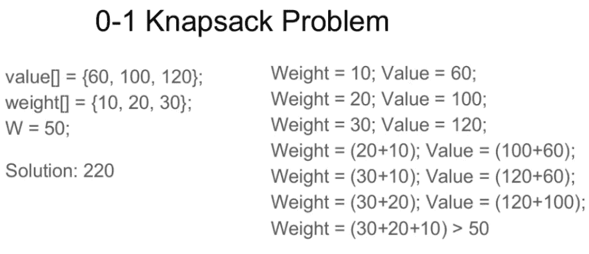

# 0-1 背包问题| DP-10

> 原文:[https://www.geeksforgeeks.org/0-1-knapsack-problem-dp-10/](https://www.geeksforgeeks.org/0-1-knapsack-problem-dp-10/)

给定 n 个物品的重量和值，将这些物品放入容量为 W 的背包中，得到背包中的最大总值。换句话说，给定两个整型数组 val[0..n-1]和 wt[0..n-1 ),其分别表示与 n 个项目相关联的值和权重。同样给定一个代表背包容量的整数 W，找出 val[]的最大值子集，使得这个子集的权重之和小于或等于 W。你不能破坏一个项目，要么选择完整的项目，要么不选择它(0-1 属性)。



**<u>方法 1</u> :** 通过蛮力算法或穷举搜索进行递归。
**方法:**一个简单的解决方法是考虑项目的所有子集，计算所有子集的总权重和值。只考虑总权重小于 w 的子集。从所有这样的子集中，选择最大值子集。
***最优子结构*** **:** 考虑项目的所有子集，每个项目可以有两种情况。

1.  **情况 1:** 该物品包含在最优子集内。
2.  **情况 2:** 该物品不包含在最优集合中。

因此，可以从“n”项中获得的最大值是以下两个值中的最大值。

1.  n-1 个项目和 W 个重量(不包括第 n 个项目)获得的最大值。
2.  第 n 个项目的值加上 n-1 个项目得到的最大值，W 减去第 n 个项目(包括第 n 个项目)的重量。

如果第 n 项的权重大于 W，则第 n 项不能包含在内，**情况 1** 是唯一的可能。

下面是上述方法的实现:

## C++

```
/* A Naive recursive implementation of
 0-1 Knapsack problem */
#include <bits/stdc++.h>
using namespace std;

// A utility function that returns
// maximum of two integers
int max(int a, int b) { return (a > b) ? a : b; }

// Returns the maximum value that
// can be put in a knapsack of capacity W
int knapSack(int W, int wt[], int val[], int n)
{

    // Base Case
    if (n == 0 || W == 0)
        return 0;

    // If weight of the nth item is more
    // than Knapsack capacity W, then
    // this item cannot be included
    // in the optimal solution
    if (wt[n - 1] > W)
        return knapSack(W, wt, val, n - 1);

    // Return the maximum of two cases:
    // (1) nth item included
    // (2) not included
    else
        return max(
            val[n - 1]
                + knapSack(W - wt[n - 1],
                           wt, val, n - 1),
            knapSack(W, wt, val, n - 1));
}

// Driver code
int main()
{
    int val[] = { 60, 100, 120 };
    int wt[] = { 10, 20, 30 };
    int W = 50;
    int n = sizeof(val) / sizeof(val[0]);
    cout << knapSack(W, wt, val, n);
    return 0;
}

// This code is contributed by rathbhupendra
```

## C

```
/* A Naive recursive implementation
of 0-1 Knapsack problem */
#include <stdio.h>

// A utility function that returns
// maximum of two integers
int max(int a, int b) { return (a > b) ? a : b; }

// Returns the maximum value that can be
// put in a knapsack of capacity W
int knapSack(int W, int wt[], int val[], int n)
{
    // Base Case
    if (n == 0 || W == 0)
        return 0;

    // If weight of the nth item is more than
    // Knapsack capacity W, then this item cannot
    // be included in the optimal solution
    if (wt[n - 1] > W)
        return knapSack(W, wt, val, n - 1);

    // Return the maximum of two cases:
    // (1) nth item included
    // (2) not included
    else
        return max(
            val[n - 1]
                + knapSack(W - wt[n - 1],
                           wt, val, n - 1),
            knapSack(W, wt, val, n - 1));
}

// Driver program to test above function
int main()
{
    int val[] = { 60, 100, 120 };
    int wt[] = { 10, 20, 30 };
    int W = 50;
    int n = sizeof(val) / sizeof(val[0]);
    printf("%d", knapSack(W, wt, val, n));
    return 0;
}
```

## Java 语言(一种计算机语言，尤用于创建网站)

```
/* A Naive recursive implementation
of 0-1 Knapsack problem */
class Knapsack {

    // A utility function that returns
    // maximum of two integers
    static int max(int a, int b)
    {
      return (a > b) ? a : b;
    }

    // Returns the maximum value that
    // can be put in a knapsack of
    // capacity W
    static int knapSack(int W, int wt[], int val[], int n)
    {
        // Base Case
        if (n == 0 || W == 0)
            return 0;

        // If weight of the nth item is
        // more than Knapsack capacity W,
        // then this item cannot be included
        // in the optimal solution
        if (wt[n - 1] > W)
            return knapSack(W, wt, val, n - 1);

        // Return the maximum of two cases:
        // (1) nth item included
        // (2) not included
        else
            return max(val[n - 1]
                       + knapSack(W - wt[n - 1], wt,
                                  val, n - 1),
                       knapSack(W, wt, val, n - 1));
    }

    // Driver code
    public static void main(String args[])
    {
        int val[] = new int[] { 60, 100, 120 };
        int wt[] = new int[] { 10, 20, 30 };
        int W = 50;
        int n = val.length;
        System.out.println(knapSack(W, wt, val, n));
    }
}
/*This code is contributed by Rajat Mishra */
```

## 计算机编程语言

```
# A naive recursive implementation
# of 0-1 Knapsack Problem

# Returns the maximum value that
# can be put in a knapsack of
# capacity W

def knapSack(W, wt, val, n):

    # Base Case
    if n == 0 or W == 0:
        return 0

    # If weight of the nth item is
    # more than Knapsack of capacity W,
    # then this item cannot be included
    # in the optimal solution
    if (wt[n-1] > W):
        return knapSack(W, wt, val, n-1)

    # return the maximum of two cases:
    # (1) nth item included
    # (2) not included
    else:
        return max(
            val[n-1] + knapSack(
                W-wt[n-1], wt, val, n-1),
            knapSack(W, wt, val, n-1))

# end of function knapSack

#Driver Code
val = [60, 100, 120]
wt = [10, 20, 30]
W = 50
n = len(val)
print knapSack(W, wt, val, n)

# This code is contributed by Nikhil Kumar Singh
```

## C#

```
/* A Naive recursive implementation of
0-1 Knapsack problem */
using System;

class GFG {

    // A utility function that returns
    // maximum of two integers
    static int max(int a, int b)
    {
         return (a > b) ? a : b;
    }

    // Returns the maximum value that can
    // be put in a knapsack of capacity W
    static int knapSack(int W, int[] wt,
                        int[] val, int n)
    {

        // Base Case
        if (n == 0 || W == 0)
            return 0;

        // If weight of the nth item is
        // more than Knapsack capacity W,
        // then this item cannot be
        // included in the optimal solution
        if (wt[n - 1] > W)
            return knapSack(W, wt,
                            val, n - 1);

        // Return the maximum of two cases:
        // (1) nth item included
        // (2) not included
        else
            return max(val[n - 1]
                       + knapSack(W - wt[n - 1], wt,
                                  val, n - 1),
                       knapSack(W, wt, val, n - 1));
    }

    // Driver code
    public static void Main()
    {
        int[] val = new int[] { 60, 100, 120 };
        int[] wt = new int[] { 10, 20, 30 };
        int W = 50;
        int n = val.Length;

        Console.WriteLine(knapSack(W, wt, val, n));
    }
}

// This code is contributed by Sam007
```

## 服务器端编程语言（Professional Hypertext Preprocessor 的缩写）

```
<?php
// A Naive recursive implementation
// of 0-1 Knapsack problem

// Returns the maximum value that
// can be put in a knapsack of
// capacity W
function knapSack($W, $wt, $val, $n)
{
    // Base Case
    if ($n == 0 || $W == 0)
        return 0;

    // If weight of the nth item is
    // more than Knapsack capacity
    // W, then this item cannot be
    // included in the optimal solution
    if ($wt[$n - 1] > $W)
        return knapSack($W, $wt, $val, $n - 1);

    // Return the maximum of two cases:
    // (1) nth item included
    // (2) not included
    else
        return max($val[$n - 1] +
               knapSack($W - $wt[$n - 1],
               $wt, $val, $n - 1),
               knapSack($W, $wt, $val, $n-1));
}

    // Driver Code
    $val = array(60, 100, 120);
    $wt = array(10, 20, 30);
    $W = 50;
    $n = count($val);
    echo knapSack($W, $wt, $val, $n);

// This code is contributed by Sam007
?>
```

## java 描述语言

```
<script>

    /* A Naive recursive implementation of
    0-1 Knapsack problem */

    // A utility function that returns
    // maximum of two integers
    function max(a, b)
    {
         return (a > b) ? a : b;
    }

    // Returns the maximum value that can
    // be put in a knapsack of capacity W
    function knapSack(W, wt, val, n)
    {

        // Base Case
        if (n == 0 || W == 0)
            return 0;

        // If weight of the nth item is
        // more than Knapsack capacity W,
        // then this item cannot be
        // included in the optimal solution
        if (wt[n - 1] > W)
            return knapSack(W, wt, val, n - 1);

        // Return the maximum of two cases:
        // (1) nth item included
        // (2) not included
        else
            return max(val[n - 1] +
            knapSack(W - wt[n - 1], wt, val, n - 1),
            knapSack(W, wt, val, n - 1));
    }

    let val = [ 60, 100, 120 ];
    let wt = [ 10, 20, 30 ];
       let W = 50;
    let n = val.length;

    document.write(knapSack(W, wt, val, n));

</script>
```

**Output**

```
220
```

应该注意的是，上面的函数一次又一次地计算相同的子问题。参见下面的递归树，K(1，1)被求值两次。这个原始递归解的时间复杂度是指数的(2^n).

```
In the following recursion tree, K() refers 
to knapSack(). The two parameters indicated in the
following recursion tree are n and W.
The recursion tree is for following sample inputs.
wt[] = {1, 1, 1}, W = 2, val[] = {10, 20, 30}
                       K(n, W)
                       K(3, 2)  
                   /            \ 
                 /                \               
            K(2, 2)                  K(2, 1)
          /       \                  /    \ 
        /           \              /        \
       K(1, 2)      K(1, 1)        K(1, 1)     K(1, 0)
       /  \         /   \              /        \
     /      \     /       \          /            \
K(0, 2)  K(0, 1)  K(0, 1)  K(0, 0)  K(0, 1)   K(0, 0)
Recursion tree for Knapsack capacity 2 
units and 3 items of 1 unit weight.
```

**复杂度分析:**

*   **时间复杂度:** O(2 <sup>n</sup> )。
    因为有多余的子问题。
*   **辅助空间:** O(1)。
    因为没有额外的数据结构用于存储值。

由于子问题被再次评估，这个问题具有重叠子问题的性质。所以 0-1 背包问题同时具有动态规划问题的两个性质(见[这个](https://www.geeksforgeeks.org/overlapping-subproblems-property-in-dynamic-programming-dp-1/)和[这个](https://www.geeksforgeeks.org/optimal-substructure-property-in-dynamic-programming-dp-2/))。

**<u>方法二</u> :** 和其他典型的[动态规划(DP)问题](https://www.geeksforgeeks.org/archives/tag/dynamic-programming)一样，通过自下而上的方式构造临时数组 K[][]，可以避免相同子问题的重新计算。下面是基于动态编程的实现。

**方法:**在动态编程中，我们将考虑递归方法中提到的相同情况。在 DP[][]表中，让我们考虑从“1”到“W”的所有可能的权重作为列，可以保留的权重作为行。
状态 DP[i][j]将表示“j-重量”的最大值，考虑从“1”到“1”的所有值。因此，如果我们考虑‘wi’(第‘I’行中的重量)，我们可以将其填入所有具有‘重量值>wi’的列中。现在有两种可能:

*   在给定的列中填入“wi”。
*   不要在给定的栏中填写“wi”。

现在我们必须取这两种可能性的最大值，形式上，如果我们不在“jth”列中填充“ith”权重，那么 DP[i][j]状态将与 DP[i-1][j]相同，但是如果我们填充权重，DP[i][j]将等于“wi”的值+前一行中称重“j-wi”的列的值。所以我们取这两种可能性的最大值来填充当前状态。这种可视化将使概念变得清晰:

```
Let weight elements = {1, 2, 3}
Let weight values = {10, 15, 40}
Capacity=6

0   1   2   3   4   5   6

0  0   0   0   0   0   0   0

1  0  10  10  10  10  10  10

2  0  10  15  25  25  25  25

3  0

Explanation:
For filling 'weight = 2' we come 
across 'j = 3' in which 
we take maximum of 
(10, 15 + DP[1][3-2]) = 25   
  |        |
'2'       '2 filled'
not filled  

0   1   2   3   4   5   6

0  0   0   0   0   0   0   0

1  0  10  10  10  10  10  10

2  0  10  15  25  25  25  25

3  0  10  15  40  50  55  65

Explanation:
For filling 'weight=3', 
we come across 'j=4' in which 
we take maximum of (25, 40 + DP[2][4-3]) 
= 50

For filling 'weight=3' 
we come across 'j=5' in which 
we take maximum of (25, 40 + DP[2][5-3])
= 55

For filling 'weight=3' 
we come across 'j=6' in which 
we take maximum of (25, 40 + DP[2][6-3])
= 65
```

## C++

```
// A dynamic programming based
// solution for 0-1 Knapsack problem
#include <bits/stdc++.h>
using namespace std;

// A utility function that returns
// maximum of two integers
int max(int a, int b)
{
    return (a > b) ? a : b;
}

// Returns the maximum value that
// can be put in a knapsack of capacity W
int knapSack(int W, int wt[], int val[], int n)
{
    int i, w;
      vector<vector<int>> K(n + 1, vector<int>(W + 1));

    // Build table K[][] in bottom up manner
    for(i = 0; i <= n; i++)
    {
        for(w = 0; w <= W; w++)
        {
            if (i == 0 || w == 0)
                K[i][w] = 0;
            else if (wt[i - 1] <= w)
                K[i][w] = max(val[i - 1] +
                                K[i - 1][w - wt[i - 1]],
                                K[i - 1][w]);
            else
                K[i][w] = K[i - 1][w];
        }
    }
    return K[n][W];
}

// Driver Code
int main()
{
    int val[] = { 60, 100, 120 };
    int wt[] = { 10, 20, 30 };
    int W = 50;
    int n = sizeof(val) / sizeof(val[0]);

    cout << knapSack(W, wt, val, n);

    return 0;
}

// This code is contributed by Debojyoti Mandal
```

## C

```
// A Dynamic Programming based
// solution for 0-1 Knapsack problem
#include <stdio.h>

// A utility function that returns
// maximum of two integers
int max(int a, int b)
{
    return (a > b) ? a : b;
}

// Returns the maximum value that
// can be put in a knapsack of capacity W
int knapSack(int W, int wt[], int val[], int n)
{
    int i, w;
    int K[n + 1][W + 1];

    // Build table K[][] in bottom up manner
    for (i = 0; i <= n; i++)
    {
        for (w = 0; w <= W; w++)
        {
            if (i == 0 || w == 0)
                K[i][w] = 0;
            else if (wt[i - 1] <= w)
                K[i][w] = max(val[i - 1]
                          + K[i - 1][w - wt[i - 1]],
                          K[i - 1][w]);
            else
                K[i][w] = K[i - 1][w];
        }
    }

    return K[n][W];
}

// Driver Code
int main()
{
    int val[] = { 60, 100, 120 };
    int wt[] = { 10, 20, 30 };
    int W = 50;
    int n = sizeof(val) / sizeof(val[0]);
    printf("%d", knapSack(W, wt, val, n));
    return 0;
}
```

## Java 语言(一种计算机语言，尤用于创建网站)

```
// A Dynamic Programming based solution
// for 0-1 Knapsack problem
class Knapsack {

    // A utility function that returns
    // maximum of two integers
    static int max(int a, int b)
    {
          return (a > b) ? a : b;
    }

    // Returns the maximum value that can
    // be put in a knapsack of capacity W
    static int knapSack(int W, int wt[],
                        int val[], int n)
    {
        int i, w;
        int K[][] = new int[n + 1][W + 1];

        // Build table K[][] in bottom up manner
        for (i = 0; i <= n; i++)
        {
            for (w = 0; w <= W; w++)
            {
                if (i == 0 || w == 0)
                    K[i][w] = 0;
                else if (wt[i - 1] <= w)
                    K[i][w]
                        = max(val[i - 1]
                         + K[i - 1][w - wt[i - 1]],
                         K[i - 1][w]);
                else
                    K[i][w] = K[i - 1][w];
            }
        }

        return K[n][W];
    }

    // Driver code
    public static void main(String args[])
    {
        int val[] = new int[] { 60, 100, 120 };
        int wt[] = new int[] { 10, 20, 30 };
        int W = 50;
        int n = val.length;
        System.out.println(knapSack(W, wt, val, n));
    }
}
/*This code is contributed by Rajat Mishra */
```

## 计算机编程语言

```
# A Dynamic Programming based Python
# Program for 0-1 Knapsack problem
# Returns the maximum value that can
# be put in a knapsack of capacity W

def knapSack(W, wt, val, n):
    K = [[0 for x in range(W + 1)] for x in range(n + 1)]

    # Build table K[][] in bottom up manner
    for i in range(n + 1):
        for w in range(W + 1):
            if i == 0 or w == 0:
                K[i][w] = 0
            elif wt[i-1] <= w:
                K[i][w] = max(val[i-1]
                          + K[i-1][w-wt[i-1]], 
                              K[i-1][w])
            else:
                K[i][w] = K[i-1][w]

    return K[n][W]

# Driver code
val = [60, 100, 120]
wt = [10, 20, 30]
W = 50
n = len(val)
print(knapSack(W, wt, val, n))

# This code is contributed by Bhavya Jain
```

## C#

```
// A Dynamic Programming based solution for
// 0-1 Knapsack problem
using System;

class GFG {

    // A utility function that returns
    // maximum of two integers
    static int max(int a, int b)
    {
         return (a > b) ? a : b;
    }

    // Returns the maximum value that
    // can be put in a knapsack of
    // capacity W
    static int knapSack(int W, int[] wt,
                        int[] val, int n)
    {
        int i, w;
        int[, ] K = new int[n + 1, W + 1];

        // Build table K[][] in bottom
        // up manner
        for (i = 0; i <= n; i++)
        {
            for (w = 0; w <= W; w++)
            {
                if (i == 0 || w == 0)
                    K[i, w] = 0;

                else if (wt[i - 1] <= w)
                    K[i, w] = Math.Max(
                        val[i - 1]
                        + K[i - 1, w - wt[i - 1]],
                        K[i - 1, w]);
                else
                    K[i, w] = K[i - 1, w];
            }
        }

        return K[n, W];
    }

    // Driver code
    static void Main()
    {
        int[] val = new int[] { 60, 100, 120 };
        int[] wt = new int[] { 10, 20, 30 };
        int W = 50;
        int n = val.Length;

        Console.WriteLine(knapSack(W, wt, val, n));
    }
}

// This code is contributed by Sam007
```

## 服务器端编程语言（Professional Hypertext Preprocessor 的缩写）

```
<?php
// A Dynamic Programming based solution
// for 0-1 Knapsack problem

// Returns the maximum value that
// can be put in a knapsack of
// capacity W
function knapSack($W, $wt, $val, $n)
{

    $K = array(array());

    // Build table K[][] in
    // bottom up manner
    for ($i = 0; $i <= $n; $i++)
    {
        for ($w = 0; $w <= $W; $w++)
        {
            if ($i == 0 || $w == 0)
                $K[$i][$w] = 0;
            else if ($wt[$i - 1] <= $w)
                    $K[$i][$w] = max($val[$i - 1] +
                                     $K[$i - 1][$w -
                                     $wt[$i - 1]],
                                     $K[$i - 1][$w]);
            else
                    $K[$i][$w] = $K[$i - 1][$w];
        }
    }

    return $K[$n][$W];
}

    // Driver Code
    $val = array(60, 100, 120);
    $wt = array(10, 20, 30);
    $W = 50;
    $n = count($val);
    echo knapSack($W, $wt, $val, $n);

// This code is contributed by Sam007.
?>
```

## java 描述语言

```
<script>
    // A Dynamic Programming based solution
    // for 0-1 Knapsack problem

    // A utility function that returns
    // maximum of two integers
    function max(a, b)
    {
          return (a > b) ? a : b;
    }

    // Returns the maximum value that can
    // be put in a knapsack of capacity W
    function knapSack(W, wt, val, n)
    {
        let i, w;
        let K = new Array(n + 1);

        // Build table K[][] in bottom up manner
        for (i = 0; i <= n; i++)
        {
            K[i] = new Array(W + 1);
            for (w = 0; w <= W; w++)
            {
                if (i == 0 || w == 0)
                    K[i][w] = 0;
                else if (wt[i - 1] <= w)
                    K[i][w]
                        = max(val[i - 1]
                         + K[i - 1][w - wt[i - 1]],
                         K[i - 1][w]);
                else
                    K[i][w] = K[i - 1][w];
            }
        }

        return K[n][W];
    }

    let val = [ 60, 100, 120 ];
    let wt = [ 10, 20, 30 ];
    let W = 50;
    let n = val.length;
    document.write(knapSack(W, wt, val, n));
</script>
```

**Output**

```
220
```

**复杂度分析:**

*   **时间复杂度:** O(N*W)。
    其中‘N’是重量元素的数量，‘W’是容量。对于每个重量元素，我们遍历所有重量能力 1 < =w < =W。
*   **辅助空间:** O(N*W)。
    使用二维数组的大小‘N * W’。

**改进范围:-** 我们使用了相同的方法，但优化了空间复杂度

## C++

```
#include <bits/stdc++.h>
using namespace std;

// we can futher improve the above Knapsack function's space
// complexity
int knapSack(int W, int wt[], int val[], int n)
{
    int i, w;
    int K[2][W + 1];
    // We know we are always using the the current row or
    // the previous row of the array/vector . Thereby we can
    // improve it further by using a 2D array but with only
    // 2 rows i%2 will be giving the index inside the bounds
    // of 2d array K

    for (i = 0; i <= n; i++) {
        for (w = 0; w <= W; w++) {
            if (i == 0 || w == 0)
                K[i % 2][w] = 0;
            else if (wt[i - 1] <= w)
                K[i % 2][w] = max(
                    val[i - 1]
                        + K[(i - 1) % 2][w - wt[i - 1]],
                    K[(i - 1) % 2][w]);
            else
                K[i % 2][w] = K[(i - 1) % 2][w];
        }
    }
    return K[n % 2][W];
}

// Driver Code
int main()
{
    int val[] = { 60, 100, 120 };
    int wt[] = { 10, 20, 30 };
    int W = 50;
    int n = sizeof(val) / sizeof(val[0]);

    cout << knapSack(W, wt, val, n);

    return 0;
}

// This code was improved by Udit Singla
```

## Java 语言(一种计算机语言，尤用于创建网站)

```
import java.util.*;
class GFG {

  // we can futher improve the above Knapsack function's space
  // complexity
  static int knapSack(int W, int wt[], int val[], int n)
  {
    int i, w;
    int [][]K = new int[2][W + 1];

    // We know we are always using the the current row or
    // the previous row of the array/vector . Thereby we can
    // improve it further by using a 2D array but with only
    // 2 rows i%2 will be giving the index inside the bounds
    // of 2d array K
    for (i = 0; i <= n; i++) {
      for (w = 0; w <= W; w++) {
        if (i == 0 || w == 0)
          K[i % 2][w] = 0;
        else if (wt[i - 1] <= w)
          K[i % 2][w] = Math.max(
          val[i - 1]
          + K[(i - 1) % 2][w - wt[i - 1]],
          K[(i - 1) % 2][w]);
        else
          K[i % 2][w] = K[(i - 1) % 2][w];
      }
    }
    return K[n % 2][W];
  }

  // Driver Code
  public static void main(String[] args)
  {
    int val[] = { 60, 100, 120 };
    int wt[] = { 10, 20, 30 };
    int W = 50;
    int n = val.length;

    System.out.print(knapSack(W, wt, val, n));

  }
}

// This code is contributed by gauravrajput1
```

## C#

```
using System;

public class GFG {

    // we can futher improve the above Knapsack function's space
    // complexity
    static int knapSack(int W, int []wt, int []val, int n) {
        int i, w;
        int[,] K = new int[2,W + 1];

        // We know we are always using the the current row or
        // the previous row of the array/vector . Thereby we can
        // improve it further by using a 2D array but with only
        // 2 rows i%2 will be giving the index inside the bounds
        // of 2d array K
        for (i = 0; i <= n; i++) {
            for (w = 0; w <= W; w++) {
                if (i == 0 || w == 0)
                    K[i % 2, w] = 0;
                else if (wt[i - 1] <= w)
                    K[i % 2,w] = Math.Max(val[i - 1] + K[(i - 1) % 2,w - wt[i - 1]], K[(i - 1) % 2,w]);
                else
                    K[i % 2,w] = K[(i - 1) % 2,w];
            }
        }
        return K[n % 2,W];
    }

    // Driver Code
    public static void Main(String[] args) {
        int []val = { 60, 100, 120 };
        int []wt = { 10, 20, 30 };
        int W = 50;
        int n = val.Length;

        Console.Write(knapSack(W, wt, val, n));

    }
}

// This code is contributed by umadevi9616
```

## java 描述语言

```
<script>
    // we can futher improve the above Knapsack function's space
    // complexity
    function knapSack(W , wt , val , n) {
        var i, w;
        var K = Array(2).fill().map(()=>Array(W + 1).fill(0));

        // We know we are always using the the current row or
        // the previous row of the array/vector . Thereby we can
        // improve it further by using a 2D array but with only
        // 2 rows i%2 will be giving the index inside the bounds
        // of 2d array K
        for (i = 0; i <= n; i++) {
            for (w = 0; w <= W; w++) {
                if (i == 0 || w == 0)
                    K[i % 2][w] = 0;
                else if (wt[i - 1] <= w)
                    K[i % 2][w] = Math.max(val[i - 1] +
                    K[(i - 1) % 2][w - wt[i - 1]],
                    K[(i - 1) % 2][w]);
                else
                    K[i % 2][w] = K[(i - 1) % 2][w];
            }
        }
        return K[n % 2][W];
    }

    // Driver Code
        var val = [ 60, 100, 120 ];
        var wt = [ 10, 20, 30 ];
        var W = 50;
        var n = val.length;

        document.write(knapSack(W, wt, val, n));

// This code is contributed by Rajput-Ji
</script>
```

**复杂度分析:**

*   **时间复杂度:** O(N*W)。
*   **辅助空间:** O(2*W)
    因为我们使用的是二维阵列，但只有 2 行。

**<u>方法 3</u> :** 该方法使用记忆技术(递归方法的扩展)。
这种方法基本上是递归方法的扩展，因此我们可以克服计算冗余情况的问题，从而增加复杂性。我们可以通过简单地创建一个二维数组来解决这个问题，如果我们第一次得到它，这个数组可以存储一个特定的状态(n，w)。现在，如果我们再次遇到相同的状态(n，w)，而不是以指数复杂度计算它，我们可以直接以恒定时间返回存储在表中的结果。这种方法在这方面优于递归方法。

## C++

```
// Here is the top-down approach of
// dynamic programming
#include <bits/stdc++.h>
using namespace std;

// Returns the value of maximum profit
int knapSackRec(int W, int wt[],
                int val[], int i,
                int** dp)
{
    // base condition
    if (i < 0)
        return 0;
    if (dp[i][W] != -1)
        return dp[i][W];

    if (wt[i] > W) {

        // Store the value of function call
        // stack in table before return
        dp[i][W] = knapSackRec(W, wt,
                               val, i - 1,
                               dp);
        return dp[i][W];
    }
    else {
        // Store value in a table before return
        dp[i][W] = max(val[i]
                      + knapSackRec(W - wt[i],
                                   wt, val,
                                   i - 1, dp),
                       knapSackRec(W, wt, val,
                                   i - 1, dp));

        // Return value of table after storing
        return dp[i][W];
    }
}

int knapSack(int W, int wt[], int val[], int n)
{
    // double pointer to declare the
    // table dynamically
    int** dp;
    dp = new int*[n];

    // loop to create the table dynamically
    for (int i = 0; i < n; i++)
        dp[i] = new int[W + 1];

    // loop to initially filled the
    // table with -1
    for (int i = 0; i < n; i++)
        for (int j = 0; j < W + 1; j++)
            dp[i][j] = -1;
    return knapSackRec(W, wt, val, n - 1, dp);
}

// Driver Code
int main()
{
    int val[] = { 60, 100, 120 };
    int wt[] = { 10, 20, 30 };
    int W = 50;
    int n = sizeof(val) / sizeof(val[0]);
    cout << knapSack(W, wt, val, n);
    return 0;
}
```

## Java 语言(一种计算机语言，尤用于创建网站)

```
// Here is the top-down approach of 
// dynamic programming
class GFG{

// A utility function that returns 
// maximum of two integers    
static int max(int a, int b)    
{    
    return (a > b) ? a : b;    
}

// Returns the value of maximum profit  
static int knapSackRec(int W, int wt[],
                       int val[], int n,
                       int [][]dp)
{  

    // Base condition
    if (n == 0 || W == 0)  
        return 0;

    if (dp[n][W] != -1)
        return dp[n][W];  

    if (wt[n - 1] > W)  

        // Store the value of function call  
        // stack in table before return
        return dp[n][W] = knapSackRec(W, wt, val,
                                      n - 1, dp);

    else

        // Return value of table after storing 
        return dp[n][W] = max((val[n - 1] +
                              knapSackRec(W - wt[n - 1], wt,
                                          val, n - 1, dp)),
                              knapSackRec(W, wt, val,
                                          n - 1, dp));            
}

static int knapSack(int W, int wt[], int val[], int N)
{ 

    // Declare the table dynamically
    int dp[][] = new int[N + 1][W + 1];

    // Loop to initially filled the
    // table with -1
    for(int i = 0; i < N + 1; i++)  
        for(int j = 0; j < W + 1; j++)  
            dp[i][j] = -1;   

    return knapSackRec(W, wt, val, N, dp);    
}

// Driver Code
public static void main(String [] args)
{      
    int val[] = { 60, 100, 120 };  
    int wt[] = { 10, 20, 30 };  

    int W = 50; 
    int N = val.length;        

    System.out.println(knapSack(W, wt, val, N));  
}    
}

// This Code is contributed By FARAZ AHMAD
```

## 蟒蛇 3

```
# This is the memoization approach of
# 0 / 1 Knapsack in Python in simple
# we can say recursion + memoization = DP

# driver code
val = [60, 100, 120 ]
wt = [10, 20, 30 ]
W = 50
n = len(val)

# We initialize the matrix with -1 at first.
t = [[-1 for i in range(W + 1)] for j in range(n + 1)]

def knapsack(wt, val, W, n):

    # base conditions
    if n == 0 or W == 0:
        return 0
    if t[n][W] != -1:
        return t[n][W]

    # choice diagram code
    if wt[n-1] <= W:
        t[n][W] = max(
            val[n-1] + knapsack(
                wt, val, W-wt[n-1], n-1),
            knapsack(wt, val, W, n-1))
        return t[n][W]
    elif wt[n-1] > W:
        t[n][W] = knapsack(wt, val, W, n-1)
        return t[n][W]

print(knapsack(wt, val, W, n))

# This code is contributed by Prosun Kumar Sarkar
```

## C#

```
// Here is the top-down approach of 
// dynamic programming
using System;
public class GFG
{

    // A utility function that returns
    // maximum of two integers
    static int max(int a, int b) { return (a > b) ? a : b; }

    // Returns the value of maximum profit
    static int knapSackRec(int W, int[] wt, int[] val,
                           int n, int[, ] dp)
    {

        // Base condition
        if (n == 0 || W == 0)
            return 0;
        if (dp[n, W] != -1)
            return dp[n, W];
        if (wt[n - 1] > W)

            // Store the value of function call
            // stack in table before return
            return dp[n, W]
                = knapSackRec(W, wt, val, n - 1, dp);

        else

            // Return value of table after storing
            return dp[n, W]
                = max((val[n - 1]
                       + knapSackRec(W - wt[n - 1], wt, val,
                                     n - 1, dp)),
                      knapSackRec(W, wt, val, n - 1, dp));
    }

    static int knapSack(int W, int[] wt, int[] val, int N)
    {

        // Declare the table dynamically
        int[, ] dp = new int[N + 1, W + 1];

        // Loop to initially filled the
        // table with -1
        for (int i = 0; i < N + 1; i++)
            for (int j = 0; j < W + 1; j++)
                dp[i, j] = -1;

        return knapSackRec(W, wt, val, N, dp);
    }

    // Driver Code
    static public void Main()
    {

        int[] val = new int[]{ 60, 100, 120 };
        int[] wt = new int[]{ 10, 20, 30 };

        int W = 50;
        int N = val.Length;

        Console.WriteLine(knapSack(W, wt, val, N));
    }
}

// This Code is contributed By Dharanendra L V.
```

## java 描述语言

```
<script>
// A utility function that returns
// maximum of two integers   
function max(a,  b)   
{   
    return (a > b) ? a : b;   
}

// Returns the value of maximum profit
function knapSackRec(W, wt, val, n,dp)
{

    // Base condition
    if (n == 0 || W == 0)
        return 0;

    if (dp[n][W] != -1)
        return dp[n][W];

    if (wt[n - 1] > W)

        // Store the value of function call
        // stack in table before return
        return dp[n][W] = knapSackRec(W, wt, val,
                                    n - 1, dp);

    else

        // Return value of table after storing
        return dp[n][W] = max((val[n - 1] +
                            knapSackRec(W - wt[n - 1], wt,
                                        val, n - 1, dp)),
                            knapSackRec(W, wt, val,
                                        n - 1, dp));           
}

function knapSack( W, wt,val,N)
{

    // Declare the table dynamically
    var dp = new Array(N + 1);
    for(var i = 0; i < dp.length; i++)
    {
        dp[i]=new Array(W + 1);
      }

    // Loop to initially filled the
    // table with -1
    for(var i = 0; i < N + 1; i++)
        for(var j = 0; j < W + 1; j++)
            dp[i][j] = -1;

    return knapSackRec(W, wt, val, N, dp);   
}

   var val= [ 60, 100, 120 ];
    var wt = [ 10, 20, 30 ];

    var W = 50;
    var N = val.length;       

    document.write(knapSack(W, wt, val, N));

// This code is contributed by akshitsaxenaa09.

</script>
```

**Output**

```
220
```

**复杂度分析:**

*   **时间复杂度:** O(N*W)。
    因为避免了多余的状态计算。
*   **辅助空间:** O(N*W)。
    使用 2D 数组数据结构存储中间状态:

**【注意:32 位整数用 long 代替 int。】**
**参考文献:**

*   [http://www . es . ele . tue . nl/education/5mc 10/Solutions/背包. pdf](http://www.es.ele.tue.nl/education/5MC10/Solutions/knapsack.pdf)
*   [http://www . CSE . unl . edu/~ Goddard/Courses/csce 310j/讲座/讲师 8-DynamicProgramming.pdf](http://www.cse.unl.edu/~goddard/Courses/CSCE310J/Lectures/Lecture8-DynamicProgramming.pdf)
*   [https://youtu . be/T4 by 72 lcqac？list = plqm 7 alxfysgmu 2 csdw _ 6d 2 u1 或 6wftio-](https://youtu.be/T4bY72lCQac?list=PLqM7alHXFySGMu2CSdW_6d2u1o6WFTIO-)T2]

如果你发现任何不正确的地方，或者你想分享更多关于上面讨论的话题的信息，请写评论。

**<u>方法 4 :-</u>** 我们再次使用动态规划方法，该方法具有更优化的空间复杂度。

## C++

```
#include <bits/stdc++.h>
using namespace std;
int knapSack(int W, int wt[], int val[], int n)
{
    // making and initializing dp array
    int dp[W + 1];
    memset(dp, 0, sizeof(dp));

    for (int i = 1; i < n + 1; i++) {
        for (int w = W; w >= 0; w--) {

            if (wt[i - 1] <= w)
                // finding the maximum value
                dp[w] = max(dp[w],
                            dp[w - wt[i - 1]] + val[i - 1]);
        }
    }
    return dp[W]; // returning the maximum value of knapsack
}
int main()
{
    int val[] = { 60, 100, 120 };
    int wt[] = { 10, 20, 30 };
    int W = 50;
    int n = sizeof(val) / sizeof(val[0]);
    cout << knapSack(W, wt, val, n);
    return 0;
}
```

## Java 语言(一种计算机语言，尤用于创建网站)

```
import java.util.*;

class GFG{
  static int knapSack(int W, int wt[], int val[], int n)
  {
    // making and initializing dp array
    int []dp = new int[W + 1];

    for (int i = 1; i < n + 1; i++) {
      for (int w = W; w >= 0; w--) {

        if (wt[i - 1] <= w)

          // finding the maximum value
          dp[w] = Math.max(dp[w],
                           dp[w - wt[i - 1]] + val[i - 1]);
      }
    }
    return dp[W]; // returning the maximum value of knapsack
  }

  // Driver code
  public static void main(String[] args)
  {
    int val[] = { 60, 100, 120 };
    int wt[] = { 10, 20, 30 };
    int W = 50;
    int n = val.length;
    System.out.print(knapSack(W, wt, val, n));
  }
}

// This code is contributed by gauravrajput1
```

## 蟒蛇 3

```
# code
# A Dynamic Programming based Python
# Program for 0-1 Knapsack problem
# Returns the maximum value that can
# be put in a knapsack of capacity W

def knapSack(W, wt, val, n):
    dp = [0 for i in range(W+1)]  # Making the dp array

    for i in range(1, n+1):  # taking first i elements
        for w in range(W, 0, -1):  # starting from back,so that we also have data of
                                # previous computation when taking i-1 items
            if wt[i-1] <= w:
                # finding the maximum value
                dp[w] = max(dp[w], dp[w-wt[i-1]]+val[i-1])

    return dp[W]  # returning the maximum value of knapsack

# Driver code
val = [60, 100, 120]
wt = [10, 20, 30]
W = 50
n = len(val)
# This code is contributed by Suyash Saxena
print(knapSack(W, wt, val, n))
```

## C#

```
using System;
public class GFG {
    static int knapSack(int W, int []wt, int []val, int n)
    {

        // making and initializing dp array
        int[] dp = new int[W + 1];

        for (int i = 1; i < n + 1; i++)
        {
            for (int w = W; w >= 0; w--)
            {

                if (wt[i - 1] <= w)

                    // finding the maximum value
                    dp[w] = Math.Max(dp[w], dp[w - wt[i - 1]] + val[i - 1]);
            }
        }
        return dp[W]; // returning the maximum value of knapsack
    }

    // Driver code
    public static void Main(String[] args) {
        int []val = { 60, 100, 120 };
        int []wt = { 10, 20, 30 };
        int W = 50;
        int n = val.Length;
        Console.Write(knapSack(W, wt, val, n));
    }
}

// This code is contributed by gauravrajput1
```

**Output**

```
220
```

**复杂度分析**:

**时间复杂度** : O(N*W)。因为避免了多余的状态计算。

**辅助空间** : O(W)因为我们用的是一维数组而不是二维数组。