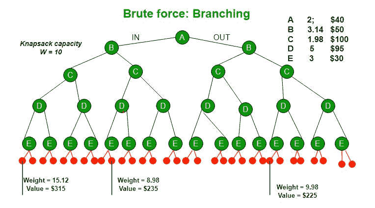
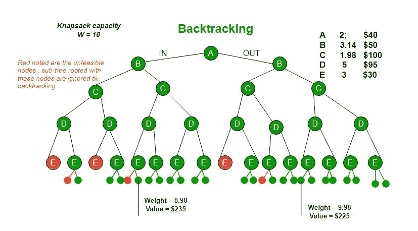
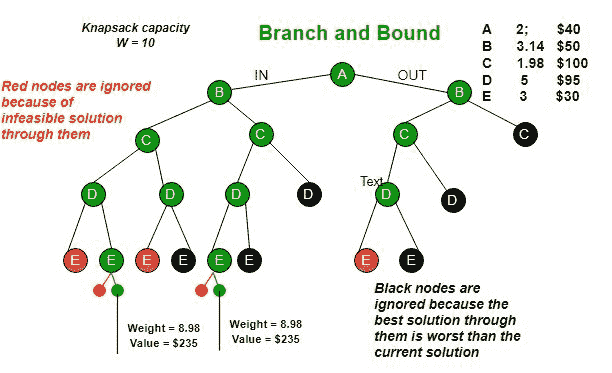

# 使用分支定界的 0/1 背包

> 原文:[https://www . geesforgeks . org/0-1-使用分支绑定的背包/](https://www.geeksforgeeks.org/0-1-knapsack-using-branch-and-bound/)

分支定界是一种算法设计范式，通常用于解决组合优化问题。这些问题在时间复杂度方面通常是指数级的，并且在最坏的情况下可能需要探索所有可能的排列。分支和绑定可以相对快速地解决这些问题。

让我们考虑下面的 0/1 背包问题来理解分支和有界。

*给定两个整数数组**值【0..n-1]** 和**wt【0..n-1]** 分别表示与 n 个项目相关联的值和权重。找出 val[]的最大值子集，使得该子集的权重之和小于或等于背包容量 W.*

让我们探索解决这个问题的所有方法。

1.  一 [**贪婪**的方法](https://www.geeksforgeeks.org/fractional-knapsack-problem/)是按单位重量价值递减的顺序挑选物品。贪婪方法只适用于[分数背包](https://www.geeksforgeeks.org/fractional-knapsack-problem/)问题，可能不会对 [0/1 背包](https://www.geeksforgeeks.org/dynamic-programming-set-10-0-1-knapsack-problem/)产生正确的结果。
2.  对于 0/1 背包问题，我们可以使用[T1】Ddynamic**P**编程( **DP** )。在 DP 中，我们使用大小为 n×w 的 2D 表。如果项目权重不是整数，则 **DP 解决方案不起作用。**](https://www.geeksforgeeks.org/dynamic-programming-set-10-0-1-knapsack-problem/)
3.  Since DP solution doesn’t alway work, a solution is to use **Brute Force**. With n items, there are 2n solutions to be generated, check each to see if they satisfy the constraint, save maximum solution that satisfies constraint. This solution can be expressed as **tree**.

    

4.  我们可以使用**回溯**来优化蛮力解。在树的表示中，我们可以做树的 DFS。如果我们到了一个解决方案不再可行的地步，就没有必要继续探索了。在给定的例子中，如果我们有更多的物品或更小的背包容量，回溯会更有效。

**Branch and Bound**

The backtracking based solution works better than brute force by ignoring infeasible solutions. We can do better (than backtracking) if we know a bound on best possible solution subtree rooted with every node. If the best in subtree is worse than current best, we can simply ignore this node and its subtrees. So we compute bound (best solution) for every node and compare the bound with current best solution before exploring the node.

下图中使用的示例界限是， **A** 下跌可给出 315 美元， **B** 下跌可给出 275 美元， **C** 下跌可给出 225 美元， **D** 下跌可给出 125 美元， **E** 下跌可给出 30 美元。在[下一篇文章](https://www.geeksforgeeks.org/branch-and-bound-set-2-implementation-of-01-knapsack/)中，我们已经讨论了获得这些界限的过程。

分支定界是搜索解的非常有用的技术，但是在最坏的情况下，我们需要完全计算整个树。充其量，我们只需要完全计算出一条穿过树的路径，然后修剪掉剩下的部分。

**来源:**
以上图片及内容采用自以下尼斯链接。[http://www . CSE . MSU . edu/~ torng/class/Archives/CSE 830.03 fall/讲座/讲师 11.ppt](http://www.cse.msu.edu/~torng/Classes/Archives/cse830.03fall/Lectures/Lecture11.ppt)

[分支定界|集合 2(0/1 背包的实现)](https://www.geeksforgeeks.org/branch-and-bound-set-2-implementation-of-01-knapsack/)

本文由乌特卡尔什·特里维迪供稿。如果你喜欢极客博客并想投稿，你也可以写一篇文章并把你的文章邮寄到 contribute@geeksforgeeks.org。看到你的文章出现在极客博客主页上，帮助其他极客。

如果您发现任何不正确的地方，或者您想分享更多关于上面讨论的主题的信息，请写评论