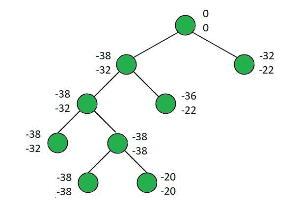
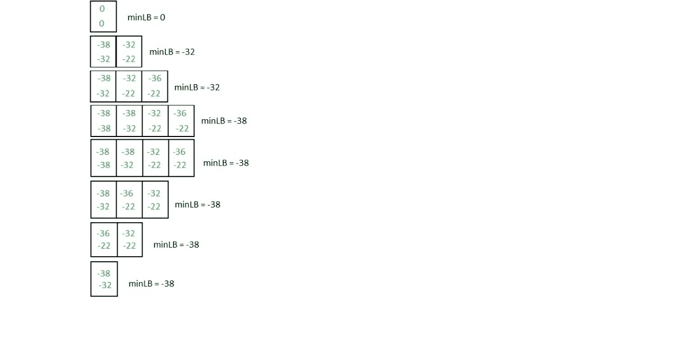

# 使用最小成本分支和界限的 0/1 背包

> 原文:[https://www . geesforgeks . org/0-1-背包使用最少计数分支绑定/](https://www.geeksforgeeks.org/0-1-knapsack-using-least-count-branch-and-bound/)

给定 **N** 项重量**W【0..n-1]** ，值**V【0..n-1]** 和容量为 **C** 的背包，选择项目如下:

1.  进入背包的重量总和小于或等于 c。
2.  在所有可能的组合中，背包中物品的价值总和最大。

**例:**

> **输入:** N = 4，C = 15，V[]= {10，10，12，18}，W[]= {2，4，6，9}
> **输出:**
> 带入背包的物品为
> 1 1 0 1
> 最大利润为 38
> **说明:**
> 1 在输出中表示物品包含在背包中，而 0 表示物品被排除。
> 由于允许的最大可能成本为 15，因此选择项目的方式为:
> (1 1 0 1) - >成本= 2 + 4 + 9 = 15，利润= 10 + 10 + 18 = 38。
> (0 0 1 1) - >成本= 6 + 9 = 15，利润= 12 + 18 = 30
> (1 1 1 0) - >成本= 2 + 4 + 6 = 12，利润= 32
> 因此，在 15 的成本范围内可能的最大利润是 38。
> **输入:** N = 4，C = 21，V[]= {18，20，14，18}，W[]= {6，3，5，9}
> **输出:**
> 带入背包的物品为
> 1 1 0 1
> 最大利润为 56
> **说明:**
> 成本= 6 + 3 + 9 = 18
> 利润= 18 + 20

**方法:**
本文讨论了 [0/1 背包问题](https://www.geeksforgeeks.org/0-1-knapsack-problem-dp-10/)使用最小成本(LC) 的**分支定界法的实现。
[分支定界](https://www.geeksforgeeks.org/branch-and-bound-algorithm/)可以使用[**FIFO**](https://www.geeksforgeeks.org/fifo-first-in-first-out-approach-in-programming/)[**LIFO**](https://www.geeksforgeeks.org/lifo-last-in-first-out-approach-in-programming/)和 **LC** 策略求解。**最小成本(LC)** 被认为是最智能的，因为它基于**启发式成本函数**选择下一个节点。它选择成本最低的一个。
由于 **0/1 背包**是关于总价值最大化的，我们不能直接使用 **LC 分支定界**技术来解决这个问题。相反，我们通过取给定值的负值，将这个问题转化为最小化问题。
按照以下步骤解决问题:** 

1.  根据物品的**值/重量(体积/重量)**比率对物品进行排序。
2.  在[优先级队列](https://www.geeksforgeeks.org/priority-queue-set-1-introduction/)中插入一个伪节点。
3.  重复以下步骤，直到优先级队列为空:
    *   从优先级队列中提取 peek 元素，并将其分配给**当前节点**。
    *   如果当前节点的上限小于 **minLB** ，即所有探索节点的最小下限，则没有探索点。所以，继续下一个元素。不考虑上限大于 **minLB** 的节点的原因是，上限存储了可能达到的最佳值。如果最好的价值本身并不比 **minLB** 最优，那么探索那条路是没有用的。

    *   更新**路径数组**。
    *   如果当前节点的级别为 **N** ，则检查当前节点的下限是否小于 **finalLB** ，即所有到达最终级别的路径的最小下限。如果是真的，更新**最终路径**和**最终路径**。否则，继续下一个元素。
    *   计算当前节点的右子节点的下限和上限。
    *   如果当前项目可以插入背包，那么计算当前节点左子节点的上下界。
    *   更新 **minLB** ，如果孩子的上限小于 **minLB** ，则插入孩子。

> **插图:**
> N = 4，C = 15，V[]= {10 10 12 18}，【W[]= {2 4 6 9}
> 
> 
> 
> 位于 **i <sup>th</sup>** 级别的左分支和右分支存储包括和不包括 **i <sup>th</sup>** 元素获得的最大值。
> 下图显示了每一步后优先级队列的状态:
> 
> 

以下是上述方法的实现:

## C++

```
// C++ Program to implement 0/1
// knapsack using LC Branch and Bound

#include <bits/stdc++.h>
using namespace std;

// Stores the number of items
int size;

// Stores the knapsack capacity
float capacity;

typedef struct Item {

    // Stores the weight of items
    float weight;

    // Stores the value of items
    int value;

    // Stores the index of items
    int idx;
} Item;

typedef struct Node {

    // Upper Bound: Best case
    // (Fractional Knapsack)
    float ub;

    // Lower Bound: Worst case (0/1)
    float lb;

    // Level of the node
    // in the decision tree
    int level;

    // Stores if the current item is
    // selected or not
    bool flag;

    // Total Value: Stores the sum of the
    // values of the items included
    float tv;

    // Total Weight: Stores the sum of the
    // weights of the items included
    float tw;
} Node;

// Function to calculate upper bound
// (includes fractional part of the items)
float upper_bound(float tv, float tw,
                  int idx, vector<Item>& arr)
{
    float value = tv;
    float weight = tw;
    for (int i = idx; i < size; i++) {
        if (weight + arr[i].weight
            <= capacity) {
            weight += arr[i].weight;
            value -= arr[i].value;
        }
        else {
            value -= (float)(capacity
                             - weight)
                     / arr[i].weight
                     * arr[i].value;
            break;
        }
    }
    return value;
}

// Function to calculate lower bound (doesn't
// include fractional part of the items)
float lower_bound(float tv, float tw,
                  int idx, vector<Item>& arr)
{
    float value = tv;
    float weight = tw;
    for (int i = idx; i < size; i++) {
        if (weight + arr[i].weight
            <= capacity) {
            weight += arr[i].weight;
            value -= arr[i].value;
        }
        else {
            break;
        }
    }
    return value;
}

class comp {
public:
    bool operator()(Node a, Node b)
    {
        return a.lb > b.lb;
    }
};

void assign(Node& a, float ub, float lb,
            int level, bool flag,
            float tv, float tw)
{
    a.ub = ub;
    a.lb = lb;
    a.level = level;
    a.flag = flag;
    a.tv = tv;
    a.tw = tw;
}

void knapsack(vector<Item>& arr)
{

    // Sort the items based on the
    // profit/weight ratio
    sort(arr.begin(), arr.end(),
         [&](Item& a, Item& b) {
             return a.value / a.weight
                    > b.value / b.weight;
         });

    // min_lb -> Minimum lower bound
    // of all the nodes explored

    // final_lb -> Minimum lower bound
    // of all the paths that reached
    // the final level
    float min_lb = 0, final_lb = INT_MAX;

    // curr_path -> Boolean array to store
    // at every index if the element is
    // included or not

    // final_path -> Boolean array to store
    // the result of selection array when
    // it reached the last level
    bool curr_path[size], final_path[size];

    // Priority queue to store the nodes
    // based on lower bounds
    priority_queue<Node, vector<Node>,
                   comp>
        pq;

    Node current, left, right;
    current.lb = current.ub = current.tw
        = current.tv = current.level
        = current.flag = 0;

    // Insert a dummy node
    pq.push(current);

    for (int i = 0; i < size; i++)
        curr_path[i] = final_path[i]
            = false;

    while (!pq.empty()) {
        current = pq.top();
        pq.pop();

        if (current.ub > min_lb
            || current.ub >= final_lb) {

            // If the current node's best case
            // value is not optimal than min_lb,
            // then there is no reason to explore
            // that path including final_lb
            // eliminates all those paths whose
            // best values is equal to final_lb
            continue;
        }

        // update the path
        if (current.level != 0)
            curr_path[current.level - 1]
                = current.flag;

        if (current.level == size) {
            // Reached last level
            if (current.lb < final_lb)
                for (int i = 0; i < size; i++)
                    final_path[arr[i].idx]
                        = curr_path[i];
            final_lb = min(current.lb, final_lb);
            continue;
        }

        int level = current.level;

        // right node -> Exludes current item
        // Hence, cp, cw will obtain the value
        // of that of parent
        assign(right,
               upper_bound(current.tv,
                           current.tw, level + 1,
                           arr),
               lower_bound(current.tv, current.tw,
                           level + 1, arr),
               level + 1, false,
               current.tv, current.tw);

        // Check whether adding the current
        // item will not exceed the knapsack weight
        if (current.tw + arr[current.level].weight
            <= capacity) {

            // left node -> includes current item
            // c and lb should be calculated
            // including the current item.
            left.ub
                = upper_bound(
                    current.tv
                        - arr[level].value,
                    current.tw
                        + arr[level].weight,
                    level + 1, arr);

            left.lb
                = lower_bound(
                    current.tv
                        - arr[level].value,
                    current.tw
                        + arr[level].weight,
                    level + 1, arr);

            assign(left, left.ub, left.lb,
                   level + 1, true,
                   current.tv - arr[level].value,
                   current.tw
                       + arr[level].weight);
        }

        // If Left node cannot be inserted
        else {

            // Stop the left node from
            // getting added to the
            // priority queue
            left.ub = left.lb = 1;
        }

        // Update the lower bound
        min_lb = min(min_lb, left.lb);
        min_lb = min(min_lb, right.lb);

        // Exploring nodes whose
        // upper bound is greater than
        // min_lb will never give
        // the optimal result

        if (min_lb >= left.ub)
            pq.push(left);
        if (min_lb >= right.ub)
            pq.push(right);
    }

    cout << "Items taken into the"
         << " knapsack are : \n";
    if (final_lb == INT_MAX)
        final_lb = 0;
    for (int i = 0; i < size; i++)
        cout << final_path[i] << " ";
    cout << "\n";
    cout << "Maximum profit is : "
         << (-final_lb) << "\n";
}

// Driver Code
int main()
{
    size = 4;

    capacity = 15;

    vector<Item> arr;
    arr.push_back({ 2, 10, 0 });
    arr.push_back({ 4, 10, 1 });
    arr.push_back({ 6, 12, 2 });
    arr.push_back({ 9, 18, 3 });

    knapsack(arr);

    return 0;
}
```

## Java 语言(一种计算机语言，尤用于创建网站)

```
// Java Program to implement
// 0/1 knapsack using LC
// Branch and Bound

import java.util.*;
class Item {

    // Stores the weight
    // of items
    float weight;

    // Stores the values
    // of items
    int value;

    // Stores the index
    // of items
    int idx;
    public Item() {}
    public Item(int value, float weight,
                int idx)
    {
        this.value = value;
        this.weight = weight;
        this.idx = idx;
    }
}

class Node {
    // Upper Bound: Best case
    // (Fractional Knapsack)
    float ub;

    // Lower Bound: Worst case
    // (0/1)
    float lb;

    // Level of the node in
    // the decision tree
    int level;

    // Stores if the current
    // item is selected or not
    boolean flag;

    // Total Value: Stores the
    // sum of the values of the
    // items included
    float tv;

    // Total Weight: Stores the sum of
    // the weights of included items
    float tw;
    public Node() {}
    public Node(Node cpy)
    {
        this.tv = cpy.tv;
        this.tw = cpy.tw;
        this.ub = cpy.ub;
        this.lb = cpy.lb;
        this.level = cpy.level;
        this.flag = cpy.flag;
    }
}

// Comparator to sort based on lower bound
class sortByC implements Comparator<Node> {
    public int compare(Node a, Node b)
    {
        boolean temp = a.lb > b.lb;
        return temp ? 1 : -1;
    }
}

class sortByRatio implements Comparator<Item> {
    public int compare(Item a, Item b)
    {
        boolean temp = (float)a.value
                           / a.weight
                       > (float)b.value
                             / b.weight;
        return temp ? -1 : 1;
    }
}

class knapsack {

    private static int size;
    private static float capacity;

    // Function to calculate upper bound
    // (includes fractional part of the items)
    static float upperBound(float tv, float tw,
                            int idx, Item arr[])
    {
        float value = tv;
        float weight = tw;
        for (int i = idx; i < size; i++) {
            if (weight + arr[i].weight
                <= capacity) {
                weight += arr[i].weight;
                value -= arr[i].value;
            }
            else {
                value -= (float)(capacity
                                 - weight)
                         / arr[i].weight
                         * arr[i].value;
                break;
            }
        }
        return value;
    }

    // Calculate lower bound (doesn't
    // include fractional part of items)
    static float lowerBound(float tv, float tw,
                            int idx, Item arr[])
    {
        float value = tv;
        float weight = tw;
        for (int i = idx; i < size; i++) {
            if (weight + arr[i].weight
                <= capacity) {
                weight += arr[i].weight;
                value -= arr[i].value;
            }
            else {
                break;
            }
        }
        return value;
    }

    static void assign(Node a, float ub, float lb,
                       int level, boolean flag,
                       float tv, float tw)
    {
        a.ub = ub;
        a.lb = lb;
        a.level = level;
        a.flag = flag;
        a.tv = tv;
        a.tw = tw;
    }

    public static void solve(Item arr[])
    {
        // Sort the items based on the
        // profit/weight ratio
        Arrays.sort(arr, new sortByRatio());

        Node current, left, right;
        current = new Node();
        left = new Node();
        right = new Node();

        // min_lb -> Minimum lower bound
        // of all the nodes explored

        // final_lb -> Minimum lower bound
        // of all the paths that reached
        // the final level
        float minLB = 0, finalLB
                         = Integer.MAX_VALUE;
        current.tv = current.tw = current.ub
            = current.lb = 0;
        current.level = 0;
        current.flag = false;

        // Priority queue to store elements
        // based on lower bounds
        PriorityQueue<Node> pq
            = new PriorityQueue<Node>(
                new sortByC());

        // Insert a dummy node
        pq.add(current);

        // curr_path -> Boolean array to store
        // at every index if the element is
        // included or not

        // final_path -> Boolean array to store
        // the result of selection array when
        // it reached the last level
        boolean currPath[] = new boolean[size];
        boolean finalPath[] = new boolean[size];

        while (!pq.isEmpty()) {
            current = pq.poll();
            if (current.ub > minLB
                || current.ub >= finalLB) {
                // if the current node's best case
                // value is not optimal than minLB,
                // then there is no reason to
                // explore that node. Including
                // finalLB eliminates all those
                // paths whose best values is equal
                // to the finalLB
                continue;
            }

            if (current.level != 0)
                currPath[current.level - 1]
                    = current.flag;

            if (current.level == size) {
                if (current.lb < finalLB) {
                    // Reached last level
                    for (int i = 0; i < size; i++)
                        finalPath[arr[i].idx]
                            = currPath[i];
                    finalLB = current.lb;
                }
                continue;
            }

            int level = current.level;

            // right node -> Exludes current item
            // Hence, cp, cw will obtain the value
            // of that of parent
            assign(right, upperBound(current.tv,
                                     current.tw,
                                     level + 1, arr),
                   lowerBound(current.tv, current.tw,
                              level + 1, arr),
                   level + 1, false,
                   current.tv, current.tw);

            if (current.tw + arr[current.level].weight
                <= capacity) {

                // left node -> includes current item
                // c and lb should be calculated
                // including the current item.
                left.ub = upperBound(
                    current.tv
                        - arr[level].value,
                    current.tw
                        + arr[level].weight,
                    level + 1, arr);
                left.lb = lowerBound(
                    current.tv
                        - arr[level].value,
                    current.tw
                        + arr[level].weight,
                    level + 1,
                    arr);
                assign(left, left.ub, left.lb,
                       level + 1, true,
                       current.tv - arr[level].value,
                       current.tw
                           + arr[level].weight);
            }

            // If the left node cannot
            // be inserted
            else {

                // Stop the left node from
                // getting added to the
                // priority queue
                left.ub = left.lb = 1;
            }

            // Update minLB
            minLB = Math.min(minLB, left.lb);
            minLB = Math.min(minLB, right.lb);

            if (minLB >= left.ub)
                pq.add(new Node(left));
            if (minLB >= right.ub)
                pq.add(new Node(right));
        }
        System.out.println("Items taken"
                           + "into the knapsack are");
        for (int i = 0; i < size; i++) {
            if (finalPath[i])
                System.out.print("1 ");
            else
                System.out.print("0 ");
        }
        System.out.println("\nMaximum profit"
                           + " is " + (-finalLB));
    }

    // Driver code
    public static void main(String args[])
    {
        size = 4;
        capacity = 15;

        Item arr[] = new Item[size];
        arr[0] = new Item(10, 2, 0);
        arr[1] = new Item(10, 4, 1);
        arr[2] = new Item(12, 6, 2);
        arr[3] = new Item(18, 9, 3);

        solve(arr);
    }
}
```

**Output:** 

```
Items taken into the knapsack are : 
1 1 0 1 
Maximum profit is : 38
```