# 2-3 棵树|(搜索并插入)

> 原文:[https://www.geeksforgeeks.org/2-3-trees-search-and-insert/](https://www.geeksforgeeks.org/2-3-trees-search-and-insert/)

2-3 树是一种树数据结构，其中每个内部节点(非叶节点)要么有一个数据元素和两个子节点，要么有两个数据元素和三个子节点。如果一个节点包含一个数据元素 **leftVal** ，则它有两个子树(子树)，即**左**和**中**。而如果一个节点包含两个数据元素 **leftVal** 和 **rightVal** ，则它有三个子树，即 **left** 、 **middle** 和 **right** 。

2-3 棵树的主要优点是，它在本质上是平衡的，而二叉查找树树的高度在最坏的情况下可能是 0(n)。因此，搜索、插入和删除等操作的最坏情况时间复杂度为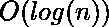，因为 2-3 棵树的高度为。

**搜索:**要在给定的 2-3 树 **T** 中搜索一个键 **K** ，我们遵循以下步骤:

基本案例:

1.  如果 **T** 为空，返回 False(在树中找不到键)。
2.  如果当前节点包含等于 **K** 的数据值，则返回真。
3.  如果我们到达叶节点并且它不包含所需的键值 **K** ，则返回 False。

递归调用:

1.  如果**K**<current node . left val，我们探索当前节点的左子树。
2.  否则如果 current node . left val< **K**<current node . right val，我们探索当前节点的中间子树。
3.  否则如果**K**>current node . right val，我们探索当前节点的右子树。

考虑以下示例:

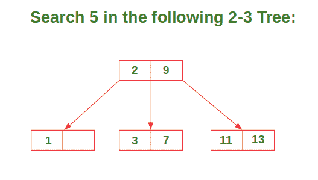

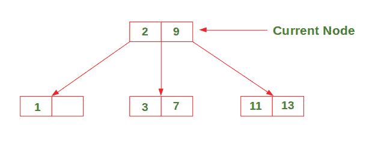

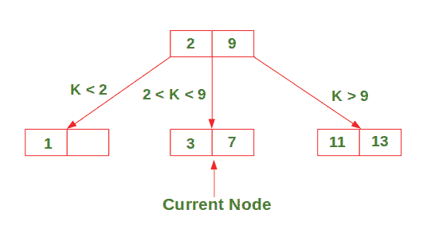

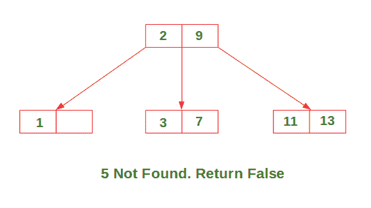

**插入:**插入有 3 种可能的情况，下面已经讨论过:

**情况 1:** 插入只有一个数据元素的节点

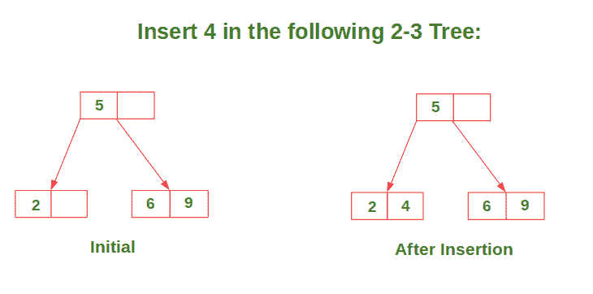

**情况 2:** 插入具有两个数据元素的节点，其父节点只包含一个数据元素。

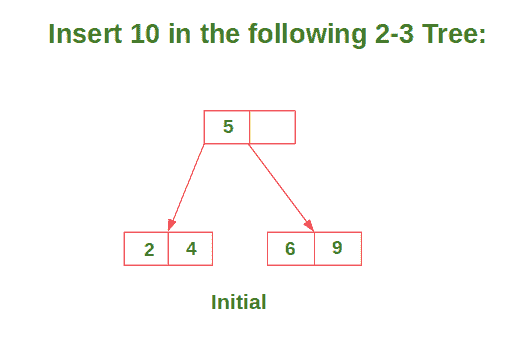

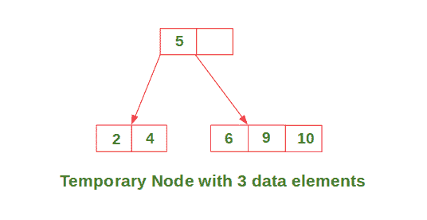

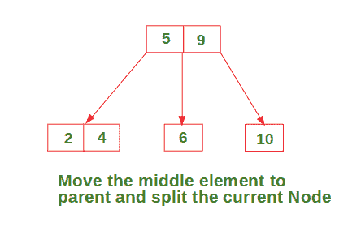

**情况 3:** 插入一个有两个数据元素的节点，其父节点也包含两个数据元素。

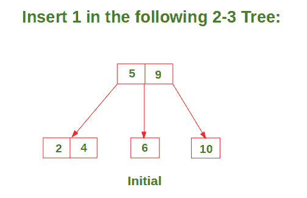

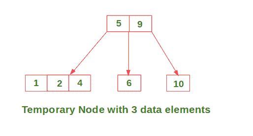

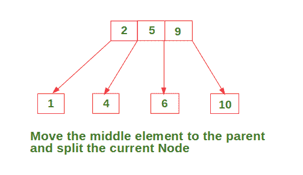

