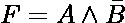
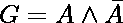
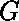
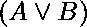
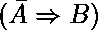
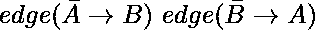
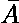
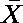

# 2-可满足性(2-SAT)问题

> 原文:[https://www . geesforgeks . org/2-可满足性-2-sat-问题/](https://www.geeksforgeeks.org/2-satisfiability-2-sat-problem/)

## 布尔可满足性问题

布尔可满足性或简称为 **SAT** 是确定一个布尔公式是可满足还是不可满足的问题。

*   **可满足:**如果布尔变量可以赋值，使得公式结果为真，那么我们说公式是可满足的。
*   **不可满足:**如果不能赋值，那么我们说公式是不可满足的。

**例:**

*   ，是可满足的，因为 A =真，B =假使得 F =真。
*   ，不可满足，因为:

<figure class="table">

|  |  |  |
| 真实的 | 错误的 | 错误的 |
| 错误的 | 真实的 | 错误的 |

</figure>

**注:**布尔可满足性问题为 [NP-complete](https://en.wikipedia.org/wiki/NP-completeness) (证明参见[库克定理](https://en.wikipedia.org/wiki/Cook%E2%80%93Levin_theorem))。


## 什么是 2-SAT 问题

> 2-SAT 是布尔可满足性问题的特例，可以在[多项式时间](https://en.wikipedia.org/wiki/Time_complexity#Polynomial_time)内求解
> 。

为了更好地理解这一点，首先让我们看看什么是合取范式(CNF)或也称为和的乘积(POS)。
**CNF :** CNF 是从句的连词(AND)，其中每个从句都是析取(OR)。
现在，2-SAT 将 SAT 的问题仅限于那些用 CNF 表示的布尔公式，每个子句只有 **2 个术语**(也称为 **2-CNF** )。
**例:** 
因此，2-可满足性问题可以表述为:
**给定每个子句只有 2 个项的 CNF，是否可以将这些值赋给变量，使得 CNF 为真？**
示例:

```
Input : 
Output : The given expression is satisfiable. 
(for x1 = FALSE, x2 = TRUE)
Input : 
Output : The given expression is unsatisfiable. 
(for all possible combinations of x1 and x2)
```

## 2-SAT 问题的解法

要使 CNF 价值成为现实，每个条款的价值都应该是真实的。让其中一个从句成为。

```
*** QuickLaTeX cannot compile formula:

*** Error message:
Error: Nothing to show, formula is empty

```

**=真**

*   如果 A = 0，B 必须为 1，即
*   如果 B = 0，A 必须为 1，即

因此，

```
 = TRUE is equivalent to 
```

现在，我们可以把 CNF 表达为一种暗示。因此，我们创建了一个蕴涵图，它对 CNF 的每个子句都有两条边。
在蕴涵图中表示为
因此，对于带有‘m’子句的布尔公式，我们用:
来制作一个蕴涵图

*   每条 2 条边，即“2m”边。
*   布尔公式中涉及的每个布尔变量都有一个节点。

让我们看一个蕴涵图的例子。

```
*** QuickLaTeX cannot compile formula:

*** Error message:
Error: Nothing to show, formula is empty

```


**注:**言外之意(如果 A 那么 B)等同于它的对位(如果那么)。
现在，考虑以下情况:

```
CASE 1: If [Tex]exists in the graph[/Tex]
This means 
If X = TRUE,  = TRUE, which is a contradiction.
But if X = FALSE, there are no implication constraints.
Thus, X = FALSE
```

```
CASE 2: If [Tex]exists in the graph[/Tex]
This means 
If  = TRUE, X = TRUE, which is a contradiction.
But if  = FALSE, there are no implication constraints.
Thus,  = FALSE i.e. X = TRUE
```

```
CASE 3: If [Tex]both exist in the graph[/Tex]
One edge requires X to be TRUE and the other one requires X to be FALSE.
Thus, there is no possible assignment in such a case.
```

**结论:**如果任意两个变量和处于一个周期，即都存在，那么 CNF 是不可满足的。否则，有一个可能的任务，CNF 是可满足的。
这里注意，我们使用路径是由于蕴涵的以下性质:
如果我们有
因此，如果我们在蕴涵图中有一条路径，那就相当于有一条直接边。
**结论从实现的角度来看:**
如果 X 和位于同一个 SCC(强连通分量)中，则 CNF 不可满足。
有向图强连通分支具有这样的节点，即每个节点都可以从 SCC 中的每个其他节点到达。
现在，如果 X 和位于同一个 SCC 上，我们肯定会有出现，从而得出结论。
可以使用 [Kosaraju 算法](https://www.geeksforgeeks.org/strongly-connected-components/)
在 O(E+V)中检查 SCC

## C++

```
// C++ implementation to find if the given
// expression is satisfiable using the
// Kosaraju's Algorithm
#include <bits/stdc++.h>
using namespace std;

const int MAX = 100000;

// data structures used to implement Kosaraju's
// Algorithm. Please refer
// https://www.geeksforgeeks.org/strongly-connected-components/
vector<int> adj[MAX];
vector<int> adjInv[MAX];
bool visited[MAX];
bool visitedInv[MAX];
stack<int> s;

// this array will store the SCC that the
// particular node belongs to
int scc[MAX];

// counter maintains the number of the SCC
int counter = 1;

// adds edges to form the original graph
void addEdges(int a, int b)
{
    adj[a].push_back(b);
}

// add edges to form the inverse graph
void addEdgesInverse(int a, int b)
{
    adjInv[b].push_back(a);
}

// for STEP 1 of Kosaraju's Algorithm
void dfsFirst(int u)
{
    if(visited[u])
        return;

    visited[u] = 1;

    for (int i=0;i<adj[u].size();i++)
        dfsFirst(adj[u][i]);

    s.push(u);
}

// for STEP 2 of Kosaraju's Algorithm
void dfsSecond(int u)
{
    if(visitedInv[u])
        return;

    visitedInv[u] = 1;

    for (int i=0;i<adjInv[u].size();i++)
        dfsSecond(adjInv[u][i]);

    scc[u] = counter;
}

// function to check 2-Satisfiability
void is2Satisfiable(int n, int m, int a[], int b[])
{
    // adding edges to the graph
    for(int i=0;i<m;i++)
    {
        // variable x is mapped to x
        // variable -x is mapped to n+x = n-(-x)

        // for a[i] or b[i], addEdges -a[i] -> b[i]
        // AND -b[i] -> a[i]
        if (a[i]>0 && b[i]>0)
        {
            addEdges(a[i]+n, b[i]);
            addEdgesInverse(a[i]+n, b[i]);
            addEdges(b[i]+n, a[i]);
            addEdgesInverse(b[i]+n, a[i]);
        }

        else if (a[i]>0 && b[i]<0)
        {
            addEdges(a[i]+n, n-b[i]);
            addEdgesInverse(a[i]+n, n-b[i]);
            addEdges(-b[i], a[i]);
            addEdgesInverse(-b[i], a[i]);
        }

        else if (a[i]<0 && b[i]>0)
        {
            addEdges(-a[i], b[i]);
            addEdgesInverse(-a[i], b[i]);
            addEdges(b[i]+n, n-a[i]);
            addEdgesInverse(b[i]+n, n-a[i]);
        }

        else
        {
            addEdges(-a[i], n-b[i]);
            addEdgesInverse(-a[i], n-b[i]);
            addEdges(-b[i], n-a[i]);
            addEdgesInverse(-b[i], n-a[i]);
        }
    }

    // STEP 1 of Kosaraju's Algorithm which
    // traverses the original graph
    for (int i=1;i<=2*n;i++)
        if (!visited[i])
            dfsFirst(i);

    // STEP 2 pf Kosaraju's Algorithm which
    // traverses the inverse graph. After this,
    // array scc[] stores the corresponding value
    while (!s.empty())
    {
        int n = s.top();
        s.pop();

        if (!visitedInv[n])
        {
            dfsSecond(n);
            counter++;
        }
    }

    for (int i=1;i<=n;i++)
    {
        // for any 2 variable x and -x lie in
        // same SCC
        if(scc[i]==scc[i+n])
        {
            cout << "The given expression "
                 "is unsatisfiable." << endl;
            return;
        }
    }

    // no such variables x and -x exist which lie
    // in same SCC
    cout << "The given expression is satisfiable."
         << endl;
    return;
}

//  Driver function to test above functions
int main()
{
    // n is the number of variables
    // 2n is the total number of nodes
    // m is the number of clauses
    int n = 5, m = 7;

    // each clause is of the form a or b
    // for m clauses, we have a[m], b[m]
    // representing a[i] or b[i]

    // Note:
    // 1 <= x <= N for an uncomplemented variable x
    // -N <= x <= -1 for a complemented variable x
    // -x is the complement of a variable x

    // The CNF being handled is:
    // '+' implies 'OR' and '*' implies 'AND'
    // (x1+x2)*(x2’+x3)*(x1’+x2’)*(x3+x4)*(x3’+x5)*
    // (x4’+x5’)*(x3’+x4)
    int a[] = {1, -2, -1, 3, -3, -4, -3};
    int b[] = {2, 3, -2, 4, 5, -5, 4};

    // We have considered the same example for which
    // Implication Graph was made
    is2Satisfiable(n, m, a, b);

    return 0;
}
```

## Java 语言(一种计算机语言，尤用于创建网站)

```
// Java implementation to find if the given 
// expression is satisfiable using the 
// Kosaraju's Algorithm 
import java.io.*;
import java.util.*;

class GFG{

static final int MAX = 100000;

// Data structures used to implement Kosaraju's
// Algorithm. Please refer
// https://www.geeksforgeeks.org/strongly-connected-components/
@SuppressWarnings("unchecked")
static List<List<Integer> > adj = new ArrayList();

@SuppressWarnings("unchecked")
static List<List<Integer> > adjInv = new ArrayList();
static boolean[] visited = new boolean[MAX];
static boolean[] visitedInv = new boolean[MAX];
static Stack<Integer> s = new Stack<Integer>();

// This array will store the SCC that the
// particular node belongs to
static int[] scc = new int[MAX];

// counter maintains the number of the SCC
static int counter = 1;

// Adds edges to form the original graph void
static void addEdges(int a, int b)
{
    adj.get(a).add(b);
}

// Add edges to form the inverse graph
static void addEdgesInverse(int a, int b)
{
    adjInv.get(b).add(a);
}

// For STEP 1 of Kosaraju's Algorithm
static void dfsFirst(int u)
{
    if (visited[u])
        return;

    visited[u] = true;

    for(int i = 0; i < adj.get(u).size(); i++)
        dfsFirst(adj.get(u).get(i));

    s.push(u);
}

// For STEP 2 of Kosaraju's Algorithm
static void dfsSecond(int u)
{
    if (visitedInv[u])
        return;

    visitedInv[u] = true;

    for(int i = 0; i < adjInv.get(u).size(); i++)
        dfsSecond(adjInv.get(u).get(i));

    scc[u] = counter;
}

// Function to check 2-Satisfiability
static void is2Satisfiable(int n, int m, 
                           int a[], int b[])
{

    // Adding edges to the graph
    for(int i = 0; i < m; i++) 
    {

        // variable x is mapped to x
        // variable -x is mapped to n+x = n-(-x)

        // for a[i] or b[i], addEdges -a[i] -> b[i]
        // AND -b[i] -> a[i]
        if (a[i] > 0 && b[i] > 0) 
        {
            addEdges(a[i] + n, b[i]);
            addEdgesInverse(a[i] + n, b[i]);
            addEdges(b[i] + n, a[i]);
            addEdgesInverse(b[i] + n, a[i]);
        }

        else if (a[i] > 0 && b[i] < 0) 
        {
            addEdges(a[i] + n, n - b[i]);
            addEdgesInverse(a[i] + n, n - b[i]);
            addEdges(-b[i], a[i]);
            addEdgesInverse(-b[i], a[i]);
        }

        else if (a[i] < 0 && b[i] > 0) 
        {
            addEdges(-a[i], b[i]);
            addEdgesInverse(-a[i], b[i]);
            addEdges(b[i] + n, n - a[i]);
            addEdgesInverse(b[i] + n, n - a[i]);
        }

        else
        {
            addEdges(-a[i], n - b[i]);
            addEdgesInverse(-a[i], n - b[i]);
            addEdges(-b[i], n - a[i]);
            addEdgesInverse(-b[i], n - a[i]);
        }
    }

    // STEP 1 of Kosaraju's Algorithm which
    // traverses the original graph
    for(int i = 1; i <= 2 * n; i++)
        if (!visited[i])
            dfsFirst(i);

    // STEP 2 pf Kosaraju's Algorithm which
    // traverses the inverse graph. After this,
    // array scc[] stores the corresponding value
    while (!s.isEmpty()) 
    {
        int top = s.peek();
        s.pop();

        if (!visitedInv[top]) 
        {
            dfsSecond(top);
            counter++;
        }
    }

    for(int i = 1; i <= n; i++) 
    {

        // For any 2 variable x and -x lie in
        // same SCC
        if (scc[i] == scc[i + n])
        {
            System.out.println("The given expression" +
                               "is unsatisfiable.");
            return;
        }
    }

    // No such variables x and -x exist which lie
    // in same SCC
    System.out.println("The given expression " + 
                       "is satisfiable.");
}

// Driver code
public static void main(String[] args)
{

    // n is the number of variables
    // 2n is the total number of nodes
    // m is the number of clauses
    int n = 5, m = 7;

    for(int i = 0; i < MAX; i++) 
    {
        adj.add(new ArrayList<Integer>());
        adjInv.add(new ArrayList<Integer>());
    }

    // Each clause is of the form a or b
    // for m clauses, we have a[m], b[m]
    // representing a[i] or b[i]

    // Note:
    // 1 <= x <= N for an uncomplemented variable x
    // -N <= x <= -1 for a complemented variable x
    // -x is the complement of a variable x

    // The CNF being handled is:
    // '+' implies 'OR' and '*' implies 'AND'
    // (x1+x2)*(x2’+x3)*(x1’+x2’)*(x3+x4)*(x3’+x5)*
    // (x4’+x5’)*(x3’+x4)
    int a[] = { 1, -2, -1, 3, -3, -4, -3 };
    int b[] = { 2, 3, -2, 4, 5, -5, 4 };

    // We have considered the same example 
    // for which Implication Graph was made
    is2Satisfiable(n, m, a, b);
}
}

// This code is contributed by jithin
```

**输出:**

```
The given expression is satisfiable.
```

**更多测试用例:**

```
Input : n = 2, m = 3
        a[] = {1, 2, -1}
        b[] = {2, -1, -2}
Output : The given expression is satisfiable.

Input : n = 2, m = 4
        a[] = {1, -1, 1, -1}
        b[] = {2, 2, -2, -2}
Output : The given expression is unsatisfiable.
```

本文由**安雅金达尔**供稿。如果你喜欢 GeeksforGeeks 并想投稿，你也可以使用[write.geeksforgeeks.org](https://write.geeksforgeeks.org)写一篇文章或者把你的文章邮寄到 review-team@geeksforgeeks.org。看到你的文章出现在极客博客主页上，帮助其他极客。
如果你发现任何不正确的地方，或者你想分享更多关于上面讨论的话题的信息，请写评论。