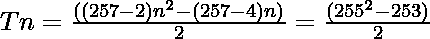

# 257-gon 编号

> 原文:[https://www.geeksforgeeks.org/257-gon-number/](https://www.geeksforgeeks.org/257-gon-number/)

给定一个 **N** 号，任务是找到 **N <sup>第</sup>T5【257-gon 号。** 

> 257 边数是一类图形数。它有一个 257 边的多边形，叫做 257 边多边形。第 N 个 257 边数是 257 个数的点，所有其他点都被一个公共的共享角包围并形成一个图案。前几个 257 边的数字是 **1，257，768，1534，2555，3831，…**

**例:**

> **输入:** N = 2
> **输出:** 257
> **说明:**
> 第二个 257-淋病号为 257。
> **输入:** N = 3
> **输出:** 768

**方法:**第 N 个 257 边数由公式给出:

*   s 边多边形的第 n 项= 

*   因此 257 边多边形的第 n 项为

> 

以下是上述方法的实现:

## C++

```
// C++ implementation for
// above approach
#include <bits/stdc++.h>
using namespace std;

// Function to find the
// nth 257-gon Number
int gonNum257(int n)
{
    return (255 * n * n - 253 * n) / 2;
}

// Driver Code
int main()
{
    int n = 3;
    cout << gonNum257(n);

    return 0;
}
```

## Java 语言(一种计算机语言，尤用于创建网站)

```
// Java program for above approach
class GFG{

// Function to find the
// nth 257-gon Number
static int gonNum257(int n)
{
    return (255 * n * n - 253 * n) / 2;
}

// Driver code
public static void main(String[] args)
{
    int n = 3;
    System.out.print(gonNum257(n));
}
}

// This code is contributed by shubham
```

## 蟒蛇 3

```
# Python3 implementation for
# above approach

# Function to find the
# nth 257-gon Number
def gonNum257(n):

    return (255 * n * n - 253 * n) // 2;

# Driver Code
n = 3;
print(gonNum257(n));

# This code is contributed by Code_Mech
```

## C#

```
// C# program for above approach
using System;
class GFG{

// Function to find the
// nth 257-gon Number
static int gonNum257(int n)
{
    return (255 * n * n - 253 * n) / 2;
}

// Driver code
public static void Main(String[] args)
{
    int n = 3;
    Console.Write(gonNum257(n));
}
}

// This code is contributed by sapnasingh4991
```

## java 描述语言

```
<script>

// JavaScript implementation for
// above approach

// Function to find the
// nth 257-gon Number
function gonNum257(n)
{
    return (255 * n * n - 253 * n) / 2;
}

// Driver Code
var n = 3;
document.write(gonNum257(n));

</script>
```

**Output:** 

```
768
```

**参考资料:**[https://en . Wikipedia . org/wiki/257-gon](https://en.wikipedia.org/wiki/257-gon)