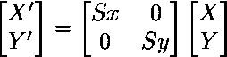
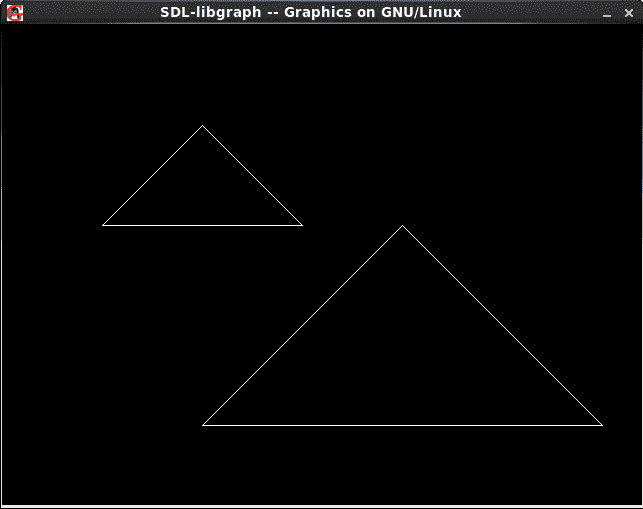

# 计算机图形学中的 2D 变换|集合 1(对象的缩放)

> 原文:[https://www . geesforgeks . org/2d-计算机图形中的变换-set-1-对象的缩放/](https://www.geeksforgeeks.org/2d-transformation-in-computer-graphics-set-1-scaling-of-objects/)

缩放变换会改变对象的大小。在缩放过程中，我们要么压缩，要么扩展对象的维度。
缩放操作可以通过将多边形的每个顶点坐标(x，y)乘以缩放因子 s <sub>x</sub> 和 s <sub>y</sub> 来实现，以产生变换后的坐标(x’，y’)。
所以，x' = x * s <sub>x</sub> 和 y' = y * s <sub>y</sub> 。
缩放因子 s <sub>x</sub> ，s <sub>y</sub> 分别在 X 和 Y 方向缩放对象。所以，上面的等式可以用矩阵形式表示:

或者 P' = S . P
缩放过程:

**注:**如果缩放因子 S 小于 1，那么我们缩小对象的大小。如果缩放因子大于 1，那么我们增加对象的大小。

算法:

```
1\. Make a 2x2 scaling matrix S as:
   Sx 0
   0  Sy
2\. For each point of the polygon.
   (i) Make a 2x1 matrix P, where P[0][0] equals 
       to x coordinate of the point and P[1][0] 
       equals to y coordinate of the point.
   (ii) Multiply scaling matrix S with point 
        matrix P to get the new coordinate.
3\. Draw the polygon using new coordinates.

```

下面是 C 实现:

```
// C program to demonstrate scaling of abjects
#include<stdio.h>
#include<graphics.h>

// Matrix Multiplication to find new Coordinates.
// s[][] is scaling matrix. p[][] is to store
// points that needs to be scaled.
// p[0][0] is x coordinate of point.
// p[1][0] is y coordinate of given point.
void findNewCoordinate(int s[][2], int p[][1])
{
    int temp[2][1] = { 0 };

    for (int i = 0; i < 2; i++)
        for (int j = 0; j < 1; j++)
            for (int k = 0; k < 2; k++)
                temp[i][j] += (s[i][k] * p[k][j]);

    p[0][0] = temp[0][0];
    p[1][0] = temp[1][0];
}

// Scaling the Polygon
void scale(int x[], int y[], int sx, int sy)
{
    // Triangle before Scaling
    line(x[0], y[0], x[1], y[1]);
    line(x[1], y[1], x[2], y[2]);
    line(x[2], y[2], x[0], y[0]);

    // Initializing the Scaling Matrix.
    int s[2][2] = { sx, 0, 0, sy };
    int p[2][1];

    // Scaling the triangle
    for (int i = 0; i < 3; i++)
    {
        p[0][0] = x[i];
        p[1][0] = y[i];

        findNewCoordinate(s, p);

        x[i] = p[0][0];
        y[i] = p[1][0];
    }

    // Triangle after Scaling
    line(x[0], y[0], x[1], y[1]);
    line(x[1], y[1], x[2], y[2]);
    line(x[2], y[2], x[0], y[0]);
}

// Driven Program
int main()
{
    int x[] = { 100, 200, 300 };
    int y[] = { 200, 100, 200 };
    int sx = 2, sy = 2;

    int gd, gm;
    detectgraph(&gd, &gm);
    initgraph(&gd, &gm," ");

    scale(x, y, sx,sy);
    getch();

    return 0;
}
```

输出:



本文由 **[Anuj Chauhan](https://www.facebook.com/anuj0503)** 供稿。如果你喜欢 GeeksforGeeks 并想投稿，你也可以使用[contribute.geeksforgeeks.org](http://www.contribute.geeksforgeeks.org)写一篇文章或者把你的文章邮寄到 contribute@geeksforgeeks.org。看到你的文章出现在极客博客主页上，帮助其他极客。

如果你发现任何不正确的地方，或者你想分享更多关于上面讨论的话题的信息，请写评论。