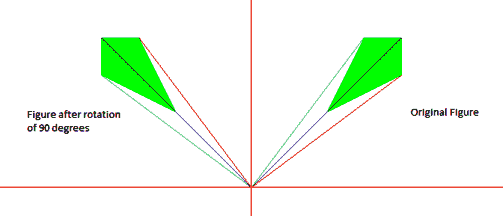
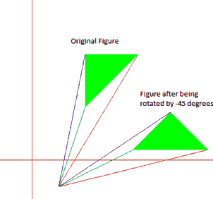
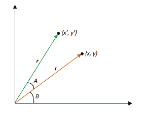
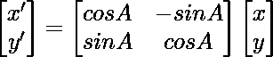

# 2D 变换|对象旋转

> 原文:[https://www . geesforgeks . org/2d-变换-旋转-对象/](https://www.geeksforgeeks.org/2d-transformation-rotation-objects/)

我们必须将一个物体围绕一个给定的枢轴点旋转一个给定的角度，然后打印新的坐标。
示例:

```
Input : {(100, 100), (150, 200), (200, 200), 
         (200, 150)} is to be rotated about 
          (0, 0) by 90 degrees
Output : (-100, 100), (-200, 150), (-200, 200), (-150, 200)
```



```
Input : {(100, 100), (100, 200), (200, 200)} 
        is to be rotated about (50, -50) by 
         -45 degrees
Output : (191.421, 20.7107), (262.132, 91.4214), 
         (332.843, 20.7107)
```



为了旋转一个物体，我们需要单独旋转图形的每个顶点。
将点 P(x，y)绕原点旋转一个角度α，我们得到点 P’(x，y’)。x '和 y '的值可以计算如下



我们知道，
x = rcsb，y = rsinb
【x】= RCS(a+b)= r(cosacosb–sinab)=<u>【rcsb】</u>什么--<u>rsinb</u>【Sina】**【xcosa】–ysina**



## C

```
// C program to rotate an object by
// a given angle about a given point
#include <math.h>
#include <stdio.h>

// Using macros to convert degree to radian
// and call sin() and cos() as these functions
// take input in radians
#define SIN(x) sin(x * 3.141592653589 / 180)
#define COS(x) cos(x * 3.141592653589 / 180)

// To rotate an object
void rotate(float a[][2], int n, int x_pivot, int y_pivot,
            int angle)
{
    int i = 0;
    while (i < n) {
        // Shifting the pivot point to the origin
        // and the given points accordingly
        int x_shifted = a[i][0] - x_pivot;
        int y_shifted = a[i][1] - y_pivot;

        // Calculating the rotated point co-ordinates
        // and shifting it back
        a[i][0] = x_pivot
                  + (x_shifted * COS(angle)
                     - y_shifted * SIN(angle));
        a[i][1] = y_pivot
                  + (x_shifted * SIN(angle)
                     + y_shifted * COS(angle));
        printf("(%f, %f) ", a[i][0], a[i][1]);
        i++;
    }
}

// Driver Code
int main()
{
    // 1st Example
    // The following figure is to be
    // rotated about (0, 0) by 90 degrees
    int size1 = 4; // No. of vertices

    // Vertex co-ordinates must be in order
    float points_list1[][2] = { { 100, 100 },
                                { 150, 200 },
                                { 200, 200 },
                                { 200, 150 } };
    rotate(points_list1, size1, 0, 0, 90);

    // 2nd Example
    // The following figure is to be
    // rotated about (50, -50) by -45 degrees
    /*int size2 = 3;//No. of vertices
    float points_list2[][2] = {{100, 100}, {100, 200},
                                {200, 200}};
    rotate(points_list2, size2, 50, -50, -45);*/
    return 0;
}
```

## 卡片打印处理机（Card Print Processor 的缩写）

```
// C++ program to rotate an object by
// a given angle about a given point
#include <iostream>
#include <math.h>
using namespace std;

// Using macros to convert degree to radian
// and call sin() and cos() as these functions
// take input in radians
#define SIN(x) sin(x * 3.141592653589 / 180)
#define COS(x) cos(x * 3.141592653589 / 180)

// To rotate an object given as order set of points in a[]
// (x_pivot, y_pivot)
void rotate(float a[][2], int n, int x_pivot, int y_pivot,
            int angle)
{
    int i = 0;
    while (i < n) {
        // Shifting the pivot point to the origin
        // and the given points accordingly
        int x_shifted = a[i][0] - x_pivot;
        int y_shifted = a[i][1] - y_pivot;

        // Calculating the rotated point co-ordinates
        // and shifting it back
        a[i][0] = x_pivot
                  + (x_shifted * COS(angle)
                     - y_shifted * SIN(angle));
        a[i][1] = y_pivot
                  + (x_shifted * SIN(angle)
                     + y_shifted * COS(angle));
        cout << "(" << a[i][0] << ", " << a[i][1] << ") ";
        i++;
    }
}

// Driver Code
int main()
{
    // 1st Example
    // The following figure is to be
    // rotated about (0, 0) by 90 degrees
    int size1 = 4; // No. of vertices
    // Vertex co-ordinates must be in order
    float points_list1[][2] = { { 100, 100 },
                                { 150, 200 },
                                { 200, 200 },
                                { 200, 150 } };
    rotate(points_list1, size1, 0, 0, 90);

    // 2nd Example
    // The following figure is to be
    // rotated about (50, -50) by -45 degrees
    /*int size2 = 3;//No. of vertices
    float points_list2[][2] = {{100, 100}, {100, 200},
                                {200, 200}};
    rotate(points_list2, size2, 50, -50, -45);*/
    return 0;
}
```

## 蟒蛇 3

```
# Python3 program to rotate an object by
# a given angle about a given point
import math

SIN=lambda x: int(math.sin(x * 3.141592653589 / 180))
COS=lambda x: int(math.cos(x * 3.141592653589 / 180))

# To rotate an object
def rotate(a, n, x_pivot, y_pivot, angle):
    i = 0
    while (i < n) :
        # Shifting the pivot point to the origin
        # and the given points accordingly
        x_shifted = a[i][0] - x_pivot
        y_shifted = a[i][1] - y_pivot

        # Calculating the rotated point co-ordinates
        # and shifting it back
        a[i][0] = x_pivot + (x_shifted * COS(angle) - y_shifted * SIN(angle))
        a[i][1] = y_pivot + (x_shifted * SIN(angle) + y_shifted * COS(angle))
        print("({}, {}) ".format(a[i][0], a[i][1]),end=" ")
        i+=1

# Driver Code
if __name__=='__main__':
    # 1st Example
    # The following figure is to be
    # rotated about (0, 0) by 90 degrees
    size1 = 4 # No. of vertices

    # Vertex co-ordinates must be in order
    points_list1 = [[ 100, 100],
                    [ 150, 200],
                    [ 200, 200],
                    [ 200, 150],] 
    rotate(points_list1, size1, 0, 0, 90)

    # 2nd Example
    # The following figure is to be
    # rotated about (50, -50) by -45 degrees
    # size2 = 3#No. of vertices
    # points_list2 = [[100, 100],
    #                     [100, 200],
    #                     [200, 200]]
    # rotate(points_list2, size2, 50, -50, -45)
```

**输出:**

```
(-100, 100), (-200, 150), (-200, 200), (-150, 200)
```

**时间复杂度:**O(N)
T3】辅助空间: O(1)
**参考文献:** [旋转矩阵](https://en.wikipedia.org/wiki/Rotation_matrix)

本文由**纳巴尼特罗伊**供稿。如果你喜欢 GeeksforGeeks 并想投稿，你也可以使用[write.geeksforgeeks.org](http://www.write.geeksforgeeks.org)写一篇文章或者把你的文章邮寄到 review-team@geeksforgeeks.org。看到你的文章出现在极客博客主页上，帮助其他极客。
如果你发现任何不正确的地方，或者你想分享更多关于上面讨论的话题的信息，请写评论。