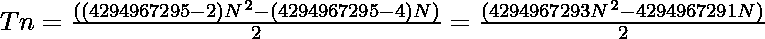

# 4294967295-gon 号码

> 原文:[https://www.geeksforgeeks.org/4294967295-gon-number/](https://www.geeksforgeeks.org/4294967295-gon-number/)

**4294967295-gon 数**是一类图形数。它有一个 4294967295 边的多边形，叫做 **4294967295 边**。第 N 个 4294967295-gon 数计算 4294967295 个点的数量，所有其他点用一个公共共享角包围并形成一个图案。
前几个 4294967295 的号码是:

> 1，4294967295，12884901882，…

### 检查 N 是否为 4294967295-gon 数字

给定一个编号 **N** ，任务是找到**N<sup>th</sup>T5**4294967295-gon 编号**。
**举例:**** 

> **输入:** N = 2
> **输出:** 4294967295
> **说明:**
> 第二个 4294967295-戈诺尔号为 4294967295。
> **输入:** N = 3
> **输出:** 12884901882

**方法:**N-th 4294967295-gon 数由公式
给出

*   S 边多边形的第 n 项= 

*   因此 4294967295 边多边形的第 N 项由
    给出

> 

以下是上述方法的实现:

## C++

```
// C++ program to find N-th
// TetracontapentagonNum number
#include<bits/stdc++.h>
using namespace std;

// Function to find the nth
// 4294967295-gon number
static long gonNum4294967295(int N)
{
    return (4294967293L * N *
        N - 4294967291L * N) / 2;
}

// Driver code
int main()
{
    int n = 3;
    cout << "3rd 4294967295-gon Number is "
         << gonNum4294967295(n);
}

// This code is contributed by Code_Mech
```

## Java 语言(一种计算机语言，尤用于创建网站)

```
// Java program to find N-th
// TetracontapentagonNum number
class GFG{

// Function to find the nth
// 4294967295-gon number
static long gonNum4294967295(int N)
{
    return (4294967293L * N *
        N - 4294967291L * N) / 2;
}

// Driver code
public static void main(String[] args)
{
    int n = 3;
    System.out.print("3rd 4294967295-gon Number is " +
                                 gonNum4294967295(n));
}
}

// This code is contributed by Pratima Pandey
```

## 蟒蛇 3

```
# Python3 program to find the N-th
# 4294967295-gon number

# Function to find the N-th
# 4294967295-gon number
def gonNum4294967295(N):

    return (4294967293 * N * N - 4294967291 * N) // 2

# Driver Code

# Given Number
n = 3

# Function Call
print("3rd 4294967295-gon Number is ",
                gonNum4294967295(n))
```

## C#

```
// C# program to find N-th
// TetracontapentagonNum number
using System;
class GFG{

// Function to find the nth
// 4294967295-gon number
static long gonNum4294967295(int N)
{
    return (4294967293L * N *
        N - 4294967291L * N) / 2;
}

// Driver code
public static void Main()
{
    int n = 3;
    Console.Write("3rd 4294967295-gon Number is " +
                              gonNum4294967295(n));
}
}

// This code is contributed by Code_Mech
```

## java 描述语言

```
<script>
// Javascript program to find N-th
// TetracontapentagonNum number

    // Function to find the nth
    // 4294967295-gon number
    function gonNum4294967295(N)
    {
        return ((4294967293 * N * N ) - (4294967291 * N)) / 2;
    }

    // Driver code

    let n = 3;
    document.write("3rd 4294967295-gon Number is " + gonNum4294967295(n));

// This code is contributed by aashish1995
</script>
```

**Output:** 

```
3rd 4294967295-gon Number is  12884901882
```