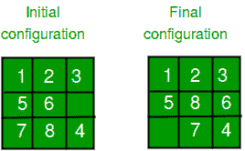
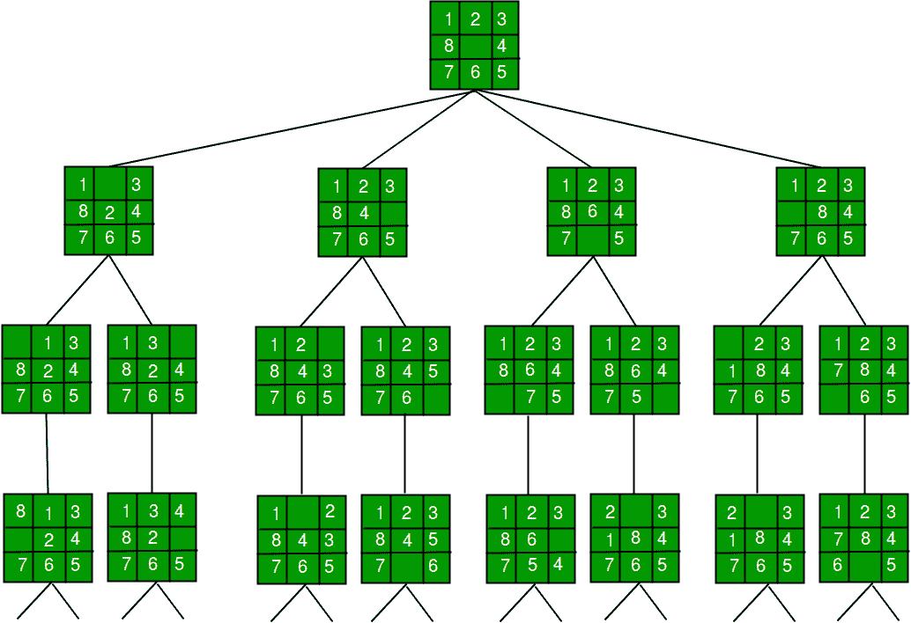
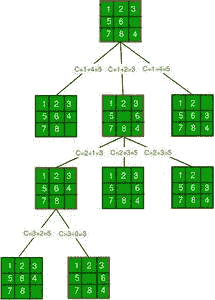

# 使用分支定界的 8 道难题

> 原文:[https://www . geesforgeks . org/8-难题-问题-使用分支和绑定/](https://www.geeksforgeeks.org/8-puzzle-problem-using-branch-and-bound/)

我们已经介绍了分支和边界，并在下面的帖子中讨论了 0/1 背包问题。

*   [分支定界|集合 1(带 0/1 背包的介绍)](https://www.geeksforgeeks.org/branch-and-bound-set-1-introduction-with-01-knapsack/)
*   [分支定界|集合 2(0/1 背包的实现)](https://www.geeksforgeeks.org/branch-and-bound-set-2-implementation-of-01-knapsack/)

在这个难题中，讨论了 8 个难题的解。
*给定一块 3×3 的板，有 8 块瓷砖(每块瓷砖有一个从 1 到 8 的数字)和一个空格。目标是将数字放在瓷砖上，以利用空白空间匹配**最终配置。我们可以将四个相邻的(左、右、上方*、*和下方)瓷砖滑入空白空间。*

例如，



**1。
我们可以在状态空间(给定问题的所有配置的集合，即从初始状态可以到达的所有状态)树上执行深度优先搜索。** 



State Space Tree for 8 Puzzle

在这个解决方案中，连续的动作可以让我们远离目标，而不是让我们更接近目标。状态空间树的搜索遵循从根开始的最左边的路径，而不考虑初始状态。在这种方法中可能永远找不到答案节点。

**2。BFS(蛮力)**
我们可以在状态空间树上执行广度优先搜索。这总是会找到离根最近的目标状态。但是不管初始状态是什么，算法都会像 DFS 一样尝试相同的移动顺序。

**3。分支和界限**
对答案节点的搜索通常可以通过使用“智能”排序函数(也称为近似成本函数)来加速，以避免在不包含答案节点的子树中搜索。它类似于回溯技术，但使用类似 BFS 的搜索。

分支定界
**1 涉及的节点基本有三种。活动节点**是已经生成但子节点尚未生成的节点。
T4【2】。e 节点是一个活节点，其子节点目前正在探索中。换句话说，电子节点是当前正在扩展的节点。
**3。死节点**是生成的节点，不再扩展或探索。死亡节点的所有子节点都已展开。

成本函数:
搜索树中的每个节点 X 都与一个成本相关联。成本函数对于确定下一个 E 节点很有用。下一个电子节点是成本最低的节点。成本函数定义为

```
   C(X) = g(X) + h(X) where
   g(X) = cost of reaching the current node 
          from the root
   h(X) = cost of reaching an answer node from X.
```

的理想**成本函数一个**8-难题算法:**
我们假设在任何方向移动一个瓷砖的单位成本为 1。记住这一点，我们为 8-难题算法定义了如下的成本函数:**

```
   c(x) = f(x) + h(x) where
   f(x) is the length of the path from root to x 
        (the number of moves so far) and
   h(x) is the number of non-blank tiles not in 
        their goal position (the number of mis-
        -placed tiles). There are at least h(x) 
        moves to transform state x to a goal state
```

有一种算法可以得到未知值 h(x)的近似值。

**完整算法:**

```
/* Algorithm LCSearch uses c(x) to find an answer node
 * LCSearch uses Least() and Add() to maintain the list 
   of live nodes
 * Least() finds a live node with least c(x), deletes
   it from the list and returns it
 * Add(x) adds x to the list of live nodes
 * Implement list of live nodes as a min-heap */

struct list_node
{
   list_node *next;

   // Helps in tracing path when answer is found
   list_node *parent; 
   float cost;
} 

algorithm LCSearch(list_node *t)
{
   // Search t for an answer node
   // Input: Root node of tree t
   // Output: Path from answer node to root
   if (*t is an answer node)
   {
       print(*t);
       return;
   }

   E = t; // E-node

   Initialize the list of live nodes to be empty;
   while (true)
   {
      for each child x of E
      {
          if x is an answer node
          {
             print the path from x to t;
             return;
          }
          Add (x); // Add x to list of live nodes;
          x->parent = E; // Pointer for path to root
      }

      if there are no more live nodes
      {
         print ("No answer node");
         return;
      }

      // Find a live node with least estimated cost
      E = Least(); 

      // The found node is deleted from the list of 
      // live nodes
   }
}
```

下图显示了上述算法从给定的 8-拼图初始配置到达最终配置的路径。请注意，只有成本函数值最小的节点才会被展开。



## C++14

```
// Program to print path from root node to destination node
// for N*N -1 puzzle algorithm using Branch and Bound
// The solution assumes that instance of puzzle is solvable
#include <bits/stdc++.h>
using namespace std;
#define N 3

// state space tree nodes
struct Node
{
    // stores the parent node of the current node
    // helps in tracing path when the answer is found
    Node* parent;

    // stores matrix
    int mat[N][N];

    // stores blank tile coordinates
    int x, y;

    // stores the number of misplaced tiles
    int cost;

    // stores the number of moves so far
    int level;
};

// Function to print N x N matrix
int printMatrix(int mat[N][N])
{
    for (int i = 0; i < N; i++)
    {
        for (int j = 0; j < N; j++)
            printf("%d ", mat[i][j]);
        printf("\n");
    }
}

// Function to allocate a new node
Node* newNode(int mat[N][N], int x, int y, int newX,
              int newY, int level, Node* parent)
{
    Node* node = new Node;

    // set pointer for path to root
    node->parent = parent;

    // copy data from parent node to current node
    memcpy(node->mat, mat, sizeof node->mat);

    // move tile by 1 position
    swap(node->mat[x][y], node->mat[newX][newY]);

    // set number of misplaced tiles
    node->cost = INT_MAX;

    // set number of moves so far
    node->level = level;

    // update new blank tile coordinates
    node->x = newX;
    node->y = newY;

    return node;
}

// bottom, left, top, right
int row[] = { 1, 0, -1, 0 };
int col[] = { 0, -1, 0, 1 };

// Function to calculate the number of misplaced tiles
// ie. number of non-blank tiles not in their goal position
int calculateCost(int initial[N][N], int final[N][N])
{
    int count = 0;
    for (int i = 0; i < N; i++)
      for (int j = 0; j < N; j++)
        if (initial[i][j] && initial[i][j] != final[i][j])
           count++;
    return count;
}

// Function to check if (x, y) is a valid matrix coordinate
int isSafe(int x, int y)
{
    return (x >= 0 && x < N && y >= 0 && y < N);
}

// print path from root node to destination node
void printPath(Node* root)
{
    if (root == NULL)
        return;
    printPath(root->parent);
    printMatrix(root->mat);

    printf("\n");
}

// Comparison object to be used to order the heap
struct comp
{
    bool operator()(const Node* lhs, const Node* rhs) const
    {
        return (lhs->cost + lhs->level) > (rhs->cost + rhs->level);
    }
};

// Function to solve N*N - 1 puzzle algorithm using
// Branch and Bound. x and y are blank tile coordinates
// in initial state
void solve(int initial[N][N], int x, int y,
           int final[N][N])
{
    // Create a priority queue to store live nodes of
    // search tree;
    priority_queue<Node*, std::vector<Node*>, comp> pq;

    // create a root node and calculate its cost
    Node* root = newNode(initial, x, y, x, y, 0, NULL);
    root->cost = calculateCost(initial, final);

    // Add root to list of live nodes;
    pq.push(root);

    // Finds a live node with least cost,
    // add its childrens to list of live nodes and
    // finally deletes it from the list.
    while (!pq.empty())
    {
        // Find a live node with least estimated cost
        Node* min = pq.top();

        // The found node is deleted from the list of
        // live nodes
        pq.pop();

        // if min is an answer node
        if (min->cost == 0)
        {
            // print the path from root to destination;
            printPath(min);
            return;
        }

        // do for each child of min
        // max 4 children for a node
        for (int i = 0; i < 4; i++)
        {
            if (isSafe(min->x + row[i], min->y + col[i]))
            {
                // create a child node and calculate
                // its cost
                Node* child = newNode(min->mat, min->x,
                              min->y, min->x + row[i],
                              min->y + col[i],
                              min->level + 1, min);
                child->cost = calculateCost(child->mat, final);

                // Add child to list of live nodes
                pq.push(child);
            }
        }
    }
}

// Driver code
int main()
{
    // Initial configuration
    // Value 0 is used for empty space
    int initial[N][N] =
    {
        {1, 2, 3},
        {5, 6, 0},
        {7, 8, 4}
    };

    // Solvable Final configuration
    // Value 0 is used for empty space
    int final[N][N] =
    {
        {1, 2, 3},
        {5, 8, 6},
        {0, 7, 4}
    };

    // Blank tile coordinates in initial
    // configuration
    int x = 1, y = 2;

    solve(initial, x, y, final);

    return 0;
}
```

## 蟒蛇 3

```
# Python3 program to print the path from root
# node to destination node for N*N-1 puzzle
# algorithm using Branch and Bound
# The solution assumes that instance of
# puzzle is solvable

# Importing copy for deepcopy function
import copy

# Importing the heap functions from python
# library for Priority Queue
from heapq import heappush, heappop

# This variable can be changed to change
# the program from 8 puzzle(n=3) to 15
# puzzle(n=4) to 24 puzzle(n=5)...
n = 3

# bottom, left, top, right
row = [ 1, 0, -1, 0 ]
col = [ 0, -1, 0, 1 ]

# A class for Priority Queue
class priorityQueue:

    # Constructor to initialize a
    # Priority Queue
    def __init__(self):
        self.heap = []

    # Inserts a new key 'k'
    def push(self, k):
        heappush(self.heap, k)

    # Method to remove minimum element
    # from Priority Queue
    def pop(self):
        return heappop(self.heap)

    # Method to know if the Queue is empty
    def empty(self):
        if not self.heap:
            return True
        else:
            return False

# Node structure
class node:

    def __init__(self, parent, mat, empty_tile_pos,
                 cost, level):

        # Stores the parent node of the
        # current node helps in tracing
        # path when the answer is found
        self.parent = parent

        # Stores the matrix
        self.mat = mat

        # Stores the position at which the
        # empty space tile exists in the matrix
        self.empty_tile_pos = empty_tile_pos

        # Storesthe number of misplaced tiles
        self.cost = cost

        # Stores the number of moves so far
        self.level = level

    # This method is defined so that the
    # priority queue is formed based on
    # the cost variable of the objects
    def __lt__(self, nxt):
        return self.cost < nxt.cost

# Function to calculate the number of
# misplaced tiles ie. number of non-blank
# tiles not in their goal position
def calculateCost(mat, final) -> int:

    count = 0
    for i in range(n):
        for j in range(n):
            if ((mat[i][j]) and
                (mat[i][j] != final[i][j])):
                count += 1

    return count

def newNode(mat, empty_tile_pos, new_empty_tile_pos,
            level, parent, final) -> node:

    # Copy data from parent matrix to current matrix
    new_mat = copy.deepcopy(mat)

    # Move tile by 1 position
    x1 = empty_tile_pos[0]
    y1 = empty_tile_pos[1]
    x2 = new_empty_tile_pos[0]
    y2 = new_empty_tile_pos[1]
    new_mat[x1][y1], new_mat[x2][y2] = new_mat[x2][y2], new_mat[x1][y1]

    # Set number of misplaced tiles
    cost = calculateCost(new_mat, final)

    new_node = node(parent, new_mat, new_empty_tile_pos,
                    cost, level)
    return new_node

# Function to print the N x N matrix
def printMatrix(mat):

    for i in range(n):
        for j in range(n):
            print("%d " % (mat[i][j]), end = " ")

        print()

# Function to check if (x, y) is a valid
# matrix coordinate
def isSafe(x, y):

    return x >= 0 and x < n and y >= 0 and y < n

# Print path from root node to destination node
def printPath(root):

    if root == None:
        return

    printPath(root.parent)
    printMatrix(root.mat)
    print()

# Function to solve N*N - 1 puzzle algorithm
# using Branch and Bound. empty_tile_pos is
# the blank tile position in the initial state.
def solve(initial, empty_tile_pos, final):

    # Create a priority queue to store live
    # nodes of search tree
    pq = priorityQueue()

    # Create the root node
    cost = calculateCost(initial, final)
    root = node(None, initial,
                empty_tile_pos, cost, 0)

    # Add root to list of live nodes
    pq.push(root)

    # Finds a live node with least cost,
    # add its children to list of live
    # nodes and finally deletes it from
    # the list.
    while not pq.empty():

        # Find a live node with least estimated
        # cost and delete it form the list of
        # live nodes
        minimum = pq.pop()

        # If minimum is the answer node
        if minimum.cost == 0:

            # Print the path from root to
            # destination;
            printPath(minimum)
            return

        # Generate all possible children
        for i in range(n):
            new_tile_pos = [
                minimum.empty_tile_pos[0] + row[i],
                minimum.empty_tile_pos[1] + col[i], ]

            if isSafe(new_tile_pos[0], new_tile_pos[1]):

                # Create a child node
                child = newNode(minimum.mat,
                                minimum.empty_tile_pos,
                                new_tile_pos,
                                minimum.level + 1,
                                minimum, final,)

                # Add child to list of live nodes
                pq.push(child)

# Driver Code

# Initial configuration
# Value 0 is used for empty space
initial = [ [ 1, 2, 3 ],
            [ 5, 6, 0 ],
            [ 7, 8, 4 ] ]

# Solvable Final configuration
# Value 0 is used for empty space
final = [ [ 1, 2, 3 ],
          [ 5, 8, 6 ],
          [ 0, 7, 4 ] ]

# Blank tile coordinates in
# initial configuration
empty_tile_pos = [ 1, 2 ]

# Function call to solve the puzzle
solve(initial, empty_tile_pos, final)

# This code is contributed by Kevin Joshi
```

**输出:**

```
1 2 3 
5 6 0 
7 8 4 

1 2 3 
5 0 6 
7 8 4 

1 2 3 
5 8 6 
7 0 4 

1 2 3 
5 8 6 
0 7 4
```

**来源:**T2[www.cs.umsl.edu/~sanjiv/classes/cs5130/lectures/bb.pdf](http://www.cs.umsl.edu/~sanjiv/classes/cs5130/lectures/bb.pdf)T5[https://www.seas.gwu.edu/~bell/csci212/Branch_and_Bound.pdf](https://www.seas.gwu.edu/~bell/csci212/Branch_and_Bound.pdf)

本文由**阿迪蒂亚·戈尔**供稿。如果你喜欢极客博客并想投稿，你也可以写一篇文章并把你的文章邮寄到 review-team@geeksforgeeks.org。看到你的文章出现在极客博客主页上，帮助其他极客。
如发现任何不正确的地方，请写评论，或者您想分享更多关于上述话题的信息