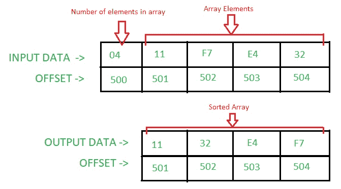

# 8086 选择排序程序

> 原文:[https://www.geeksforgeeks.org/8086-program-selection-sort/](https://www.geeksforgeeks.org/8086-program-selection-sort/)

**问题–**在 8086 微处理器中编写汇编语言程序，使用 Selection Sort 对给定的 n 个数数组进行排序。

**假设–**数组中的元素数量以偏移量 500 存储。数组从偏移量 501 开始。

**示例–**


**算法–**

1.  我们首先找到数组中最小的数字。
2.  从数组的第一个元素中交换最小的数字。
3.  继续重复这个过程，直到遍历完所有元素。

**程序–**

<center>

| 抵消 | 记忆术 | 评论 |
| --- | --- | --- |
| four hundred | MOV，501 年 | DI |
| Four hundred and three | MOV 是，500 | 国际标准 |
| Four hundred and six | mov cl 是] | cl |
| Four hundred and eight | 异曲同工 | ch |
| 40A | 国际公司 | SI |
| 40B | DEC CX | CX < - CX-0001 |
| 40C | MOV BX，是的 | bx |
| 40E | 莫夫啊，CL | ah |
| Four hundred and ten | 公司 AH | AH |
| Four hundred and twelve | MOV AL，[是] | al |
| Four hundred and fourteen | 国际公司 | SI |
| Four hundred and fifteen | 十二月啊 | AH |
| Four hundred and seventeen | CMP AL，[是] | [是] |
| Four hundred and nineteen | JC 41F | 如果进位标志= 1，转到偏移量 41F |
| 41B | MOV AL，[是] | al |
| 41D | MOV BX，是的 | bx |
| 41F | 国际公司 | SI |
| Four hundred and twenty | 十二月啊 | AH |
| Four hundred and twenty-two | JNZ 417 | 如果零标志= 0，转到偏移 417 |
| Four hundred and twenty-four | mov dl[bx] | dl |
| Four hundred and twenty-six | XCHG DL，[来自] | dl〔t0〕〔迪〕 |
| Four hundred and twenty-eight | XCHG DL，[BX] | dl〔t0〕〔bx〕 |
| 42A | 投资公司直接投资 | DI |
| 42B | 莫夫是，迪 | 国际标准 |
| 42D | LOOP 40C | CX |
| 42F | HLT | 节目结束。 |

</center>

**说明–**寄存器 AH、AL、BX、CX、DL、SI、DI 用于通用目的:

```
AL - Stored the smallest number
AH - Stores the counter for the inner loop
BX - Stores the offset of the smallest 
     number of each iteration of the outer loop
CX - Stores the counter for the outer loop
DL - Helps in swapping the elements
SI - Pointer
DI - Pointer 
```

1.  **MOV SI，500:** 在 SI 存储 0500。
2.  **MOV CL，[SI]:** 将偏移量 SI 处的内容存储在 CL 中。
3.  **异或 CH，CH:** 将逻辑运算异或 b/w CH 和 CH 的结果存储在 CH 中。
4.  **INC SI:** 将 SI 的值增加 1。
5.  **DEC CX:**CX 值减 1。
6.  **MOV AH，CL:** 存储 AH 中 CL 的含量。
7.  **CMP AL、【SI】:**将 AL 的含量与偏移 SI 处的含量进行比较。如果人工智能<【国际标准】–设置进位标志(即进位标志= 1)。
8.  **JC 41F:** 跳至偏移 041F，如果进位标志被设置(1)。
9.  **JNZ 417:** 跳至偏移 0417，如果零标志复位(0)。
10.  **XCHG DL、【BX】:**用偏移 BX 的内容交换 DL 的内容。
11.  **回路 40C:** 将 CX 值减少 1，并检查是否设置了零标志(1)。如果零标志被重置(0)，那么它跳到偏移 040℃。
12.  **HLT:** 终止程序。