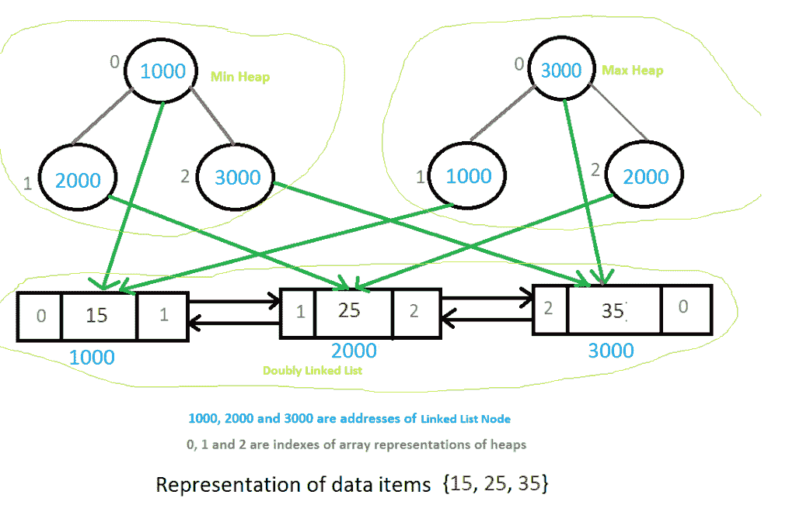

# 为给定的操作设计一个高效的数据结构

> 原文:[https://www.geeksforgeeks.org/a-data-structure-question/](https://www.geeksforgeeks.org/a-data-structure-question/)

为以下操作设计数据结构。数据结构应该足够高效，能够根据操作的频率来容纳操作。

```
1) findMin() : Returns the minimum item.
   Frequency: Most frequent

2) findMax() : Returns the maximum item.
    Frequency: Most frequent

3) deleteMin() : Delete the minimum item.
    Frequency: Moderate frequent 

4) deleteMax() : Delete the maximum item.
    Frequency: Moderate frequent 

5) Insert() : Inserts an item.
    Frequency: Least frequent

6) Delete() : Deletes an item.
    Frequency: Least frequent. 
```

一个**简单的解决方案**是维护一个排序的数组，其中最小的元素在第一个位置，最大的元素在最后。findMin()、findMAx()和 deleteMax()的时间复杂度为 O(1)。但是 deleteMin()，insert()和 delete()的时间复杂度将是 O(n)。

**我们能在 O(1)时间做最频繁的两个操作，在 O(Logn)时间做其他操作吗？**。
想法是使用两个二进制堆(一个最大堆和一个最小堆)。主要的挑战是，在删除一个项目时，我们需要从最小堆和最大堆中删除。所以，我们需要某种相互的数据结构。在下面的设计中，我们使用了双向链表作为相互数据结构。双向链表包含所有输入项和相应的最小和最大堆节点的索引。最小堆和最大堆的节点存储双向链表节点的地址。最小堆的根节点存储双向链表中最小项的地址。同样，最大堆的根存储双向链表中最大项目的地址。以下是操作细节。

**1) findMax():** 我们从 Max Heap 的根获取最大值节点的地址。所以这是一个 O(1)运算。

**1) findMin():** 我们从 Min 堆的根获取最小值节点的地址。所以这是一个 O(1)运算。

**3) deleteMin()** :我们从 Min 堆的根获取最小值节点的地址。我们使用这个地址来查找双向链表中的节点。从双向链表中，我们得到最大堆的节点。我们从所有三个节点中删除节点。我们可以在 O(1)时间内从双向链表中删除一个节点。最大堆和最小堆的 delete()操作需要 O(Logn)时间。

**4) deleteMax()** :类似于 deleteMin()

**5) Insert()** 我们总是在 O(1)时间内在链表的开头插入。在最大堆和最小堆中插入地址需要 O(Logn)时间。所以整体复杂度是 O(Logn)

**6)删除()**我们首先在链表中搜索该项。一旦在 O(n)时间内找到该项目，我们就将其从链表中删除。然后使用存储在链表中的索引，在 0(Logn)时间内从最小堆和最大堆中删除它。*所以这个操作的整体复杂度是 O(n)。删除操作可以通过使用平衡二叉查找树而不是双链表作为相互数据结构来优化为 0(Logn)。平衡二分搜索法的使用不会影响其他操作的时间复杂性，因为它将充当双向链表这样的相互数据结构。*
[](https://media.geeksforgeeks.org/wp-content/cdn-uploads/data-structure1.png)

下面是上述数据结构的 C 实现。

```
// C program for efficient data structure
#include <stdio.h>
#include <stdlib.h>
#include <limits.h>

// A node of doubly linked list
struct LNode
{
    int data;
    int minHeapIndex;
    int maxHeapIndex;
    struct LNode *next, *prev;
};

// Structure for a doubly linked list
struct List
{
    struct LNode *head;
};

// Structure for min heap
struct MinHeap
{
    int size;
    int capacity;
    struct LNode* *array;
};

// Structure for max heap
struct MaxHeap
{
    int size;
    int capacity;
    struct LNode* *array;
};

// The required data structure
struct MyDS
{
    struct MinHeap* minHeap;
    struct MaxHeap* maxHeap;
    struct List* list;
};

// Function to swap two integers
void swapData(int* a, int* b)
{ int t = *a;   *a = *b;   *b = t; }

// Function to swap two List nodes
void swapLNode(struct LNode** a, struct LNode** b)
{ struct LNode* t = *a; *a = *b; *b = t; }

// A utility function to create a new List node
struct LNode* newLNode(int data)
{
    struct LNode* node =
        (struct LNode*) malloc(sizeof(struct LNode));
    node->minHeapIndex = node->maxHeapIndex = -1;
    node->data = data;
    node->prev = node->next = NULL;
    return node;
}

// Utility function to create a max heap of given capacity
struct MaxHeap* createMaxHeap(int capacity)
{
    struct MaxHeap* maxHeap =
     (struct MaxHeap*) malloc(sizeof(struct MaxHeap));
    maxHeap->size = 0;
    maxHeap->capacity = capacity;
    maxHeap->array =
     (struct LNode**) malloc(maxHeap->capacity * sizeof(struct LNode*));
    return maxHeap;
}

// Utility function to create a min heap of given capacity
struct MinHeap* createMinHeap(int capacity)
{
    struct MinHeap* minHeap =
       (struct MinHeap*) malloc(sizeof(struct MinHeap));
    minHeap->size = 0;
    minHeap->capacity = capacity;
    minHeap->array =
       (struct LNode**) malloc(minHeap->capacity * sizeof(struct LNode*));
    return minHeap;
}

// Utility function to create a List
struct List* createList()
{
    struct List* list =
      (struct List*) malloc(sizeof(struct List));
    list->head = NULL;
    return list;
}

// Utility function to create the main data structure
// with given capacity
struct MyDS* createMyDS(int capacity)
{
    struct MyDS* myDS =
        (struct MyDS*) malloc(sizeof(struct MyDS));
    myDS->minHeap = createMinHeap(capacity);
    myDS->maxHeap = createMaxHeap(capacity);
    myDS->list = createList();
    return myDS;
}

// Some basic operations for heaps and List
int isMaxHeapEmpty(struct MaxHeap* heap)
{  return (heap->size == 0); }

int isMinHeapEmpty(struct MinHeap* heap)
{  return heap->size == 0; }

int isMaxHeapFull(struct MaxHeap* heap)
{  return heap->size == heap->capacity; }

int isMinHeapFull(struct MinHeap* heap)
{  return heap->size == heap->capacity; }

int isListEmpty(struct List* list)
{  return !list->head;   }

int hasOnlyOneLNode(struct List* list)
{    return !list->head->next && !list->head->prev; }

// The standard minheapify function.  The only thing it does extra
// is swapping indexes of heaps inside the List
void minHeapify(struct MinHeap* minHeap, int index)
{
    int smallest, left, right;
    smallest = index;
    left = 2 * index + 1;
    right = 2 * index + 2;

    if ( minHeap->array[left] &&
         left < minHeap->size &&
         minHeap->array[left]->data < minHeap->array[smallest]->data
       )
        smallest = left;

    if ( minHeap->array[right] &&
         right < minHeap->size &&
         minHeap->array[right]->data < minHeap->array[smallest]->data
       )
        smallest = right;

    if (smallest != index)
    {
        // First swap indexes inside the List using address
        // of List nodes
        swapData(&(minHeap->array[smallest]->minHeapIndex),
                 &(minHeap->array[index]->minHeapIndex));

        // Now swap pointers to List nodes
        swapLNode(&minHeap->array[smallest],
                  &minHeap->array[index]);

        // Fix the heap downward
        minHeapify(minHeap, smallest);
    }
}

// The standard maxHeapify function.  The only thing it does extra
// is swapping indexes of heaps inside the List
void maxHeapify(struct MaxHeap* maxHeap, int index)
{
    int largest, left, right;
    largest = index;
    left = 2 * index + 1;
    right = 2 * index + 2;

    if ( maxHeap->array[left] &&
         left < maxHeap->size &&
         maxHeap->array[left]->data > maxHeap->array[largest]->data
       )
        largest = left;

    if ( maxHeap->array[right] &&
         right < maxHeap->size &&
         maxHeap->array[right]->data > maxHeap->array[largest]->data
       )
        largest = right;

    if (largest != index)
    {
        // First swap indexes inside the List using address
        // of List nodes
        swapData(&maxHeap->array[largest]->maxHeapIndex,
                 &maxHeap->array[index]->maxHeapIndex);

        // Now swap pointers to List nodes
        swapLNode(&maxHeap->array[largest],
                  &maxHeap->array[index]);

        // Fix the heap downward
        maxHeapify(maxHeap, largest);
    }
}

// Standard function to insert an item in Min Heap
void insertMinHeap(struct MinHeap* minHeap, struct LNode* temp)
{
    if (isMinHeapFull(minHeap))
        return;

    ++minHeap->size;
    int i = minHeap->size - 1;
    while (i && temp->data < minHeap->array[(i - 1) / 2]->data )
    {
        minHeap->array[i] = minHeap->array[(i - 1) / 2];
        minHeap->array[i]->minHeapIndex = i;
        i = (i - 1) / 2;
    }

    minHeap->array[i] = temp;
    minHeap->array[i]->minHeapIndex = i;
}

// Standard function to insert an item in Max Heap
void insertMaxHeap(struct MaxHeap* maxHeap, struct LNode* temp)
{
    if (isMaxHeapFull(maxHeap))
        return;

    ++maxHeap->size;
    int i = maxHeap->size - 1;
    while (i && temp->data > maxHeap->array[(i - 1) / 2]->data )
    {
        maxHeap->array[i] = maxHeap->array[(i - 1) / 2];
        maxHeap->array[i]->maxHeapIndex = i;
        i = (i - 1) / 2;
    }

    maxHeap->array[i] = temp;
    maxHeap->array[i]->maxHeapIndex = i;
}

// Function to find minimum value stored in the main data structure
int findMin(struct MyDS* myDS)
{
    if (isMinHeapEmpty(myDS->minHeap))
        return INT_MAX;

    return myDS->minHeap->array[0]->data;
}

// Function to find maximum value stored in the main data structure
int findMax(struct MyDS* myDS)
{
    if (isMaxHeapEmpty(myDS->maxHeap))
        return INT_MIN;

    return myDS->maxHeap->array[0]->data;
}

// A utility function to remove an item from linked list
void removeLNode(struct List* list, struct LNode** temp)
{
    if (hasOnlyOneLNode(list))
        list->head = NULL;

    else if (!(*temp)->prev) // first node
    {
        list->head = (*temp)->next;
        (*temp)->next->prev = NULL;
    }
    // any other node including last
    else
    {
        (*temp)->prev->next = (*temp)->next;
        // last node
        if ((*temp)->next)
            (*temp)->next->prev = (*temp)->prev;
    }
    free(*temp);
    *temp = NULL;
}

// Function to delete maximum value stored in the main data structure
void deleteMax(struct MyDS* myDS)
{
    MinHeap *minHeap = myDS->minHeap;
    MaxHeap *maxHeap = myDS->maxHeap;

    if (isMaxHeapEmpty(maxHeap))
        return;
    struct LNode* temp = maxHeap->array[0];

    // delete the maximum item from maxHeap
    maxHeap->array[0] =
        maxHeap->array[maxHeap->size - 1];
    --maxHeap->size;
    maxHeap->array[0]->maxHeapIndex = 0;
    maxHeapify(maxHeap, 0);

    // remove the item from minHeap
    minHeap->array[temp->minHeapIndex] = minHeap->array[minHeap->size - 1];
    --minHeap->size;
    minHeap->array[temp->minHeapIndex]->minHeapIndex = temp->minHeapIndex;
    minHeapify(minHeap, temp->minHeapIndex);

    // remove the node from List
    removeLNode(myDS->list, &temp);
}

// Function to delete minimum value stored in the main data structure
void deleteMin(struct MyDS* myDS)
{
    MinHeap *minHeap = myDS->minHeap;
    MaxHeap *maxHeap = myDS->maxHeap;

    if (isMinHeapEmpty(minHeap))
        return;
    struct LNode* temp = minHeap->array[0];

    // delete the minimum item from minHeap
    minHeap->array[0] = minHeap->array[minHeap->size - 1];
    --minHeap->size;
    minHeap->array[0]->minHeapIndex = 0;
    minHeapify(minHeap, 0);

    // remove the item from maxHeap
    maxHeap->array[temp->maxHeapIndex] = maxHeap->array[maxHeap->size - 1];
    --maxHeap->size;
    maxHeap->array[temp->maxHeapIndex]->maxHeapIndex = temp->maxHeapIndex;
    maxHeapify(maxHeap, temp->maxHeapIndex);

    // remove the node from List
    removeLNode(myDS->list, &temp);
}

// Function to enList an item to List
void insertAtHead(struct List* list, struct LNode* temp)
{
    if (isListEmpty(list))
        list->head = temp;

    else
    {
        temp->next = list->head;
        list->head->prev = temp;
        list->head = temp;
    }
}

// Function to delete an item from List. The function also
// removes item from min and max heaps
void Delete(struct MyDS* myDS, int item)
{
    MinHeap *minHeap = myDS->minHeap;
    MaxHeap *maxHeap = myDS->maxHeap;

    if (isListEmpty(myDS->list))
        return;

    // search the node in List
    struct LNode* temp = myDS->list->head;
    while (temp && temp->data != item)
        temp = temp->next;

    // if item not found
    if (!temp || temp && temp->data != item)
        return;

    // remove item from min heap
    minHeap->array[temp->minHeapIndex] = minHeap->array[minHeap->size - 1];
    --minHeap->size;
    minHeap->array[temp->minHeapIndex]->minHeapIndex = temp->minHeapIndex;
    minHeapify(minHeap, temp->minHeapIndex);

    // remove item from max heap
    maxHeap->array[temp->maxHeapIndex] = maxHeap->array[maxHeap->size - 1];
    --maxHeap->size;
    maxHeap->array[temp->maxHeapIndex]->maxHeapIndex = temp->maxHeapIndex;
    maxHeapify(maxHeap, temp->maxHeapIndex);

    // remove node from List
    removeLNode(myDS->list, &temp);
}

// insert operation for main data structure
void Insert(struct MyDS* myDS, int data)
{
    struct LNode* temp = newLNode(data);

    // insert the item in List
    insertAtHead(myDS->list, temp);

    // insert the item in min heap
    insertMinHeap(myDS->minHeap, temp);

    // insert the item in max heap
    insertMaxHeap(myDS->maxHeap, temp);
}

// Driver program to test above functions
int main()
{
    struct MyDS *myDS = createMyDS(10);
    // Test Case #1
    /*Insert(myDS, 10);
    Insert(myDS, 2);
    Insert(myDS, 32);
    Insert(myDS, 40);
    Insert(myDS, 5);*/

    // Test Case #2
    Insert(myDS, 10);
    Insert(myDS, 20);
    Insert(myDS, 30);
    Insert(myDS, 40);
    Insert(myDS, 50);

    printf("Maximum = %d \n", findMax(myDS));
    printf("Minimum = %d \n\n", findMin(myDS));

    deleteMax(myDS);  // 50 is deleted
    printf("After deleteMax()\n");
    printf("Maximum = %d \n", findMax(myDS));
    printf("Minimum = %d \n\n", findMin(myDS));

    deleteMin(myDS); // 10 is deleted
    printf("After deleteMin()\n");
    printf("Maximum = %d \n", findMax(myDS));
    printf("Minimum = %d \n\n", findMin(myDS));

    Delete(myDS, 40); // 40 is deleted
    printf("After Delete()\n");
    printf("Maximum = %d \n", findMax(myDS));
    printf("Minimum = %d \n", findMin(myDS));

    return 0;
}
```

输出:

```
Maximum = 50
Minimum = 10

After deleteMax()
Maximum = 40
Minimum = 10

After deleteMin()
Maximum = 40
Minimum = 20

After Delete()
Maximum = 30
Minimum = 20
```

本文由[aashis Barnwal](https://www.facebook.com/barnwal.aashish?fref=ts)编辑，GeeksforGeeks 团队审核。如果您发现任何不正确的地方，或者您想分享更多关于上面讨论的主题的信息，请写评论