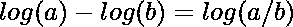
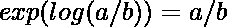
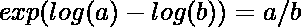

# 一个产品数组拼图|第三集

> 原文:[https://www.geeksforgeeks.org/a-product-array-puzzle-set-3/](https://www.geeksforgeeks.org/a-product-array-puzzle-set-3/)

给定一个由 **N** 个整数组成的[数组](https://www.geeksforgeeks.org/array-data-structure/)**arr【】**，任务是构造一个相同大小的[乘积数组](https://www.geeksforgeeks.org/product-array-puzzle-set-2-o1-space/)，而不使用除法( **'/'** )运算符，使得每个数组元素等于除 **arr[i]** 之外的**arr【】**所有元素的乘积。

**示例:**

> **输入:** arr[] = {10，3，5，6，2}
> **输出:** 180 600 360 300 900
> **解释:**
> 3 * 5 * 6 * 2 是除 10 外所有数组元素的乘积是 180
> 10 * 5 * 6 * 2 是除 3 外所有数组元素的乘积是 600。
> 10 * 3 * 6 * 2 是除 5 以外所有数组元素的乘积是 360。
> 10 * 3 * 5 * 2 是除 6 以外所有数组元素的乘积是 300。
> 10 * 3 * 6 * 5 是除 2 外所有数组元素的乘积为 9。
> 
> **输入:** arr[] = {1，2，1，3，4}
> 输出: 24 12 24 8 6

**方法:**思路是用 [log()](https://www.geeksforgeeks.org/log-function-cpp/) 和 [exp()](https://www.geeksforgeeks.org/exp-function-cpp/) 函数代替 l **og10()** 和 [pow()。](https://www.geeksforgeeks.org/power-function-cc/)以下是一些关于这方面的观察:

*   假设 **M** 是所有数组元素的乘积，那么在**I<sup>th</sup>T5】位置的输出数组元素将等于 **M/arr[i]。****
*   两个数的除法可以利用[对数](https://www.geeksforgeeks.org/logarithm/)和 [exp 函数](https://www.geeksforgeeks.org/exp-function-cpp/)的性质进行。
    *   
    *   
    *   
*   对数函数不是为小于零的数字定义的，因此要单独维护这些情况。

按照以下步骤解决问题:

*   初始化两个变量，比如**乘积= 1** 和 **Z = 1** ，存储数组的乘积和零元素的个数。
*   [如果**arr【I】**不等于 **0** ，则遍历数组](https://www.geeksforgeeks.org/c-program-to-traverse-an-array/)并将乘积乘以**arr【I】**。否则，将 **Z** 的计数增加**一**。
*   [遍历阵列](https://www.geeksforgeeks.org/c-program-to-traverse-an-array/)**arr【】**并执行以下操作:
    *   如果 **Z** 为 **1** 且 **arr[i]** 不为零，则更新 **arr[i]** 为**arr[I]= 0****[继续](https://www.geeksforgeeks.org/continue-statement-cpp/)。**
    *   **否则，如果 **Z** 为**1****arr【I】**为 **0** ，则更新**arr【I】**为**产品**，继续[。](https://www.geeksforgeeks.org/continue-statement-cpp/)**
    *   **否则，如果 **Z** 大于 **1** ，则将**arr【I】**指定为 **0** 并继续。**
    *   **现在使用上面讨论的公式找到 **abs(产品)/abs(arr[i])** 的值，并将其存储在一个变量中，比如 **curr** 。**
    *   **如果 **arr[i]** 和**产品**的值为负，或者如果 **arr[i]** 和**产品**为正，则将 **arr[i]** 指定为 **curr** 。**
    *   **否则，将**arr【I】**指定为 **-1*curr** 。**
*   **完成以上步骤后，[打印数组](https://www.geeksforgeeks.org/c-program-to-print-an-array-using-recursion/) **arr[]** 。**

**下面是上述方法的实现:**

## **C++**

```
// C++ program for the above approach
#include <bits/stdc++.h>
using namespace std;

// Function to form product array
// with O(n) time and O(1) space
void productExceptSelf(int arr[],
                       int N)
{
    // Stores the product of array
    int product = 1;

    // Stores the count of zeros
    int z = 0;

    // Traverse the array
    for (int i = 0; i < N; i++) {

        // If arr[i] is not zero
        if (arr[i])
            product *= arr[i];

        // If arr[i] is zero then
        // increment count of z by 1
        z += (arr[i] == 0);
    }

    // Stores the absolute value
    // of the product
    int a = abs(product), b;
    for (int i = 0; i < N; i++) {

        // If Z is equal to 1
        if (z == 1) {

            // If arr[i] is not zero
            if (arr[i])
                arr[i] = 0;

            // Else
            else
                arr[i] = product;
            continue;
        }

        // If count of 0s at least 2
        else if (z > 1) {

            // Assign arr[i] = 0
            arr[i] = 0;
            continue;
        }

        // Store absolute value of arr[i]
        int b = abs(arr[i]);

        // Find the value of a/b
        int curr = round(exp(log(a) - log(b)));

        // If arr[i] and product both
        // are less than zero
        if (arr[i] < 0 && product < 0)
            arr[i] = curr;

        // If arr[i] and product both
        // are greater than zero
        else if (arr[i] > 0 && product > 0)
            arr[i] = curr;

        // Else
        else
            arr[i] = -1 * curr;
    }

    // Traverse the array arr[]
    for (int i = 0; i < N; i++) {
        cout << arr[i] << " ";
    }
}

// Driver Code
int main()
{
    int arr[] = { 10, 3, 5, 6, 2 };
    int N = sizeof(arr) / sizeof(arr[0]);

    // Function Call
    productExceptSelf(arr, N);

    return 0;
}
```

## **Java 语言(一种计算机语言，尤用于创建网站)**

```
// Java program to implement
// the above approach
import java.util.*;

class GFG{

// Function to form product array
// with O(n) time and O(1) space
static void productExceptSelf(int arr[],
                       int N)
{
    // Stores the product of array
    int product = 1;

    // Stores the count of zeros
    int z = 0;

    // Traverse the array
    for (int i = 0; i < N; i++) {

        // If arr[i] is not zero
        if (arr[i] != 0)
            product *= arr[i];

        // If arr[i] is zero then
        // increment count of z by 1
        if (arr[i] == 0)
            z += 1;
    }

    // Stores the absolute value
    // of the product
    int a = Math.abs(product);
    for (int i = 0; i < N; i++) {

        // If Z is equal to 1
        if (z == 1) {

            // If arr[i] is not zero
            if (arr[i] != 0)
                arr[i] = 0;

            // Else
            else
                arr[i] = product;
            continue;
        }

        // If count of 0s at least 2
        else if (z > 1) {

            // Assign arr[i] = 0
            arr[i] = 0;
            continue;
        }

        // Store absolute value of arr[i]
        int b = Math.abs(arr[i]);

        // Find the value of a/b
        int curr = (int)Math.round(Math.exp(Math.log(a) - Math.log(b)));

        // If arr[i] and product both
        // are less than zero
        if (arr[i] < 0 && product < 0)
            arr[i] = curr;

        // If arr[i] and product both
        // are greater than zero
        else if (arr[i] > 0 && product > 0)
            arr[i] = curr;

        // Else
        else
            arr[i] = -1 * curr;
    }

    // Traverse the array arr[]
    for (int i = 0; i < N; i++) {
        System.out.print(arr[i] + " ");
    }
}

// Driver Code
public static void main(String args[])
{
    int arr[] = { 10, 3, 5, 6, 2 };
    int N = arr.length;

    // Function Call
    productExceptSelf(arr, N);
}
}

// This code is contributed by splevel62.
```

## **蟒蛇 3**

```
# Python 3 program for the above approach
import math

# Function to form product array
# with O(n) time and O(1) space
def productExceptSelf(arr, N) :

    # Stores the product of array
    product = 1

    # Stores the count of zeros
    z = 0

    # Traverse the array
    for i in range(N):

        # If arr[i] is not zero
        if (arr[i] != 0) :
            product *= arr[i]

        # If arr[i] is zero then
        # increment count of z by 1
        if(arr[i] == 0):
            z += 1

    # Stores the absolute value
    # of the product
    a = abs(product)
    for i in range(N):

        # If Z is equal to 1
        if (z == 1) :

            # If arr[i] is not zero
            if (arr[i] != 0) :
                arr[i] = 0

            # Else
            else :
                arr[i] = product
            continue

        # If count of 0s at least 2
        elif (z > 1) :

            # Assign arr[i] = 0
            arr[i] = 0
            continue

        # Store absolute value of arr[i]
        b = abs(arr[i])

        # Find the value of a/b
        curr = round(math.exp(math.log(a) - math.log(b)))

        # If arr[i] and product both
        # are less than zero
        if (arr[i] < 0 and product < 0):
            arr[i] = curr

        # If arr[i] and product both
        # are greater than zero
        elif (arr[i] > 0 and product > 0):
            arr[i] = curr

        # Else
        else:
            arr[i] = -1 * curr

    # Traverse the array arr[]
    for i in range(N):
        print(arr[i], end = " ")

# Driver Code
arr = [ 10, 3, 5, 6, 2 ]
N = len(arr)

# Function Call
productExceptSelf(arr, N)

# This code is contributed by code_hunt.
```

## **C#**

```
// C# program for the above approach
using System;
class GFG
{

// Function to form product array
// with O(n) time and O(1) space
static void productExceptSelf(int[] arr,
                       int N)
{
    // Stores the product of array
    int product = 1;

    // Stores the count of zeros
    int z = 0;

    // Traverse the array
    for (int i = 0; i < N; i++)
    {

        // If arr[i] is not zero
        if (arr[i] != 0)
            product *= arr[i];

        // If arr[i] is zero then
        // increment count of z by 1
        if (arr[i] == 0)
            z += 1;
    }

    // Stores the absolute value
    // of the product
    int a = Math.Abs(product);
    for (int i = 0; i < N; i++)
    {

        // If Z is equal to 1
        if (z == 1)
        {

            // If arr[i] is not zero
            if (arr[i] != 0)
                arr[i] = 0;

            // Else
            else
                arr[i] = product;
            continue;
        }

        // If count of 0s at least 2
        else if (z > 1)
        {

            // Assign arr[i] = 0
            arr[i] = 0;
            continue;
        }

        // Store absolute value of arr[i]
        int b = Math.Abs(arr[i]);

        // Find the value of a/b
        int curr = (int)Math.Round(Math.Exp(Math.Log(a) - Math.Log(b)));

        // If arr[i] and product both
        // are less than zero
        if (arr[i] < 0 && product < 0)
            arr[i] = curr;

        // If arr[i] and product both
        // are greater than zero
        else if (arr[i] > 0 && product > 0)
            arr[i] = curr;

        // Else
        else
            arr[i] = -1 * curr;
    }

    // Traverse the array arr[]
    for (int i = 0; i < N; i++)
    {
        Console.Write(arr[i] + " ");
    }
}

// Driver Code
public static void Main(String[] args)
{
    int[] arr = { 10, 3, 5, 6, 2 };
    int N = arr.Length;

    // Function Call
    productExceptSelf(arr, N);
}
}

// This code is contributed by sanjoy_62.
```

## **java 描述语言**

```
<script>

// Javascript Program to check matrix
// is scalar matrix or not.

 // Function to form product array
// with O(n) time and O(1) space
function productExceptSelf(arr,
                       N)
{

    // Stores the product of array
    let product = 1;

    // Stores the count of zeros
    let z = 0;

    // Traverse the array
    for (let i = 0; i < N; i++) {

        // If arr[i] is not zero
        if (arr[i] != 0)
            product *= arr[i];

        // If arr[i] is zero then
        // increment count of z by 1
        if (arr[i] == 0)
            z += 1;
    }

    // Stores the absolute value
    // of the product
    let a = Math.abs(product);
    for (let i = 0; i < N; i++) {

        // If Z is equal to 1
        if (z == 1) {

            // If arr[i] is not zero
            if (arr[i] != 0)
                arr[i] = 0;

            // Else
            else
                arr[i] = product;
            continue;
        }

        // If count of 0s at least 2
        else if (z > 1) {

            // Assign arr[i] = 0
            arr[i] = 0;
            continue;
        }

        // Store absolute value of arr[i]
        let b = Math.abs(arr[i]);

        // Find the value of a/b
        let curr = Math.round(Math.exp(Math.log(a) - Math.log(b)));

        // If arr[i] and product both
        // are less than zero
        if (arr[i] < 0 && product < 0)
            arr[i] = curr;

        // If arr[i] and product both
        // are greater than zero
        else if (arr[i] > 0 && product > 0)
            arr[i] = curr;

        // Else
        else
            arr[i] = -1 * curr;
    }

    // Traverse the array arr[]
    for (let i = 0; i < N; i++) {
        document.write(arr[i] + " ");
    }
}

    // Driver Code
    let arr = [ 10, 3, 5, 6, 2 ];
    let N = arr.length;

    // Function Call
    productExceptSelf(arr, N);

// This code is contributed by souravghosh0416.
</script>
```

****Output:** 

```
180 600 360 300 900
```** 

*****时间复杂度:**O(N)*
T5**辅助空间:** O(1)**

****替代方法:**替代方法请参考本文之前的帖子:**

*   **[一个产品数组拼图](https://www.geeksforgeeks.org/a-product-array-puzzle/)**
*   **[一个产品数组拼图|第 2 集](https://www.geeksforgeeks.org/product-array-puzzle-set-2-o1-space/)**