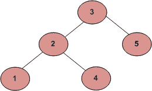

# 检查二叉树是否为 BST 的程序

> 原文:[https://www . geesforgeks . org/a-program-to-check-if-a-binary-tree-is-BST-or-not/](https://www.geeksforgeeks.org/a-program-to-check-if-a-binary-tree-is-bst-or-not/)

二叉查找树树是一种基于节点的二叉树数据结构，具有以下特性。

*   节点的左子树只包含键小于该节点键的节点。
*   节点的右子树只包含键大于节点键的节点。
*   左右子树都必须是二分搜索法树。

从上述特性中自然可以得出以下结论:

*   每个节点(树中的项目)都有一个不同的键。


**方法 1(简单但错误)**
下面是一个简单的程序。对于每个节点，检查其左节点是否小于该节点，右节点是否大于该节点。

## C++

```
int isBST(struct node* node)
{
  if (node == NULL)
    return 1;

  /* false if left is > than node */
  if (node->left != NULL && node->left->data > node->data)
    return 0;

  /* false if right is < than node */
  if (node->right != NULL && node->right->data < node->data)
    return 0;

  /* false if, recursively, the left or right is not a BST */
  if (!isBST(node->left) || !isBST(node->right))
    return 0;

  /* passing all that, it's a BST */
  return 1;
}

// This code is contributed by shubhamsingh10
```

## C

```
int isBST(struct node* node)
{
  if (node == NULL)
    return 1;

  /* false if left is > than node */
  if (node->left != NULL && node->left->data > node->data)
    return 0;

  /* false if right is < than node */
  if (node->right != NULL && node->right->data < node->data)
    return 0;

  /* false if, recursively, the left or right is not a BST */
  if (!isBST(node->left) || !isBST(node->right))
    return 0;

  /* passing all that, it's a BST */
  return 1;
}
```

## Java 语言(一种计算机语言，尤用于创建网站)

```
boolean isBST(Node node)
{
    if (node == null)
        return true;

    /* False if left is > than node */
    if (node.left != null && node.left.data > node.data)
        return false;

    /* False if right is < than node */
    if (node.right != null && node.right.data < node.data)
        return false;

    /* False if, recursively, the left or right is not a BST */
    if (!isBST(node.left) || !isBST(node.right))
        return false;

    /* Passing all that, it's a BST */
    return true;
}

// This code is contributed by shubhamsingh10
```

## C#

```
bool isBST(Node node)
{
    if (node == null)
        return true;

    /* False if left is > than node */
    if (node.left != null && node.left.data > node.data)
        return false;

    /* False if right is < than node */
    if (node.right != null && node.right.data < node.data)
        return false;

    /* False if, recursively, the left or right is not a BST */
    if (!isBST(node.left) || !isBST(node.right))
        return false;

    /* Passing all that, it's a BST */
    return true;
}

// This code is contributed by Rajput-Ji
```

## java 描述语言

```
<script>

function isBST(node)
{
    if (node == null)
        return true;

    /* False if left is > than node */
    if (node.left != null && node.left.data > node.data)
        return false;

    /* False if right is < than node */
    if (node.right != null && node.right.data < node.data)
        return false;

    /* False if, recursively, the left or right is not a BST */
    if (!isBST(node.left) || !isBST(node.right))
        return false;

    /* Passing all that, it's a BST */
    return true;
}

// This code is contributed by avanitrachhadiya2155

</script>
```

**这种方法是错误的，因为对于下面的二叉树这将返回真(并且下面的树不是 BST，因为 4 在 3 的左子树中)**



**方法 2(正确但无效)**
对于每个节点，检查左子树中的最大值是否小于该节点，右子树中的最小值是否大于该节点。

## C++

```
/* Returns true if a binary tree is a binary search tree */
int isBST(struct node* node)
{
  if (node == NULL)
    return 1;

  /* false if the max of the left is > than us */
  if (node->left != NULL && maxValue(node->left) >= node->data)
    return 0;

  /* false if the min of the right is <= than us */
  if (node->right != NULL && minValue(node->right) <= node->data)
    return 0;

  /* false if, recursively, the left or right is not a BST */
  if (!isBST(node->left) || !isBST(node->right))
    return 0;

  /* passing all that, it's a BST */
  return 1;
}

// This code is contributed by shubhamsingh10
```

## C

```
/* Returns true if a binary tree is a binary search tree */
int isBST(struct node* node)
{
  if (node == NULL)
    return 1;

  /* false if the max of the left is > than us */
  if (node->left!=NULL && maxValue(node->left) > node->data)
    return 0;

  /* false if the min of the right is <= than us */
  if (node->right!=NULL && minValue(node->right) < node->data)
    return 0;

  /* false if, recursively, the left or right is not a BST */
  if (!isBST(node->left) || !isBST(node->right))
    return 0;

  /* passing all that, it's a BST */
  return 1;
}
```

## Java 语言(一种计算机语言，尤用于创建网站)

```
/* Returns true if a binary tree is a binary search tree */
int isBST(Node node)
{
  if (node == null)
    return 1;

  /* false if the max of the left is > than us */
  if (node.left != null && maxValue(node.left) >= node.data)
    return 0;

  /* false if the min of the right is <= than us */
  if (node.right != null && minValue(node.right) <= node.data)
    return 0;

  /* false if, recursively, the left or right is not a BST */
  if (!isBST(node.left) || !isBST(node.right))
    return 0;

  /* passing all that, it's a BST */
  return 1;
}

// This code is ccontributed by akshitsaxenaa09.
```

## 蟒蛇 3

```
''' Returns true if a binary tree is a binary search tree '''
def isBST(node):
    if (node == None):
        return 1
    ''' false if the max of the left is > than us '''
    if (node.left != None and maxValue(node.left) >= node.data):
        return 0

    ''' false if the min of the right is <= than us '''
    if (node.right != None and minValue(node.right) <= node.data):
        return 0

    ''' false if, recursively, the left or right is not a BST '''
    if (!isBST(node.left) or !isBST(node.right)):
        return 0

    ''' passing all that, it's a BST '''
    return 1

# This code is contributed by Shubham Singh
```

## C#

```
/* Returns true if a binary tree is a binary search tree */
bool isBST(Node node)
{
    if (node == null)
        return true;

    /* false if the max of the left is > than us */
    if (node.left != null && maxValue(node.left) >= node.data)
        return false;

    /* false if the min of the right is <= than us */
    if (node.right != null && minValue(node.right) <= node.data)
        return false;

    /* false if, recursively, the left or right is not a BST */
    if (!isBST(node.left) || !isBST(node.right))
        return false;

    /* passing all that, it's a BST */
    return true;
}

// This code is contributed by Shubham Singh
```

## java 描述语言

```
<script>

function isBST(node)
{
    if (node == null)
        return true;

    /* False if the max of the left is > than us */
    if (node.left != null && maxValue(node.left) >= node.data)
        return false;

    /* False if the min of the right is <= than us */
    if (node.right != null && minValue(node.right) <= node.data)
        return false;

    /* False if, recursively, the left or right is not a BST */
    if (!isBST(node.left) || !isBST(node.right))
        return false;

    /* Passing all that, it's a BST */
    return true;
}

// This code is contributed by Shubham Singh

</script>
```

假设您有助手函数 minValue()和 maxValue()，它们从非空树中返回 min 或 max int 值

**方法 3(正确有效)** :
上面的方法 2 运行缓慢，因为它多次穿越树的某些部分。更好的解决方案只查看每个节点一次。诀窍是编写一个实用助手函数 isBSTUtil(struct node* node，int min，int max)，它遍历树，跟踪不断缩小的最小和最大允许值，只查看每个节点一次。最小值和最大值的初始值应该是 INT_MIN 和 INT_MAX —它们从这里开始变窄。

注意:如果存在值为 INT_MIN 或 INT_MAX 的重复元素，则此方法不适用。

下面是上述方法的实现:

## C++

```
#include<bits/stdc++.h>

using namespace std;

/* A binary tree node has data,
pointer to left child and
a pointer to right child */
class node
{
    public:
    int data;
    node* left;
    node* right;

    /* Constructor that allocates
    a new node with the given data
    and NULL left and right pointers. */
    node(int data)
    {
        this->data = data;
        this->left = NULL;
        this->right = NULL;
    }
};

int isBSTUtil(node* node, int min, int max);

/* Returns true if the given
tree is a binary search tree
(efficient version). */
int isBST(node* node)
{
    return(isBSTUtil(node, INT_MIN, INT_MAX));
}

/* Returns true if the given
tree is a BST and its values
are >= min and <= max. */
int isBSTUtil(node* node, int min, int max)
{
    /* an empty tree is BST */
    if (node==NULL)
        return 1;

    /* false if this node violates
    the min/max constraint */
    if (node->data < min || node->data > max)
        return 0;

    /* otherwise check the subtrees recursively,
    tightening the min or max constraint */
    return
        isBSTUtil(node->left, min, node->data-1) && // Allow only distinct values
        isBSTUtil(node->right, node->data+1, max); // Allow only distinct values
}

/* Driver code*/
int main()
{
    node *root = new node(4);
    root->left = new node(2);
    root->right = new node(5);
    root->left->left = new node(1);
    root->left->right = new node(3);

    if(isBST(root))
        cout<<"Is BST";
    else
        cout<<"Not a BST";

    return 0;
}

// This code is contributed by rathbhupendra
```

## C

```
#include <stdio.h>
#include <stdlib.h>
#include <limits.h>

/* A binary tree node has data, pointer to left child
   and a pointer to right child */
struct node
{
    int data;
    struct node* left;
    struct node* right;
};

int isBSTUtil(struct node* node, int min, int max);

/* Returns true if the given tree is a binary search tree
 (efficient version). */
int isBST(struct node* node)
{
  return(isBSTUtil(node, INT_MIN, INT_MAX));
}

/* Returns true if the given tree is a BST and its
   values are >= min and <= max. */
int isBSTUtil(struct node* node, int min, int max)
{
  /* an empty tree is BST */
  if (node==NULL)
     return 1;

  /* false if this node violates the min/max constraint */ 
  if (node->data < min || node->data > max)
     return 0;

  /* otherwise check the subtrees recursively,
   tightening the min or max constraint */
  return
    isBSTUtil(node->left, min, node->data-1) &&  // Allow only distinct values
    isBSTUtil(node->right, node->data+1, max);  // Allow only distinct values
}

/* Helper function that allocates a new node with the
   given data and NULL left and right pointers. */
struct node* newNode(int data)
{
  struct node* node = (struct node*)
                       malloc(sizeof(struct node));
  node->data = data;
  node->left = NULL;
  node->right = NULL;

  return(node);
}

/* Driver program to test above functions*/
int main()
{
  struct node *root = newNode(4);
  root->left        = newNode(2);
  root->right       = newNode(5);
  root->left->left  = newNode(1);
  root->left->right = newNode(3);

  if(isBST(root))
    printf("Is BST");
  else
    printf("Not a BST");

  getchar();
  return 0;
} 
```

## Java 语言(一种计算机语言，尤用于创建网站)

```
//Java implementation to check if given Binary tree
//is a BST or not

/* Class containing left and right child of current
 node and key value*/
class Node
{
    int data;
    Node left, right;

    public Node(int item)
    {
        data = item;
        left = right = null;
    }
}

public class BinaryTree
{
    //Root of the Binary Tree
    Node root;

    /* can give min and max value according to your code or
    can write a function to find min and max value of tree. */

    /* returns true if given search tree is binary
     search tree (efficient version) */
    boolean isBST()  {
        return isBSTUtil(root, Integer.MIN_VALUE,
                               Integer.MAX_VALUE);
    }

    /* Returns true if the given tree is a BST and its
      values are >= min and <= max. */
    boolean isBSTUtil(Node node, int min, int max)
    {
        /* an empty tree is BST */
        if (node == null)
            return true;

        /* false if this node violates the min/max constraints */
        if (node.data < min || node.data > max)
            return false;

        /* otherwise check the subtrees recursively
        tightening the min/max constraints */
        // Allow only distinct values
        return (isBSTUtil(node.left, min, node.data-1) &&
                isBSTUtil(node.right, node.data+1, max));
    }

    /* Driver program to test above functions */
    public static void main(String args[])
    {
        BinaryTree tree = new BinaryTree();
        tree.root = new Node(4);
        tree.root.left = new Node(2);
        tree.root.right = new Node(5);
        tree.root.left.left = new Node(1);
        tree.root.left.right = new Node(3);

        if (tree.isBST())
            System.out.println("IS BST");
        else
            System.out.println("Not a BST");
    }
}
```

## 计算机编程语言

```
# Python program to check if a binary tree is bst or not

INT_MAX = 4294967296
INT_MIN = -4294967296

# A binary tree node
class Node:

    # Constructor to create a new node
    def __init__(self, data):
        self.data = data
        self.left = None
        self.right = None

# Returns true if the given tree is a binary search tree
# (efficient version)
def isBST(node):
    return (isBSTUtil(node, INT_MIN, INT_MAX))

# Retusn true if the given tree is a BST and its values
# >= min and <= max
def isBSTUtil(node, mini, maxi):

    # An empty tree is BST
    if node is None:
        return True

    # False if this node violates min/max constraint
    if node.data < mini or node.data > maxi:
        return False

    # Otherwise check the subtrees recursively
    # tightening the min or max constraint
    return (isBSTUtil(node.left, mini, node.data -1) and
          isBSTUtil(node.right, node.data+1, maxi))

# Driver program to test above function
root = Node(4)
root.left = Node(2)
root.right = Node(5)
root.left.left = Node(1)
root.left.right = Node(3)

if (isBST(root)):
    print "Is BST"
else:
    print "Not a BST"

# This code is contributed by Nikhil Kumar Singh(nickzuck_007)
```

## C#

```
using System;

// C# implementation to check if given Binary tree
//is a BST or not

/* Class containing left and right child of current
 node and key value*/
public class Node
{
    public int data;
    public Node left, right;

    public Node(int item)
    {
        data = item;
        left = right = null;
    }
}

public class BinaryTree
{
    //Root of the Binary Tree
    public Node root;

    /* can give min and max value according to your code or
    can write a function to find min and max value of tree. */

    /* returns true if given search tree is binary
     search tree (efficient version) */
    public virtual bool BST
    {
        get
        {
            return isBSTUtil(root, int.MinValue, int.MaxValue);
        }
    }

    /* Returns true if the given tree is a BST and its
      values are >= min and <= max. */
    public virtual bool isBSTUtil(Node node, int min, int max)
    {
        /* an empty tree is BST */
        if (node == null)
        {
            return true;
        }

        /* false if this node violates the min/max constraints */
        if (node.data < min || node.data > max)
        {
            return false;
        }

        /* otherwise check the subtrees recursively
        tightening the min/max constraints */
        // Allow only distinct values
        return (isBSTUtil(node.left, min, node.data - 1) && isBSTUtil(node.right, node.data + 1, max));
    }

    /* Driver program to test above functions */
    public static void Main(string[] args)
    {
        BinaryTree tree = new BinaryTree();
        tree.root = new Node(4);
        tree.root.left = new Node(2);
        tree.root.right = new Node(5);
        tree.root.left.left = new Node(1);
        tree.root.left.right = new Node(3);

        if (tree.BST)
        {
            Console.WriteLine("IS BST");
        }
        else
        {
            Console.WriteLine("Not a BST");
        }
    }
}

  // This code is contributed by Shrikant13
```

## java 描述语言

```
<script>

// Javascript implementation to
// check if given Binary tree
// is a BST or not

/* Class containing left and right child of current
 node and key value*/

class Node
{
    constructor(item)
    {
        this.data=item;
        this.left=this.right=null;
    }
}

 //Root of the Binary Tree
    let root;

    /* can give min and max value according to your code or
    can write a function to find min and max value of tree. */

    /* returns true if given search tree is binary
     search tree (efficient version) */
    function isBST()
    {
        return isBSTUtil(root, Number.MIN_VALUE,
                               Number.MAX_VALUE);
    }

    /* Returns true if the given tree is a BST and its
      values are >= min and <= max. */
    function isBSTUtil(node,min,max)
    {
        /* an empty tree is BST */
        if (node == null)
            return true;

        /* false if this node violates
        the min/max constraints */
        if (node.data < min || node.data > max)
            return false;

        /* otherwise check the subtrees recursively
        tightening the min/max constraints */
        // Allow only distinct values
        return (isBSTUtil(node.left, min, node.data-1) &&
                isBSTUtil(node.right, node.data+1, max));
    }

     /* Driver program to test above functions */
        root = new Node(4);
        root.left = new Node(2);
        root.right = new Node(5);
        root.left.left = new Node(1);
        root.left.right = new Node(3);

        if (isBST())
            document.write("IS BST<br>");
        else
            document.write("Not a BST<br>");

// This code is contributed by rag2127

</script>
```

**输出:**

```
IS BST
```

**时间复杂度:** O(n)
**辅助空间:** O(1)如果不考虑函数调用栈大小，否则 O(n)

**简化方法 3**
我们可以用 NULL 指针代替 INT_MIN 和 INT_MAX 值来简化方法 2。

## C++

```
// C++ program to check if a given tree is BST.
#include <bits/stdc++.h>
using namespace std;

/* A binary tree node has data, pointer to
   left child and a pointer to right child */
struct Node
{
    int data;
    struct Node* left, *right;
};

// Returns true if given tree is BST.
bool isBST(Node* root, Node* l=NULL, Node* r=NULL)
{
    // Base condition
    if (root == NULL)
        return true;

    // if left node exist then check it has
    // correct data or not i.e. left node's data
    // should be less than root's data
    if (l != NULL and root->data <= l->data)
        return false;

    // if right node exist then check it has
    // correct data or not i.e. right node's data
    // should be greater than root's data
    if (r != NULL and root->data >= r->data)
        return false;

    // check recursively for every node.
    return isBST(root->left, l, root) and
           isBST(root->right, root, r);
}

/* Helper function that allocates a new node with the
   given data and NULL left and right pointers. */
struct Node* newNode(int data)
{
    struct Node* node = new Node;
    node->data = data;
    node->left = node->right = NULL;
    return (node);
}

/* Driver program to test above functions*/
int main()
{
    struct Node *root = newNode(3);
    root->left        = newNode(2);
    root->right       = newNode(5);
    root->left->left  = newNode(1);
    root->left->right = newNode(4);

    if (isBST(root,NULL,NULL))
        cout << "Is BST";
    else
        cout << "Not a BST";

    return 0;
}
```

## Java 语言(一种计算机语言，尤用于创建网站)

```
// Java program to check if a given tree is BST.
class Sol
{

// A binary tree node has data, pointer to
//left child && a pointer to right child /
static class Node
{
    int data;
    Node left, right;
};

// Returns true if given tree is BST.
static boolean isBST(Node root, Node l, Node r)
{
    // Base condition
    if (root == null)
        return true;

    // if left node exist then check it has
    // correct data or not i.e. left node's data
    // should be less than root's data
    if (l != null && root.data <= l.data)
        return false;

    // if right node exist then check it has
    // correct data or not i.e. right node's data
    // should be greater than root's data
    if (r != null && root.data >= r.data)
        return false;

    // check recursively for every node.
    return isBST(root.left, l, root) &&
        isBST(root.right, root, r);
}

// Helper function that allocates a new node with the
//given data && null left && right pointers. /
static Node newNode(int data)
{
    Node node = new Node();
    node.data = data;
    node.left = node.right = null;
    return (node);
}

// Driver code
public static void main(String args[])
{
    Node root = newNode(3);
    root.left = newNode(2);
    root.right = newNode(5);
    root.left.left = newNode(1);
    root.left.right = newNode(4);

    if (isBST(root,null,null))
        System.out.print("Is BST");
    else
        System.out.print("Not a BST");
}
}

// This code is contributed by Arnab Kundu
```

## 蟒蛇 3

```
""" Program to check if a given Binary
Tree is balanced like a Red-Black Tree """

# Helper function that allocates a new
# node with the given data and None
# left and right poers.                                
class newNode:

    # Construct to create a new node
    def __init__(self, key):
        self.data = key
        self.left = None
        self.right = None

# Returns true if given tree is BST.
def isBST(root, l = None, r = None):

    # Base condition
    if (root == None) :
        return True

    # if left node exist then check it has
    # correct data or not i.e. left node's data
    # should be less than root's data
    if (l != None and root.data <= l.data) :
        return False

    # if right node exist then check it has
    # correct data or not i.e. right node's data
    # should be greater than root's data
    if (r != None and root.data >= r.data) :
        return False

    # check recursively for every node.
    return isBST(root.left, l, root) and \
        isBST(root.right, root, r)

# Driver Code
if __name__ == '__main__':
    root = newNode(3)
    root.left = newNode(2)
    root.right = newNode(5)
    root.right.left = newNode(1)
    root.right.right = newNode(4)
    #root.right.left.left = newNode(40)
    if (isBST(root,None,None)):
        print("Is BST")
    else:
        print("Not a BST")

# This code is contributed by
# Shubham Singh(SHUBHAMSINGH10)
```

## C#

```
// C# program to check if a given tree is BST.
using System;

class GFG
{

// A binary tree node has data, pointer to
//left child && a pointer to right child /
public class Node
{
    public int data;
    public Node left, right;
};

// Returns true if given tree is BST.
static Boolean isBST(Node root, Node l, Node r)
{
    // Base condition
    if (root == null)
        return true;

    // if left node exist then check it has
    // correct data or not i.e. left node's data
    // should be less than root's data
    if (l != null && root.data <= l.data)
        return false;

    // if right node exist then check it has
    // correct data or not i.e. right node's data
    // should be greater than root's data
    if (r != null && root.data >= r.data)
        return false;

    // check recursively for every node.
    return isBST(root.left, l, root) &&
        isBST(root.right, root, r);
}

// Helper function that allocates a new node with the
//given data && null left && right pointers. /
static Node newNode(int data)
{
    Node node = new Node();
    node.data = data;
    node.left = node.right = null;
    return (node);
}

// Driver code
public static void Main(String []args)
{
    Node root = newNode(3);
    root.left = newNode(2);
    root.right = newNode(5);
    root.left.left = newNode(1);
    root.left.right = newNode(4);

    if (isBST(root,null,null))
        Console.Write("Is BST");
    else
        Console.Write("Not a BST");
}
}

// This code is contributed by 29AjayKumar
```

## java 描述语言

```
<script>

    // JavaScript program to check if a given tree is BST.

    class Node
    {
        constructor(data) {
           this.left = null;
           this.right = null;
           this.data = data;
        }
    }

    // Returns true if given tree is BST.
    function isBST(root, l, r)
    {
        // Base condition
        if (root == null)
            return true;

        // if left node exist then check it has
        // correct data or not i.e. left node's data
        // should be less than root's data
        if (l != null && root.data <= l.data)
            return false;

        // if right node exist then check it has
        // correct data or not i.e. right node's data
        // should be greater than root's data
        if (r != null && root.data >= r.data)
            return false;

        // check recursively for every node.
        return isBST(root.left, l, root) &&
            isBST(root.right, root, r);
    }

    // Helper function that allocates a new node with the
    //given data && null left && right pointers. /
    function newNode(data)
    {
        let node = new Node(data);
        return (node);
    }

    let root = newNode(3);
    root.left = newNode(2);
    root.right = newNode(5);
    root.left.left = newNode(1);
    root.left.right = newNode(4);

    if (isBST(root,null,null))
        document.write("Is BST");
    else
        document.write("Not a BST");

</script>
```

**输出:**

```
Not a BST
```

感谢[**艾伯尼什·加尔瓦尔**](https://practice.geeksforgeeks.org/user-profile.php?user=akgarhwal)**提出上述解决方案。**

****方法 4(使用有序遍历)**
感谢 *LJW489* 提出这个方法。
1)对给定的树进行有序遍历，并将结果存储在临时数组中。**

**2)该方法假设树
中没有重复值 3)检查 temp 数组是否按升序排序，如果是，则树为 BST。
时间复杂度:O(n)
我们可以避免使用辅助阵。在进行有序遍历时，我们可以跟踪以前访问过的节点。如果当前访问节点的值小于前一个值，则树不是 BST。感谢 *ygos* 对这个空间的优化。**

## **C++**

```
bool isBST(node* root)
{
    static node *prev = NULL;

    // traverse the tree in inorder fashion
    // and keep track of prev node
    if (root)
    {
        if (!isBST(root->left))
        return false;

        // Allows only distinct valued nodes
        if (prev != NULL &&
            root->data <= prev->data)
        return false;

        prev = root;

        return isBST(root->right);
    }

    return true;
}

// This code is contributed by rathbhupendra
```

## **C**

```
bool isBST(struct node* root)
{
    static struct node *prev = NULL;

    // traverse the tree in inorder fashion and keep track of prev node
    if (root)
    {
        if (!isBST(root->left))
          return false;

        // Allows only distinct valued nodes
        if (prev != NULL && root->data <= prev->data)
          return false;

        prev = root;

        return isBST(root->right);
    }

    return true;
}
```

## **Java 语言(一种计算机语言，尤用于创建网站)**

```
// Java implementation to check if given Binary tree
// is a BST or not

/* Class containing left and right child of current
 node and key value*/
class Node
{
    int data;
    Node left, right;

    public Node(int item)
    {
        data = item;
        left = right = null;
    }
}

public class BinaryTree
{
    // Root of the Binary Tree
    Node root;

    // To keep tract of previous node in Inorder Traversal
    Node prev;

    boolean isBST()  {
        prev = null;
        return isBST(root);
    }

    /* Returns true if given search tree is binary
       search tree (efficient version) */
    boolean isBST(Node node)
    {
        // traverse the tree in inorder fashion and
        // keep a track of previous node
        if (node != null)
        {
            if (!isBST(node.left))
                return false;

            // allows only distinct values node
            if (prev != null && node.data <= prev.data )
                return false;
            prev = node;
            return isBST(node.right);
        }
        return true;
    }

    /* Driver program to test above functions */
    public static void main(String args[])
    {
        BinaryTree tree = new BinaryTree();
        tree.root = new Node(4);
        tree.root.left = new Node(2);
        tree.root.right = new Node(5);
        tree.root.left.left = new Node(1);
        tree.root.left.right = new Node(3);

        if (tree.isBST())
            System.out.println("IS BST");
        else
            System.out.println("Not a BST");
    }
}
```

## **蟒蛇 3**

```
# Python implementation to check if
# given Binary tree is a BST or not

# A binary tree node containing data
# field, left and right pointers
class Node:
    # constructor to create new node
    def __init__(self, val):
        self.data = val
        self.left = None
        self.right = None

# global variable prev - to keep track
# of previous node during Inorder
# traversal
prev = None

# function to check if given binary
# tree is BST
def isbst(root):

    # prev is a global variable
    global prev
    prev = None
    return isbst_rec(root)

# Helper function to test if binary
# tree is BST
# Traverse the tree in inorder fashion
# and keep track of previous node
# return true if tree is Binary
# search tree otherwise false
def isbst_rec(root):

    # prev is a global variable
    global prev

    # if tree is empty return true
    if root is None:
        return True

    if isbst_rec(root.left) is False:
        return False

    # if previous node'data is found
    # greater than the current node's
    # data return fals
    if prev is not None and prev.data > root.data:
        return False

    # store the current node in prev
    prev = root
    return isbst_rec(root.right)

# driver code to test above function
root = Node(4)
root.left = Node(2)
root.right = Node(5)
root.left.left = Node(1)
root.left.right = Node(3)

if isbst(root):
    print("is BST")
else:
    print("not a BST")

# This code is contributed by
# Shweta Singh(shweta44)
```

## **C#**

```
// C# implementation to check if
// given Binary tree is a BST or not
using System;

/* Class containing left and
right child of current node
and key value*/
class Node
{
    public int data;
    public Node left, right;

    public Node(int item)
    {
        data = item;
        left = right = null;
    }
}

public class BinaryTree
{
    // Root of the Binary Tree
    Node root;

    // To keep tract of previous node
    // in Inorder Traversal
    Node prev;

    Boolean isBST()
    {
        prev = null;
        return isBST(root);
    }

    /* Returns true if given search tree is binary
    search tree (efficient version) */
    Boolean isBST(Node node)
    {
        // traverse the tree in inorder fashion and
        // keep a track of previous node
        if (node != null)
        {
            if (!isBST(node.left))
                return false;

            // allows only distinct values node
            if (prev != null &&
                node.data <= prev.data )
                return false;
            prev = node;
            return isBST(node.right);
        }
        return true;
    }

    // Driver Code
    public static void Main(String []args)
    {
        BinaryTree tree = new BinaryTree();
        tree.root = new Node(4);
        tree.root.left = new Node(2);
        tree.root.right = new Node(5);
        tree.root.left.left = new Node(1);
        tree.root.left.right = new Node(3);

        if (tree.isBST())
            Console.WriteLine("IS BST");
        else
            Console.WriteLine("Not a BST");
    }
}

// This code is contributed by Rajput-Ji
```

## **java 描述语言**

```
<script>
// Javascript implementation to check if given Binary tree
// is a BST or not

/* Class containing left and right child of current
 node and key value*/
class Node
{
    constructor(item)
    {
        this.data = item;
        this.left = this.right=null;
    }
}

// Root of the Binary Tree
let root;

// To keep tract of previous node in Inorder Traversal
let prev;

function isBST()
{
    prev = null;
    return _isBST(root);
}

/* Returns true if given search tree is binary
       search tree (efficient version) */
function _isBST(node)
{

    // traverse the tree in inorder fashion and
        // keep a track of previous node
        if (node != null)
        {
            if (!_isBST(node.left))
                return false;

            // allows only distinct values node
            if (prev != null && node.data <= prev.data )
                return false;
            prev = node;
            return _isBST(node.right);
        }
        return true;
}

/* Driver program to test above functions */
root = new Node(4);
root.left = new Node(2);
root.right = new Node(5);
root.left.left = new Node(1);
root.left.right = new Node(3);

if (isBST())
    document.write("IS BST");
else
    document.write("Not a BST");

// This code is contributed by unknown2108
</script>
```

**通过使用对 prev 节点的引用作为参数，也可以避免使用静态变量。**

## **C++**

```
// C++ program to check if a given tree is BST.
#include <bits/stdc++.h>
using namespace std;

/* A binary tree node has data, pointer to
left child and a pointer to right child */
struct Node
{
    int data;
    struct Node* left, *right;

    Node(int data)
    {
        this->data = data;
        left = right = NULL;
    }
};

bool isBSTUtil(struct Node* root, Node *&prev)
{
    // traverse the tree in inorder fashion and 
    // keep track of prev node
    if (root)
    {
        if (!isBSTUtil(root->left, prev))
          return false;

        // Allows only distinct valued nodes 
        if (prev != NULL && root->data <= prev->data)
          return false;

        prev = root;

        return isBSTUtil(root->right, prev);
    }

    return true;
}

bool isBST(Node *root)
{
   Node *prev = NULL;
   return isBSTUtil(root, prev);
}

/* Driver program to test above functions*/
int main()
{
    struct Node *root = new Node(3);
    root->left     = new Node(2);
    root->right     = new Node(5);
    root->left->left = new Node(1);
    root->left->right = new Node(4);

    if (isBST(root))
        cout << "Is BST";
    else
        cout << "Not a BST";

    return 0;
}
```

## **蟒蛇 3**

```
# Python3 program to check
# if a given tree is BST.
import math

# A binary tree node has data,
# pointer to left child and
# a pointer to right child
class Node:
    def __init__(self, data):
        self.data = data
        self.left = None
        self.right = None

def isBSTUtil(root, prev):

    # traverse the tree in inorder fashion
    # and keep track of prev node
    if (root != None):
        if (isBSTUtil(root.left, prev) == True):
            return False

        # Allows only distinct valued nodes
        if (prev != None and
            root.data <= prev.data):
            return False

        prev = root
        return isBSTUtil(root.right, prev)

    return True

def isBST(root):
    prev = None
    return isBSTUtil(root, prev)

# Driver Code
if __name__ == '__main__':
    root = Node(3)
    root.left = Node(2)
    root.right = Node(5)
    root.right.left = Node(1)
    root.right.right = Node(4)
    #root.right.left.left = Node(40)

    if (isBST(root) == None):
        print("Is BST")
    else:
        print("Not a BST")

# This code is contributed by Srathore
```

## **C#**

```
// C# program to check if a given tree is BST.
using System;
public class GFG
{
/* A binary tree node has data, pointer to
left child and a pointer to right child */
public class Node
{
    public int data;
    public Node left, right;

    public Node(int data)
    {
        this.data = data;
        left = right = null;
    }
};

static Node prev;

static Boolean isBSTUtil(Node root)
{
    // traverse the tree in inorder fashion and
    // keep track of prev node
    if (root != null)
    {
        if (!isBSTUtil(root.left))
        return false;

        // Allows only distinct valued nodes
        if (prev != null &&
            root.data <= prev.data)
        return false;

        prev = root;

        return isBSTUtil(root.right);
    }
    return true;
}

static Boolean isBST(Node root)
{
    return isBSTUtil(root);
}

// Driver Code
public static void Main(String[] args)
{
    Node root = new Node(3);
    root.left = new Node(2);
    root.right = new Node(5);
    root.left.left = new Node(1);
    root.left.right = new Node(4);

    if (isBST(root))
        Console.WriteLine("Is BST");
    else
        Console.WriteLine("Not a BST");
}
}

// This code is contributed by Rajput-Ji
```

## **java 描述语言**

```
<script>
    // Javascript program to check if a given tree is BST.   
    class Node
    {
        constructor(data)
        {
           this.left = null;
           this.right = null;
           this.data = data;
        }
    }

    let prev;

    function isBSTUtil(root)
    {

        // traverse the tree in inorder fashion and
        // keep track of prev node
        if (root != null)
        {
            if (!isBSTUtil(root.left))
                return false;

            // Allows only distinct valued nodes
            if (prev != null && root.data <= prev.data)
                return false;

            prev = root;

            return isBSTUtil(root.right);
        }
        return true;
    }

    function isBST(root)
    {
        return isBSTUtil(root);
    }

    let root = new Node(3);
    root.left = new Node(2);
    root.right = new Node(5);
    root.left.left = new Node(1);
    root.left.right = new Node(4);

    if (isBST(root))
        document.write("Is BST");
    else
        document.write("Not a BST");

// This code is contributed by divyeshrabadiya07.
</script>
```

****输出**:**

```
Not a BST
```

****来源:**
[【http://en.wikipedia.org/wiki/Binary_search_tree】](http://en.wikipedia.org/wiki/Binary_search_tree)
[【http://cslibrary.stanford.edu/110/BinaryTrees.html】](http://cslibrary.stanford.edu/110/BinaryTrees.html)
如发现以上程序/算法有 bug 或有其他方法解决同样问题，请写评论。**