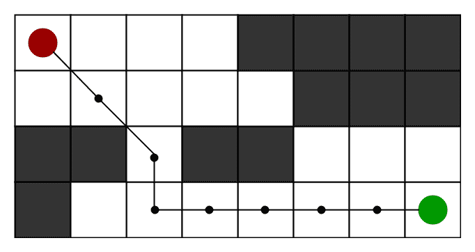
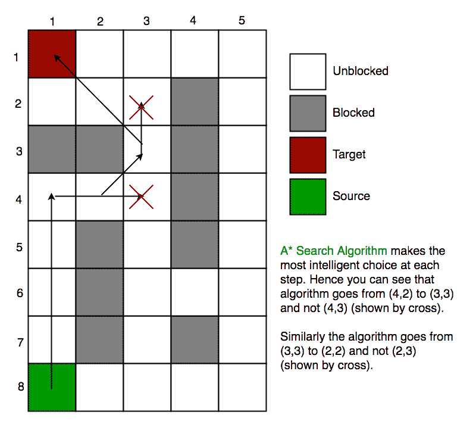
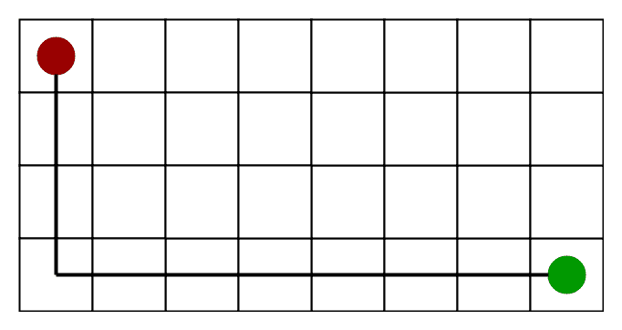
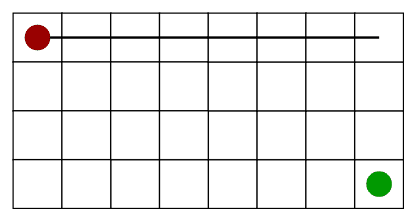
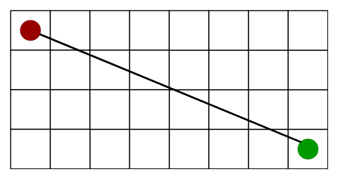

# A*搜索算法

> 原文:[https://www.geeksforgeeks.org/a-search-algorithm/](https://www.geeksforgeeks.org/a-search-algorithm/)

**动机**
在现实生活中近似最短路径的情况，比如——在地图、游戏中可能会有很多障碍。
我们可以考虑一个有几个障碍物的 2D 网格，我们从一个源单元(下面的红色)开始到达一个目标单元(下面的绿色)



**什么是 A*搜索算法？**
A*搜索算法是路径寻找和图遍历中使用的最好和流行的技术之一。

**为什么是 A*搜索算法？**
非正式地说，A*搜索算法与其他遍历技术不同，它有“大脑”。这意味着它确实是一个智能算法，将它与其他传统算法区分开来。这一事实将在下面的章节中详细说明。
而且值得一提的是，很多游戏和基于网络的地图都使用这种算法非常高效地找到最短路径(近似)。

**解释**
考虑一个有很多障碍物的正方形网格，我们得到一个起始单元和一个目标单元。我们希望尽快从起始单元格到达目标单元格(如果可能)。这里一个*搜索算法来拯救。
a* Search Algorithm 所做的是，在每一步中，它根据一个值来挑选节点-“**f**”，该值是一个等于另外两个参数之和的参数—“**g**”和“ **h** ”。在每一步中，它选择具有最低的“ **f** ”的节点/单元，并处理该节点/单元。
我们在
**g** 下面尽可能简单地定义“ **g** ”和“**h**”=按照生成的路径从起点移动到网格上给定正方形的移动成本。
**h** =从网格上的给定方块移动到最终目的地的估计移动成本。这通常被称为启发式，只不过是一种聪明的猜测。在找到路径之前，我们真的不知道实际的距离，因为各种各样的东西都可能挡路(墙、水等)。).有许多方法可以计算这个“h”，这将在后面的章节中讨论。

**算法**
我们创建了两个列表——开放列表和封闭列表(就像迪克斯特拉算法一样)

```
// A* Search Algorithm
1\.  Initialize the open list
2\.  Initialize the closed list
    put the starting node on the open 
    list (you can leave its f at zero)

3\.  while the open list is not empty
    a) find the node with the least f on 
       the open list, call it "q"

    b) pop q off the open list

    c) generate q's 8 successors and set their 
       parents to q

    d) for each successor
        i) if successor is the goal, stop search
          successor.g = q.g + distance between 
                              successor and q
          successor.h = distance from goal to 
          successor (This can be done using many 
          ways, we will discuss three heuristics- 
          Manhattan, Diagonal and Euclidean 
          Heuristics)

          successor.f = successor.g + successor.h

        ii) if a node with the same position as 
            successor is in the OPEN list which has a 
           lower f than successor, skip this successor

        iii) if a node with the same position as 
            successor  is in the CLOSED list which has
            a lower f than successor, skip this successor
            otherwise, add  the node to the open list
     end (for loop)

    e) push q on the closed list
    end (while loop)
```

因此，假设如下图所示，如果我们想从源单元格到达目标单元格，那么 A* Search 算法将遵循如下所示的路径。请注意，下图是通过将欧几里德距离视为试探法而制作的。



**启发式**
我们可以计算 **g** 但是如何计算 h 呢？
我们可以做事。
A)要么计算 h 的精确值(这当然很耗时)。
或
B)使用一些试探法近似 h 的值(耗时更少)。
我们将讨论这两种方法。
A) **精确试探法**–
我们可以找到 h 的精确值，但这通常非常耗时。
以下是计算 h 的精确值的一些方法。
1)在运行 A*搜索算法之前，预先计算每对单元格之间的距离。
2)如果没有被阻挡的细胞/障碍物，那么我们可以使用[距离公式/欧几里德距离](https://en.wikipedia.org/wiki/Euclidean_distance)无需任何预先计算就可以找到 h 的精确值

**B)近似试探法–**
通常有三种近似试探法来计算 h–

**1)曼哈顿距离–**

*   它只不过是目标的 x 和 y 坐标与当前单元格的 x 和 y 坐标的差值的绝对值之和，即，

```
 h = abs (current_cell.x – goal.x) + 
     abs (current_cell.y – goal.y)
```

*   什么时候用这个启发式？–当我们只能向四个方向移动时(右、左、上、下)

曼哈顿距离试探法如下图所示(假设红色点为源单元格，绿色点为目标单元格)。



**2)对角线距离-**

*   它只不过是目标的 x 和 y 坐标与当前单元格的 x 和 y 坐标之差的绝对值的最大值，即，

```
dx = abs(current_cell.x – goal.x)
dy = abs(current_cell.y – goal.y)

h = D * (dx + dy) + (D2 - 2 * D) * min(dx, dy)

where D is length of each node(usually = 1) and D2 is diagonal distance between each node (usually = sqrt(2) ). 
```

*   什么时候用这个启发式？–当我们只能向八个方向移动时(类似于象棋中国王的移动)

对角线距离试探法如下图所示(假设红色点为源单元格，绿色点为目标单元格)。



**3)欧氏距离-**

*   从它的名字可以清楚地看出，它只不过是使用距离公式计算的当前单元格和目标单元格之间的距离

```
 h = sqrt ( (current_cell.x – goal.x)2 + 
            (current_cell.y – goal.y)2 )
```

*   什么时候用这个启发式？–当我们被允许向任何方向移动时。

欧几里德距离试探法如下图所示(假设红色点为源单元格，绿色点为目标单元格)。



**与其他算法的关系(相似性和差异性)—**
Dijkstra 是 A* Search 算法的特例，其中 h = 0 表示所有节点。

**实现**
我们可以使用任何数据结构来实现开放列表和封闭列表，但是为了获得最佳性能，我们使用 C++ STL 的**集合**数据结构(实现为红黑树)和封闭列表的布尔哈希表。
实现类似于 Dijkstra 的算法。如果我们使用斐波那契堆来实现开放列表，而不是二进制堆/自平衡树，那么性能会变得更好(因为斐波那契堆需要 O(1)个平均时间来插入开放列表和减少键)

同样为了减少计算 g 所花费的时间，我们将使用动态编程。

## C++

```
// A C++ Program to implement A* Search Algorithm
#include <bits/stdc++.h>
using namespace std;

#define ROW 9
#define COL 10

// Creating a shortcut for int, int pair type
typedef pair<int, int> Pair;

// Creating a shortcut for pair<int, pair<int, int>> type
typedef pair<double, pair<int, int> > pPair;

// A structure to hold the necessary parameters
struct cell {
    // Row and Column index of its parent
    // Note that 0 <= i <= ROW-1 & 0 <= j <= COL-1
    int parent_i, parent_j;
    // f = g + h
    double f, g, h;
};

// A Utility Function to check whether given cell (row, col)
// is a valid cell or not.
bool isValid(int row, int col)
{
    // Returns true if row number and column number
    // is in range
    return (row >= 0) && (row < ROW) && (col >= 0)
           && (col < COL);
}

// A Utility Function to check whether the given cell is
// blocked or not
bool isUnBlocked(int grid[][COL], int row, int col)
{
    // Returns true if the cell is not blocked else false
    if (grid[row][col] == 1)
        return (true);
    else
        return (false);
}

// A Utility Function to check whether destination cell has
// been reached or not
bool isDestination(int row, int col, Pair dest)
{
    if (row == dest.first && col == dest.second)
        return (true);
    else
        return (false);
}

// A Utility Function to calculate the 'h' heuristics.
double calculateHValue(int row, int col, Pair dest)
{
    // Return using the distance formula
    return ((double)sqrt(
        (row - dest.first) * (row - dest.first)
        + (col - dest.second) * (col - dest.second)));
}

// A Utility Function to trace the path from the source
// to destination
void tracePath(cell cellDetails[][COL], Pair dest)
{
    printf("\nThe Path is ");
    int row = dest.first;
    int col = dest.second;

    stack<Pair> Path;

    while (!(cellDetails[row][col].parent_i == row
             && cellDetails[row][col].parent_j == col)) {
        Path.push(make_pair(row, col));
        int temp_row = cellDetails[row][col].parent_i;
        int temp_col = cellDetails[row][col].parent_j;
        row = temp_row;
        col = temp_col;
    }

    Path.push(make_pair(row, col));
    while (!Path.empty()) {
        pair<int, int> p = Path.top();
        Path.pop();
        printf("-> (%d,%d) ", p.first, p.second);
    }

    return;
}

// A Function to find the shortest path between
// a given source cell to a destination cell according
// to A* Search Algorithm
void aStarSearch(int grid[][COL], Pair src, Pair dest)
{
    // If the source is out of range
    if (isValid(src.first, src.second) == false) {
        printf("Source is invalid\n");
        return;
    }

    // If the destination is out of range
    if (isValid(dest.first, dest.second) == false) {
        printf("Destination is invalid\n");
        return;
    }

    // Either the source or the destination is blocked
    if (isUnBlocked(grid, src.first, src.second) == false
        || isUnBlocked(grid, dest.first, dest.second)
               == false) {
        printf("Source or the destination is blocked\n");
        return;
    }

    // If the destination cell is the same as source cell
    if (isDestination(src.first, src.second, dest)
        == true) {
        printf("We are already at the destination\n");
        return;
    }

    // Create a closed list and initialise it to false which
    // means that no cell has been included yet This closed
    // list is implemented as a boolean 2D array
    bool closedList[ROW][COL];
    memset(closedList, false, sizeof(closedList));

    // Declare a 2D array of structure to hold the details
    // of that cell
    cell cellDetails[ROW][COL];

    int i, j;

    for (i = 0; i < ROW; i++) {
        for (j = 0; j < COL; j++) {
            cellDetails[i][j].f = FLT_MAX;
            cellDetails[i][j].g = FLT_MAX;
            cellDetails[i][j].h = FLT_MAX;
            cellDetails[i][j].parent_i = -1;
            cellDetails[i][j].parent_j = -1;
        }
    }

    // Initialising the parameters of the starting node
    i = src.first, j = src.second;
    cellDetails[i][j].f = 0.0;
    cellDetails[i][j].g = 0.0;
    cellDetails[i][j].h = 0.0;
    cellDetails[i][j].parent_i = i;
    cellDetails[i][j].parent_j = j;

    /*
     Create an open list having information as-
     <f, <i, j>>
     where f = g + h,
     and i, j are the row and column index of that cell
     Note that 0 <= i <= ROW-1 & 0 <= j <= COL-1
     This open list is implemented as a set of pair of
     pair.*/
    set<pPair> openList;

    // Put the starting cell on the open list and set its
    // 'f' as 0
    openList.insert(make_pair(0.0, make_pair(i, j)));

    // We set this boolean value as false as initially
    // the destination is not reached.
    bool foundDest = false;

    while (!openList.empty()) {
        pPair p = *openList.begin();

        // Remove this vertex from the open list
        openList.erase(openList.begin());

        // Add this vertex to the closed list
        i = p.second.first;
        j = p.second.second;
        closedList[i][j] = true;

        /*
         Generating all the 8 successor of this cell

             N.W   N   N.E
               \   |   /
                \  |  /
             W----Cell----E
                  / | \
                /   |  \
             S.W    S   S.E

         Cell-->Popped Cell (i, j)
         N -->  North       (i-1, j)
         S -->  South       (i+1, j)
         E -->  East        (i, j+1)
         W -->  West           (i, j-1)
         N.E--> North-East  (i-1, j+1)
         N.W--> North-West  (i-1, j-1)
         S.E--> South-East  (i+1, j+1)
         S.W--> South-West  (i+1, j-1)*/

        // To store the 'g', 'h' and 'f' of the 8 successors
        double gNew, hNew, fNew;

        //----------- 1st Successor (North) ------------

        // Only process this cell if this is a valid one
        if (isValid(i - 1, j) == true) {
            // If the destination cell is the same as the
            // current successor
            if (isDestination(i - 1, j, dest) == true) {
                // Set the Parent of the destination cell
                cellDetails[i - 1][j].parent_i = i;
                cellDetails[i - 1][j].parent_j = j;
                printf("The destination cell is found\n");
                tracePath(cellDetails, dest);
                foundDest = true;
                return;
            }
            // If the successor is already on the closed
            // list or if it is blocked, then ignore it.
            // Else do the following
            else if (closedList[i - 1][j] == false
                     && isUnBlocked(grid, i - 1, j)
                            == true) {
                gNew = cellDetails[i][j].g + 1.0;
                hNew = calculateHValue(i - 1, j, dest);
                fNew = gNew + hNew;

                // If it isn’t on the open list, add it to
                // the open list. Make the current square
                // the parent of this square. Record the
                // f, g, and h costs of the square cell
                //                OR
                // If it is on the open list already, check
                // to see if this path to that square is
                // better, using 'f' cost as the measure.
                if (cellDetails[i - 1][j].f == FLT_MAX
                    || cellDetails[i - 1][j].f > fNew) {
                    openList.insert(make_pair(
                        fNew, make_pair(i - 1, j)));

                    // Update the details of this cell
                    cellDetails[i - 1][j].f = fNew;
                    cellDetails[i - 1][j].g = gNew;
                    cellDetails[i - 1][j].h = hNew;
                    cellDetails[i - 1][j].parent_i = i;
                    cellDetails[i - 1][j].parent_j = j;
                }
            }
        }

        //----------- 2nd Successor (South) ------------

        // Only process this cell if this is a valid one
        if (isValid(i + 1, j) == true) {
            // If the destination cell is the same as the
            // current successor
            if (isDestination(i + 1, j, dest) == true) {
                // Set the Parent of the destination cell
                cellDetails[i + 1][j].parent_i = i;
                cellDetails[i + 1][j].parent_j = j;
                printf("The destination cell is found\n");
                tracePath(cellDetails, dest);
                foundDest = true;
                return;
            }
            // If the successor is already on the closed
            // list or if it is blocked, then ignore it.
            // Else do the following
            else if (closedList[i + 1][j] == false
                     && isUnBlocked(grid, i + 1, j)
                            == true) {
                gNew = cellDetails[i][j].g + 1.0;
                hNew = calculateHValue(i + 1, j, dest);
                fNew = gNew + hNew;

                // If it isn’t on the open list, add it to
                // the open list. Make the current square
                // the parent of this square. Record the
                // f, g, and h costs of the square cell
                //                OR
                // If it is on the open list already, check
                // to see if this path to that square is
                // better, using 'f' cost as the measure.
                if (cellDetails[i + 1][j].f == FLT_MAX
                    || cellDetails[i + 1][j].f > fNew) {
                    openList.insert(make_pair(
                        fNew, make_pair(i + 1, j)));
                    // Update the details of this cell
                    cellDetails[i + 1][j].f = fNew;
                    cellDetails[i + 1][j].g = gNew;
                    cellDetails[i + 1][j].h = hNew;
                    cellDetails[i + 1][j].parent_i = i;
                    cellDetails[i + 1][j].parent_j = j;
                }
            }
        }

        //----------- 3rd Successor (East) ------------

        // Only process this cell if this is a valid one
        if (isValid(i, j + 1) == true) {
            // If the destination cell is the same as the
            // current successor
            if (isDestination(i, j + 1, dest) == true) {
                // Set the Parent of the destination cell
                cellDetails[i][j + 1].parent_i = i;
                cellDetails[i][j + 1].parent_j = j;
                printf("The destination cell is found\n");
                tracePath(cellDetails, dest);
                foundDest = true;
                return;
            }

            // If the successor is already on the closed
            // list or if it is blocked, then ignore it.
            // Else do the following
            else if (closedList[i][j + 1] == false
                     && isUnBlocked(grid, i, j + 1)
                            == true) {
                gNew = cellDetails[i][j].g + 1.0;
                hNew = calculateHValue(i, j + 1, dest);
                fNew = gNew + hNew;

                // If it isn’t on the open list, add it to
                // the open list. Make the current square
                // the parent of this square. Record the
                // f, g, and h costs of the square cell
                //                OR
                // If it is on the open list already, check
                // to see if this path to that square is
                // better, using 'f' cost as the measure.
                if (cellDetails[i][j + 1].f == FLT_MAX
                    || cellDetails[i][j + 1].f > fNew) {
                    openList.insert(make_pair(
                        fNew, make_pair(i, j + 1)));

                    // Update the details of this cell
                    cellDetails[i][j + 1].f = fNew;
                    cellDetails[i][j + 1].g = gNew;
                    cellDetails[i][j + 1].h = hNew;
                    cellDetails[i][j + 1].parent_i = i;
                    cellDetails[i][j + 1].parent_j = j;
                }
            }
        }

        //----------- 4th Successor (West) ------------

        // Only process this cell if this is a valid one
        if (isValid(i, j - 1) == true) {
            // If the destination cell is the same as the
            // current successor
            if (isDestination(i, j - 1, dest) == true) {
                // Set the Parent of the destination cell
                cellDetails[i][j - 1].parent_i = i;
                cellDetails[i][j - 1].parent_j = j;
                printf("The destination cell is found\n");
                tracePath(cellDetails, dest);
                foundDest = true;
                return;
            }

            // If the successor is already on the closed
            // list or if it is blocked, then ignore it.
            // Else do the following
            else if (closedList[i][j - 1] == false
                     && isUnBlocked(grid, i, j - 1)
                            == true) {
                gNew = cellDetails[i][j].g + 1.0;
                hNew = calculateHValue(i, j - 1, dest);
                fNew = gNew + hNew;

                // If it isn’t on the open list, add it to
                // the open list. Make the current square
                // the parent of this square. Record the
                // f, g, and h costs of the square cell
                //                OR
                // If it is on the open list already, check
                // to see if this path to that square is
                // better, using 'f' cost as the measure.
                if (cellDetails[i][j - 1].f == FLT_MAX
                    || cellDetails[i][j - 1].f > fNew) {
                    openList.insert(make_pair(
                        fNew, make_pair(i, j - 1)));

                    // Update the details of this cell
                    cellDetails[i][j - 1].f = fNew;
                    cellDetails[i][j - 1].g = gNew;
                    cellDetails[i][j - 1].h = hNew;
                    cellDetails[i][j - 1].parent_i = i;
                    cellDetails[i][j - 1].parent_j = j;
                }
            }
        }

        //----------- 5th Successor (North-East)
        //------------

        // Only process this cell if this is a valid one
        if (isValid(i - 1, j + 1) == true) {
            // If the destination cell is the same as the
            // current successor
            if (isDestination(i - 1, j + 1, dest) == true) {
                // Set the Parent of the destination cell
                cellDetails[i - 1][j + 1].parent_i = i;
                cellDetails[i - 1][j + 1].parent_j = j;
                printf("The destination cell is found\n");
                tracePath(cellDetails, dest);
                foundDest = true;
                return;
            }

            // If the successor is already on the closed
            // list or if it is blocked, then ignore it.
            // Else do the following
            else if (closedList[i - 1][j + 1] == false
                     && isUnBlocked(grid, i - 1, j + 1)
                            == true) {
                gNew = cellDetails[i][j].g + 1.414;
                hNew = calculateHValue(i - 1, j + 1, dest);
                fNew = gNew + hNew;

                // If it isn’t on the open list, add it to
                // the open list. Make the current square
                // the parent of this square. Record the
                // f, g, and h costs of the square cell
                //                OR
                // If it is on the open list already, check
                // to see if this path to that square is
                // better, using 'f' cost as the measure.
                if (cellDetails[i - 1][j + 1].f == FLT_MAX
                    || cellDetails[i - 1][j + 1].f > fNew) {
                    openList.insert(make_pair(
                        fNew, make_pair(i - 1, j + 1)));

                    // Update the details of this cell
                    cellDetails[i - 1][j + 1].f = fNew;
                    cellDetails[i - 1][j + 1].g = gNew;
                    cellDetails[i - 1][j + 1].h = hNew;
                    cellDetails[i - 1][j + 1].parent_i = i;
                    cellDetails[i - 1][j + 1].parent_j = j;
                }
            }
        }

        //----------- 6th Successor (North-West)
        //------------

        // Only process this cell if this is a valid one
        if (isValid(i - 1, j - 1) == true) {
            // If the destination cell is the same as the
            // current successor
            if (isDestination(i - 1, j - 1, dest) == true) {
                // Set the Parent of the destination cell
                cellDetails[i - 1][j - 1].parent_i = i;
                cellDetails[i - 1][j - 1].parent_j = j;
                printf("The destination cell is found\n");
                tracePath(cellDetails, dest);
                foundDest = true;
                return;
            }

            // If the successor is already on the closed
            // list or if it is blocked, then ignore it.
            // Else do the following
            else if (closedList[i - 1][j - 1] == false
                     && isUnBlocked(grid, i - 1, j - 1)
                            == true) {
                gNew = cellDetails[i][j].g + 1.414;
                hNew = calculateHValue(i - 1, j - 1, dest);
                fNew = gNew + hNew;

                // If it isn’t on the open list, add it to
                // the open list. Make the current square
                // the parent of this square. Record the
                // f, g, and h costs of the square cell
                //                OR
                // If it is on the open list already, check
                // to see if this path to that square is
                // better, using 'f' cost as the measure.
                if (cellDetails[i - 1][j - 1].f == FLT_MAX
                    || cellDetails[i - 1][j - 1].f > fNew) {
                    openList.insert(make_pair(
                        fNew, make_pair(i - 1, j - 1)));
                    // Update the details of this cell
                    cellDetails[i - 1][j - 1].f = fNew;
                    cellDetails[i - 1][j - 1].g = gNew;
                    cellDetails[i - 1][j - 1].h = hNew;
                    cellDetails[i - 1][j - 1].parent_i = i;
                    cellDetails[i - 1][j - 1].parent_j = j;
                }
            }
        }

        //----------- 7th Successor (South-East)
        //------------

        // Only process this cell if this is a valid one
        if (isValid(i + 1, j + 1) == true) {
            // If the destination cell is the same as the
            // current successor
            if (isDestination(i + 1, j + 1, dest) == true) {
                // Set the Parent of the destination cell
                cellDetails[i + 1][j + 1].parent_i = i;
                cellDetails[i + 1][j + 1].parent_j = j;
                printf("The destination cell is found\n");
                tracePath(cellDetails, dest);
                foundDest = true;
                return;
            }

            // If the successor is already on the closed
            // list or if it is blocked, then ignore it.
            // Else do the following
            else if (closedList[i + 1][j + 1] == false
                     && isUnBlocked(grid, i + 1, j + 1)
                            == true) {
                gNew = cellDetails[i][j].g + 1.414;
                hNew = calculateHValue(i + 1, j + 1, dest);
                fNew = gNew + hNew;

                // If it isn’t on the open list, add it to
                // the open list. Make the current square
                // the parent of this square. Record the
                // f, g, and h costs of the square cell
                //                OR
                // If it is on the open list already, check
                // to see if this path to that square is
                // better, using 'f' cost as the measure.
                if (cellDetails[i + 1][j + 1].f == FLT_MAX
                    || cellDetails[i + 1][j + 1].f > fNew) {
                    openList.insert(make_pair(
                        fNew, make_pair(i + 1, j + 1)));

                    // Update the details of this cell
                    cellDetails[i + 1][j + 1].f = fNew;
                    cellDetails[i + 1][j + 1].g = gNew;
                    cellDetails[i + 1][j + 1].h = hNew;
                    cellDetails[i + 1][j + 1].parent_i = i;
                    cellDetails[i + 1][j + 1].parent_j = j;
                }
            }
        }

        //----------- 8th Successor (South-West)
        //------------

        // Only process this cell if this is a valid one
        if (isValid(i + 1, j - 1) == true) {
            // If the destination cell is the same as the
            // current successor
            if (isDestination(i + 1, j - 1, dest) == true) {
                // Set the Parent of the destination cell
                cellDetails[i + 1][j - 1].parent_i = i;
                cellDetails[i + 1][j - 1].parent_j = j;
                printf("The destination cell is found\n");
                tracePath(cellDetails, dest);
                foundDest = true;
                return;
            }

            // If the successor is already on the closed
            // list or if it is blocked, then ignore it.
            // Else do the following
            else if (closedList[i + 1][j - 1] == false
                     && isUnBlocked(grid, i + 1, j - 1)
                            == true) {
                gNew = cellDetails[i][j].g + 1.414;
                hNew = calculateHValue(i + 1, j - 1, dest);
                fNew = gNew + hNew;

                // If it isn’t on the open list, add it to
                // the open list. Make the current square
                // the parent of this square. Record the
                // f, g, and h costs of the square cell
                //                OR
                // If it is on the open list already, check
                // to see if this path to that square is
                // better, using 'f' cost as the measure.
                if (cellDetails[i + 1][j - 1].f == FLT_MAX
                    || cellDetails[i + 1][j - 1].f > fNew) {
                    openList.insert(make_pair(
                        fNew, make_pair(i + 1, j - 1)));

                    // Update the details of this cell
                    cellDetails[i + 1][j - 1].f = fNew;
                    cellDetails[i + 1][j - 1].g = gNew;
                    cellDetails[i + 1][j - 1].h = hNew;
                    cellDetails[i + 1][j - 1].parent_i = i;
                    cellDetails[i + 1][j - 1].parent_j = j;
                }
            }
        }
    }

    // When the destination cell is not found and the open
    // list is empty, then we conclude that we failed to
    // reach the destination cell. This may happen when the
    // there is no way to destination cell (due to
    // blockages)
    if (foundDest == false)
        printf("Failed to find the Destination Cell\n");

    return;
}

// Driver program to test above function
int main()
{
    /* Description of the Grid-
     1--> The cell is not blocked
     0--> The cell is blocked    */
    int grid[ROW][COL]
        = { { 1, 0, 1, 1, 1, 1, 0, 1, 1, 1 },
            { 1, 1, 1, 0, 1, 1, 1, 0, 1, 1 },
            { 1, 1, 1, 0, 1, 1, 0, 1, 0, 1 },
            { 0, 0, 1, 0, 1, 0, 0, 0, 0, 1 },
            { 1, 1, 1, 0, 1, 1, 1, 0, 1, 0 },
            { 1, 0, 1, 1, 1, 1, 0, 1, 0, 0 },
            { 1, 0, 0, 0, 0, 1, 0, 0, 0, 1 },
            { 1, 0, 1, 1, 1, 1, 0, 1, 1, 1 },
            { 1, 1, 1, 0, 0, 0, 1, 0, 0, 1 } };

    // Source is the left-most bottom-most corner
    Pair src = make_pair(8, 0);

    // Destination is the left-most top-most corner
    Pair dest = make_pair(0, 0);

    aStarSearch(grid, src, dest);

    return (0);
}
```

## C++14

```
// A C++ Program to implement A* Search Algorithm
#include "math.h"
#include <array>
#include <chrono>
#include <cstring>
#include <iostream>
#include <queue>
#include <set>
#include <stack>
#include <tuple>
using namespace std;

// Creating a shortcut for int, int pair type
typedef pair<int, int> Pair;
// Creating a shortcut for tuple<int, int, int> type
typedef tuple<double, int, int> Tuple;

// A structure to hold the necessary parameters
struct cell {
    // Row and Column index of its parent
    Pair parent;
    // f = g + h
    double f, g, h;
    cell()
        : parent(-1, -1)
        , f(-1)
        , g(-1)
        , h(-1)
    {
    }
};

// A Utility Function to check whether given cell (row, col)
// is a valid cell or not.
template <size_t ROW, size_t COL>
bool isValid(const array<array<int, COL>, ROW>& grid,
             const Pair& point)
{ // Returns true if row number and column number is in
  // range
    if (ROW > 0 && COL > 0)
        return (point.first >= 0) && (point.first < ROW)
               && (point.second >= 0)
               && (point.second < COL);

    return false;
}

// A Utility Function to check whether the given cell is
// blocked or not
template <size_t ROW, size_t COL>
bool isUnBlocked(const array<array<int, COL>, ROW>& grid,
                 const Pair& point)
{
    // Returns true if the cell is not blocked else false
    return isValid(grid, point)
           && grid[point.first][point.second] == 1;
}

// A Utility Function to check whether destination cell has
// been reached or not
bool isDestination(const Pair& position, const Pair& dest)
{
    return position == dest;
}

// A Utility Function to calculate the 'h' heuristics.
double calculateHValue(const Pair& src, const Pair& dest)
{
    // h is estimated with the two points distance formula
    return sqrt(pow((src.first - dest.first), 2.0)
                + pow((src.second - dest.second), 2.0));
}

// A Utility Function to trace the path from the source to
// destination
template <size_t ROW, size_t COL>
void tracePath(
    const array<array<cell, COL>, ROW>& cellDetails,
    const Pair& dest)
{
    printf("\nThe Path is ");

    stack<Pair> Path;

    int row = dest.second;
    int col = dest.second;
    Pair next_node = cellDetails[row][col].parent;
    do {
        Path.push(next_node);
        next_node = cellDetails[row][col].parent;
        row = next_node.first;
        col = next_node.second;
    } while (cellDetails[row][col].parent != next_node);

    Path.emplace(row, col);
    while (!Path.empty()) {
        Pair p = Path.top();
        Path.pop();
        printf("-> (%d,%d) ", p.first, p.second);
    }
}

// A Function to find the shortest path between a given
// source cell to a destination cell according to A* Search
// Algorithm
template <size_t ROW, size_t COL>
void aStarSearch(const array<array<int, COL>, ROW>& grid,
                 const Pair& src, const Pair& dest)
{
    // If the source is out of range
    if (!isValid(grid, src)) {
        printf("Source is invalid\n");
        return;
    }

    // If the destination is out of range
    if (!isValid(grid, dest)) {
        printf("Destination is invalid\n");
        return;
    }

    // Either the source or the destination is blocked
    if (!isUnBlocked(grid, src)
        || !isUnBlocked(grid, dest)) {
        printf("Source or the destination is blocked\n");
        return;
    }

    // If the destination cell is the same as source cell
    if (isDestination(src, dest)) {
        printf("We are already at the destination\n");
        return;
    }

    // Create a closed list and initialise it to false which
    // means that no cell has been included yet This closed
    // list is implemented as a boolean 2D array
    bool closedList[ROW][COL];
    memset(closedList, false, sizeof(closedList));

    // Declare a 2D array of structure to hold the details
    // of that cell
    array<array<cell, COL>, ROW> cellDetails;

    int i, j;
    // Initialising the parameters of the starting node
    i = src.first, j = src.second;
    cellDetails[i][j].f = 0.0;
    cellDetails[i][j].g = 0.0;
    cellDetails[i][j].h = 0.0;
    cellDetails[i][j].parent = { i, j };

    /*
    Create an open list having information as-
    <f, <i, j>>
    where f = g + h,
    and i, j are the row and column index of that cell
    Note that 0 <= i <= ROW-1 & 0 <= j <= COL-1
    This open list is implemented as a set of tuple.*/
    std::priority_queue<Tuple, std::vector<Tuple>,
                        std::greater<Tuple> >
        openList;

    // Put the starting cell on the open list and set its
    // 'f' as 0
    openList.emplace(0.0, i, j);

    // We set this boolean value as false as initially
    // the destination is not reached.
    while (!openList.empty()) {
        const Tuple& p = openList.top();
        // Add this vertex to the closed list
        i = get<1>(p); // second element of tupla
        j = get<2>(p); // third element of tupla

        // Remove this vertex from the open list
        openList.pop();
        closedList[i][j] = true;
        /*
                Generating all the 8 successor of this cell
                        N.W N N.E
                        \ | /
                        \ | /
                        W----Cell----E
                                / | \
                        / | \
                        S.W S S.E

                Cell-->Popped Cell (i, j)
                N --> North     (i-1, j)
                S --> South     (i+1, j)
                E --> East     (i, j+1)
                W --> West         (i, j-1)
                N.E--> North-East (i-1, j+1)
                N.W--> North-West (i-1, j-1)
                S.E--> South-East (i+1, j+1)
                S.W--> South-West (i+1, j-1)
        */
        for (int add_x = -1; add_x <= 1; add_x++) {
            for (int add_y = -1; add_y <= 1; add_y++) {
                Pair neighbour(i + add_x, j + add_y);
                // Only process this cell if this is a valid
                // one
                if (isValid(grid, neighbour)) {
                    // If the destination cell is the same
                    // as the current successor
                    if (isDestination(
                            neighbour,
                            dest)) { // Set the Parent of
                                     // the destination cell
                        cellDetails[neighbour.first]
                                   [neighbour.second]
                                       .parent
                            = { i, j };
                        printf("The destination cell is "
                               "found\n");
                        tracePath(cellDetails, dest);
                        return;
                    }
                    // If the successor is already on the
                    // closed list or if it is blocked, then
                    // ignore it.  Else do the following
                    else if (!closedList[neighbour.first]
                                        [neighbour.second]
                             && isUnBlocked(grid,
                                            neighbour)) {
                        double gNew, hNew, fNew;
                        gNew = cellDetails[i][j].g + 1.0;
                        hNew = calculateHValue(neighbour,
                                               dest);
                        fNew = gNew + hNew;

                        // If it isn’t on the open list, add
                        // it to the open list. Make the
                        // current square the parent of this
                        // square. Record the f, g, and h
                        // costs of the square cell
                        //             OR
                        // If it is on the open list
                        // already, check to see if this
                        // path to that square is better,
                        // using 'f' cost as the measure.
                        if (cellDetails[neighbour.first]
                                       [neighbour.second]
                                           .f
                                == -1
                            || cellDetails[neighbour.first]
                                          [neighbour.second]
                                              .f
                                   > fNew) {
                            openList.emplace(
                                fNew, neighbour.first,
                                neighbour.second);

                            // Update the details of this
                            // cell
                            cellDetails[neighbour.first]
                                       [neighbour.second]
                                           .g
                                = gNew;
                            cellDetails[neighbour.first]
                                       [neighbour.second]
                                           .h
                                = hNew;
                            cellDetails[neighbour.first]
                                       [neighbour.second]
                                           .f
                                = fNew;
                            cellDetails[neighbour.first]
                                       [neighbour.second]
                                           .parent
                                = { i, j };
                        }
                    }
                }
            }
        }
    }

    // When the destination cell is not found and the open
    // list is empty, then we conclude that we failed to
    // reach the destiantion cell. This may happen when the
    // there is no way to destination cell (due to
    // blockages)
    printf("Failed to find the Destination Cell\n");
}

// Driver program to test above function
int main()
{
    /* Description of the Grid-
    1--> The cell is not blocked
    0--> The cell is blocked */
    array<array<int, 10>, 9> grid{
        { { { 1, 0, 1, 1, 1, 1, 0, 1, 1, 1 } },
          { { 1, 1, 1, 0, 1, 1, 1, 0, 1, 1 } },
          { { 1, 1, 1, 0, 1, 1, 0, 1, 0, 1 } },
          { { 0, 0, 1, 0, 1, 0, 0, 0, 0, 1 } },
          { { 1, 1, 1, 0, 1, 1, 1, 0, 1, 0 } },
          { { 1, 0, 1, 1, 1, 1, 0, 1, 0, 0 } },
          { { 1, 0, 0, 0, 0, 1, 0, 0, 0, 1 } },
          { { 1, 0, 1, 1, 1, 1, 0, 1, 1, 1 } },
          { { 1, 1, 1, 0, 0, 0, 1, 0, 0, 1 } } }
    };

    // Source is the left-most bottom-most corner
    Pair src(8, 0);

    // Destination is the left-most top-most corner
    Pair dest(0, 0);

    aStarSearch(grid, src, dest);

    return 0;
}
```

**限制**
虽然 A*搜索算法是目前最好的寻路算法，但它并不总是产生最短路径，因为它严重依赖启发式/近似法来计算–h

**应用**
这是 A*搜索算法最有趣的部分。他们用在游戏里！但是怎么做呢？
玩过[塔防游戏](https://en.wikipedia.org/wiki/Tower_defense)吗？
塔防是一种策略类电子游戏，目标是通过阻挡敌方攻击者来保卫玩家的领地或财产，通常通过在他们的攻击路径上或沿着攻击路径放置防御结构来实现。
A*搜索算法常用于寻找从一点到另一点的最短路径。你可以用这个为每个敌人找到一条通往目标的道路。
其中一个例子就是非常受欢迎的游戏——魔兽争霸 III

**如果搜索空间不是网格，是图怎么办？**
同样的规则也适用于那里。为了便于理解，以网格为例。因此，我们可以使用这个 A*搜索算法找到图中源节点和目标节点之间的最短路径，就像我们对 2D 网格所做的那样。

**时间复杂度**
考虑一个图，我们可能需要遍历所有的边才能从源单元格到达目的单元格【例如，考虑一个图，其中源节点和目的节点由一系列边连接，像–0(源)–>1–>2–>3(目标)
所以最坏的情况时间复杂度是 O(E)，其中 E 是图中的边数

**辅助空间**在最坏的情况下我们可以拥有开放列表内部的所有边，所以最坏情况下需要的辅助空间是 O(V)，其中 V 是顶点的总数。

**给读者的练习-**
曾经想知道如何让一个游戏像有很多这样的障碍的帕克曼。我们能用 A*搜索算法找到正确的方法吗？
把它当成一个有趣的练习。

**感兴趣的读者文章**
在我们的节目中，障碍是固定的。如果障碍物在移动呢？感兴趣的读者可以在这里看到[关于这个话题的精彩讨论。](http://theory.stanford.edu/~amitp/GameProgramming/MovingObstacles.html#recalculating-paths)

**总结**
那么什么时候用 A*上的 DFS，什么时候用 A*上的 Dijkstra 来寻找最短路径呢？
我们可以总结如下-
1)一个源和一个目的地-
→使用 A*搜索算法(对于未加权和加权图)
2)一个源，所有目的地–
→使用 BFS(对于未加权图)
→使用迪克斯特拉(对于没有负权重的加权图)
→使用贝尔曼福特(对于负权重的加权图)
3)在每对节点之间-
→Floyd-Warshall
→Johnson

**相关文章:**
[最佳第一搜索(知情搜索)](https://www.geeksforgeeks.org/best-first-search-informed-search/)

**参考文献-**T2[http://theory.stanford.edu/~amitp/GameProgramming/](http://theory.stanford.edu/~amitp/GameProgramming/)T5[https://en.wikipedia.org/wiki/A*_search_algorithm](https://en.wikipedia.org/wiki/A*_search_algorithm)

本文由**拉希特·贝尔瓦亚尔**供稿。如果你喜欢极客博客并想投稿，你也可以写一篇文章并把你的文章邮寄到 review-team@geeksforgeeks.org。看到你的文章出现在极客博客主页上，帮助其他极客。
如发现任何不正确的地方，请写评论，或者您想分享更多关于上述话题的信息