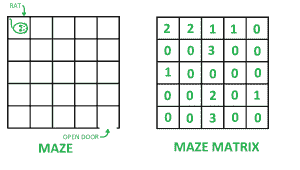
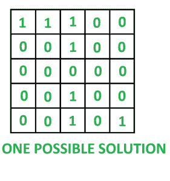

# 迷宫中老鼠的变异:允许多步或跳跃

> 原文:[https://www . geesforgeks . org/a-迷宫中老鼠的变异-允许多步或跳跃/](https://www.geeksforgeeks.org/a-variation-of-rat-in-a-maze-multiple-steps-or-jumps-allowed/)

迷宫中的变异鼠。
给你一个 **N * N** 二维矩阵形迷宫(姑且称之为 M)，在**左上角单元格**即**M【0】【0】**有一只老鼠，在**右下角单元格**即**M【N-1】【N-1】**有一个逃生门。从每个单元格 **M[i][j]** (0 ≤ i ≤ N-1，0 ≤ j ≤ N-1)开始，大鼠可以向右走多步(例如:到 M[i][j+ s])，或者向下走多步(例如:到 M[i+ s][j])，其中最大步数(或 s 的最大值)可以是单元格 **M[i][j]** 中的值。如果任何一个单元格包含 **0** ，那么这就是一个**死胡同**。**为例:**下图第二张图中 **M[0][0]** 处的大鼠可以跳到一个细胞: **M[0][1]** 、 **M[0][2]** 、 **M[1][0]** 或 **M[2][0]** 。



您必须以大小矩阵 **N * N** 的形式打印从 M[0][0]到 M[N-1][N-1] 的可能路径**，使得路径中的单元格具有值 **1** ，而其他单元格具有值 **0** 。对于上面的例子，一个这样的解决方案是:** 



这个问题在[这篇](https://www.geeksforgeeks.org/rat-in-a-maze-with-multiple-steps-jump-allowed/)中有**回溯解**。
**这里给出了一个基于动态规划的解决方案。**
**示例:**

> **输入:** mat[][] = {
> {3，0，0，2，1}、
> {0，0，0，0，2}、
> {0，1，0，1，0}、
> {1，0，0，1，1，1}、
> {3，0，0，1，1，1，1} }
> **输出:**
> 1 0 0 1
> 0 0 0 1
> 0 0 0 0 0 0 0 0 0

**进场:**

*   用**假**初始化布尔**通用报告格式【N】【N】**(可从)矩阵。现在使**通用报告格式【N-1】【N-1】=真**，因为从目的地可以到达目的地。
*   现在，从**迷宫【N–1】【N–1】**开始，到**迷宫【0】【0】**结束，根据是否有可能到达任何其他有效单元格(通往目的地)，更新**CRF【】【】【】**中的所有单元格。
*   当所有 **CRF[][]** 矩阵都已更新后，使用创建一个矩阵，该矩阵包含通往目的地路径中所有 **1s** 单元，其他单元为 **0s** 。
*   最后打印这个新创建的矩阵。
*   如果无法到达目的地，则打印**不存在路径**。

以下是上述方法的实现:

## C++

```
// C++ implementation of the approach
#include <bits/stdc++.h>
using namespace std;

// Function to check whether the path exists
bool hasPath(vector<vector<int>> maze, vector<vector<int>>& sol,
                                     int N)
{

    for (int i = 0; i < N; i++)
        for (int j = 0; j < N; j++)
            sol[i][j] = 0;

    // Declaring and initializing CRF
    // (can reach from) matrix
    vector<vector<bool>> CRF(N);
    for (int i = 0; i < N; i++)
        CRF[i] = vector<bool>(N);

    for (int i = 0; i < N; i++)
        for (int j = 0; j < N; j++)
            CRF[i][j] = false;
    CRF[N - 1][N - 1] = true;

    // Using the DP to fill CRF matrix
    // in correct order
    for (int k = N - 1; k >= 0; k--) {
        for (int j = k; j >= 0; j--) {

            if (!(k == N - 1 && j == N - 1)) {

                // If it is possible to get
                // to a valid location from
                // cell maze[k][j]
                for (int a = 0; a <= maze[k][j]; a++) {
                    if ((j + a < N && CRF[k][j + a] == true)
                        || (k + a < N && CRF[k + a][j] == true)) {
                        CRF[k][j] = true;
                        break;
                    }
                }

                // If it is possible to get to
                // a valid location from cell
                // maze[j][k]
                for (int a = 0; a <= maze[j][k]; a++) {
                    if ((k + a < N && CRF[j][k + a] == true)
                        || (j + a < N && CRF[j + a][k] == true)) {
                        CRF[j][k] = true;
                        break;
                    }
                }
            }
        }
    }

    // If CRF[0][0] is false it means we cannot reach
    // the end of the maze at all
    if (CRF[0][0] == false)
        return false;

    // Filling the solution matrix using CRF
    int i = 0, j = 0;
    while (!(i == N - 1 && j == N - 1)) {
        sol[i][j] = 1;
        if (maze[i][j] > 0)

            // Get to a valid location from
            // the current cell
            for (int a = 1; a <= maze[i][j]; a++) {
                if ((j + a < N && CRF[i][j + a] == true)) {
                    j = j + a;
                    break;
                }
                else if ((i + a < N && CRF[i + a][j] == true)) {
                    i = i + a;
                    break;
                }
            }
    }
    sol[N - 1][N - 1] = 1;

    return true;
}

// Utility function to print the contents
// of a 2-D array
void printMatrix(vector<vector<int>> sol, int N)
{
    for (int i = 0; i < N; i++) {
        for (int j = 0; j < N; j++)
            cout << sol[i][j] << " ";
        cout << "\n";
    }
}

// Driver code
int main()
{

    vector<vector<int>> maze = { { 2, 2, 1, 1, 0 },
                        { 0, 0, 3, 0, 0 },
                        { 1, 0, 0, 0, 0 },
                        { 0, 0, 2, 0, 1 },
                        { 0, 0, 3, 0, 0 } };
    int N = maze.size();
    vector<vector<int>> sol(N,vector<int>(N));

    // If path exists
    if (hasPath(maze, sol, N))

        // Print the path
        printMatrix(sol, N);
    else
        cout << "No path exists";

    return 0;
}
```

## Java 语言(一种计算机语言，尤用于创建网站)

```
// Java implementation of the approach
class GFG
{
static int MAX = 50;

// Function to check whether the path exists
static boolean hasPath(int maze[][],
                       int sol[][], int N)
{
    for (int i = 0; i < N; i++)
        for (int j = 0; j < N; j++)
            sol[i][j] = 0;

    // Declaring and initializing CRF
    // (can reach from) matrix
    boolean [][]CRF = new boolean[N][N];

    CRF[N - 1][N - 1] = true;

    // Using the DP to fill CRF matrix
    // in correct order
    for (int k = N - 1; k >= 0; k--)
    {
        for (int j = k; j >= 0; j--)
        {

            if (!(k == N - 1 && j == N - 1))
            {

                // If it is possible to get
                // to a valid location from
                // cell maze[k][j]
                for (int a = 0; a <= maze[k][j]; a++)
                {
                    if ((j + a < N && CRF[k][j + a] == true) ||
                        (k + a < N && CRF[k + a][j] == true))
                    {
                        CRF[k][j] = true;
                        break;
                    }
                }

                // If it is possible to get to
                // a valid location from cell
                // maze[j][k]
                for (int a = 0; a <= maze[j][k]; a++)
                {
                    if ((k + a < N && CRF[j][k + a] == true) ||
                        (j + a < N && CRF[j + a][k] == true))
                    {
                        CRF[j][k] = true;
                        break;
                    }
                }
            }
        }
    }

    // If CRF[0][0] is false it means we cannot reach
    // the end of the maze at all
    if (CRF[0][0] == false)
        return false;

    // Filling the solution matrix using CRF
    int i = 0, j = 0;
    while (!(i == N - 1 && j == N - 1))
    {
        sol[i][j] = 1;
        if (maze[i][j] > 0)

            // Get to a valid location from
            // the current cell
            for (int a = 1; a <= maze[i][j]; a++)
            {
                if ((j + a < N && CRF[i][j + a] == true))
                {
                    j = j + a;
                    break;
                }
                else if ((i + a < N && CRF[i + a][j] == true))
                {
                    i = i + a;
                    break;
                }
            }
    }
    sol[N - 1][N - 1] = 1;

    return true;
}

// Utility function to print the contents
// of a 2-D array
static void printMatrix(int sol[][], int N)
{
    for (int i = 0; i < N; i++)
    {
        for (int j = 0; j < N; j++)
            System.out.print(sol[i][j] + " ");
        System.out.println();
    }
}

// Driver code
public static void main(String[] args)
{
    int maze[][] = {{ 2, 2, 1, 1, 0 },
                    { 0, 0, 3, 0, 0 },
                    { 1, 0, 0, 0, 0 },
                    { 0, 0, 2, 0, 1 },
                    { 0, 0, 3, 0, 0 }};
    int N = maze.length;
    int [][]sol = new int [N][MAX];

    // If path exists
    if (hasPath(maze, sol, N))

        // Print the path
        printMatrix(sol, N);
    else
        System.out.println("No path exists");
    }
}

// This code is contributed by Princi Singh
```

## C#

```
// C# implementation of the approach
using System;

class GFG
{
static int MAX = 50;

// Function to check whether the path exists
static Boolean hasPath(int [,]maze,
                       int [,]sol, int N)
{
    int i, j, k;
    for (i = 0; i < N; i++)
        for (j = 0; j < N; j++)
            sol[i, j] = 0;

    // Declaring and initializing CRF
    // (can reach from) matrix
    Boolean [,]CRF = new Boolean[N, N];

    CRF[N - 1, N - 1] = true;

    // Using the DP to fill CRF matrix
    // in correct order
    for (k = N - 1; k >= 0; k--)
    {
        for (j = k; j >= 0; j--)
        {
            if (!(k == N - 1 && j == N - 1))
            {

                // If it is possible to get
                // to a valid location from
                // cell maze[k,j]
                for (int a = 0; a <= maze[k, j]; a++)
                {
                    if ((j + a < N && CRF[k, j + a] == true) ||
                        (k + a < N && CRF[k + a, j] == true))
                    {
                        CRF[k, j] = true;
                        break;
                    }
                }

                // If it is possible to get to
                // a valid location from cell
                // maze[j,k]
                for (int a = 0; a <= maze[j, k]; a++)
                {
                    if ((k + a < N && CRF[j, k + a] == true) ||
                        (j + a < N && CRF[j + a, k] == true))
                    {
                        CRF[j, k] = true;
                        break;
                    }
                }
            }
        }
    }

    // If CRF[0,0] is false it means we cannot
    // reach the end of the maze at all
    if (CRF[0, 0] == false)
        return false;

    // Filling the solution matrix using CRF
    i = 0; j = 0;
    while (!(i == N - 1 && j == N - 1))
    {
        sol[i, j] = 1;
        if (maze[i, j] > 0)

            // Get to a valid location from
            // the current cell
            for (int a = 1; a <= maze[i, j]; a++)
            {
                if ((j + a < N &&
                     CRF[i, j + a] == true))
                {
                    j = j + a;
                    break;
                }
                else if ((i + a < N &&
                          CRF[i + a, j] == true))
                {
                    i = i + a;
                    break;
                }
            }
    }
    sol[N - 1, N - 1] = 1;

    return true;
}

// Utility function to print the contents
// of a 2-D array
static void printMatrix(int [,]sol, int N)
{
    for (int i = 0; i < N; i++)
    {
        for (int j = 0; j < N; j++)
            Console.Write(sol[i, j] + " ");
        Console.WriteLine();
    }
}

// Driver code
public static void Main(String[] args)
{
    int [,]maze = {{ 2, 2, 1, 1, 0 },
                   { 0, 0, 3, 0, 0 },
                   { 1, 0, 0, 0, 0 },
                   { 0, 0, 2, 0, 1 },
                   { 0, 0, 3, 0, 0 }};
    int N = maze.GetLength(0);
    int [,]sol = new int [N, MAX];

    // If path exists
    if (hasPath(maze, sol, N))

        // Print the path
        printMatrix(sol, N);
    else
        Console.WriteLine("No path exists");
    }
}

// This code is contributed by Rajput-Ji
```

## java 描述语言

```
<script>

// JavaScript implementation of the approach
var MAX = 50;

// Function to check whether the path exists
function hasPath(maze, sol, N)
{

    for (var i = 0; i < N; i++)
        for (var j = 0; j < N; j++)
            sol[i][j] = 0;

    // Declaring and initializing CRF
    // (can reach from) matrix
    var CRF = Array.from(Array(N), ()=>Array(N));;

    for (var i = 0; i < N; i++)
        for (var j = 0; j < N; j++)
            CRF[i][j] = false;
    CRF[N - 1][N - 1] = true;

    // Using the DP to fill CRF matrix
    // in correct order
    for (var k = N - 1; k >= 0; k--) {
        for (var j = k; j >= 0; j--) {

            if (!(k == N - 1 && j == N - 1)) {

                // If it is possible to get
                // to a valid location from
                // cell maze[k][j]
                for (var a = 0; a <= maze[k][j]; a++) {
                    if ((j + a < N && CRF[k][j + a] == true)
                        || (k + a < N && CRF[k + a][j] == true)) {
                        CRF[k][j] = true;
                        break;
                    }
                }

                // If it is possible to get to
                // a valid location from cell
                // maze[j][k]
                for (var a = 0; a <= maze[j][k]; a++) {
                    if ((k + a < N && CRF[j][k + a] == true)
                        || (j + a < N && CRF[j + a][k] == true)) {
                        CRF[j][k] = true;
                        break;
                    }
                }
            }
        }
    }

    // If CRF[0][0] is false it means we cannot reach
    // the end of the maze at all
    if (CRF[0][0] == false)
        return false;

    // Filling the solution matrix using CRF
    var i = 0, j = 0;
    while (!(i == N - 1 && j == N - 1)) {
        sol[i][j] = 1;
        if (maze[i][j] > 0)

            // Get to a valid location from
            // the current cell
            for (var a = 1; a <= maze[i][j]; a++) {
                if ((j + a < N && CRF[i][j + a] == true)) {
                    j = j + a;
                    break;
                }
                else if ((i + a < N && CRF[i + a][j] == true)) {
                    i = i + a;
                    break;
                }
            }
    }
    sol[N - 1][N - 1] = 1;

    return true;
}

// Utility function to print the contents
// of a 2-D array
function printMatrix( sol, N)
{
    for (var i = 0; i < N; i++) {
        for (var j = 0; j < N; j++)
            document.write( sol[i][j] + " ");
        document.write("<br>");
    }
}

// Driver code
var maze = [ [ 2, 2, 1, 1, 0 ],
             [ 0, 0, 3, 0, 0 ],
             [ 1, 0, 0, 0, 0 ],
             [ 0, 0, 2, 0, 1 ],
             [ 0, 0, 3, 0, 0 ] ];
var N = maze.length;
var sol = Array.from(Array(N), ()=>Array(MAX));
// If path exists
if (hasPath(maze, sol, N))
    // Print the path
    printMatrix(sol, N);
else
    document.write( "No path exists");

</script>
```

## 蟒蛇 3

```
# Python3 implementation of the approach

MAX=50

# Function to check whether the path exists
def hasPath(maze, sol,N):

    for i in range(N):
        for j in range(N):
            sol[i][j] = 0

    # Declaring and initializing CRF
    # can reach from matrix
    CRF =[[False]*N for _ in range(N)]

    for i in range(N):
        for j in range(N):
            CRF[i][j] = False
    CRF[N - 1][N - 1] = True

    # Using the DP to fill CRF matrix
    # in correct order
    for k in range(N-1,-1,-1):
        for j in range(k,-1,-1):
            if not(k == N - 1 and j == N - 1):
                # If it is possible to get
                # to a valid location from
                # cell maze[k][j]
                for a in range(maze[k][j]+1):
                    if (j + a < N and CRF[k][j + a]) or (k + a < N and CRF[k + a][j]):
                        CRF[k][j] = True
                        break

                # If it is possible to get to
                # a valid location from cell
                # maze[j][k]
                for a in range(maze[j][k]+1):
                    if ((k + a < N and CRF[j][k + a]) or (j + a < N and CRF[j + a][k])):
                        CRF[j][k] = True
                        break

    # If CRF[0][0] is false it means we cannot reach
    # the end of the maze at all
    if not CRF[0][0]:
        return False

    # Filling the solution matrix using CRF
    i = 0; j = 0
    while (not (i == N - 1 and j == N - 1)):
        sol[i][j] = 1
        if (maze[i][j] > 0):

            # Get to a valid location from
            # the current cell
            for a in range(1,maze[i][j]+1):
                if (j + a < N and CRF[i][j + a]):
                    j = j + a
                    break
                elif ((i + a < N and CRF[i + a][j])):
                    i = i + a
                    break
    sol[N - 1][N - 1] = 1

    return True

# Utility function to print the contents
# of a 2-D array
def printMatrix(sol, N):
    for i in range(N):
        for j in range(N):
            print(sol[i][j],end=" ")
        print()

# Driver code
if __name__ == '__main__':

    maze= [ [ 2, 2, 1, 1, 0 ],
            [ 0, 0, 3, 0, 0 ],
            [ 1, 0, 0, 0, 0 ],
            [ 0, 0, 2, 0, 1 ],
            [ 0, 0, 3, 0, 0 ] ]
    N = len(maze)
    sol=[[0]*N for _ in range(MAX)]

    # If path exists
    if (hasPath(maze, sol, N)):

        # Print the path
        printMatrix(sol, N)
    else:
        print("No path exists")

 # This code is contributed by Amartya Ghosh
```

**Output:** 

```
1 1 1 0 0 
0 0 1 0 0 
0 0 0 0 0 
0 0 1 0 0 
0 0 1 0 1
```

**时间复杂度:** O(N ^ 2 * MAX)，其中 n 是行数，MAX 是矩阵中的最大元素。
**辅助空间:** O(N * N)