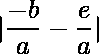

# 四次方程根的和与积的绝对差

> 原文:[https://www . geeksforgeeks . org/四次方程根的和与积的绝对差/](https://www.geeksforgeeks.org/absolute-difference-between-sum-and-product-of-roots-of-a-quartic-equation/)

给定一个形式为的四次方程，求其根之和与其根之积的绝对差。请注意，根不必是真实的——它们也可以是复杂的。
**例:**

```
Input: 4x^4 + 3x^3 + 2x^2 + x - 1
Output: 0.5

Input: x^4 + 4x^3 + 6x^2 + 4x + 1
Output: 5
```

**方法:**求解四次方程以获得每个单独的根将是耗时且低效的，并且将需要大量的努力和计算能力。一个更有效的解决方案利用以下公式:

```
The quartic  always has sum of roots ,
and product of roots . 
```

因此通过计算我们找到了根的和与积之间的绝对差。
**以下是执行上述办法:**

## C++

```
// C++ implementation of above approach
#include <bits/stdc++.h>
using namespace std;

// Function taking coefficient of
// each term of equation as input
double sumProductDifference(int a, int b,
                            int c, int d,
                            int e)
{
    // Finding sum of roots
    double rootSum = (double)(-1 * b) / a;

    // Finding product of roots
    double rootProduct = (double) e / a;

    // Absolute difference
    return abs(rootSum - rootProduct);
}

// Driver code
int main()
{
    cout << sumProductDifference(8, 4, 6, 4, 1);

    return 0;
}

// This code is contributed
// by ANKITRAI1
```

## Java 语言(一种计算机语言，尤用于创建网站)

```
// Java implementation of above approach

public class GFG {
    // Function taking coefficient of
    // each term of equation as input
    static double sumProductDifference(int a, int b, int c, int d, int e) {
        // Finding sum of roots
        double rootSum = (double)(-1 * b) / a;

        // Finding product of roots
        double rootProduct = (double) e / a;

        // Absolute difference
        return Math.abs(rootSum - rootProduct);
    }

    // Driver Code
    public static void main(String args[]) {
        System.out.println(sumProductDifference(8, 4, 6, 4, 1));
    }
}
```

## 蟒蛇 3

```
# Python implementation of above approach

# Function taking coefficient of
# each term of equation as input
def sumProductDifference(a, b, c, d, e):

    # Finding sum of roots
    rootSum = (-1 * b)/a

    # Finding product of roots
    rootProduct = e / a

    # Absolute difference
    return abs(rootSum-rootProduct)

print(sumProductDifference(8, 4, 6, 4, 1))
```

## C#

```
// C# implementation of above approach
using System;

class GFG
{
// Function taking coefficient of
// each term of equation as input
static double sumProductDifference(int a, int b,
                                   int c, int d,
                                   int e)
{
    // Finding sum of roots
    double rootSum = (double)(-1 * b) / a;

    // Finding product of roots
    double rootProduct = (double) e / a;

    // Absolute difference
    return Math.Abs(rootSum - rootProduct);
}

// Driver Code
public static void Main()
{
    Console.Write(sumProductDifference(8, 4, 6, 4, 1));
}
}

// This code is contributed
// by ChitraNayal
```

## 服务器端编程语言（Professional Hypertext Preprocessor 的缩写）

```
<?php
// PHP implementation of above approach

// Function taking coefficient of
// each term of equation as input
function sumProductDifference($a, $b,
                              $c, $d,$e)
{
    // Finding sum of roots
    $rootSum = (double)(-1 * $b) / $a;

    // Finding product of roots
    $rootProduct = (double) $e / $a;

    // Absolute difference
    return abs($rootSum - $rootProduct);
}

// Driver code
echo sumProductDifference(8, 4, 6, 4, 1);

// This code is contributed
// by Shivi_Aggarwal
?>
```

## java 描述语言

```
<script>

// Javascript implementation of above approach

// Function taking coefficient of
// each term of equation as input
function sumProductDifference(a, b, c, d, e)
{

    // Finding sum of roots
    var rootSum = (-1 * b) / a;

    // Finding product of roots
    var rootProduct = e / a;

    // Absolute difference
    return Math.abs(rootSum - rootProduct);
}

// Driver Code
document.write(sumProductDifference(8, 4, 6, 4, 1));

// This code is contributed by Ankita saini

</script>
```

**Output:** 

```
0.625
```

**说明:**输入方程为。
通过找到，我们得到、
，也就是或者。