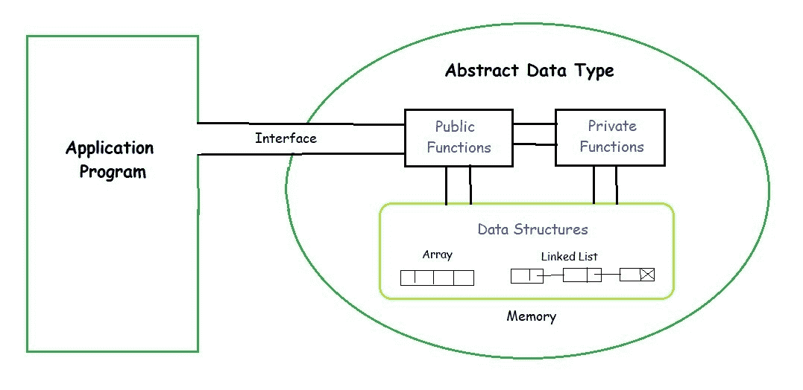
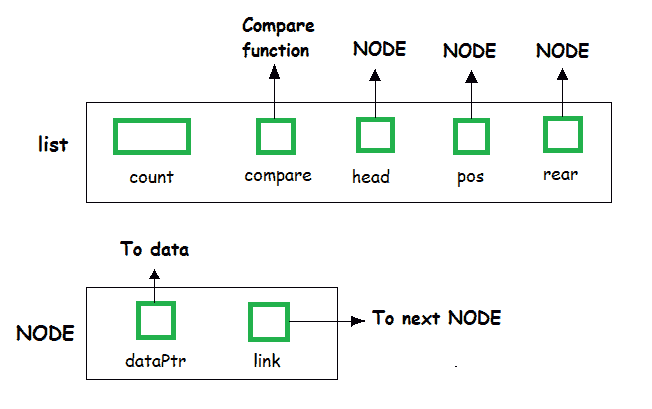
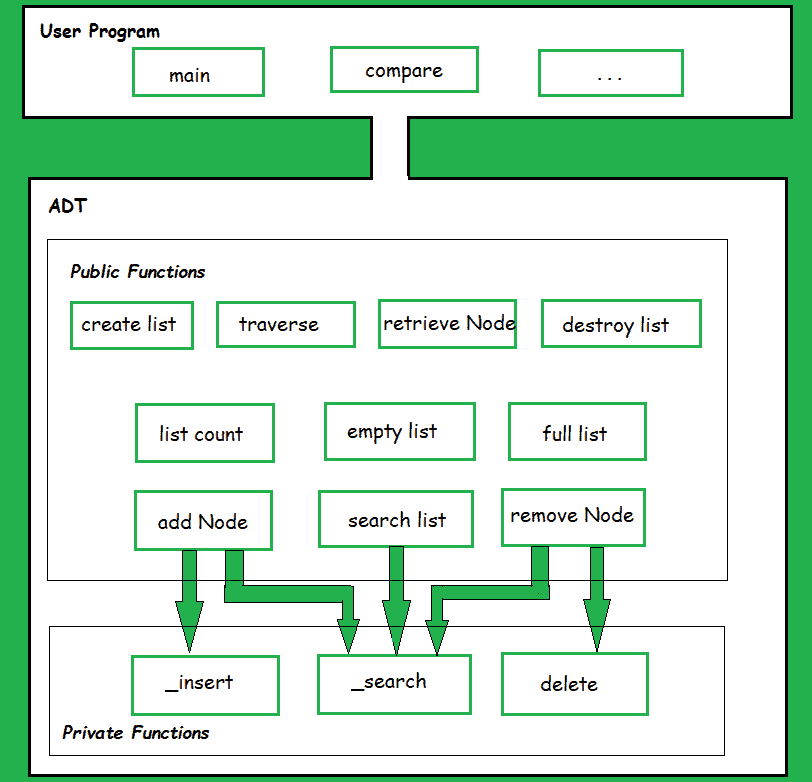
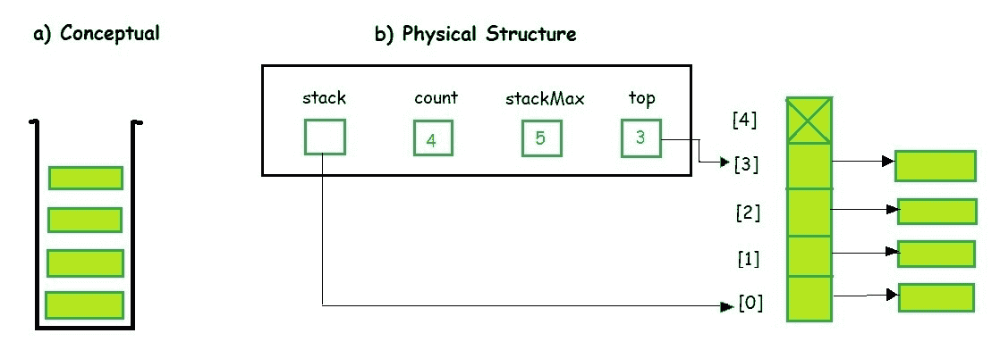
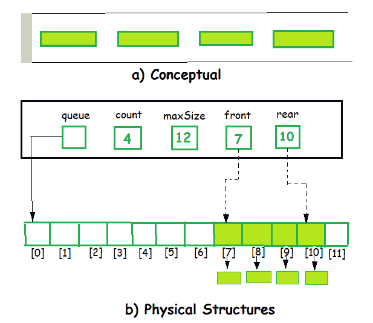

# 抽象数据类型

> 原文:[https://www.geeksforgeeks.org/abstract-data-types/](https://www.geeksforgeeks.org/abstract-data-types/)

抽象数据类型(ADT)是一种对象类型(或类)，其行为由一组值和一组操作来定义。

ADT 的定义只提到要执行哪些操作，而没有提到这些操作将如何实现。它没有指定数据将如何在内存中组织，以及将使用什么算法来实现这些操作。它被称为“抽象的”，因为它给出了一个独立于实现的视图。只提供要点和隐藏细节的过程被称为抽象。

[](https://media.geeksforgeeks.org/wp-content/uploads/20190828194629/ADT.jpg)

[数据类型](https://www.geeksforgeeks.org/data-types-in-c/)的用户不需要知道该数据类型是如何实现的，例如，我们一直在使用像 int、float、char 数据类型这样的原语值，只知道这些数据类型可以操作和执行，而不知道它们是如何实现的。所以用户只需要知道一个数据类型能做什么，而不需要知道它将如何实现。把 ADT 想象成一个隐藏数据类型内部结构和设计的黑盒。现在我们将定义三个 ADT，即[列表](https://www.geeksforgeeks.org/linked-list-set-1-introduction/) ADT、[堆栈](https://www.geeksforgeeks.org/stack-data-structure-introduction-program/) ADT、[队列](https://www.geeksforgeeks.org/queue-set-1introduction-and-array-implementation/) ADT。

1.  **List ADT**
    *   The data is generally stored in key sequence in a list which has a head structure consisting of *count*, *pointers* and *address of compare function* needed to compare the data in the list.

        

    *   数据节点包含指向数据结构的*指针*和指向列表中下一个节点的*自引用指针*。

        ```
        //List ADT Type Definitions
        typedef struct node
        {
         void *DataPtr;
         struct node *link;
        } Node;
        typedef struct
        {
         int count;
         Node *pos;
         Node *head;
         Node *rear;
         int (*compare) (void *argument1, void *argument2)
        } LIST; 
        ```

    *   The **List ADT Functions** is given below:

        

    列表包含按顺序排列的相同类型的元素，可以对列表执行以下操作。

    *   get()–返回列表中任意给定位置的元素。
    *   Insert()–在列表的任何位置插入一个元素。
    *   Remove()–从非空列表中删除任何元素的第一个匹配项。
    *   removeAt()–从非空列表中删除指定位置的元素。
    *   Replace()–用另一个元素替换任意位置的元素。
    *   size()–返回列表中元素的数量。
    *   isEmpty()–如果列表为空，则返回 true，否则返回 false。
    *   isFull()–如果列表已满，则返回 true，否则返回 false。
2.  **Stack ADT**
    *   在堆栈 ADT 实现中，数据指针不是存储在每个节点中，而是存储在数据中。
    *   The program allocates memory for the *data* and *address* is passed to the stack ADT.

        

    *   头节点和数据节点封装在 ADT 中。调用函数只能看到指向堆栈的指针。
    *   堆栈头结构还包含一个指针，指向当前堆栈中条目数量的*顶部*和*计数*。

        ```
        //Stack ADT Type Definitions
        typedef struct node
        {
         void *DataPtr;
         struct node *link;
        } StackNode;
        typedef struct
        {
         int count;
         StackNode *top;
        } STACK;
        ```

    堆栈包含按顺序排列的相同类型的元素。所有操作都发生在堆栈顶部的单个末端，并且可以执行以下操作:

    *   push()–在堆栈的一端插入一个名为 top 的元素。
    *   pop()–移除并返回堆栈顶部的元素(如果它不是空的)。
    *   peek()–如果堆栈不是空的，则返回堆栈顶部的元素，而不移除它。
    *   size()–返回堆栈中元素的数量。
    *   isEmpty()–如果堆栈为空，则返回 true，否则返回 false。
    *   isFull()–如果堆栈已满，则返回 true，否则返回 false。
3.  **Queue ADT**
    *   The queue abstract data type (ADT) follows the basic design of the stack abstract data type.

        

    *   每个节点包含一个指向*数据*的空指针和指向队列中下一个元素的*链接指针*。程序的职责是分配存储数据的内存。

        ```
        //Queue ADT Type Definitions
        typedef struct node
        {
         void *DataPtr;
         struct node *next;
        } QueueNode;
        typedef struct 
        {
         QueueNode *front;
         QueueNode *rear;
         int count;
        } QUEUE;
        ```

    队列包含按顺序排列的相同类型的元素。操作在两端进行，插入在末端完成，删除在前面完成。可以执行以下操作:

    *   enqueue()–在队列末尾插入一个元素。
    *   出列()–如果队列不为空，则移除并返回队列的第一个元素。
    *   peek()–如果队列不是空的，则返回队列的元素，而不删除它。
    *   size()–返回队列中的元素数量。
    *   isEmpty()–如果队列为空，则返回 true，否则返回 false。
    *   isFull()–如果队列已满，则返回 true，否则返回 false。

从这些定义中，我们可以清楚地看到，这些定义并没有指定如何表示这些 ADT 以及如何执行操作。可以有不同的方法来实现 ADT，例如，列表 ADT 可以使用数组、单链表或双链表来实现。类似地，堆栈 ADT 和队列 ADT 可以使用数组或链表来实现。

**参考:**T2】https://en.wikipedia.org/wiki/Abstract_data_type

本文由 **Anuj Chauhan** 供稿。如果你喜欢 GeeksforGeeks 并想投稿，你也可以使用[contribute.geeksforgeeks.org](http://contribute.geeksforgeeks.org)写一篇文章或者把你的文章邮寄到 contribute@geeksforgeeks.org。看到你的文章出现在极客博客主页上，帮助其他极客。

如果你发现任何不正确的地方，或者你想分享更多关于上面讨论的话题的信息，请写评论。