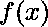

# 二分搜索法的抽象

> 原文:[https://www.geeksforgeeks.org/abstraction-of-binary-search/](https://www.geeksforgeeks.org/abstraction-of-binary-search/)

**什么是二分搜索法算法？**
[**【二分搜索法】**](https://www.geeksforgeeks.org/binary-search/) 算法用于寻找 **x** 的某个值，对于该值，某个定义的函数 **f(x)** 需要最大化或最小化。它经常被用来通过重复地将搜索间隔分成两半来搜索排序序列中的元素。从覆盖整个序列的间隔开始，如果搜索关键字的值小于间隔中间的项目，则在间隔的左半部分搜索，否则在右半部分搜索。反复检查，直到找到值或间隔为空。
执行二分搜索法的主要条件是序列必须是单调的，即它必须是递增或递减的。

> **单调函数**
> 函数 f(x)被认为是单调的当且仅当对于任何 x 如果 *f(x)* 返回真，那么对于 y 的任何值(其中 y > x)也应该返回真，同样如果对于某个 x 的值 *f(x)* 为假，那么对于任何值 z (z < x)，该函数也应该返回假。

**如何用二分搜索法求解问题:**
如果函数是


任务是找到 **x** 的最大值，使得 **f(x)** 小于或等于**目标值**。我们将搜索给定的目标值的时间间隔



是从 **0 到目标值**。
那么我们可以用二分搜索法为这个问题自函数


是单调递增的函数。

> **Target**= 17
> f(x)= x<sup>2</sup>，由于函数是单调的，二分搜索法可以应用于它。
> 搜索区间范围将为【0，目标】
> **第 1 步:**
> 低= 0，高= 17，计算 mid =(低+高)/2 = 8
> 计算 f(8) = 64 比目标多，因此将返回 false，高将更新为高= mid–1 = 7。
> **第 2 步:**
> low = 0，high = 7，计算 mid = (low + high)/2 = 3
> 计算 f(3) = 9，小于目标，则返回 true，low 将更新为 low = mid + 1 = 4。
> **第三步:**
> low = 4，high = 7，计算 mid = (low + high)/2 = 5
> 计算 f(5) = 25 比目标多，所以会返回 false，high 会更新为 high = mid–1 = 4。
> **第 4 步:**
> 现在由于范围[低，高]收敛到一个单点，即 4，所以最终结果被找到，因为 f(4) = 16，这是给定函数小于目标的最大值。

下面是上面例子的实现:

## C++

```
// C++ program for the above example

#include "bits/stdc++.h"
using namespace std;

// Function to find X such that it is
// less than the target value and function
// is f(x) = x^2
void findX(int targetValue)
{

    // Initialise start and end
    int start = 0, end = targetValue;
    int mid, result;

    // Loop till start <= end
    while (start <= end) {

        // Find the mid
        mid = start + (end - start) / 2;

        // Check for the left half
        if (mid * mid <= targetValue) {

            // Store the result
            result = mid;

            // Reinitialize the start point
            start = mid + 1;
        }

        // Check for the right half
        else {
            end = mid - 1;
        }
    }

    // Print the maximum value of x
    // such that x^2 is less than the
    // targetValue
    cout << result << endl;
}

// Driver Code
int main()
{
    // Given targetValue;
    int targetValue = 81;

    // Function Call
    findX(targetValue);
}
```

## Java 语言(一种计算机语言，尤用于创建网站)

```
// Java program for
// the above example
import java.util.*;
class GFG{

// Function to find X such
// that it is less than the
// target value and function
// is f(x) = x^2
static void findX(int targetValue)
{

    // Initialise start and end
    int start = 0, end = targetValue;
    int mid = 0, result = 0;

    // Loop till start <= end
    while (start <= end)
    {

        // Find the mid
        mid = start + (end - start) / 2;

        // Check for the left half
        if (mid * mid <= targetValue)
        {

            // Store the result
            result = mid;

            // Reinitialize the start point
            start = mid + 1;
        }

        // Check for the right half
        else
        {
            end = mid - 1;
        }
    }

    // Print the maximum value of x
    // such that x^2 is less than the
    // targetValue
    System.out.print(result + "\n");
}

// Driver Code
public static void main(String[] args)
{

    // Given targetValue;
    int targetValue = 81;

    // Function call
    findX(targetValue);
}
}

// This code is contributed by 29AjayKumar
```

## 蟒蛇 3

```
# Python3 program for
# the above example

# Function to find X such
# that it is less than the
# target value and function
# is f(x) = x ^ 2
def findX(targetValue):

    # Initialise start and end
    start = 0;
    end = targetValue;
    mid = 0;

    # Loop till start <= end
    while (start <= end):

        # Find the mid
        mid = start + (end - start) // 2;

        # Check for the left half
        if (mid * mid <= targetValue):
            result = mid
            start = mid + 1;

        # Check for the right half
        else:
            end = mid - 1;

    # Print maximum value of x
    # such that x ^ 2 is less than the
    # targetValue
    print(result);

# Driver Code
if __name__ == '__main__':

    # Given targetValue;
    targetValue = 81;

    # Function Call
    findX(targetValue);

# This code is contributed by Rajput-Ji
```

## C#

```
// C# program for
// the above example
using System;
class GFG{

// Function to find X such
// that it is less than the
// target value and function
// is f(x) = x^2
static void findX(int targetValue)
{

    // Initialise start and end
    int start = 0, end = targetValue;
    int mid = 0, result = 0;

    // Loop till start <= end
    while (start <= end)
    {

        // Find the mid
        mid = start + (end - start) / 2;

        // Check for the left half
        if (mid * mid <= targetValue)
        {

            // Store the result
            result = mid;

            // Reinitialize the start point
            start = mid + 1;
        }

        // Check for the right half
        else
        {
            end = mid - 1;
        }
    }

    // Print the maximum value of x
    // such that x^2 is less than the
    // targetValue
    Console.Write(result + "\n");
}

// Driver Code
public static void Main(String[] args)
{

    // Given targetValue;
    int targetValue = 81;

    // Function Call
    findX(targetValue);
}
}

// This code is contributed by 29AjayKumar
```

## java 描述语言

```
<script>

// JavaScript program for the above example

// Function to find X such that it is
// less than the target value and function
// is f(x) = x^2
function findX(targetValue)
{

    // Initialise start and end
    var start = 0, end = targetValue;
    var mid, result;

    // Loop till start <= end
    while (start <= end) {

        // Find the mid
        mid = start + parseInt((end - start) / 2);

        // Check for the left half
        if (mid * mid <= targetValue) {

            // Store the result
            result = mid;

            // Reinitialize the start point
            start = mid + 1;
        }

        // Check for the right half
        else {
            end = mid - 1;
        }
    }

    // Print the maximum value of x
    // such that x^2 is less than the
    // targetValue
    document.write( result );
}

// Driver Code

// Given targetValue;
var targetValue = 81;

// Function Call
findX(targetValue);

</script>
```

**Output:** 

```
9
```

上述二分搜索法算法最多需要 **O(log N)** 次比较，找到小于或等于目标值的最大值。并且函数 f(x) = x 的值 <sup>2</sup> 不需要多次求值。
***时间复杂度:** O(logN)*
***辅助空间:** O(1)*