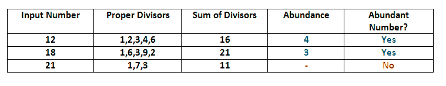

# 丰号

> 原文:[https://www.geeksforgeeks.org/abundant-number/](https://www.geeksforgeeks.org/abundant-number/)

如果由和(n)表示的数的所有自然数之和大于数 n 的值，则称数 n 为丰数，这两个值之差称为**丰数**。
从数学上讲，如果下面的条件成立，这个数被称为丰数:

```
sum(n)> n
abundance =  sum(n) - n
sum(n): aliquot sum - The sum of all proper divisors of n
```

给定一个数 n，我们的任务是找出这个数是否是丰数。
前几个丰数是:12，18，20，24，30，36，40，42，48，54，56，60，66 …..



**例:**

```
Input: 21
Output: NO

Input: 12
Output: YES

Input: 17
Output: NO
```

**方法 1**

一个**简单的解决方法**就是把所有的数字从 1 迭代到 n-1，检查数字是否除以 n，计算总和。检查这个总和是否大于 n。
该方法的时间复杂度:O(n)

**优化方案:**

如果我们仔细观察，数 n 的除数成对出现。例如，如果 n = 100，那么所有的除数对都是:(1，100)，(2，50)，(4，25)，(5，20)，(10，10)
利用这个事实，我们可以加快我们的程序。在检查除数时，我们必须小心是否有两个相等的除数，如(10，10)的情况。在这种情况下，我们将只取其中的一个来计算总和。
将所有除数之和减去数 n，得到真除数之和。

## C++

```
// An Optimized Solution to check Abundant Number
#include <bits/stdc++.h>
using namespace std;

// Function to calculate sum of divisors
int getSum(int n)
{
    int sum = 0;

    // Note that this loop runs till square root
    // of n
    for (int i=1; i<=sqrt(n); i++)
    {
        if (n%i==0)
        {
            // If divisors are equal,take only one
            // of them
            if (n/i == i)
                sum = sum + i;

            else // Otherwise take both
            {
                sum = sum + i;
                sum = sum + (n / i);
            }
        }
    }

    // calculate sum of all proper divisors only
    sum = sum - n;
    return sum;
}

// Function to check Abundant Number
bool checkAbundant(int n)
{
    // Return true if sum of divisors is greater
    // than n.
    return (getSum(n) > n);
}

/* Driver program to test above function */
int main()
{
    checkAbundant(12)? cout << "YES\n" : cout << "NO\n";
    checkAbundant(15)? cout << "YES\n" : cout << "NO\n";
    return 0;
}
```

## Java 语言(一种计算机语言，尤用于创建网站)

```
// An Optimized Solution to check Abundant Number
// in JAVA
import java.io.*;
import java.math.*;

// Function to calculate sum of divisors
class GFG{
    static int getSum(int n)
    {
        int sum = 0;

       // Note that this loop runs till square
       // root of n
        for (int i=1; i<=(Math.sqrt(n)); i++)
        {
            if (n%i==0)
            {
             // If divisors are equal,take only
             // one of them
                if (n/i == i)
                   sum = sum + i;

                else // Otherwise take both
                {
                   sum = sum + i;
                   sum = sum + (n / i);
                }
            }
        }

        // calculate sum of all proper divisors
       // only
        sum = sum - n;
        return sum;
    }

    // Function to check Abundant Number
    static boolean checkAbundant(int n)
    {
      // Return true if sum of divisors is
      // greater than n.
      return (getSum(n) > n);
    }

    /* Driver program to test above function */
    public static void main(String args[])throws
                                   IOException
    {
      if(checkAbundant(12))
          System.out.println("YES");
      else
          System.out.println("NO");
      if(checkAbundant(15))
          System.out.println("YES");
      else
          System.out.println("NO");
    }
}

// This code is contributed by Nikita Tiwari.
```

## 计算机编程语言

```
# An Optimized Solution to check Abundant Number
# in PYTHON
import math

# Function to calculate sum of divisors
def getSum(n) :
    sum = 0

    # Note that this loop runs till square root
    # of n
    i = 1
    while i <= (math.sqrt(n)) :
        if n%i == 0 :

        # If divisors are equal,take only one
        # of them
            if n/i == i :
                sum = sum + i
            else : # Otherwise take both
                sum = sum + i
                sum = sum + (n / i )
        i = i + 1

    # calculate sum of all proper divisors only
    sum = sum - n
    return sum

# Function to check Abundant Number
def checkAbundant(n) :

    # Return true if sum of divisors is greater
    # than n.
    if (getSum(n) > n) :
        return 1
    else :
        return 0

# Driver program to test above function */
if(checkAbundant(12) == 1) :
    print "YES"
else :
    print "NO"

if(checkAbundant(15) == 1) :
    print "YES"
else :
    print "NO"

# This code is contributed by Nikita Tiwari.
```

## C#

```
// An Optimized Solution to check Abundant Number
// in C#
// Function to calculate sum of divisors
using System;

class GFG {

    // Function to calculate sum of divisors
    static int getSum(int n)
    {
        int sum = 0;

        // Note that this loop runs till square
        // root of n
        for (int i = 1; i <= (Math.Sqrt(n)); i++) {
            if (n % i == 0) {

                // If divisors are equal, take only
                // one of them
                if (n / i == i)
                    sum = sum + i;

                else // Otherwise take both
                {
                    sum = sum + i;
                    sum = sum + (n / i);
                }
            }
        }

        // calculate sum of all proper divisors
        // only
        sum = sum - n;
        return sum;
    }

    // Function to check Abundant Number
    static bool checkAbundant(int n)
    {

        // Return true if sum of divisors is
        // greater than n.
        return (getSum(n) > n);
    }

    /* Driver program to test above function */
    public static void Main()
    {
        if (checkAbundant(12))
            Console.WriteLine("YES");
        else
            Console.WriteLine("NO");

        if (checkAbundant(15))
            Console.WriteLine("YES");
        else
            Console.WriteLine("NO");
    }
}

// This code is contributed by vt_m.
```

## 服务器端编程语言（Professional Hypertext Preprocessor 的缩写）

```
<?php
// PHP program for an Optimized
// solution to check Abundant Number

// Function to calculate
// sum of divisors
function getSum($n)
{
    $sum = 0;

    // Note that this loop runs
    // till square root of n
    for ($i = 1; $i <= sqrt($n); $i++)
    {
        if ($n % $i == 0)
        {
            // If divisors are equal,take
            // only one of them
            if ($n / $i == $i)
                $sum = $sum + $i;

            // Otherwise take both
            else
            {
                $sum = $sum + $i;
                $sum = $sum + ($n / $i);
            }
        }
    }

    // calculate sum of all
    // proper divisors only
    $sum = $sum - $n;
    return $sum;
}

// Function to check Abundant Number
function checkAbundant($n)
{
    // Return true if sum of
    // divisors is greater than n.
    return (getSum($n) > $n);
}

// Driver Code
$k = checkAbundant(12) ? "YES\n" : "NO\n";
echo($k);

$k = checkAbundant(15) ? "YES\n" : "NO\n";
echo($k);

// This code is contributed by Ajit.
?>
```

## java 描述语言

```
<script>
// Javascript program for an Optimized
// solution to check Abundant Number

// Function to calculate
// sum of divisors
function getSum(n)
{
    let sum = 0;

    // Note that this loop runs
    // till square root of n
    for (let i = 1; i <= Math.sqrt(n); i++)
    {
        if (n % i == 0)
        {
            // If divisors are equal,take
            // only one of them
            if (n / i == i)
                sum = sum + i;

            // Otherwise take both
            else
            {
                sum = sum + i;
                sum = sum + (n / i);
            }
        }
    }

    // calculate sum of all
    // proper divisors only
    sum = sum - n;
    return sum;
}

// Function to check Abundant Number
function checkAbundant(n)
{
    // Return true if sum of
    // divisors is greater than n.
    return (getSum(n) > n);
}

// Driver Code
let k = checkAbundant(12) ? "YES<br>" : "NO<br>";
document.write(k);

k = checkAbundant(15) ? "YES<br>" : "NO<br>";
document.write(k);

// This code is contributed by _saurabh_jaiswal
</script>
```

**输出:**

```
YES
NO
```

时间复杂度:O(sqrt(n))
辅助空间:O(1)
**参考文献:**
[【https://en.wikipedia.org/wiki/Abundant_number】](https://en.wikipedia.org/wiki/Abundant_number)
本文由 [**Harsh Agarwal**](https://www.facebook.com/harsh.agarwal.16752) 投稿。如果你喜欢 GeeksforGeeks 并想投稿，你也可以使用[contribute.geeksforgeeks.org](http://www.contribute.geeksforgeeks.org)写一篇文章或者把你的文章邮寄到 contribute@geeksforgeeks.org。看到你的文章出现在极客博客主页上，帮助其他极客。
-如果您发现任何不正确的地方，或者您想分享更多关于上面讨论的主题的信息，请写评论。”