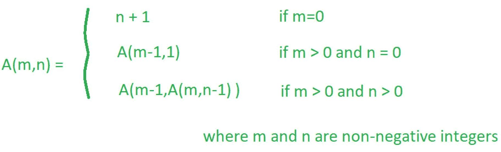
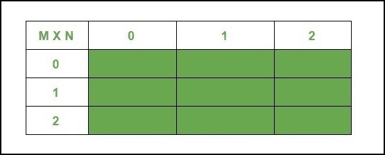
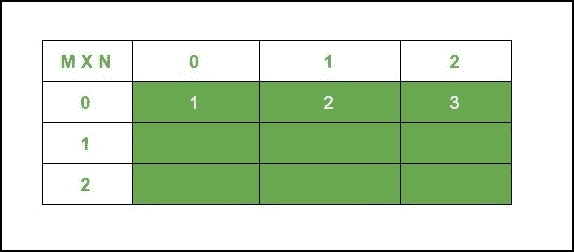
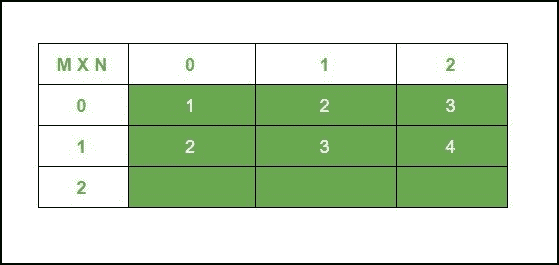
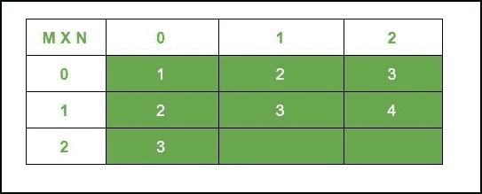
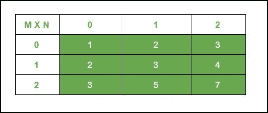

# 使用动态编程的阿克曼函数

> 原文:[https://www . geesforgeks . org/ackermanns-function-use-dynamic-programming/](https://www.geeksforgeeks.org/ackermanns-function-using-dynamic-programming/)

给定两个非零整数 **M** 和 **N** ，问题是根据一些特定的方程计算[阿克曼函数](https://www.geeksforgeeks.org/ackermann-function/)的结果。

> 阿克曼函数定义为:
> [](https://media.geeksforgeeks.org/wp-content/uploads/20200219173155/Capture551.png)

**示例:**

> **输入:** M = 2，N = 2
> T3】输出: 7
> 
> **输入:** M = 2，N = 7
> T3】输出: 6141004759

本文中描述的阿克曼函数的方法花费了大量的时间来计算(M，N)的小值，或者在大多数情况下不会产生任何结果。

**动态规划方法:**

下面是阿克曼方程，这些方程将被用来得出有效的解。

> **A(m，n) = A(m-1，A(m，n-1))*****—(Eq 1)***
> 
> **A(0，n)= n+1*****—(Eq 2)***
> 
> **A(m，0) = A(m-1，1)*****—(Eq 3)***

我们假设 m = **2** 和 n =**2**T5 的值

创建一个 2d DP 大小的表(**(m+1)****×****(n+1)**)来存储每个子问题的结果。

以下是填充表格的演示步骤。

1.  **空表–初始步骤**
    [](https://media.geeksforgeeks.org/wp-content/uploads/20200515212033/1589557291.jpg)
2.  **使用 A ( 0，n ) = n + 1**
    填充接下来的方法是借助**方程-2** 填充所有的基础值。

    [](https://media.geeksforgeeks.org/wp-content/uploads/20200515212056/1589557316.jpg)

3.  在下一步中，整个第一行将被填充，

    *   > A (1,0) = A (0,1) ***-(Refer to equation (3)***
        > Since A (0,1) = 2
        > , **A (1,0)**

    *   > a (1,1) = a (0, a (1,0)) ***-refer to equation (1)***
        > = a (0, 2) ***-refer to equation (4)***
        > = 3 ***-refer to equation (2)***
        > So, **a (1,1) =**

    *   > a (1,2) = a (0,a (1,1)) ***-refer to equation (1)***
        > = a (0, 3) ***-refer to equation (5)***
        > = 4 ***-refer to equation (2)***
        > So, **a (1,2) = 4 [**

4.  **Fill the table using equations and stored values**

    [](https://media.geeksforgeeks.org/wp-content/uploads/20200515212100/1589557771.jpg)

    让我们用和上面相同的方式填充最后一行**的第一列，即(2，0)** ，因为对于另外两列有一些未解决的值。

    > A ( 2，0 ) = A ( 1，1)***——参考方程(3)***
    > A ( 1，1 ) = 3
    > 所以， **A ( 2，0 ) = 3** ***—(等式。7)***

    [](https://media.geeksforgeeks.org/wp-content/uploads/20200515212057/1589557362.jpg)

5.  **求解为 **A ( 2，1 )** 和 **A ( 2，2)。****

    为简单起见，求解上述函数的过程分为两个步骤，

    *   In the first one, the problem is identified.

        > A ( 2，1 ) = A ( 1，A ( 2，0))***–参考等式(1)***
        > A ( 2，0 ) = 3
        > **A ( 2，1 )** = A ( 1，3)
        > 
        > 所以要计算这个值，再次使用 ***方程(1)***
        > A ( 1，3 ) = A ( 0，A ( 1，2 ) )
        > A ( 1，2 ) = 4
        > A ( 1，3 ) = A ( 0，4)***——参考方程(2)***
        > = 5
        > 
        > 因此 **A ( 2，1 ) = A ( 1，3 ) = 5** ***— (Eq 7)***

        [](https://media.geeksforgeeks.org/wp-content/uploads/20200515212058/1589557377.jpg)

    *   In the next one, methodology is described in detail and a **generic** formula is obtained to be logical while being used in program

        先来解 **A ( 2，2 )** ，前面有个理论

        > **A ( 2，2 )** = A ( 1，A ( 2，1))***——参考等式(1)***
        > A ( 2，1) = 5
        > **A ( 2，2 )** = A ( 1，5)

        以通用方式计算 **A(1，5)** ，观察它是如何减少自身的！

        > A ( 1，5 ) = A ( 0，A ( 1，4 ) )
        > A ( 1，4 ) = A( 0，A ( 1，3 ) )
        > A ( 1，3 ) = A ( 0，A ( 1，2 ) )
        > A ( 1，2 ) = 4
        > 
        > 从我们得到的函数返回，
        > A ( 1，3 ) = A ( 0，4)= 5***——参考方程(2)***
        > A ( 1，4 ) = A ( 0，A ( 1，3 ) ) = A ( 0，5)= 6***——自 A ( 1，3 ) = 5***
        > A ( 1，5 ) = A ( 0，A (1， 4 ) ) = A ( 0，6 ) = 7
        > 所以， **A ( 2，2)= 7*****—-(等式 9)***

**要点:**

> **(n =列号，c: (** 任意号 **> n)，r:行号】**
> 
> 1。 **A ( 1，c ) = A ( 1，n)+(c–n)**从以上观察
> 
> 2。 **A ( r，c ) = A ( r，n)+(c–n)* r**基于手迹

8.  **最终表格，包含每个子问题的结果**
    [](https://media.geeksforgeeks.org/wp-content/uploads/20200515212059/1589557396.jpg)

下面是上述方法的实现:

## 蟒蛇 3

```
# Python code for the above approach

# Bottom Up Approach
def Ackermann(m, n):

    # creating 2D LIST
    cache = [[0 for i in range(n + 1)] for j in range(m + 1)]
    for rows in range(m + 1):
        for cols in range(n + 1):
            # base case A ( 0, n ) = n + 1
            if rows == 0:       
                cache[rows][cols] = cols + 1
            # base case  A ( m, 0 ) = 
            # A ( m-1, 1) [Computed already]
            elif cols == 0:
                cache[rows][cols] = cache[rows-1][1]
            else:
                # if rows and cols > 0
                # then applying A ( m, n ) = 
                # A ( m-1, A ( m, n-1 ) ) 
                r = rows - 1
                c = cache[rows][cols-1]
                # applying equation (2) 
                # here A ( 0, n ) = n + 1
                if r == 0:    
                    ans = c + 1
                elif c <= n:
                    # using stored value in cache
                    ans = cache[rows-1][cache[rows][cols-1]]
                else:
                    # Using the Derived Formula 
                    # to compute mystery values in O(1) time
                    ans = (c-n)*(r) + cache[r][n]

                cache[rows][cols] = ans

    return cache[m][n]

# very small values
m = 2     
n = 2

# a bit higher value
m1 = 5      
n1 = 7

print("Ackermann value for m = ", m,
      " and n = ", n, "is -> ", 
      Ackermann(m, n))

print("Ackermann value for m = ", m1, 
      " and n = ", n1, "is -> ", 
      Ackermann(m1, n1))
```

**Output:**

> m = 2 和 n = 2 的阿克曼值是-> 7
> m = 5 和 n = 7 的阿克曼值是- > 6141004759

***时间复杂度:** O( M * N )
**辅助空间复杂度:** O( M * N )*