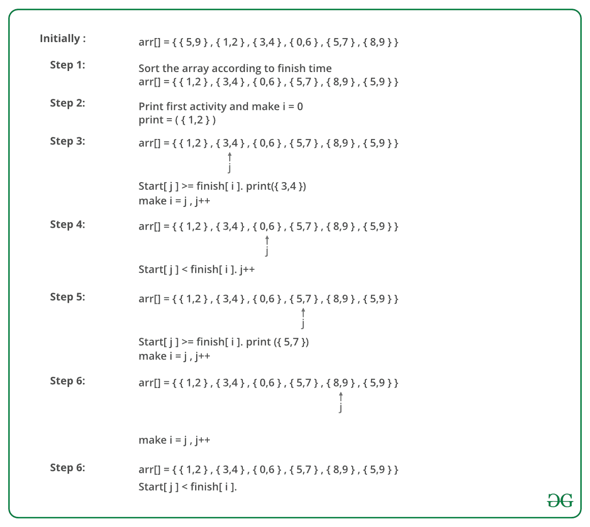

# 活动选择问题|贪婪算法-1

> 原文:[https://www . geesforgeks . org/activity-selection-problem-greedy-algo-1/](https://www.geeksforgeeks.org/activity-selection-problem-greedy-algo-1/)

贪婪是一种算法范式，它一点一点地建立解决方案，总是选择下一个能带来最明显和最直接好处的方案。贪婪算法用于优化问题。一个优化问题，如果问题具有以下性质，可以用 Greedy 来求解:*在每一步，我们都可以做出一个此刻看起来最好的选择，就得到完整问题的最优解*。
如果一个贪婪算法可以解决一个问题，那么它通常会成为解决这个问题的最佳方法，因为贪婪算法通常比动态规划等其他技术更有效。但是贪婪算法不能总是被应用。例如[分数背包](https://www.geeksforgeeks.org/fractional-knapsack-problem/)问题可以用贪婪解决，但是 [0-1 背包](https://www.geeksforgeeks.org/0-1-knapsack-problem-dp-10/)不能用贪婪解决。
以下是一些标准的贪婪算法。
**1)**[**Kruskal 的最小生成树(MST)**](https://www.geeksforgeeks.org/greedy-algorithms-set-2-kruskals-minimum-spanning-tree-mst/) **:** 在 Kruskal 的算法中，我们通过逐个拾取边来创建一个 MST。贪婪选择是选择最小的权重边，它不会导致到目前为止构造的 MST 中的循环。
**2)** [**Prim 的最小生成树**](https://www.geeksforgeeks.org/prims-algorithm-using-priority_queue-stl/) **:** 同样在 Prim 的算法中，我们通过逐个拾取边来创建一个 MST。我们维护两个集合:已经包含在 MST 中的顶点集合和尚未包含的顶点集合。贪婪选择是选择连接两个集合的最小权重边。
**3)**[**Dijkstra 的最短路径**](https://www.geeksforgeeks.org/greedy-algorithms-set-6-dijkstras-shortest-path-algorithm/) **:** Dijkstra 的算法与 Prim 的算法非常相似。最短路径树是边对边地建立起来的。我们维护两个集合:已经包含在树中的一组顶点和尚未包含的一组顶点。贪婪选择是选择连接两个集合的边，并且在从源到包含尚未包含的顶点的集合的最小权重路径上。
**4)** [**霍夫曼编码**](https://www.geeksforgeeks.org/greedy-algorithms-set-3-huffman-coding/)T42:霍夫曼编码是一种无损压缩技术。它将可变长度的位代码分配给不同的字符。贪婪选择是给最频繁的字符分配最少的位长代码。
贪婪算法有时也用于获得硬优化问题的近似值。比如[旅行推销员问题](https://www.geeksforgeeks.org/travelling-salesman-problem-set-1/)就是一个 NP-Hard 问题。这个问题的贪婪选择是在每一步从当前城市中选择最近的未访问城市。这些解并不总是产生最佳的最优解，但可以用来获得近似最优解。
让我们考虑[活动选择问题](http://en.wikipedia.org/wiki/Activity_selection_problem)作为贪婪算法的第一个例子。以下是问题陈述。
*给你 n 个活动及其开始和结束时间。假设一个人一次只能从事一项活动，请选择一个人可以从事的最大活动数量。*

示例:

```
Example 1 : Consider the following 3 activities sorted by
by finish time.
     start[]  =  {10, 12, 20};
     finish[] =  {20, 25, 30};
A person can perform at most two activities. The 
maximum set of activities that can be executed 
is {0, 2} [ These are indexes in start[] and 
finish[] ]

Example 2 : Consider the following 6 activities 
sorted by by finish time.
     start[]  =  {1, 3, 0, 5, 8, 5};
     finish[] =  {2, 4, 6, 7, 9, 9};
A person can perform at most four activities. The 
maximum set of activities that can be executed 
is {0, 1, 3, 4} [ These are indexes in start[] and 
finish[] ]
```

贪婪的选择是总是选择下一个活动，它的完成时间是剩余活动中最少的，并且开始时间大于或等于先前选择的活动的完成时间。我们可以根据活动的完成时间对其进行排序，以便我们总是将下一个活动视为最小完成时间活动。
1)根据活动的完成时间对活动进行排序
2)从排序后的数组中选择第一个活动并打印出来。
3)对排序数组中的剩余活动执行以下操作。
……。a)如果此活动的开始时间大于或等于先前选择的活动的结束时间，则选择此活动并打印它。
在下面的 C 实现中，假设活动已经根据其完成时间进行了排序。

## C++

```
// C++ program for activity selection problem.
// The following implementation assumes that the activities
// are already sorted according to their finish time
#include <bits/stdc++.h>
using namespace std;

// Prints a maximum set of activities that can be done by a single
// person, one at a time.
//  n   -->  Total number of activities
//  s[] -->  An array that contains start time of all activities
//  f[] -->  An array that contains finish time of all activities
void printMaxActivities(int s[], int f[], int n)
{
    int i, j;

    cout <<"Following activities are selected "<< endl;

    // The first activity always gets selected
    i = 0;
    cout <<" "<< i;

    // Consider rest of the activities
    for (j = 1; j < n; j++)
    {
      // If this activity has start time greater than or
      // equal to the finish time of previously selected
      // activity, then select it
      if (s[j] >= f[i])
      {
          cout <<" " << j;
          i = j;
      }
    }
}

// driver program to test above function
int main()
{
    int s[] =  {1, 3, 0, 5, 8, 5};
    int f[] =  {2, 4, 6, 7, 9, 9};
    int n = sizeof(s)/sizeof(s[0]);
    printMaxActivities(s, f, n);
    return 0;
}
//this code contributed by shivanisinghss2110
```

## C

```
// C program for activity selection problem.
// The following implementation assumes that the activities
// are already sorted according to their finish time
#include<stdio.h>

// Prints a maximum set of activities that can be done by a single
// person, one at a time.
//  n   -->  Total number of activities
//  s[] -->  An array that contains start time of all activities
//  f[] -->  An array that contains finish time of all activities
void printMaxActivities(int s[], int f[], int n)
{
    int i, j;

    printf ("Following activities are selected n");

    // The first activity always gets selected
    i = 0;
    printf("%d ", i);

    // Consider rest of the activities
    for (j = 1; j < n; j++)
    {
      // If this activity has start time greater than or
      // equal to the finish time of previously selected
      // activity, then select it
      if (s[j] >= f[i])
      {
          printf ("%d ", j);
          i = j;
      }
    }
}

// driver program to test above function
int main()
{
    int s[] =  {1, 3, 0, 5, 8, 5};
    int f[] =  {2, 4, 6, 7, 9, 9};
    int n = sizeof(s)/sizeof(s[0]);
    printMaxActivities(s, f, n);
    return 0;
}
```

## Java 语言(一种计算机语言，尤用于创建网站)

```
// The following implementation assumes that the activities
// are already sorted according to their finish time
import java.util.*;
import java.lang.*;
import java.io.*;

class ActivitySelection
{
    // Prints a maximum set of activities that can be done by a single
    // person, one at a time.
    //  n   -->  Total number of activities
    //  s[] -->  An array that contains start time of all activities
    //  f[] -->  An array that contains finish time of all activities
    public static void printMaxActivities(int s[], int f[], int n)
    {
    int i, j;

    System.out.print("Following activities are selected : n");

    // The first activity always gets selected
    i = 0;
    System.out.print(i+" ");

    // Consider rest of the activities
    for (j = 1; j < n; j++)
    {
         // If this activity has start time greater than or
         // equal to the finish time of previously selected
         // activity, then select it
         if (s[j] >= f[i])
         {
              System.out.print(j+" ");
              i = j;
          }
     }
    }

    // driver program to test above function
    public static void main(String[] args)
    {
    int s[] =  {1, 3, 0, 5, 8, 5};
    int f[] =  {2, 4, 6, 7, 9, 9};
    int n = s.length;

    printMaxActivities(s, f, n);
    }

}
```

## C#

```
// The following implementation assumes
// that the activities are already sorted
// according to their finish time
using System;

class GFG
{
// Prints a maximum set of activities
// that can be done by a single
// person, one at a time.
// n --> Total number of activities
// s[] --> An array that contains start
//         time of all activities
// f[] --> An array that contains finish
//         time of all activities
public static void printMaxActivities(int[] s,
                                      int[] f, int n)
{
int i, j;

Console.Write("Following activities are selected : ");

// The first activity always gets selected
i = 0;
Console.Write(i + " ");

// Consider rest of the activities
for (j = 1; j < n; j++)
{
    // If this activity has start time greater than or
    // equal to the finish time of previously selected
    // activity, then select it
    if (s[j] >= f[i])
    {
        Console.Write(j + " ");
        i = j;
    }
}
}

// Driver Code
public static void Main()
{
    int[] s = {1, 3, 0, 5, 8, 5};
    int[] f = {2, 4, 6, 7, 9, 9};
    int n = s.Length;

    printMaxActivities(s, f, n);
}
}

// This code is contributed
// by ChitraNayal
```

## 计算机编程语言

```
"""The following implementation assumes that the activities
are already sorted according to their finish time"""

"""Prints a maximum set of activities that can be done by a
single person, one at a time"""
# n --> Total number of activities
# s[]--> An array that contains start time of all activities
# f[] --> An array that contains finish time of all activities

def printMaxActivities(s , f ):
    n = len(f)
    print "The following activities are selected"

    # The first activity is always selected
    i = 0
    print i,

    # Consider rest of the activities
    for j in xrange(n):

        # If this activity has start time greater than
        # or equal to the finish time of previously
        # selected activity, then select it
        if s[j] >= f[i]:
            print j,
            i = j

# Driver program to test above function
s = [1 , 3 , 0 , 5 , 8 , 5]
f = [2 , 4 , 6 , 7 , 9 , 9]
printMaxActivities(s , f)

# This code is contributed by Nikhil Kumar Singh
```

## 服务器端编程语言（Professional Hypertext Preprocessor 的缩写）

```
<?php
// PHP program for activity selection problem.
// The following implementation assumes that
// the activities are already sorted according
// to their finish time

// Prints a maximum set of activities
// that can be done by a single
// person, one at a time.
// n --> Total number of activities
// s[] --> An array that contains start
//         time of all activities
// f[] --> An array that contains finish
//         time of all activities
function printMaxActivities($s, $f, $n)
{

    echo "Following activities are selected " . "\n";

    // The first activity always gets selected
    $i = 0;
    echo $i . " ";

    // Consider rest of the activities
    for ($j = 1; $j < $n; $j++)
    {

    // If this activity has start time greater
    // than or equal to the finish time of
    // previously selected activity, then select it
    if ($s[$j] >= $f[$i])
    {
        echo $j . " ";
        $i = $j;
    }
    }
}

// Driver Code
$s = array(1, 3, 0, 5, 8, 5);
$f = array(2, 4, 6, 7, 9, 9);
$n = sizeof($s);
printMaxActivities($s, $f, $n);

// This code is contributed
// by Akanksha Rai
?>
```

## java 描述语言

```
<script>
// The following implementation assumes that the activities
// are already sorted according to their finish time

    // Prints a maximum set of activities that can be done by a single
    // person, one at a time.
    //  n   -->  Total number of activities
    //  s[] -->  An array that contains start time of all activities
    //  f[] -->  An array that contains finish time of all activities
    function printMaxActivities(s,f,n)
    {
        let i, j;
        document.write("Following activities are selected : n");

        // The first activity always gets selected
        i = 0;
        document.write(i+" ");

        // Consider rest of the activities
        for (j = 1; j < n; j++)
        {

             // If this activity has start time greater than or
             // equal to the finish time of previously selected
             // activity, then select it
             if (s[j] >= f[i])
             {
                  document.write(j+" ");
                  i = j;
              }
        }
    }

    // Driver program to test above function
    let s = [1, 3, 0, 5, 8, 5]
    let f = [2, 4, 6, 7, 9, 9]
    let n = s.length;
    printMaxActivities(s, f, n);

    // This code is contributed by avanitrachhadiya2155
</script>
```

**Output**

```
Following activities are selected n0 1 3 4 
```

**对于按照完成时间排序的活动，贪婪选择是如何工作的？**
让给定的一组活动为 S = {1，2，3，…n}，活动按完成时间排序。贪婪的选择是总是选择活动 1。为什么活动 1 总是提供最佳解决方案之一。我们可以通过证明，如果有另一个解 B 的第一个活动不是 1，那么也有一个解 A 的大小相同，活动 1 作为第一个活动。假设 B 选择的第一个活动是 k，那么总是存在 A = { B –{ k } } U { 1 }。

(注意 B 中的活动是独立的，k 在所有活动中完成时间最小。因为 k 不是 1，所以 finish(k) >= finish(1))。

**给定活动未排序时如何执行？**
我们为活动创建一个结构/类。我们按照完成时间对所有活动进行排序(参考 C++ STL 中的[排序](https://www.geeksforgeeks.org/sort-c-stl/))。一旦我们对活动进行了排序，我们就应用相同的算法。
下图是上述方法的示例:



下面是上述方法的实现:

## C++

```
// C++ program for activity selection problem
// when input activities may not be sorted.
#include <bits/stdc++.h>
using namespace std;

// A job has a start time, finish time and profit.
struct Activitiy
{
    int start, finish;
};

// A utility function that is used for sorting
// activities according to finish time
bool activityCompare(Activitiy s1, Activitiy s2)
{
    return (s1.finish < s2.finish);
}

// Returns count of the maximum set of activities that can
// be done by a single person, one at a time.
void printMaxActivities(Activitiy arr[], int n)
{
    // Sort jobs according to finish time
    sort(arr, arr+n, activityCompare);

    cout << "Following activities are selected n";

    // The first activity always gets selected
    int i = 0;
    cout << "(" << arr[i].start << ", " << arr[i].finish << "), ";

    // Consider rest of the activities
    for (int j = 1; j < n; j++)
    {
      // If this activity has start time greater than or
      // equal to the finish time of previously selected
      // activity, then select it
      if (arr[j].start >= arr[i].finish)
      {
          cout << "(" << arr[j].start << ", "
              << arr[j].finish << "), ";
          i = j;
      }
    }
}

// Driver program
int main()
{
    Activitiy arr[] = {{5, 9}, {1, 2}, {3, 4}, {0, 6},
                                       {5, 7}, {8, 9}};
    int n = sizeof(arr)/sizeof(arr[0]);
    printMaxActivities(arr, n);
    return 0;
}
```

## Java 语言(一种计算机语言，尤用于创建网站)

```
// Java program for activity selection problem
// when input activities may not be sorted.
import java.io.*;
import java.util.*;

// A job has a start time, finish time and profit.
class Activity
{
  int start, finish;

  // Constructor
  public Activity(int start, int finish)
  {
    this.start = start;
    this.finish = finish;
  }
}

// class to define user defined comparator
class Compare
{

  // A utility function that is used for sorting
  // activities according to finish time
  static void compare(Activity arr[], int n)
  {
    Arrays.sort(arr, new Comparator<Activity>()
                {
                  @Override
                  public int compare(Activity s1, Activity s2)
                  {
                    return s1.finish - s2.finish;
                  }
                });
  }
}

// Driver class
class GFG {

  // Returns count of the maximum set of activities that
  // can
  // be done by a single person, one at a time.
  static void printMaxActivities(Activity arr[], int n)
  {
    // Sort jobs according to finish time
    Compare obj = new Compare();
    obj.compare(arr, n);
    System.out.println(
      "Following activities are selected :");

    // The first activity always gets selected
    int i = 0;
    System.out.print("(" + arr[i].start + ", "
                     + arr[i].finish + "), ");

    // Consider rest of the activities
    for (int j = 1; j < n; j++)
    {

      // If this activity has start time greater than
      // or equal to the finish time of previously
      // selected activity, then select it
      if (arr[j].start >= arr[i].finish)
      {
        System.out.print("(" + arr[j].start + ", "
                         + arr[j].finish + "), ");
        i = j;
      }
    }
  }

  // Driver code
  public static void main(String[] args)
  {

    int n = 6;
    Activity arr[] = new Activity[n];
    arr[0] = new Activity(5, 9);
    arr[1] = new Activity(1, 2);
    arr[2] = new Activity(3, 4);
    arr[3] = new Activity(0, 6);
    arr[4] = new Activity(5, 7);
    arr[5] = new Activity(8, 9);

    printMaxActivities(arr, n);
  }
}

// This code is contributed by Dharanendra L V.
```

## 蟒蛇 3

```
''' Python program for activity selection problem
 when input activities may not be sorted.'''
def MaxActivities(arr, n):
    selected = []

    # Sort jobs according to finish time
    Activity.sort(key = lambda x : x[1])

    # The first activity always gets selected
    i = 0
    selected.append(arr[i])

    for j in range(1, n):

      '''If this activity has start time greater than or
         equal to the finish time of previously selected
         activity, then select it'''
      if arr[j][0] >= arr[i][1]:
          selected.append(arr[j])
          i = j
    return selected

# Driver code
Activity = [[5, 9], [1, 2], [3, 4], [0, 6],[5, 7], [8, 9]]
n = len(Activity)
selected = MaxActivities(Activity, n)
print("Following activities are selected :")
print(selected)

# This cde is contributed by kshitijjainm
```

## java 描述语言

```
<script>
/* JavaScript program for activity selection problem
 when input activities may not be sorted.*/
function MaxActivities(arr, n){
    let selected = [];

    // Sort jobs according to finish time
       Activity = Activity.sort(function(a,b) {
    return a[1] - b[1];
    });

    // The first activity always gets selected
    let i = 0
    selected.push(arr[i]);

    for(let j=1;j<n;j++){
      /*If this activity has start time greater than or
         equal to the finish time of previously selected
         activity, then select it*/
      if( arr[j][0] >= arr[i][1]){
          selected.push(arr[j]);
          i = j;
      }
    }
    return selected;
}
// Driver code
Activity = [[5, 9], [1, 2], [3, 4], [0, 6],[5, 7], [8, 9]];
n = Activity.length;
selected = MaxActivities(Activity, n);
document.write("Following activities are selected : <br>")
console.log(selected)
for(let i = 0;i<selected.length;i++)
    document.write("("+selected[i]+"), ")
</script>
```

**输出:**

```
Following activities are selected 
(1, 2), (3, 4), (5, 7), (8, 9),
```

**时间复杂度:**如果输入活动可能没有排序，需要 O(n log n)时间。当给定输入活动总是被排序时，需要花费 O(n)个时间。
**使用 STL 我们可以如下解决:**

## 卡片打印处理机（Card Print Processor 的缩写）

```
// C++ program for activity selection problem
// when input activities may not be sorted.
#include <bits/stdc++.h>
using namespace std;

void SelectActivities(vector<int>s,vector<int>f){
// Vector to store results.
    vector<pair<int,int>>ans;

// Minimum Priority Queue to sort activities in ascending order of finishing time (f[i]).

    priority_queue<pair<int,int>,vector<pair<int,int>>,greater<pair<int,int>>>p;

    for(int i=0;i<s.size();i++){
        // Pushing elements in priority queue where the key is f[i]
        p.push(make_pair(f[i],s[i]));
    }

    auto it = p.top();
    int start = it.second;
    int end = it.first;
    p.pop();
    ans.push_back(make_pair(start,end));

    while(!p.empty()){
        auto itr = p.top();
        p.pop();
        if(itr.second >= end){
            start = itr.second;
            end = itr.first;
            ans.push_back(make_pair(start,end));
        }
    }
    cout << "Following Activities should be selected. " << endl << endl;

    for(auto itr=ans.begin();itr!=ans.end();itr++){
        cout << "Activity started at: " << (*itr).first << " and ends at  " << (*itr).second << endl;
    }
}

// Driver program
int main()
{
    vector<int>s = {1, 3, 0, 5, 8, 5};
    vector<int>f = {2, 4, 6, 7, 9, 9};
    SelectActivities(s,f);

    return 0;
}
```

## Java 语言(一种计算机语言，尤用于创建网站)

```
// java program for the above approach
import java.io.*;
import java.lang.*;
import java.util.*;

class GFG {

  // Pair class
  static class Pair {

    int first;
    int second;

    Pair(int first, int second)
    {
      this.first = first;
      this.second = second;
    }
  }

  static void SelectActivities(int s[], int f[])
  {

    // Vector to store results.
    ArrayList<Pair> ans = new ArrayList<>();

    // Minimum Priority Queue to sort activities in
    // ascending order of finishing time (f[i]).
    PriorityQueue<Pair> p = new PriorityQueue<>(
      (p1, p2) -> p1.first - p2.first);

    for (int i = 0; i < s.length; i++) {
      // Pushing elements in priority queue where the
      // key is f[i]
      p.add(new Pair(f[i], s[i]));
    }

    Pair it = p.poll();
    int start = it.second;
    int end = it.first;
    ans.add(new Pair(start, end));

    while (!p.isEmpty()) {
      Pair itr = p.poll();
      if (itr.second >= end) {
        start = itr.second;
        end = itr.first;
        ans.add(new Pair(start, end));
      }
    }
    System.out.println(
      "Following Activities should be selected. \n");

    for (Pair itr : ans) {
      System.out.println(
        "Activity started at: " + itr.first
        + " and ends at  " + itr.second);
    }
  }

  // Driver Code
  public static void main(String[] args)
  {

    int s[] = { 1, 3, 0, 5, 8, 5 };
    int f[] = { 2, 4, 6, 7, 9, 9 };

    // Function call
    SelectActivities(s, f);
  }
}

// This code is contributed by Kingash.
```

## java 描述语言

```
<script>
// javascript program for the above approach

 // Pair class
class Pair
{
    constructor(first,second)
    {
        this.first = first;
          this.second = second;
    }
}

function SelectActivities(s,f)
{
    // Vector to store results.
    let ans = [];

    // Minimum Priority Queue to sort activities in
    // ascending order of finishing time (f[i]).
    let p = [];

    for (let i = 0; i < s.length; i++) {
      // Pushing elements in priority queue where the
      // key is f[i]
      p.push(new Pair(f[i], s[i]));
    }
    p.sort(function(a,b){return a.first-b.first;});

    let it = p.shift();
    let start = it.second;
    let end = it.first;
    ans.push(new Pair(start, end));

    while (p.length!=0) {
      let itr = p.shift();
      if (itr.second >= end) {
        start = itr.second;
        end = itr.first;
        ans.push(new Pair(start, end));
      }
    }
    document.write(
      "Following Activities should be selected. <br>");

    for(let itr of ans.values()) {
      document.write(
        "Activity started at: " + itr.first
        + " and ends at  " + itr.second+"<br>");
    }
}

// Driver Code
let s=[1, 3, 0, 5, 8, 5 ];
let f=[2, 4, 6, 7, 9, 9 ];
// Function call
SelectActivities(s, f);

// This code is contributed by rag2127
</script>
```

**Output**

```
Following Activities should be selected. 

Activity started at: 1 and ends at  2
Activity started at: 3 and ends at  4
Activity started at: 5 and ends at  7
Activity started at: 8 and ends at  9
```