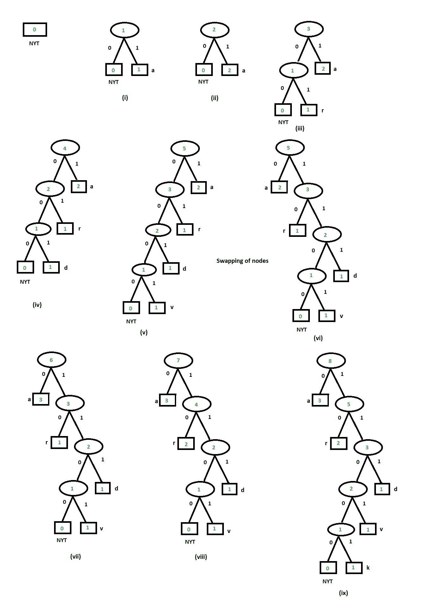

# 自适应霍夫曼编码和解码

> 原文:[https://www . geesforgeks . org/adaptive-Huffman-编解码/](https://www.geeksforgeeks.org/adaptive-huffman-coding-and-decoding/)

**先决条件:** [霍夫曼编码](https://www.geeksforgeeks.org/huffman-coding-greedy-algo-3/)[霍夫曼解码](https://www.geeksforgeeks.org/huffman-decoding/)
自适应霍夫曼编码也称为动态霍夫曼编码。使用维特尔算法实现。

**<u>编码</u>**

包含字母的字符串的自适应霍夫曼编码:
设 m 为字母总数。所以 m = 26。
对于维特算法，找到一个参数 e & r，这样

```
m = 2e + r and 0 ≤ r ≤ 2e
Therefore, for m = 26 we get e = 4 & r = 10
```

有两种代码 NYT 代码和固定代码。

```
NYT code = Traversing tree from the root node to that particular NYT node.
```

对于固定码，可以从以下两个条件计算:

1.  如果 0 ≤ k ≤ 2r，则字母 Sk 被编码为(e+1)位中(k-1)的二进制表示。(其中 k 是字母表在排序顺序中的位置)
2.  否则，字母 Sk 被编码为 e 位中(k-r-1)的二进制表示。

**树木更新**
维特尔算法中的树木更新遵循隐式编号。在隐式编号中，

*   节点按递增顺序编号，即从左到右逐级编号
*   具有相同权重和类型的节点一起形成一个块
*   块通过它们的权重的递增顺序相互关联
*   内部节点由椭圆形表示。内部节点的权重=子节点权重之和
*   外部节点由正方形表示。外部节点的权重=最初为 1，如果重复，则权重增加 1

**树木更新步骤:**

1.  用 NYT 节点初始化树
2.  对于第一次被识别的符号，初始 NYT 节点被进一步划分为 NYT 节点，并且新节点被初始化为该符号并且权重= 1。
3.  将子节点权重的总和分配给父节点
4.  如果遇到重复的符号，将对该符号更新权重。

**注意:**在树中更新期间，如果左子树的权重大于右子树，则必须交换节点。

**例**T2】

```
code = "aardvark"
The final Code we get is:
00000 1 010001 0000011 0001011 0 10  110001010
  a   a   r      d        v    a  r     k
```



**说明:**
对于字符串代码=“土豚”，e = 5，r = 10
如上图所示，树是用权重为 0 的 NYT 节点初始化的。

1.  对于符号“a”，k = 1。

```
NYT Code = "" (initially tree is empty)
```

1.  对于固定代码:作为 k < 2r i.e, 1 < 2*10, satisfy condition (1) 
    所以固定代码是(k-1) = 0 的二进制表示作为 5 位表示

```
Fixed Code = "00000"
```

```
Huffman Code for symbol for 'a' is "00000"
```

2.  对于树中已经存在的符号“a”。遍历树直到符号‘a’，我们得到代码=“1”

```
Huffman Code for symbol for 'a' is "1"
```

1.  对于符号“r”，k = 18。

```
NYT Code = "0" (traversing up to NYT Node)
```

1.  对于固定代码:当 k > 2r，即 18 > 2*10 时，满足条件(2)
    所以固定代码是(k-1 = 17)的二进制表示，作为 5 位表示

```
Fixed Code = "10001"
```

```
Huffman Code for symbol for 'r' is "010001"
```

1.  对于符号“d”，k = 4。

```
NYT Code = "000" (traversing up to NYT Node)
```

1.  对于固定代码:作为 k < 2r i.e, 4 < 2*10, satisfy condition (1) 
    所以固定代码是(k-1 = 3)的二进制表示，作为 5 位表示

```
Fixed Code = "00011"
```

```
Huffman Code = "00000011"
```

1.  对于符号“v”，k = 22。

```
NYT Code = "000" (traversing up to NYT Node)
```

1.  对于固定码:当 k > 2r，即 22 > 2*10 时，满足条件(2)
    所以固定码是(k-r-1 = 11)的二进制表示，作为 4 位表示

```
Fixed Code = "1011"
```

```
Huffman Code = "0001011"
```

1.  交换左子树和右子树的节点，因为树违反了属性
2.  对于树中已经存在的符号“a”。遍历树直到符号‘a’，我们得到代码=“0”

```
Huffman Code for symbol for 'a' is "0"
```

1.  对于树中已经存在的符号“r”。遍历树直到符号‘a’，我们得到代码=“10”

```
Huffman Code for symbol for 'r' is "10"
```

1.  对于符号“k”，k = 11。

```
NYT Code = "1100" (traversing up to NYT Node)
```

1.  对于固定代码:作为 k < 2r i.e, 11 < 2*10, satisfy condition (1) 
    所以固定代码是(k-1 = 10)的二进制表示，作为 5 位表示

```
Fixed Code = "01010"
```

```
Huffman Code for symbol for 'r' is "110001010"
```

**<u>解码</u>**

**解码步骤:**

1.  读取二进制字符串
2.  如果遇到叶节点是 NYT
    *   读取下一个 e 位
        1.  如果 e 位值< r，那么要获得所需的符号，请将(e+1)位转换为(e+1)位+1 的十进制值
        2.  如果 e 位值> r，那么为了获得所需的符号，将 e 位转换为 e 位+ r + 1 的十进制值

**例:**

```
code = "00000101000100000110001011010110001010"
We get final decoded code as
 00000  1   0    10001  00   00011  000  1011  0  10  1100  01010
   a    a  NYT     r    NYT    d    NYT   v    a   r   NYT    k
```

**说明:**

*   从读取前 e 位开始解码。所以前 4 位是 0000，转换成十进制= 0。
    现在值 0 < r，即 0 < 10 满足条件(1)。
    现在根据条件(1)，先把 e+1 = 5 位转换成十进制，再加 1。

```
00000 = 0
0 + 1 = 1, which is value for alphabet a.
```

*   更新树，并在树中为符号“a”添加一个节点
*   读取给定代码中的下一位并遍历树。我们到达外部叶节点“a”。所以下一个解码符号是“a”。
*   读取给定代码的下一组位并遍历树。我们有 0 作为 NYT 节点。到达 NYT 节点后，读取 1000 位。将 1000 转换为十进制是 8。如 8 < r satisfy condition (1). 
    现在将 e+1 位转换为十进制并加 1。

```
10001 = 17
17 + 1 = 18, which is value for alphabet r.
```

*   更新树，并在树中为符号“r”添加一个节点。
*   读取下一组位并遍历树，我们在 00 到达 NYT 节点。读取 0001 的 e 位。将 0001 转换为十进制是 1。如 1 < r satisfy condition (1). 
    现在将 e+1 位转换为十进制并加 1。

```
00011 = 3
3 + 1 = 4, which is value for alphabet d.
```

*   更新树，并在树中为符号“d”添加一个节点。
*   读取下一组位并遍历树，我们在 000 到达 NYT 节点。读取 e 位，即 1011。将 1011 转换为十进制是 11。As 11 > r 满足条件(2)。
    现在将 k+r+1 位转换为十进制并解码符号。

```
10110 = 22, which is value for alphabet v.
```

*   更新树，并在树中为符号“v”添加一个节点。
*   读取下一组位并遍历树，我们在 0 处得到符号“a”。更新树，并在树中为符号“a”添加一个节点。
*   读取下一组位并遍历树，我们在 10 处得到符号“r”。更新树，并在树中为符号“a”添加一个节点。
*   读取下一组位并遍历树，我们在 1100 到达 NYT 节点。读取 e 位，即 0101。将 0101 转换为十进制是 9。如 9 < r satisfy condition (1). 
    现在将 e+1 位转换为十进制，并加上 1。

```
01000 = 8, 
8 + 1 = 9\. which is value for alphabet k.
```

*   更新树，并在树中为符号“v”添加一个节点。