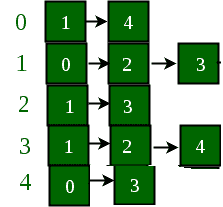

# 在图的相邻列表表示中添加和删除边

> 原文： [https://www.geeksforgeeks.org/add-and-remove-edge-in-adjacency-list-representation-of-a-graph/](https://www.geeksforgeeks.org/add-and-remove-edge-in-adjacency-list-representation-of-a-graph/)

**先决条件**：[图及其表示](https://www.geeksforgeeks.org/graph-and-its-representations/)

在本文中，以给定的邻接列表表示形式讨论了添加和删除边。

[向量](http://www.geeksforgeeks.org/vector-in-cpp-stl/)已用于使用邻接表表示实现图形。 它用于存储所有顶点的邻接列表。 顶点号用作此向量的索引。

**示例**：

> 下面是一个图形及其邻接列表表示：
>  
> 
> 如果必须删除`1`和`4`之间的边，则上图和邻接表将转换为：
>  

**方法**：想法是将图形表示为向量的数组，以使每个向量都代表顶点的邻接表。

*   **添加边**：添加边是通过将由该边连接的两个顶点插入彼此的列表中来完成的。 例如，如果必须在`(u, v)`之间添加边，则`u`将存储在`v`的向量列表和`v`存储在`u`的向量列表中。 （[`push_back`](https://www.geeksforgeeks.org/vectorpush_back-vectorpop_back-c-stl/)）

*   **删除边**：要删除`(u, v)`之间的边，将遍历`u`的邻接表，直到找到`v`从中删除。 对`v`执行相同的操作。（[`erase`](https://www.geeksforgeeks.org/vectorclear-vectorerase-c-stl/)）

下面是该方法的实现：

## C++

```cpp

// C++ implementation of the above approach 

#include <bits/stdc++.h> 
using namespace std; 

// A utility function to add an edge in an 
// undirected graph. 
void addEdge(vector<int> adj[], int u, int v) 
{ 
    adj[u].push_back(v); 
    adj[v].push_back(u); 
} 

// A utility function to delete an edge in an 
// undirected graph. 
void delEdge(vector<int> adj[], int u, int v) 
{ 
    // Traversing through the first vector list 
    // and removing the second element from it 
    for (int i = 0; i < adj[u].size(); i++) { 
        if (adj[u][i] == v) { 
            adj[u].erase(adj[u].begin() + i); 
            break; 
        } 
    } 

    // Traversing through the second vector list 
    // and removing the first element from it 
    for (int i = 0; i < adj[v].size(); i++) { 
        if (adj[v][i] == u) { 
            adj[v].erase(adj[v].begin() + i); 
            break; 
        } 
    } 
} 

// A utility function to print the adjacency list 
// representation of graph 
void printGraph(vector<int> adj[], int V) 
{ 
    for (int v = 0; v < V; ++v) { 
        cout << "vertex " << v << " "; 
        for (auto x : adj[v]) 
            cout << "-> " << x; 
        printf("\n"); 
    } 
    printf("\n"); 
} 

// Driver code 
int main() 
{ 
    int V = 5; 
    vector<int> adj[V]; 

    // Adding edge as shown in the example figure 
    addEdge(adj, 0, 1); 
    addEdge(adj, 0, 4); 
    addEdge(adj, 1, 2); 
    addEdge(adj, 1, 3); 
    addEdge(adj, 1, 4); 
    addEdge(adj, 2, 3); 
    addEdge(adj, 3, 4); 

    // Printing adjacency matrix 
    printGraph(adj, V); 

    // Deleting edge (1, 4) 
    // as shown in the example figure 
    delEdge(adj, 1, 4); 

    // Printing adjacency matrix 
    printGraph(adj, V); 

    return 0; 
} 

```