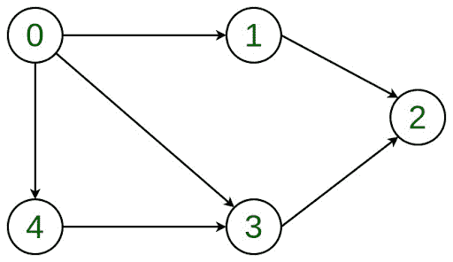
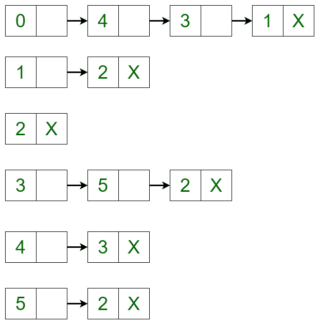

# 在图的邻接表表示中添加和移除顶点

> 原文:[https://www . geesforgeks . org/邻接表中添加和删除顶点-图形表示/](https://www.geeksforgeeks.org/add-and-remove-vertex-in-adjacency-list-representation-of-graph/)

**先决条件:** [链表](https://www.geeksforgeeks.org/data-structures/linked-list/)[图形数据结构](https://www.geeksforgeeks.org/graph-data-structure-and-algorithms/)

本文讨论了在给定的邻接表表示中添加和移除顶点。

让[有向图](https://www.geeksforgeeks.org/graph-data-structure-and-algorithms/)为:

[](https://media.geeksforgeeks.org/wp-content/uploads/20200205133335/Directed-Graph.jpg)

该图可以在邻接表中表示为:

[](https://media.geeksforgeeks.org/wp-content/uploads/20200205134219/Untitled-Diagram72.png)

这是一种[链表](https://www.geeksforgeeks.org/data-structures/linked-list/)表示，其中链表的头部是图中的一个顶点，所有连接的节点都是第一个顶点所连接的顶点。例如，从图中可以清楚地看到，顶点 **0** 连接到顶点 **4** 、 **3** 和 **1** 。同样的情况在邻接表(或链表)中表示。

**进场:**

*   **在图中添加顶点:**要在图中添加顶点，可以将邻接表迭代到需要插入的地方，并使用链表实现创建新节点。例如，如果需要在顶点 2 和顶点 3 之间添加 5，使得顶点 3 指向顶点 5，顶点 5 指向顶点 2，则在顶点 5 和顶点 3 之间创建一条新边，并从顶点 5 和顶点 2 创建一条新边。添加顶点后，邻接表变为:
    [](https://media.geeksforgeeks.org/wp-content/uploads/20200205134547/Untitled-Diagram-232.png)*   **Removing a Vertex in the Graph**: To delete a vertex in the graph, iterate through the list of each vertex if an edge is present or not. If the edge is present, then delete the vertex in the same way as delete is performed in a linked list. For example, the adjacency list translates to the below list if vertex 4 is deleted from the list:
    [](https://media.geeksforgeeks.org/wp-content/uploads/20200205134743/Untitled-Diagram-419.png)

    下面是上述方法的实现:

    ```
    # Python implementation of the above approach
    # Implementing Linked List representation
    class AdjNode(object):
        def __init__(self, data):
            self.vertex = data
            self.next = None

    # Adjacency List representation
    class AdjList(object):

        def __init__(self, vertices):
            self.v = vertices
            self.graph =[None]*self.v

    # Function to add an edge from a source vertex 
    # to a destination vertex
        def addedge(self, source, destination):
            node = AdjNode(destination)
            node.next = self.graph
            self.graph= node

    # Function to call the above function.
        def addvertex(self, vk, source, destination):
            graph.addedge(source, vk) 
            graph.addedge(vk, destination)

    # Function to print the graph
        def print_graph(self):
            for i in range(self.v):
                print(i, end ="")
                temp = self.graph[i]
                while temp:
                   print("->", temp.vertex, end ="")
                   temp = temp.next
                print("\n")

    # Function to delete a vertex
        def delvertex(self, k):

    # Iterating through all the vertices of the graph
            for i in range(self.v):
                temp = self.graph[i]
                if i == k:
                    while temp:
                        self.graph[i]= temp.next
                        temp = self.graph[i]

                # Delete the vertex 
                # using linked list concept        
                if temp:
                    if temp.vertex == k:
                        self.graph[i]= temp.next
                        temp = None
                while temp:
                    if temp.vertex == k:
                        break
                    prev = temp
                    temp = temp.next

                if temp == None:
                    continue

                prev.next = temp.next
                temp = None

    # Driver code
    if __name__ == "__main__":

        V = 6
        graph = AdjList(V) 
        graph.addedge(0, 1)
        graph.addedge(0, 3)
        graph.addedge(0, 4)
        graph.addedge(1, 2)
        graph.addedge(3, 2)
        graph.addedge(4, 3)

    print("Initial adjacency list")
    graph.print_graph() 

    # Add vertex
    graph.addvertex(5, 3, 2)
    print("Adjacency list after adding vertex")
    graph.print_graph() 

    # Delete vertex
    graph.delvertex(4)
    print("Adjacency list after deleting vertex")
    graph.print_graph()
    ```

    **Output:**

    ```
    Initial adjacency list
    0-> 4-> 3-> 1

    1-> 2

    2

    3-> 2

    4-> 3

    5

    Adjacency list after adding vertex
    0-> 4-> 3-> 1

    1-> 2

    2

    3-> 5-> 2

    4-> 3

    5-> 2

    Adjacency list after deleting vertex
    0-> 3-> 1

    1-> 2

    2

    3-> 5-> 2

    4

    5-> 2

    ```