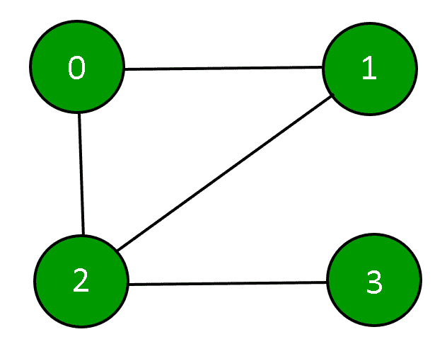
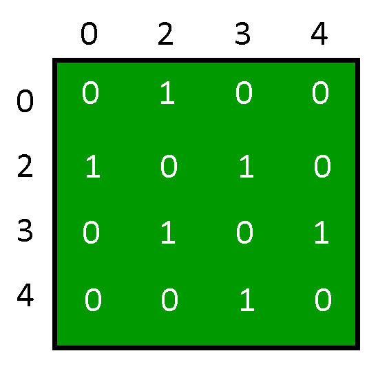
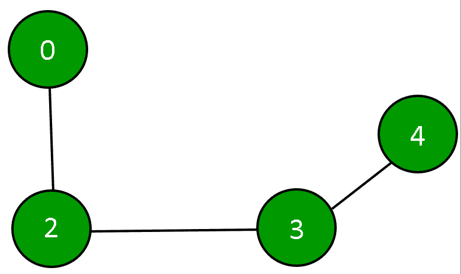

# 在图的邻接矩阵表示中添加和移除顶点

> 原文:[https://www . geesforgeks . org/添加和移除邻接矩阵中的顶点-图的表示/](https://www.geeksforgeeks.org/add-and-remove-vertex-in-adjacency-matrix-representation-of-graph/)

**图**是一组实体的表示，其中一些实体对通过连接链接在一起。互连的实体由称为顶点的点表示，顶点之间的连接称为边。形式上，图是一对集合(V，E)，其中 V 是顶点的集合，E 是连接一对顶点的边的集合。



图可以用**邻接矩阵来表示。**


**图的初始化:**邻接矩阵将使用 2D 数组来描述，构造函数将用于分配数组的大小，并且该数组的每个元素将被初始化为 0。显示图中每个顶点的度数为零。

## C++

```
class Graph {
private:
    // number of vertices
    int n;

    // adjacency matrix
    int g[10][10];

public:
    // constructor
    Graph(int x)
    {
        n = x;

        // initializing each element of the adjacency matrix to zero
        for (int i = 0; i < n; ++i) {
            for (int j = 0; j < n; ++j) {
                g[i][j] = 0;
            }
        }
    }
};
```

## Java 语言(一种计算机语言，尤用于创建网站)

```
class Graph {
    // number of vertices
    private int n;

    // adjacency matrix
    private int[][] g = new int[10][10];

    // constructor
    Graph(int x)
    {
        this.n = x;
        int i, j;

        // initializing each element of the adjacency matrix to zero
        for (i = 0; i < n; ++i) {
            for (j = 0; j < n; ++j) {
                g[i][j] = 0;
            }
        }
    }
}
```

## 蟒蛇 3

```
class Graph:
     # number of vertices
     __n = 0

     # adjacency matrix
     __g =[[0 for x in range(10)] for y in range(10)]

     # constructor
     def __init__(self, x):
        self.__n = x

        # initializing each element of the adjacency matrix to zero
        for i in range(0, self.__n):
            for j in range(0, self.__n):
                self.__g[i][j]= 0
```

## C#

```
class Graph{

// Number of vertices
private int n;

// Adjacency matrix
private int[,] g = new int[10, 10];

// Constructor
Graph(int x)
{
    this.n = x;
    int i, j;

    // Initializing each element of
    // the adjacency matrix to zero
    for(i = 0; i < n; ++i)
    {
        for(j = 0; j < n; ++j)
        {
            g[i, j] = 0;
        }
    }
}
}

// This code is contributed by ukasp
```

这里邻接矩阵是 g[n][n]，其中每个顶点的度为零。

**显示图形:**使用具有 n 个顶点的邻接矩阵 g[n][n]来描绘图形。显示 2D 阵列(邻接矩阵)，其中如果在两个顶点‘x’和‘y’之间存在边，则 g[x][y]为 1，否则为 0。

## C++

```
void displayAdjacencyMatrix()
{
    cout << "\n\n Adjacency Matrix:";

    // displaying the 2D array
    for (int i = 0; i < n; ++i) {
        cout << "\n";
        for (int j = 0; j < n; ++j) {
            cout << " " << g[i][j];
        }
    }
}
```

## Java 语言(一种计算机语言，尤用于创建网站)

```
public void displayAdjacencyMatrix()
{
    System.out.print("\n\n Adjacency Matrix:");

    // displaying the 2D array
    for (int i = 0; i < n; ++i) {
        System.out.println();
        for (int j = 0; j < n; ++j) {
            System.out.print(" " + g[i][j]);
        }
    }
}
```

## 蟒蛇 3

```
def displayAdjacencyMatrix(self):
        print("\n\n Adjacency Matrix:", end ="")

        # displaying the 2D array
        for i in range(0, self.__n):
            print()
            for j in range(0, self.__n):
                print("", self.__g[i][j], end ="")
```

上述方法是 Graph 类的一个公共成员函数，它使用邻接矩阵显示图形。

**在图中的顶点之间添加边:**要在两个现有顶点之间添加边，如顶点“x”和顶点“y”，则邻接矩阵的元素 g[x][y]和 g[y][x]将被指定为 1，表示在顶点“x”和顶点“y”之间有一条边。

## C++

```
void addEdge(int x, int y)
{

    // checks if the vertex exists in the graph
    if ((x >= n) || (y > n)) {
        cout << "Vertex does not exists!";
    }

    // checks if the vertex is connecting to itself
    if (x == y) {
        cout << "Same Vertex!";
    }
    else {
        // connecting the vertices
        g[y][x] = 1;
        g[x][y] = 1;
    }
}
```

## Java 语言(一种计算机语言，尤用于创建网站)

```
public void addEdge(int x, int y)
{
    // checks if the vertex exists in the graph
    if ((x >= n) || (y > n)) {
        System.out.println("Vertex does not exists!");
    }

    // checks if the vertex is connecting to itself
    if (x == y) {
        System.out.println("Same Vertex!");
    }
    else {
        // connecting the vertices
        g[y][x] = 1;
        g[x][y] = 1;
    }
}
```

## 蟒蛇 3

```
def addEdge(self, x, y):

        # checks if the vertex exists in the graph
        if(x>= self.__n) or (y >= self.__n):
            print("Vertex does not exists !")

        # checks if the vertex is connecting to itself
        if(x == y):
             print("Same Vertex !")
        else:

             # connecting the vertices
             self.__g[y][x]= 1
             self.__g[x][y]= 1
```

这里，上述方法是类图的公共成员函数，它连接图中任何两个现有的顶点。

**在图中添加一个顶点:**要在图中添加一个顶点，我们需要增加现有邻接矩阵的行和列，然后将与该顶点相关的新元素初始化为 0。(即添加的新顶点没有连接到任何其他顶点)

## C++

```
void addVertex()
{
    // increasing the number of vertices
    n++;
    int i;

    // initializing the new elements to 0
    for (i = 0; i < n; ++i) {
        g[i][n - 1] = 0;
        g[n - 1][i] = 0;
    }
}
```

## Java 语言(一种计算机语言，尤用于创建网站)

```
public void addVertex()
{
    // increasing the number of vertices
    n++;
    int i;

    // initializing the new elements to 0
    for (i = 0; i < n; ++i) {
        g[i][n - 1] = 0;
        g[n - 1][i] = 0;
    }
}
```

## 蟒蛇 3

```
def addVertex(self):

         # increasing the number of vertices
         self.__n = self.__n + 1;

         # initializing the new elements to 0
         for i in range(0, self.__n):
             self.__g[i][self.__n-1]= 0
             self.__g[self.__n-1][i]= 0
```

上述方法是 Graph 类的一个公共成员函数，它将顶点数增加 1，新顶点的度数为 0。

**移除图中的一个顶点:**要从图中移除一个顶点，我们需要检查该顶点是否存在于图中，如果该顶点存在，那么我们需要将邻接矩阵的行向左移动，将列向上移动，以便给定顶点的行和列值被下一个顶点的值替换，然后将顶点的数量减少 1。这样，该特定顶点将从邻接矩阵中移除。

## C++

```
void removeVertex(int x)
{
    // checking if the vertex is present
    if (x > n) {
        cout << "\nVertex not present!";
        return;
    }
    else {
        int i;

        // removing the vertex
        while (x < n) {
            // shifting the rows to left side
            for (i = 0; i < n; ++i) {
                g[i][x] = g[i][x + 1];
            }

            // shifting the columns upwards
            for (i = 0; i < n; ++i) {
                g[x][i] = g[x + 1][i];
            }
            x++;
        }

        // decreasing the number of vertices
        n--;
    }
}
```

## Java 语言(一种计算机语言，尤用于创建网站)

```
public void removeVertex(int x)
{
    // checking if the vertex is present
    if (x > n) {
        System.out.println("Vertex not present!");
        return;
    }
    else {
        int i;

        // removing the vertex
        while (x < n) {

            // shifting the rows to left side
            for (i = 0; i < n; ++i) {
                g[i][x] = g[i][x + 1];
            }

            // shifting the columns upwards
            for (i = 0; i < n; ++i) {
                g[x][i] = g[x + 1][i];
            }
            x++;
        }

        // decreasing the number of vertices
        n--;
    }
}
```

## 蟒蛇 3

```
def removeVertex(self, x):

        # checking if the vertex is present
        if(x>self.__n):
            print("Vertex not present !")
        else:

          # removing the vertex
          while(x<self.__n):

             # shifting the rows to left side
             for i in range(0, self.__n):
                  self.__g[i][x]= self.__g[i][x + 1]

             # shifting the columns upwards
             for i in range(0, self.__n):
                  self.__g[x][i]= self.__g[x + 1][i]
             x = x + 1

          # decreasing the number of vertices
          self.__n = self.__n - 1
```

上面的方法是 Graph 类的一个公共成员函数，它通过向左移动行和向上移动列，用下一个顶点替换该顶点的行和列值，然后将图中的顶点数减少 1，从而从图中移除现有的顶点。

**下面是一个完整的程序，在一个图形中使用了上述所有方法。**

## C++

```
// C++ program to add and remove Vertex in Adjacency Matrix

#include <iostream>

using namespace std;

class Graph {
private:
    // number of vertices
    int n;

    // adjacency matrix
    int g[10][10];

public:
    // constructor
    Graph(int x)
    {
        n = x;

        // initializing each element of the adjacency matrix to zero
        for (int i = 0; i < n; ++i) {
            for (int j = 0; j < n; ++j) {
                g[i][j] = 0;
            }
        }
    }

    void displayAdjacencyMatrix()
    {
        cout << "\n\n Adjacency Matrix:";

        // displaying the 2D array
        for (int i = 0; i < n; ++i) {
            cout << "\n";
            for (int j = 0; j < n; ++j) {
                cout << " " << g[i][j];
            }
        }
    }

    void addEdge(int x, int y)
    {

        // checks if the vertex exists in the graph
        if ((x >= n) || (y > n)) {
            cout << "Vertex does not exists!";
        }

        // checks if the vertex is connecting to itself
        if (x == y) {
            cout << "Same Vertex!";
        }
        else {
            // connecting the vertices
            g[y][x] = 1;
            g[x][y] = 1;
        }
    }

    void addVertex()
    {
        // increasing the number of vertices
        n++;
        int i;

        // initializing the new elements to 0
        for (i = 0; i < n; ++i) {
            g[i][n - 1] = 0;
            g[n - 1][i] = 0;
        }
    }

    void removeVertex(int x)
    {
        // checking if the vertex is present
        if (x > n) {
            cout << "\nVertex not present!";
            return;
        }
        else {
            int i;

            // removing the vertex
            while (x < n) {
                // shifting the rows to left side
                for (i = 0; i < n; ++i) {
                    g[i][x] = g[i][x + 1];
                }

                // shifting the columns upwards
                for (i = 0; i < n; ++i) {
                    g[x][i] = g[x + 1][i];
                }
                x++;
            }

            // decreasing the number of vertices
            n--;
        }
    }
};

int main()
{
    // creating objects of class Graph
    Graph obj(4);

    // calling methods
    obj.addEdge(0, 1);
    obj.addEdge(0, 2);
    obj.addEdge(1, 2);
    obj.addEdge(2, 3);
    // the adjacency matrix created
    obj.displayAdjacencyMatrix();

    // adding a vertex to the graph
    obj.addVertex();
    // connecting that vertex to other existing vertices
    obj.addEdge(4, 1);
    obj.addEdge(4, 3);
    // the adjacency matrix with a new vertex
    obj.displayAdjacencyMatrix();

    // removing an existing vertex in the graph
    obj.removeVertex(1);
    // the adjacency matrix after removing a vertex
    obj.displayAdjacencyMatrix();

    return 0;
}
```

## Java 语言(一种计算机语言，尤用于创建网站)

```
// Java program to add and remove Vertex in Adjacency Matrix
class Graph
{
    // number of vertices
    private int n;

    // adjacency matrix
    private int[][] g = new int[10][10];

    // constructor
    Graph(int x)
    {
        this.n = x;
        int i, j;

        // initializing each element of
        // the adjacency matrix to zero
        for (i = 0; i < n; ++i)
        {
            for (j = 0; j < n; ++j)
            {
                g[i][j] = 0;
            }
        }
    }

    public void displayAdjacencyMatrix()
    {
        System.out.print("\n\n Adjacency Matrix:");

        // displaying the 2D array
        for (int i = 0; i < n; ++i)
        {
            System.out.println();
            for (int j = 0; j < n; ++j)
            {
                System.out.print(" " + g[i][j]);
            }
        }
    }

    public void addEdge(int x, int y)
    {
        // checks if the vertex exists in the graph
        if ((x >= n) || (y > n))
        {
            System.out.println("Vertex does not exists!");
        }

        // checks if the vertex is connecting to itself
        if (x == y)
        {
            System.out.println("Same Vertex!");
        }
        else
        {
            // connecting the vertices
            g[y][x] = 1;
            g[x][y] = 1;
        }
    }

    public void addVertex()
    {
        // increasing the number of vertices
        n++;
        int i;

        // initializing the new elements to 0
        for (i = 0; i < n; ++i)
        {
            g[i][n - 1] = 0;
            g[n - 1][i] = 0;
        }
    }

    public void removeVertex(int x)
    {
        // checking if the vertex is present
        if (x > n)
        {
            System.out.println("Vertex not present!");
            return;
        }
        else
        {
            int i;

            // removing the vertex
            while (x < n)
            {

                // shifting the rows to left side
                for (i = 0; i < n; ++i)
                {
                    g[i][x] = g[i][x + 1];
                }

                // shifting the columns upwards
                for (i = 0; i < n; ++i)
                {
                    g[x][i] = g[x + 1][i];
                }
                x++;
            }

            // decreasing the number of vertices
            n--;
        }
    }
}

class Main
{
    public static void main(String[] args)
    {
        // creating objects of class Graph
        Graph obj = new Graph(4);

        // calling methods
        obj.addEdge(0, 1);
        obj.addEdge(0, 2);
        obj.addEdge(1, 2);
        obj.addEdge(2, 3);

        // the adjacency matrix created
        obj.displayAdjacencyMatrix();

        // adding a vertex to the graph
        obj.addVertex();

        // connecting that vertex to other existing vertices
        obj.addEdge(4, 1);
        obj.addEdge(4, 3);

        // the adjacency matrix with a new vertex
        obj.displayAdjacencyMatrix();

        // removing an existing vertex in the graph
        obj.removeVertex(1);

        // the adjacency matrix after removing a vertex
        obj.displayAdjacencyMatrix();
    }
}
```

## 蟒蛇 3

```
# Python program to add and remove Vertex in Adjacency Matrix

class Graph:
     # number of vertices
     __n = 0

     # adjacency matrix
     __g =[[0 for x in range(10)] for y in range(10)]

     # constructor
     def __init__(self, x):
        self.__n = x

        # initializing each element of the adjacency matrix to zero
        for i in range(0, self.__n):
            for j in range(0, self.__n):
                self.__g[i][j]= 0

     def displayAdjacencyMatrix(self):
        print("\n\n Adjacency Matrix:", end ="")

        # displaying the 2D array
        for i in range(0, self.__n):
            print()
            for j in range(0, self.__n):
                print("", self.__g[i][j], end ="")
     def addEdge(self, x, y):

        # checks if the vertex exists in the graph
        if(x>= self.__n) or (y >= self.__n):
            print("Vertex does not exists !")

        # checks if the vertex is connecting to itself
        if(x == y):
             print("Same Vertex !")
        else:

             # connecting the vertices
             self.__g[y][x]= 1
             self.__g[x][y]= 1     

     def addVertex(self):

         # increasing the number of vertices
         self.__n = self.__n + 1;

         # initializing the new elements to 0
         for i in range(0, self.__n):
             self.__g[i][self.__n-1]= 0
             self.__g[self.__n-1][i]= 0                 
     def removeVertex(self, x):

        # checking if the vertex is present
        if(x>self.__n):
             print("Vertex not present !")
        else:

             # removing the vertex
             while(x<self.__n):

                 # shifting the rows to left side
                 for i in range(0, self.__n):
                       self.__g[i][x]= self.__g[i][x + 1]

                 # shifting the columns upwards
                 for i in range(0, self.__n):
                       self.__g[x][i]= self.__g[x + 1][i]
                 x = x + 1

             # decreasing the number of vertices
             self.__n = self.__n - 1            

# creating objects of class Graph
obj = Graph(4);

# calling methods
obj.addEdge(0, 1);
obj.addEdge(0, 2);
obj.addEdge(1, 2);
obj.addEdge(2, 3);
# the adjacency matrix created
obj.displayAdjacencyMatrix();

# adding a vertex to the graph
obj.addVertex();
# connecting that vertex to other existing vertices
obj.addEdge(4, 1);
obj.addEdge(4, 3);
# the adjacency matrix with a new vertex
obj.displayAdjacencyMatrix();

# removing an existing vertex in the graph
obj.removeVertex(1);
# the adjacency matrix after removing a vertex
obj.displayAdjacencyMatrix();
```

## C#

```
// C# program to add and remove Vertex in Adjacency Matrix
using System;

public class Graph
{
    // number of vertices
    private int n;

    // adjacency matrix
    private int[,] g = new int[10, 10];

    // constructor
    public Graph(int x)
    {
        this.n = x;
        int i, j;

        // initializing each element of the adjacency matrix to zero
        for (i = 0; i < n; ++i)
        {
            for (j = 0; j < n; ++j)
            {
                g[i, j] = 0;
            }
        }
    }

    public void displayAdjacencyMatrix()
    {
        Console.Write("\n\n Adjacency Matrix:");

        // displaying the 2D array
        for (int i = 0; i < n; ++i)
        {
            Console.WriteLine();
            for (int j = 0; j < n; ++j)
            {
                Console.Write(" " + g[i, j]);
            }
        }
    }

    public void addEdge(int x, int y)
    {
        // checks if the vertex exists in the graph
        if ((x >= n) || (y > n))
        {
            Console.WriteLine("Vertex does not exists!");
        }

        // checks if the vertex is connecting to itself
        if (x == y)
        {
            Console.WriteLine("Same Vertex!");
        }
        else
        {
            // connecting the vertices
            g[y, x] = 1;
            g[x, y] = 1;
        }
    }

    public void addVertex()
    {
        // increasing the number of vertices
        n++;
        int i;

        // initializing the new elements to 0
        for (i = 0; i < n; ++i)
        {
            g[i, n - 1] = 0;
            g[n - 1, i] = 0;
        }
    }

    public void removeVertex(int x)
    {
        // checking if the vertex is present
        if (x > n)
        {
            Console.WriteLine("Vertex not present!");
            return;
        }
        else
        {
            int i;

            // removing the vertex
            while (x < n)
            {

                // shifting the rows to left side
                for (i = 0; i < n; ++i)
                {
                    g[i, x] = g[i, x + 1];
                }

                // shifting the columns upwards
                for (i = 0; i < n; ++i)
                {
                    g[x, i] = g[x + 1, i];
                }
                x++;
            }

            // decreasing the number of vertices
            n--;
        }
    }
}

public class GFG
{
    // Driver code
    public static void Main(String[] args)
    {
        // creating objects of class Graph
        Graph obj = new Graph(4);

        // calling methods
        obj.addEdge(0, 1);
        obj.addEdge(0, 2);
        obj.addEdge(1, 2);
        obj.addEdge(2, 3);
        // the adjacency matrix created
        obj.displayAdjacencyMatrix();

        // adding a vertex to the graph
        obj.addVertex();

        // connecting that vertex to other existing vertices
        obj.addEdge(4, 1);
        obj.addEdge(4, 3);

        // the adjacency matrix with a new vertex
        obj.displayAdjacencyMatrix();

        // removing an existing vertex in the graph
        obj.removeVertex(1);

        // the adjacency matrix after removing a vertex
        obj.displayAdjacencyMatrix();
    }
}

// This code is contributed by PrinciRaj1992
```

## java 描述语言

```
<script>
// Javascript program to add and remove Vertex in Adjacency Matrix

class Graph
{

    // constructor
    constructor(x)
    {
        // number of vertices
        this.n=x;

        // adjacency matrix
        this.g = new Array(10);
        for(let i=0;i<10;i++)
        {
            this.g[i]=new Array(10);
            for(let j=0;j<10;j++)
            {
                this.g[i][j]=0;
            }
        }
    }

    displayAdjacencyMatrix()
    {
        document.write("<br><br> Adjacency Matrix:");

        // displaying the 2D array
        for (let i = 0; i < this.n; ++i)
        {
            document.write("<br>");
            for (let j = 0; j < this.n; ++j)
            {
                document.write(" " + this.g[i][j]);
            }
        }
    }

    addEdge(x,y)
    {
        // checks if the vertex exists in the graph
        if ((x >= this.n) || (y > this.n))
        {
            document.write("Vertex does not exists!<br>");
        }

        // checks if the vertex is connecting to itself
        if (x == y)
        {
            document.write("Same Vertex!<br>");
        }
        else
        {
            // connecting the vertices
            this.g[y][x] = 1;
            this.g[x][y] = 1;
        }
    }

    addVertex()
    {
        // increasing the number of vertices
        this.n++;
        let i;

        // initializing the new elements to 0
        for (i = 0; i < this.n; ++i)
        {
            this.g[i][this.n - 1] = 0;
            this.g[this.n - 1][i] = 0;
        }
    }

    removeVertex(x)
    {
        // checking if the vertex is present
        if (x > this.n)
        {
            document.write("Vertex not present!<br>");
            return;
        }
        else
        {
            let i;

            // removing the vertex
            while (x < this.n)
            {

                // shifting the rows to left side
                for (i = 0; i < this.n; ++i)
                {
                    this.g[i][x] = this.g[i][x + 1];
                }

                // shifting the columns upwards
                for (i = 0; i < this.n; ++i)
                {
                    this.g[x][i] = this.g[x + 1][i];
                }
                x++;
            }

            // decreasing the number of vertices
            this.n--;
        }
    }

}

// creating objects of class Graph
let obj = new Graph(4);

// calling methods
obj.addEdge(0, 1);
obj.addEdge(0, 2);
obj.addEdge(1, 2);
obj.addEdge(2, 3);

// the adjacency matrix created
obj.displayAdjacencyMatrix();

// adding a vertex to the graph
obj.addVertex();

// connecting that vertex to other existing vertices
obj.addEdge(4, 1);
obj.addEdge(4, 3);

// the adjacency matrix with a new vertex
obj.displayAdjacencyMatrix();

// removing an existing vertex in the graph
obj.removeVertex(1);

// the adjacency matrix after removing a vertex
obj.displayAdjacencyMatrix();

// This code is contributed by rag2127
</script>
```

**输出:**

```
Adjacency Matrix:
0 1 1 0
1 0 1 0
1 1 0 1
0 0 1 0

Adjacency Matrix:
0 1 1 0 0
1 0 1 0 1
1 1 0 1 0
0 0 1 0 1
0 1 0 1 0

Adjacency Matrix:
0 1 0 0
1 0 1 0
0 1 0 1
0 0 1 0
```

邻接矩阵浪费了大量的内存空间。发现这种矩阵非常稀疏。这种表示需要 n*n 个元素的空间，对于 n 个顶点的图，addVertex()方法的时间复杂度为 O(n)，removeVertex()方法的时间复杂度为 O(n*n)。

从程序的输出来看，邻接矩阵为:



上述邻接矩阵所描绘的图是:

