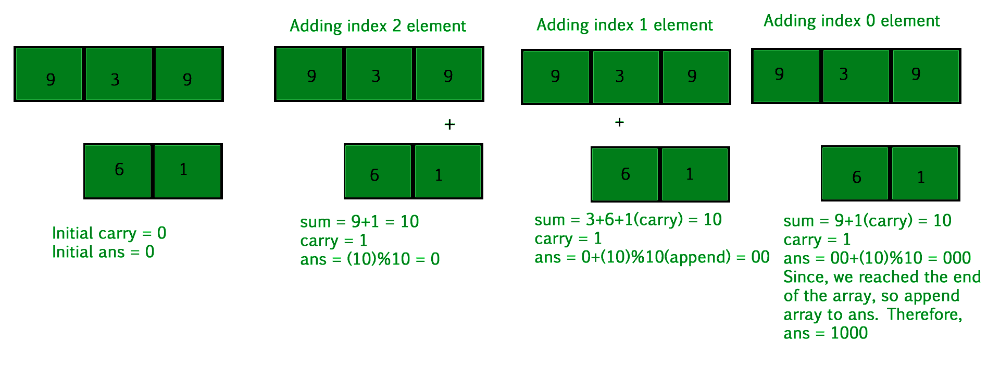

# 将两个数组表示的两个数字相加

> 原文:[https://www . geesforgeks . org/add-two-numbers-由两个数组表示/](https://www.geeksforgeeks.org/add-two-numbers-represented-by-two-arrays/)

给定两个数组**A【0】。n-1]** 和**B【0】。大小分别为 **n** 和 **m** 的 m-1】**，代表两个数字，使得数组的每个元素代表一个数字。例如，A[] = { 1，2，3}和 B[] = { 2，1，4 }分别代表 123 和 214。任务是找出两个数的和。在上述情况下，答案是 337。
**示例:**

```
Input : n = 3, m = 3
        a[] = { 1, 2, 3 }
        b[] = { 2, 1, 4 }
Output : 337
123 + 214 = 337

Input : n = 4, m = 3
        a[] = { 9, 5, 4, 9 }
        b[] = { 2, 1, 4 }
Output : 9763
```

这个想法是从最后开始同时遍历两个数组，直到我们到达其中任何一个数组的第 0 个索引。遍历数组的每个元素时，将数组的元素相加，并从前面的和中进位。现在存储总和的单位数字，并为下一个指数总和结转。如果进位向左，则添加第 0 个索引元素，然后将其追加到数字的开头。
下面是进场说明:



以下是该方法的实现:

## C++

```
// CPP program to sum two numbers represented two
// arrays.
#include <bits/stdc++.h>
using namespace std;

// Return sum of two number represented by the arrays.
// Size of a[] is greater than b[]. It is made sure
// be the wrapper function
int calSumUtil(int a[], int b[], int n, int m)
{
    // array to store sum.
    int sum[n];

    int i = n - 1, j = m - 1, k = n - 1;

    int carry = 0, s = 0;

    // Until we reach beginning of array.
    // we are comparing only for second array
    // because we have already compare the size
    // of array in wrapper function.
    while (j >= 0) {

        // find sum of corresponding element
        // of both arrays.
        s = a[i] + b[j] + carry;
        sum[k] = (s % 10);

        // Finding carry for next sum.
        carry = s / 10;

        k--;
        i--;
        j--;
    }

    // If second array size is less the first
    // array size.
    while (i >= 0) {

        // Add carry to first array elements.
        s = a[i] + carry;
        sum[k] = (s % 10);
        carry = s / 10;

        i--;
        k--;
    }

    int ans = 0;

    // If there is carry on adding 0 index elements.
    // append 1 to total sum.
    if (carry)
        ans = 10;

    // Converting array into number.
    for (int i = 0; i <= n - 1; i++) {
        ans += sum[i];
        ans *= 10;
    }

    return ans / 10;
}

// Wrapper Function
int calSum(int a[], int b[], int n, int m)
{
    // Making first array which have
    // greater number of element
    if (n >= m)
        return calSumUtil(a, b, n, m);

    else
        return calSumUtil(b, a, m, n);
}

// Driven Program
int main()
{
    int a[] = { 9, 3, 9 };
    int b[] = { 6, 1 };

    int n = sizeof(a) / sizeof(a[0]);
    int m = sizeof(b) / sizeof(b[0]);

    cout << calSum(a, b, n, m) << endl;

    return 0;
}
```

## Java 语言(一种计算机语言，尤用于创建网站)

```
// Java program to sum two numbers 
// represented two arrays.
import java.io.*;

class GFG {

    // Return sum of two number represented by
    // the arrays. Size of a[] is greater than
    // b[]. It is made sure be the wrapper
    // function
    static int calSumUtil(int a[], int b[],
                                int n, int m)
    {
        // array to store sum.
        int[] sum= new int[n];

        int i = n - 1, j = m - 1, k = n - 1;

        int carry = 0, s = 0;

        // Until we reach beginning of array.
        // we are comparing only for second
        // array because we have already compare
        // the size of array in wrapper function.
        while (j >= 0)
        {
            // find sum of corresponding element
            // of both array.
            s = a[i] + b[j] + carry;

            sum[k] = (s % 10);

            // Finding carry for next sum.
            carry = s / 10;

            k--;
            i--;
            j--;
        }

        // If second array size is less
        // the first array size.
        while (i >= 0)
        {
            // Add carry to first array elements.
            s = a[i] + carry;
            sum[k] = (s % 10);
            carry = s / 10;

            i--;
            k--;
        }

        int ans = 0;

        // If there is carry on adding 0 index
        // elements  append 1 to total sum.
        if (carry == 1)
            ans = 10;

        // Converting array into number.
        for ( i = 0; i <= n - 1; i++) {
            ans += sum[i];
            ans *= 10;
        }

        return ans / 10;
    }

    // Wrapper Function
    static int calSum(int a[], int b[], int n,
                                        int m)
    {
        // Making first array which have
        // greater number of element
        if (n >= m)
            return calSumUtil(a, b, n, m);

        else
            return calSumUtil(b, a, m, n);
    }

    /* Driver program to test above function */
    public static void main(String[] args)
    {
        int a[] = { 9, 3, 9 };
            int b[] = { 6, 1 };

            int n = a.length;
            int m = b.length;
        System.out.println(calSum(a, b, n, m));
    }
}

// This article is contributed by Gitanjali.
```

## 蟒蛇 3

```
# Python3 code to sum two numbers
# representer two arrays.

# Return sum of two number represented
# by the arrays. Size of a[] is greater
# than b[]. It is made sure be the
# wrapper function
def calSumUtil( a , b , n , m ):
    # array to store sum.
    sum = [0] * n
    i = n - 1
    j = m - 1
    k = n - 1

    carry = 0
    s = 0

    # Until we reach beginning of array.
    # we are comparing only for second array
    # because we have already compare the size
    # of array in wrapper function.
    while j >= 0:

        # find sum of corresponding element
        # of both array.
        s = a[i] + b[j] + carry
        sum[k] = (s % 10)

        # Finding carry for next sum.
        carry = s // 10

        k-=1
        i-=1
        j-=1

    # If second array size is less the first
    # array size.
    while i >= 0:

        # Add carry to first array elements.
        s = a[i] + carry
        sum[k] = (s % 10)
        carry = s // 10

        i-=1
        k-=1

    ans = 0
    # If there is carry on adding 0 index elements.
    # append 1 to total sum.
    if carry:
        ans = 10

    # Converting array into number.
    for i in range(n):
        ans += sum[i]
        ans *= 10

    return ans // 10

# Wrapper Function
def calSum(a, b, n, m ):

    # Making first array which have
    # greater number of element
    if n >= m:
        return calSumUtil(a, b, n, m)
    else:
        return calSumUtil(b, a, m, n)

# Driven Code
a = [ 9, 3, 9 ]
b = [ 6, 1 ]
n = len(a)
m = len(b)
print(calSum(a, b, n, m))

# This code is contributed by "Sharad_Bhardwaj".
```

## C#

```
// C# program to sum two numbers
// represented two arrays.
using System;

class GFG {

    // Return sum of two number represented by
    // the arrays. Size of a[] is greater than
    // b[]. It is made sure be the wrapper
    // function
    static int calSumUtil(int []a, int []b,
                                int n, int m)
    {
        // array to store sum.
        int[] sum= new int[n];

        int i = n - 1, j = m - 1, k = n - 1;

        int carry = 0, s = 0;

        // Until we reach beginning of array.
        // we are comparing only for second
        // array because we have already compare
        // the size of array in wrapper function.
        while (j >= 0)
        {
            // find sum of corresponding element
            // of both array.
            s = a[i] + b[j] + carry;

            sum[k] = (s % 10);

            // Finding carry for next sum.
            carry = s / 10;

            k--;
            i--;
            j--;
        }

        // If second array size is less
        // the first array size.
        while (i >= 0)
        {
            // Add carry to first array elements.
            s = a[i] + carry;
            sum[k] = (s % 10);
            carry = s / 10;

            i--;
            k--;
        }

        int ans = 0;

        // If there is carry on adding 0 index
        // elements append 1 to total sum.
        if (carry == 1)
            ans = 10;

        // Converting array into number.
        for ( i = 0; i <= n - 1; i++) {
            ans += sum[i];
            ans *= 10;
        }

        return ans / 10;
    }

    // Wrapper Function
    static int calSum(int []a, int []b, int n,
                                        int m)
    {
        // Making first array which have
        // greater number of element
        if (n >= m)
            return calSumUtil(a, b, n, m);

        else
            return calSumUtil(b, a, m, n);
    }

    // Driver program
    public static void Main()
    {
        int []a = { 9, 3, 9 };
        int []b = { 6, 1 };

        int n = a.Length;

        int m = b.Length;
        Console.WriteLine(calSum(a, b, n, m));
    }
}

// This article is contributed by vt_m.
```

## 服务器端编程语言（Professional Hypertext Preprocessor 的缩写）

```
<?php
// PHP program to sum two numbers
// represented two arrays.

// Return sum of two number represented
// by the arrays. Size of a[] is greater
// than b[]. It is made sure be the
// wrapper function
function calSumUtil($a, $b, $n, $m)
{
    // array to store sum.
    $sum = array();

    $i = $n - 1; $j = $m - 1; $k = $n - 1;

    $carry = 0; $s = 0;

    // Until we reach beginning of array.
    // we are comparing only for second array
    // because we have already compare the size
    // of array in wrapper function.
    while ($j >= 0)
    {
        // find sum of corresponding
        // element of both array.
        $s = $a[$i] + $b[$j] + $carry;
        $sum[$k] = ($s % 10);

        // Finding carry for next sum.
        $carry = $s / 10;

        $k--;
        $i--;
        $j--;
    }

    // If second array size is less
    // than the first array size.
    while ($i >= 0)
    {
        // Add carry to first array elements.
        $s = $a[$i] + $carry;
        $sum[$k] = ($s % 10);
        $carry = $s / 10;

        $i--;
        $k--;
    }

    $ans = 0;

    // If there is carry on
    // adding 0 index elements.
    // append 1 to total sum.
    if ($carry)
        $ans = 10;

    // Converting array into number.
    for ( $i = 0; $i <= $n - 1; $i++)
    {
        $ans += $sum[$i];
        $ans *= 10;
    }

    return $ans / 10;
}

// Wrapper Function
function calSum( $a, $b, $n, $m)
{
    // Making first array which have
    // greater number of element
    if ($n >= $m)
        return calSumUtil($a, $b, $n, $m);

    else
        return calSumUtil($b, $a, $m, $n);
}

// Driven Code
$a = array( 9, 3, 9 );
$b = array( 6, 1 );

$n = count($a);
$m = count($b);

echo calSum($a, $b, $n, $m);

// This article is contributed by anuj_67.
?>
```

## java 描述语言

```
<script>

// Javascript program to sum two numbers represented two
// arrays.

// Return sum of two number represented by the arrays.
// Size of a[] is greater than b[]. It is made sure
// be the wrapper function
function calSumUtil(a, b, n, m)
{

    // array to store sum.
    let sum = new Array(n);
    let i = n - 1, j = m - 1, k = n - 1;
    let carry = 0, s = 0;

    // Until we reach beginning of array.
    // we are comparing only for second array
    // because we have already compare the size
    // of array in wrapper function.
    while (j >= 0) {

        // find sum of corresponding element
        // of both arrays.
        s = a[i] + b[j] + carry;
        sum[k] = (s % 10);

        // Finding carry for next sum.
        carry = Math.floor(s / 10);

        k--;
        i--;
        j--;
    }

    // If second array size is less the first
    // array size.
    while (i >= 0) {

        // Add carry to first array elements.
        s = a[i] + carry;
        sum[k] = (s % 10);
        carry = Math.floor(s / 10);

        i--;
        k--;
    }

    let ans = 0;

    // If there is carry on adding 0 index elements.
    // append 1 to total sum.
    if (carry)
        ans = 10;

    // Converting array into number.
    for (let i = 0; i <= n - 1; i++) {
        ans += sum[i];
        ans *= 10;
    }

    return ans / 10;
}

// Wrapper Function
function calSum(a, b, n, m)
{

    // Making first array which have
    // greater number of element
    if (n >= m)
        return calSumUtil(a, b, n, m);

    else
        return calSumUtil(b, a, m, n);
}

// Driven Program
    let a = [ 9, 3, 9 ];
    let b = [ 6, 1 ];

    let n = a.length;
    let m = b.length;

    document.write(calSum(a, b, n, m) + "<br>");

// This code is contributed by Mayank Tyagi

</script>
```

**输出:**

```
1000
```

***时间复杂度:** O(n + m)*

***辅助空间:** O(max(n，m))*