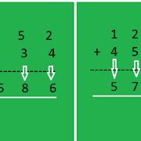

# 不传播进位的两个数相加

> 原文:[https://www . geeksforgeeks . org/无传播进位二进制数加法/](https://www.geeksforgeeks.org/addition-of-two-numbers-without-propagating-carry/)

给定两个相同长度的数字 **a** 和 **b** 。任务是这样计算它们的和，即当相加两个相应的位置时，进位必须保持不变，而不是向左传播。
参考下图:



**例:**

```
Input: a = 7752 , b = 8834
Output: 151586

Input: a = 123 , b = 456
Output: 579
```

**逼近**:首先将 **a** 和 **b** 两个数字反转。现在，生成结果总和:

*   从 a 和 b 中提取数字。
*   计算数字总和。
*   如果数字总和是个位数，直接将其附加到结果总和中。
*   否则，反转当前计算的数字总和，并从中逐个提取数字，然后追加到结果总和中。

以下是上述方法的实现:

## C++

```
// C++ implementation of the above approach
#include<bits/stdc++.h>
using namespace std;

// Function to print sum of 2 numbers
// without propagating carry
int printSum(int a, int b)
{
    int res = 0;

    int temp1 = 0, temp2 = 0;

    // Reverse a
    while(a)
    {
       temp1 = temp1*10 + (a%10);
       a /= 10;
    }
    a = temp1;

    // Reverse b
    while(b)
    {
       temp2 = temp2*10 + (b%10);
       b /= 10;
    }
    b = temp2;

    // Generate sum
    // Since length of both a and b are same,
    // take any one of them.
    while(a)
    {  
        // Extract digits from a and b and add
        int sum = (a%10 + b%10);

        // If sum is single digit
        if(sum/10 == 0)   
            res = res*10 + sum;
        else
        {
            // If sum is not single digit
            // reverse sum
            temp1 = 0;
            while(sum)
            {
                temp1 = temp1*10 + (sum%10);
                sum /= 10;
            }
            sum = temp1;

            // Extract digits from sum and append
            // to result
            while(sum)
            {
                res = res*10 + (sum%10);
                sum /=10;
            }
        }

        a/=10;
        b/=10;
    }

    return res;
}

// Driver code
int main()
{
    int a = 7752, b = 8834;
    cout<<printSum(a, b);

    return 0;
}
```

## Java 语言(一种计算机语言，尤用于创建网站)

```
// Java implementation of the approach
class GFG
{

    // Function to print sum of 2 numbers
    // without propagating carry
    static int printSum(int a, int b)
    {
        int res = 0;

        int temp1 = 0, temp2 = 0;

        // Reverse a
        while (a != 0)
        {
            temp1 = temp1 * 10 + (a % 10);
            a /= 10;
        }
        a = temp1;

        // Reverse b
        while (b != 0)
        {
            temp2 = temp2 * 10 + (b % 10);
            b /= 10;
        }
        b = temp2;

        // Generate sum
        // Since length of both a and b are same,
        // take any one of them.
        while (a != 0)
        {
            // Extract digits from a and b and add
            int sum = (a % 10 + b % 10);

            // If sum is single digit
            if (sum / 10 == 0)
            {
                res = res * 10 + sum;
            }
            else
            {
                // If sum is not single digit
                // reverse sum
                temp1 = 0;
                while (sum != 0)
                {
                    temp1 = temp1 * 10 + (sum % 10);
                    sum /= 10;
                }
                sum = temp1;

                // Extract digits from sum and append
                // to result
                while (sum != 0)
                {
                    res = res * 10 + (sum % 10);
                    sum /= 10;
                }
            }

            a /= 10;
            b /= 10;
        }

        return res;
    }

    // Driver code
    public static void main(String[] args)
    {

        int a = 7752, b = 8834;
        System.out.println(printSum(a, b));
    }
}

// This code contributed by Rajput-Ji
```

## 蟒蛇 3

```
# Python3 implementation of the approach

# Function to prsum of 2 numbers
# without propagating carry
def printSum(a, b):

    res, temp1, temp2 = 0, 0, 0

    # Reverse a
    while a > 0:

        temp1 = temp1 * 10 + (a % 10)
        a //= 10

    a = temp1

    # Reverse b
    while b > 0:

        temp2 = temp2 * 10 + (b % 10)
        b //= 10

    b = temp2

    # Generate sum
    # Since length of both a and b are same,
    # take any one of them.
    while a:

        # Extract digits from a and b and add
        Sum = a % 10 + b % 10

        # If sum is single digit
        if Sum // 10 == 0:
            res = res * 10 + Sum

        else:

            # If sum is not single digit
            # reverse sum
            temp1 = 0
            while Sum > 0:

                temp1 = temp1 * 10 + (Sum % 10)
                Sum //= 10

            Sum = temp1

            # Extract digits from sum and
            # append to result
            while Sum > 0:

                res = res * 10 + (Sum % 10)
                Sum //= 10

        a //= 10
        b //= 10

    return res

# Driver code
if __name__ == "__main__":

    a, b = 7752, 8834
    print(printSum(a, b))

# This code is contributed
# by Rituraj Jain
```

## C#

```
// C# implementation of the above approach
using System;

class GFG
{

// Function to print sum of 2 numbers
// without propagating carry
static int printSum(int a, int b)
{
    int res = 0;

    int temp1 = 0, temp2 = 0;

    // Reverse a
    while(a != 0)
    {
        temp1 = temp1 * 10 + (a % 10);
        a /= 10;
    }
    a = temp1;

    // Reverse b
    while(b != 0)
    {
        temp2 = temp2 * 10 + (b % 10);
        b /= 10;
    }
    b = temp2;

    // Generate sum
    // Since length of both a and b are same,
    // take any one of them.
    while(a != 0)
    {
        // Extract digits from a and b and add
        int sum = (a % 10 + b % 10);

        // If sum is single digit
        if(sum / 10 == 0)
            res = res * 10 + sum;
        else
        {
            // If sum is not single digit
            // reverse sum
            temp1 = 0;
            while(sum != 0)
            {
                temp1 = temp1 * 10 + (sum % 10);
                sum /= 10;
            }
            sum = temp1;

            // Extract digits from sum and append
            // to result
            while(sum != 0)
            {
                res = res * 10 + (sum % 10);
                sum /=10;
            }
        }

        a /= 10;
        b /= 10;
    }

    return res;
}

// Driver code
public static void Main()
{
    int a = 7752, b = 8834;
    Console.Write(printSum(a, b));

}
}

// This code is contributed
// by Akanksha Rai
```

## 服务器端编程语言（Professional Hypertext Preprocessor 的缩写）

```
<?php
// PHP implementation of the approach

// Function to print sum of 2 numbers
// without propagating carry
function printSum($a, $b)
{
    $res = 0;

    $temp1 = 0; $temp2 = 0;

    // Reverse a
    while ($a != 0)
    {
        $temp1 = $temp1 * 10 + ($a % 10);
        $a = (int)($a / 10);
    }
    $a = $temp1;

    // Reverse b
    while ($b != 0)
    {
        $temp2 = $temp2 * 10 + ($b % 10);
        $b = (int)($b / 10);
    }

    $b = $temp2;

    // Generate sum
    // Since length of both a and b are same,
    // take any one of them.
    while ($a != 0)
    {
        // Extract digits from a and b and add
        $sum = ($a % 10 + $b % 10);

        // If sum is single digit
        if ((int)($sum / 10) == 0)
        {
            $res = $res * 10 + $sum;
        }
        else
        {

            // If sum is not single digit
            // reverse sum
            $temp1 = 0;
            while ($sum != 0)
            {
                $temp1 = $temp1 * 10 + ($sum % 10);
                $sum = (int)($sum / 10);
            }
            $sum = $temp1;

            // Extract digits from sum and append
            // to result
            while ($sum != 0)
            {
                $res = $res * 10 + ($sum % 10);
                $sum = (int)($sum / 10);
            }
        }

        $a = (int)($a / 10);
        $b = (int)($b / 10);
    }

    return $res;
}

// Driver code
$a = 7752; $b = 8834;
echo(printSum($a, $b));

// This code contributed by Code_Mech.
?>
```

## java 描述语言

```
  <script>
    // Javascript implementation of the above approach

    // Function to print sum of 2 numbers
    // without propagating carry
    function printSum(a, b)
    {
      var res = 0;
      var temp1 = 0, temp2 = 0;

      // Reverse a
      while (a) {
        temp1 = temp1 * 10 + (a % 10);
        a = parseInt(a / 10);
      }
      a = temp1;

      // Reverse b
      while (b) {
        temp2 = temp2 * 10 + (b % 10);
        b = parseInt(b / 10);
      }
      b = temp2;

      // Generate sum
      // Since length of both a and b are same,
      // take any one of them.
      while (a)
      {

        // Extract digits from a and b and add
        var sum = (a % 10 + b % 10);

        // If sum is single digit
        if (parseInt(sum / 10) == 0)
          res = res * 10 + sum;
        else
        {

          // If sum is not single digit
          // reverse sum
          temp1 = 0;
          while (sum) {
            temp1 = temp1 * 10 + (sum % 10);
            sum = parseInt(sum / 10);
          }
          sum = temp1;

          // Extract digits from sum and append
          // to result
          while (sum) {
            res = res * 10 + (sum % 10);
            sum = parseInt(sum / 10);
          }
        }

        a = parseInt(a / 10);
        b = parseInt(b / 10);
      }

      return res;
    }

    // Driver code
    var a = 7752, b = 8834;
    document.write(printSum(a, b));

// This code is contributed by rrrtnx.
  </script>
```

**Output:** 

```
151586
```

**时间复杂度:** O(N)。