# 概率加法规则

> 原文:[https://www . geesforgeks . org/加法-概率规则/](https://www.geeksforgeeks.org/addition-rule-for-probability/)

作为社会的一部分，与周围人的交流非常普遍，并非所有的交流都包含事实。事实是我们都知道是真实存在的普遍真理，但是如果有人说“今天可能会下雨”怎么办？这被认为是事实吗？不，因为它既不是一个普遍的真理，也不存在那个事件发生的确定性。

下面列出了一些陈述，让我们仔细看看:

1.  印度今天可能会赢。
2.  也许首相今晚会发表声明。
3.  著名音乐家约翰·梅耶可能有机会来印度巡演。
4.  今天巴萨有 50%的机会击败皇马。

请注意，所有这些陈述中都使用了“可能”、“机会”等词语。这些说法不一定，有这些事情发生的几率，但也没有必要这些事情一定会发生。所以这些陈述中存在的不确定性被数学术语中的“概率”捕捉到了。让我们用形式术语来定义概率。

### 可能性

概率是我们生活中每天遇到的机会游戏的一种实验方法。这是一种用数学方法描述这些“机会”，然后进行分析的方法。它让我们可以衡量事情发生的可能性。

> 概率的概念是由著名哲学家和数学家布莱士·帕斯卡在 17 世纪提出的。

让我们做一个实验，

假设我们有一枚硬币，我们把它扔了很多次，然后收集关于正面和反面的数据。我们将多次执行这个实验，并将数据记录在表格中。

<figure class="table">

| **硬币投掷总次数** | **头数** | **尾部数量** |
| five | Two | three |
| Ten | seven | three |
| Fifteen | nine | six |
| Twenty | nine | Eleven |

让我们计算下面给出的两个分数的值，

现在，如果我们继续计算这些值，我们会注意到随着实验次数的增加，这些值开始向 0.5 收敛。

**试验**

> 审判是导致一种或多种结果的行为

在给定的实验中，抛硬币是一种尝试。

**事件**

> 事件是试验的结果

在我们的实验中，抛硬币后得到一个头或一个尾可以被认为是一个事件。现在我们来定义概率。

**样本空间**

> 它是所有可能结果的集合

因为样本空间由所有可能的结果组成。在我们的例子中，头像的数量可以从 0 到硬币被投掷的次数不等。

{0, 1, 2, 3, …..n}

**概率**

> 它是一个值，表示某个事件发生的可能性。
> 
> 设“n”为试验总数，E 为一个事件。事件发生的概率是，
> 
> 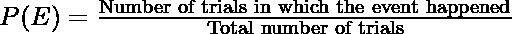
> 
> 请注意，根据其定义，分子将始终小于或等于分母。所以，
> 
> P(E) ≤ 1

**问题:基于上面的实验，假设一枚硬币被抛了 20 次，我们得到了 15 个正面和 5 个反面。找出这枚硬币再抛时，得到一个头和一个尾的概率。**

**解决方案:**

> 我们知道硬币被抛了 20 次，假设我们想先计算人头的概率。
> 
> 头部概率:
> 
> 因此，我们将寻找的事件是获得头部，当硬币被投掷 20 次时，这发生了 15 次。
> 
> 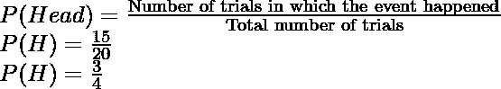
> 
> 尾巴的概率:
> 
> 因此，我们将寻找的事件是得到一个头，当硬币被投掷 20 次时，这发生了 5 次。
> 
> 

注意，在前面的例子中，头部的概率和尾部的概率相加，给我们 1。

### 维恩图的概率

在介绍文氏图之前，我们需要看一下术语“互斥”。

> **互斥:**假设一个审判中有两个事件 A 和 B。如果两者不能同时发生，那么两个事件是互斥的。
> 
> 举个例子:在抛硬币的实验中，正面和反面都不可能在一起。所以它们在本质上是互斥的事件。
> 
> 另一个例子，
> 
> 假设掷出一个骰子，事件 A 掷出奇数，事件 B 掷出 3。现在，当骰子出 3 时，事件 A 和事件 B 同时发生。因此，它们并不相互排斥。

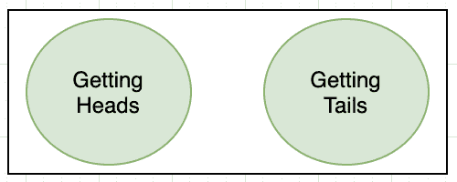

下图代表了我们上面做的抛硬币实验的文氏图。因为这两个事件是互斥的，所以这些圆不会相交。

对于骰子滚动的例子，让我们为事件 A 和事件 b 制作一个维恩图。请注意，结果 1、5 和 3 在一个圆圈中，表示事件 A。事件 A 和事件 b 共有 3，因此它位于交叉点。4 和 6 在任何情况下都不会出现，因此它们位于样本空间的外部。

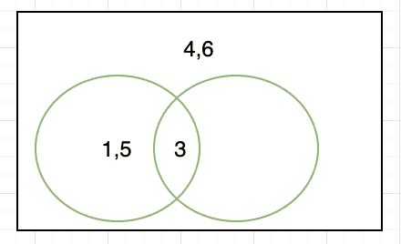

这些事件并不相互排斥，因此图是交叉的。

### 添加概率

在第一个例子中，我们看到头部的概率和尾部的概率加起来是 1。这就产生了另一个概率规则。

> 互相排斥的事件。实验中所有事件的所有概率之和总是 1。例如:
> 
> 如果一个试验有三种可能的结果，A，B 和 c
> 
> **P(A) + P(B) + P(C) = 1**

有时候我们只对一种结果感兴趣。假设有 8 支球队参加板球世界杯。我们对寻找印度赢得世界杯的可能性很感兴趣。我们对找出其他队的概率不感兴趣。所以我们将用下面的方式来表述这个问题，

假设事件 A 表示印度赢得世界杯。所以，另一个事件 B 表示印度没有赢得世界杯。

**P(A) + P(B) = 1**

**P(A)= 1–P(B)**

这样的事件称为**基本事件。**

### 概率相加规则

假设有两个事件 A 和 B，基于两个事件是否互斥的事实，描述两个不同的规则，

**规则 1:当事件互斥时**

当事件互斥时，事件发生的概率为两个事件之和。

> p(aⅱb)= p(a)+p(b)

**规则 2:当事件不相互排斥时**

两个非互斥的事件之间总有一些重叠，因此事件的概率会变成，

> p(a-b)= p(a)+p(b)-p(a-b)

让我们看看这些概念的一些问题。

### **样本问题**

**问题 1:假设一个骰子被滚动了。回答以下问题:**

1.  **得到大于 4 的数的概率是多少。**
2.  **得到偶数的概率是多少。**

**解决方案:**

> 当骰子滚动时，有六种可能的结果。
> 
> 1、2、3、4、5 和 6
> 
> 得到大于 4 的数字的概率:
> 
> 有利结果数= 2
> 
> 结果总数= 6
> 
> 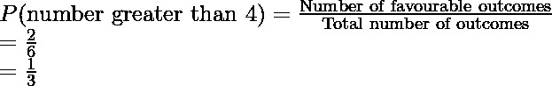
> 
> 得到偶数的概率:
> 
> 有利结果数= 3
> 
> 结果总数= 6
> 
> 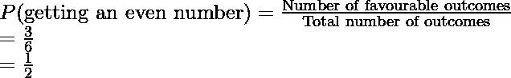

**问题 2:假设从一副洗牌良好的牌中抽出一张牌。找出一次抽中女王的概率。**

**解决方案:**

> 我们知道一副牌有 52 张牌。因此，如果抽一张牌，总共有 52 种可能的结果。我们也知道甲板上有四个女王。这些都是我们有利的结果。
> 
> 所以，
> 
> 结果总数= 52
> 
> 有利结果总数= 4
> 
> 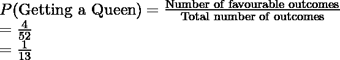

**问题 3:一个袋子里装 3 个白球，4 个黑球，2 个绿球。一个球被替换掉了。求得到的概率:**

1.  **一个白色的球**
2.  **一个黑球**
3.  **一个绿球**

**解决方案:**

> 总共有 3 + 4 + 2 = 9 个球。
> 
> 1.得到白球的概率
> 
> 球的总数= 9，
> 
> 有利结果= 3
> 
> 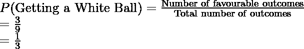
> 
> 2.得到黑球的概率
> 
> 球的总数= 9，
> 
> 有利结果= 4
> 
> 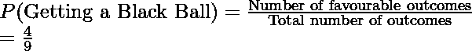
> 
> 3.得到黑球的概率
> 
> 球的总数= 9，
> 
> 有利结果= 2
> 
> 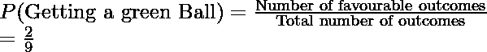

**问题 4:一颗来自太空的卫星坠落在地球上。下图显示了 ISRO 怀疑卫星坠毁的区域。找出它坠毁在湖里的概率。**

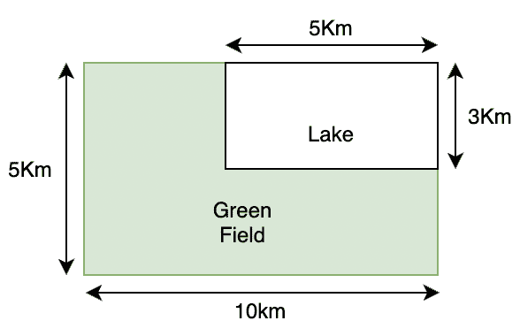

**解决方案:**

> 在这种情况下，我们不知道结果的数量。这是一个连续的案例，那就是飞机可以在该地区的任何地方坠毁。
> 
> 因此，该区域的总面积= 10 × 5 = 50 公里 2
> 
> 湖泊总面积= 5 × 3 = 15 Km 2
> 
> 现在我们可以用这些面积来计算概率。
> 
> 可能结果的总数(本例中的区域)= 50 公里 2
> 
> 有利成果总数(本例中为湖泊面积)= 5 × 3 = 15 Km 2
> 
> 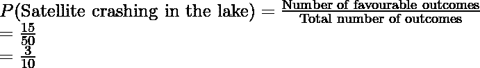
> 
> 因此，卫星坠入湖中的概率是 0.3。

**问题 5:假设我们有一副洗得很好的牌。我们抽两张牌，找出得到国王或王后的概率。**

**解决方案:**

> 假设画一个国王代表一个事件 A，而画一个王后代表一个事件 b。我们被问及得到国王或王后的概率。我们将在这里使用概率相加定律，
> 
> 概率(国王或王后)=概率(国王)+概率(王后)
> 
> 我们知道甲板上有 4 个国王和 4 个女王。
> 
> p(国王)= 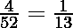
> 
> p(女王)= 
> 
> 因此，
> 
> 概率(国王或王后)= 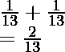

**问题 6:我们有一个骨灰盒，里面有三个黑球，两个蓝球，三个白球。找出如果我们用替换法画三次，得到一个黑色、一个蓝色和一个白色球的概率。**

**解决方案:**

> 我们总共有八个球。
> 
> p(拿到黑球)= 
> 
> p(得到一个蓝色的球)= 
> 
> p(得到一个白球)= 
> 
> 我们将利用加法定律找出这个概率。
> 
> 所以得到全部三种颜色的总概率= P(黑色)+ P(蓝色)+ P(白色)
> 
> = 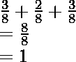
> 
> 注意概率加起来是 1。这符合概率定律。

**问题 7:本周政府将公布工会预算。给出了在某一天宣布的概率，**

<figure class="table">

| **日** | **概率** |
| **周一** |   |
| **周二** |   |
| **周三** |   |
| **周四** |   |
| **周五** |   |

**找出周一到周三预算被公布的概率。**

**解决方案:**

> 我们需要使用概率加法定律，
> 
> P(周一至周三)= P(周一)+ P(周二)+ P(周三)
> 
> p(周一)= 
> 
> p(星期二)= 
> 
> p(周三)= 
> 
> P(周一至周三)= P(周一)+ P(周二)+ P(周三)
> 
> = 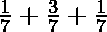
> 
> = 

**问题 8:一个 90 人的班级，50 人选数学，25 人选物理，30 人数学和物理都选。找出学过数学或物理的学生人数。**

**解决方案:**

> 由于选择数学和物理的事件是非互斥的，这里将应用第二个加法规则，
> P(数学∪物理)= P(数学)+ P(物理)–P(数学∪物理)
> P(数学)= 50
> P(物理)= 25
> P(数学∪物理)= 30
> P(数学)

</figure>

</figure>