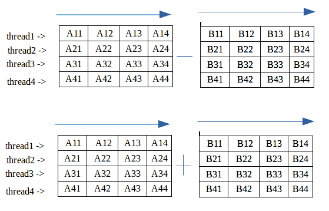

# 使用 pthreads 进行矩阵加减

> 原文:[https://www . geesforgeks . org/加减-矩阵-使用-pthreads/](https://www.geeksforgeeks.org/addition-subtraction-matrix-using-pthreads/)

矩阵的加法或减法需要 **O(n^2)** 没有线程的时间但是使用线程我们不会降低程序的时间复杂度我们把任务分成核心就像如果我们有 4 个核心那么把矩阵分成 4 个部分每个核心取矩阵的一部分计算运算最后当每个任务完成之后所有 4 个线程加入主程序并显示最终输出。

**注意–**只有当我们有一个以上的 CPU 核心时，这个方法才有效如果我们只有一个核心，不要创建线程，因为我们划分任务，只在一个 CPU 上执行，所以划分任务然后计算是浪费时间。



示例:

```
Input : 

Matrix A:
3 7 3 6 
9 2 0 3 
0 2 1 7 
2 2 7 9 

Matrix B:
6 5 5 2 
1 7 9 6 
6 6 8 9 
0 3 5 2 

Output :

Sum of Matrix A and B:
9   12   8   8   
10   9   9   9   
6   8   9   16   
2   5   12   11   

Subtraction of Matrix A and B:
-3   2  -2   4   
 8  -5  -9  -3   
-6  -4  -7  -2   
 2  -1   2   7 

```

**代码–**建议在基于 Linux 的系统中执行程序。

```
#include <pthread.h>
#include <stdio.h>
#include <stdlib.h>

// Value depend on System core
#define CORE 4

// Maximum matrix size
#define MAX 4

// Maximum threads is equal to total core of system
pthread_t thread[CORE * 2];
int mat_A[MAX][MAX], mat_B[MAX][MAX], sum[MAX][MAX], sub[MAX][MAX];

// Addition of a Matrix
void* addition(void* arg)
{

    int i, j;
    int core = (int)arg;

    // Each thread computes 1/4th of matrix addition
    for (i = core * MAX / 4; i < (core + 1) * MAX / 4; i++) {

        for (j = 0; j < MAX; j++) {

            // Compute Sum Row wise
            sum[i][j] = mat_A[i][j] + mat_B[i][j];
        }

    }

}

// Subtraction of a Matrix
void* subtraction(void* arg)
{

    int i, j;
    int core = (int)arg;

    // Each thread computes 1/4th of matrix subtraction
    for (i = core * MAX / 4; i < (core + 1) * MAX / 4; i++) {

        for (j = 0; j < MAX; j++) {

            // Compute Subtract row wise
            sub[i][j] = mat_A[i][j] - mat_B[i][j];
        }

    }

}

// Driver Code
int main()
{

    int i, j, step = 0;
    // Generating random values in mat_A and mat_B
    for (i = 0; i < MAX; i++)  {

        for (j = 0; j < MAX; j++)  {

            mat_A[i][j] = rand() % 10;
            mat_B[i][j] = rand() % 10;

        }

    }

    // Displaying mat_A
    printf("\nMatrix A:\n");

    for (i = 0; i < MAX; i++) {

        for (j = 0; j < MAX; j++) {

            printf("%d ", mat_A[i][j]);
        }

        printf("\n");
    }

    // Displaying mat_B
    printf("\nMatrix B:\n");

    for (i = 0; i < MAX; i++) {

        for (j = 0; j < MAX; j++) {

            printf("%d ", mat_B[i][j]);
        }

        printf("\n");
    }

    // Creating threads equal
    // to core size and compute matrix row
    for (i = 0; i < CORE; i++) {

        pthread_create(&thread[i], NULL, &addition, (void*)step);
        pthread_create(&thread[i + CORE], NULL, &subtraction, (void*)step);
        step++;
    }

    // Waiting for join threads after compute
    for (i = 0; i < CORE * 2; i++) {

        pthread_join(thread[i], NULL);
    }

    // Display Addition of mat_A and mat_B
    printf("\n Sum of Matrix A and B:\n");

    for (i = 0; i < MAX; i++) {

        for (j = 0; j < MAX; j++) {

            printf("%d   ", sum[i][j]);
        }

        printf("\n");
    }

    // Display Subtraction of mat_A and mat_B
    printf("\n Subtraction of Matrix A and B:\n");

    for (i = 0; i < MAX; i++) {

        for (j = 0; j < MAX; j++) {

            printf("%d   ", sub[i][j]);
        }

        printf("\n");
    }

    return 0;
}
```

输出:

```
Matrix A:
3 7 3 6 
9 2 0 3 
0 2 1 7 
2 2 7 9 

Matrix B:
6 5 5 2 
1 7 9 6 
6 6 8 9 
0 3 5 2 

Sum of Matrix A and B:

9   12   8   8   
10   9   9   9   
6   8   9   16   
2   5   12   11   

Subtraction of Matrix A and B:

-3   2  -2   4   
 8  -5  -9  -3   
-6  -4  -7  -2   
 2  -1   2   7 

```