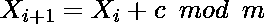

# 生成伪随机数的加法同余法

> 原文:[https://www . geesforgeks . org/加法-同余-生成伪随机数的方法/](https://www.geeksforgeeks.org/additive-congruence-method-for-generating-pseudo-random-numbers/)

**加性同余法**是一种在特定范围内产生伪随机数的线性同余发生器。这种方法可以定义为:

> 
> 
> 哪里，
> 
> **X** 、伪随机数序列
> **m** ( > 0)、模数
> **c**【0，m)、增量
> **X<sub>0</sub>**<sub>【0，m)、序列初始值–称为**种子**</sub>
> 
> 应适当选择 m、c、X <sub>0</sub> ，以获得几乎等于 m 的周期。

**进场:**

*   选择种子值 X <sub>0</sub> ，模量参数 m，增量项 c。
*   初始化需要生成的随机数数量(比如，一个整数变量*nofrandomnums*)。
*   定义存储以保持生成的随机数(这里，考虑*向量*)的大小*无随机数*。
*   用种子值初始化向量的第 0 <sup>个</sup>索引。
*   对于其余的索引，遵循加法同余法生成随机数。

> randomNums[i] = （randomNums[i – 1] + c） % m

最后，返回生成的随机数。

下面是上述方法的实现:

## C++

```
// C++ implementation of the
// above approach

#include <bits/stdc++.h>
using namespace std;

// Function to generate random numbers
void additiveCongruentialMethod(
    int Xo, int m, int c,
    vector<int>& randomNums,
    int noOfRandomNums)
{

    // Initialize the seed state
    randomNums[0] = Xo;

    // Traverse to generate required
    // numbers of random numbers
    for (int i = 1; i < noOfRandomNums; i++) {

        // Follow the additive
        // congruential method
        randomNums[i]
            = (randomNums[i - 1] + c)
              % m;
    }
}

// Driver Code
int main()
{
    int Xo = 3; // seed value
    int m = 15; // modulus parameter
    int c = 2; // increment term

    // Number of Random numbers
    // to be generated
    int noOfRandomNums = 20;

    // To store random numbers
    vector<int> randomNums(noOfRandomNums);

    // Function Call
    additiveCongruentialMethod(
Xo, m, c,
                               randomNums,
 noOfRandomNums);

    // Print the generated random numbers
    for (int i = 0; i < noOfRandomNums; i++) {
        cout << randomNums[i] << " ";
    }

    return 0;
}
```

## Java 语言(一种计算机语言，尤用于创建网站)

```
// Java implementation of the
// above approach
class GFG{

// Function to generate random numbers
static void additiveCongruentialMethod(
    int Xo, int m, int c,
    int []randomNums,
    int noOfRandomNums)
{

    // Initialize the seed state
    randomNums[0] = Xo;

    // Traverse to generate required
    // numbers of random numbers
    for(int i = 1; i < noOfRandomNums; i++)
    {

        // Follow the additive
        // congruential method
        randomNums[i] = (randomNums[i - 1] + c) % m;
    }
}

// Driver Code
public static void main(String[] args)
{

    // Seed value
    int Xo = 3;

    // Modulus parameter
    int m = 15;

    // Increment term
    int c = 2;

    // Number of Random numbers
    // to be generated
    int noOfRandomNums = 20;

    // To store random numbers
    int []randomNums = new int[noOfRandomNums];

    // Function Call
    additiveCongruentialMethod(Xo, m, c,
                               randomNums,
                               noOfRandomNums);

    // Print the generated random numbers
    for(int i = 0; i < noOfRandomNums; i++)
    {
        System.out.print(randomNums[i] + " ");
    }
}
}

// This code is contributed by PrinciRaj1992
```

## 蟒蛇 3

```
# Python3 implementation of the
# above approach

# Function to generate random numbers
def additiveCongruentialMethod(Xo, m, c,
                               randomNums,
                               noOfRandomNums):

    # Initialize the seed state
    randomNums[0] = Xo

    # Traverse to generate required
    # numbers of random numbers
    for i in range(1, noOfRandomNums):

        # Follow the linear congruential method
        randomNums[i] = (randomNums[i - 1] + c) % m

# Driver Code
if __name__ == '__main__':

    # Seed value
    Xo = 3

    # Modulus parameter
    m = 15

    # Multiplier term
    c = 2

    # Number of Random numbers
    # to be generated
    noOfRandomNums = 20

    # To store random numbers
    randomNums=[0] * (noOfRandomNums)

    # Function Call
    additiveCongruentialMethod(Xo, m, c,
                               randomNums,
                               noOfRandomNums)

    # Print the generated random numbers
    for i in randomNums:
        print(i, end = " ")

# This code is contributed by mohit kumar 29
```

## C#

```
// C# implementation of the
// above approach
using System;

class GFG{

// Function to generate random numbers
static void additiveCongruentialMethod(
    int Xo, int m, int c,
    int []randomNums,
    int noOfRandomNums)
{

    // Initialize the seed state
    randomNums[0] = Xo;

    // Traverse to generate required
    // numbers of random numbers
    for(int i = 1; i < noOfRandomNums; i++)
    {

        // Follow the additive
        // congruential method
        randomNums[i] = (randomNums[i - 1] + c) % m;
    }
}

// Driver Code
public static void Main(String[] args)
{

    // Seed value
    int Xo = 3;

    // Modulus parameter
    int m = 15;

    // Increment term
    int c = 2;

    // Number of Random numbers
    // to be generated
    int noOfRandomNums = 20;

    // To store random numbers
    int []randomNums = new int[noOfRandomNums];

    // Function call
    additiveCongruentialMethod(Xo, m, c,
                               randomNums,
                               noOfRandomNums);

    // Print the generated random numbers
    for(int i = 0; i < noOfRandomNums; i++)
    {
        Console.Write(randomNums[i] + " ");
    }
}
}

// This code is contributed by PrinciRaj1992
```

## java 描述语言

```
<script>

// Javascript program to implement
// the above approach

// Function to generate random numbers
function additiveCongruentialMethod(
    Xo, m, c,
    randomNums, noOfRandomNums)
{

    // Initialize the seed state
    randomNums[0] = Xo;

    // Traverse to generate required
    // numbers of random numbers
    for(let i = 1; i < noOfRandomNums; i++)
    {

        // Follow the additive
        // congruential method
        randomNums[i] = (randomNums[i - 1] + c) % m;
    }
}

    // Driver Code

    // Seed value
    let Xo = 3;

    // Modulus parameter
    let m = 15;

    // Increment term
    let c = 2;

    // Number of Random numbers
    // to be generated
    let noOfRandomNums = 20;

    // To store random numbers
    let randomNums = new Array(noOfRandomNums).fill(0);

    // Function Call
    additiveCongruentialMethod(Xo, m, c,
                               randomNums,
                               noOfRandomNums);

    // Print the generated random numbers
    for(let i = 0; i < noOfRandomNums; i++)
    {
        document.write(randomNums[i] + " ");
    }

</script>
```

**Output:** 

```
3 5 7 9 11 13 0 2 4 6 8 10 12 14 1 3 5 7 9 11
```

**伪**的字面意思是**假**。这些随机数被称为伪随机数，因为使用了一些已知的算术过程来生成。即使生成的序列形成一个模式，因此 ***生成的数字似乎是随机的，但可能不是真正随机的*** 。