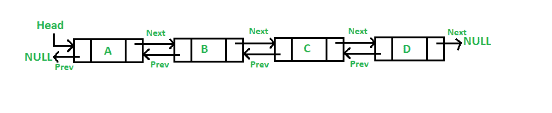

# 双链表的优点、缺点和用途

> 原文:[https://www . geeksforgeeks . org/双重链表的优缺点和用途/](https://www.geeksforgeeks.org/advantages-disadvantages-and-uses-of-doubly-linked-list/)

[双链表(DLL)](https://www.geeksforgeeks.org/doubly-linked-list/) 是一种线性数据结构，它包含一个额外的指针，通常称为*上一个指针*，以及在[单链表中的下一个指针和数据。](https://www.geeksforgeeks.org/data-structures/linked-list/)下图说明相同。

**<u>DLL 的优势</u> :**

*   反转双向链表非常容易。
*   它在执行过程中可以很容易地[分配或重新分配内存](https://www.geeksforgeeks.org/dynamic-memory-allocation-in-c-using-malloc-calloc-free-and-realloc/)。
*   与单链表一样，它是最容易实现的数据结构。
*   这个双链表的遍历是双向的，这在单链表中是不可能的。
*   与[单链表](https://codeforwin.org/2015/09/c-program-to-delete-middle-node-of-singly-linked-list.html)相比，删除节点更容易。单链表删除需要一个指向要删除的节点和前一个节点的指针，但是在双链表中，只需要要删除的指针。

**<u>DLL 的缺点</u> :**

*   与数组和单链表相比，它使用额外的内存。
*   由于内存中的元素是随机存储的，因此元素是按顺序访问的，不允许直接访问。

**<u>DLL 的使用</u> :**

*   它用于需要前后导航的导航系统。
*   浏览器使用它来实现被访问网页的向前和向后导航，这是一个向前和向后按钮。
*   它也被用来代表一副经典的纸牌游戏。
*   各种应用程序也使用它来实现撤销和重做功能。
*   双向链表也用于构建[**【MRU】**](https://www.geeksforgeeks.org/program-for-k-most-recently-used-mru-apps/)**/**[**【LRU】**](https://www.geeksforgeeks.org/lru-cache-implementation/)**(最近/最近最少使用)缓存。**
*   **其他数据结构如[栈](https://www.geeksforgeeks.org/stack-data-structure/)、[散列表](https://www.geeksforgeeks.org/hashing-data-structure/)、[二叉树](https://www.geeksforgeeks.org/binary-tree-data-structure/)也可以使用双向链表来构建或编程。**
*   **同样在许多操作系统中，**线程调度器**(选择哪个进程需要在哪个时间运行的东西)维护一个所有在那个时间运行的进程的双向链表。**