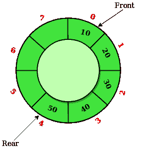
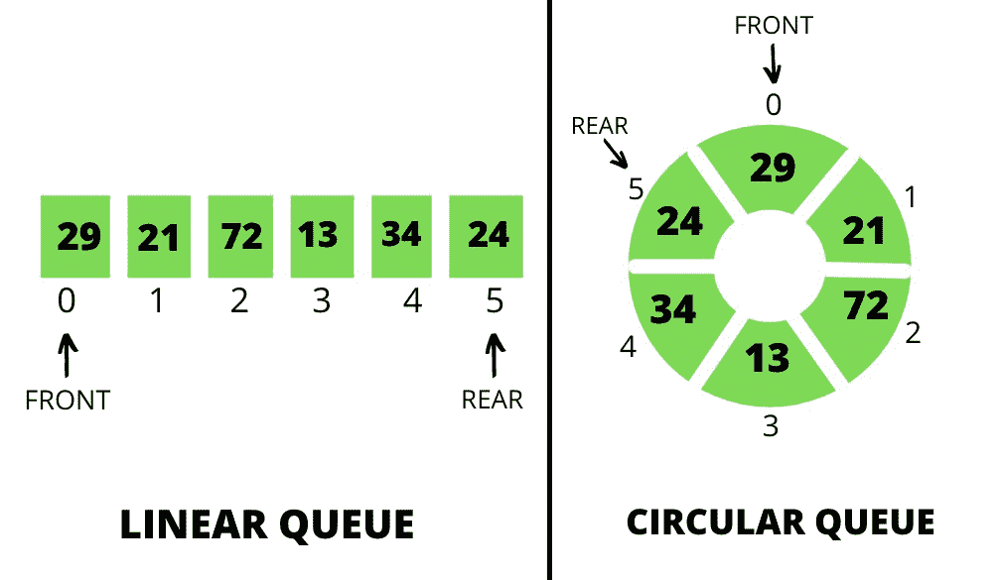
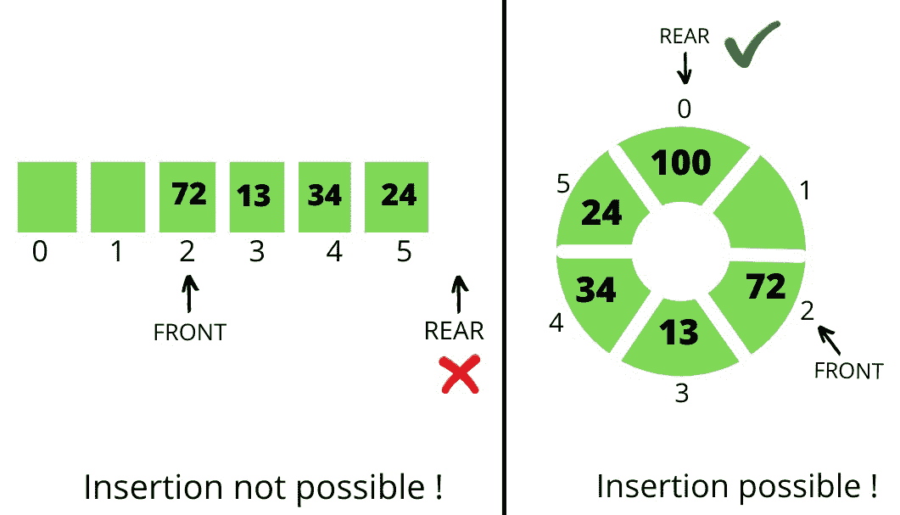

# 循环队列相对于线性队列的优势

> 原文:[https://www . geesforgeks . org/循环队列相对于线性队列的优势/](https://www.geeksforgeeks.org/advantages-of-circular-queue-over-linear-queue/)

[**<u>线性队列</u>**](https://www.geeksforgeeks.org/queue-data-structure/) **:** 线性队列一般被称为队列。它是一种[线性数据结构](https://www.geeksforgeeks.org/difference-between-linear-and-non-linear-data-structures/)，遵循先进先出的顺序。队列的一个实际例子是顾客排队等候从商店购买产品，先到的顾客先得。在队列中，所有删除([出列](https://www.geeksforgeeks.org/deque-set-1-introduction-applications/))都在前端进行，所有插入(入队)都在后端进行。

[**<u>循环队列</u>**](https://www.geeksforgeeks.org/circular-queue-set-1-introduction-array-implementation/) **:** 循环队列只是线性队列的一种变体，其中前端和后端相互连接，以优化线性队列的空间浪费并使其高效。

以下是说明**循环队列**如何优于**线性队列**的操作:

*   **When** [**Enqueue**](https://www.geeksforgeeks.org/queuepush-and-queuepop-in-cpp-stl/) **operation is performed on both the queues:** Let the queue is of size **6** having elements **{29, 21, 72, 13, 34, 24}**. In both the queues the front points at the first element **29** and the rear points at the last element **24** as illustrated below:

    

*   **When the** [**Dequeue**](https://www.geeksforgeeks.org/deque-set-1-introduction-applications/) **operation is performed on both the queues:** Consider the first 2 elements that are deleted from both the queues. In both the queues the front points at element **72** and the rear points at element **24** as illustrated below:

    

*   **Now again enqueue operation is performed:** Consider an element with a value of **100** is inserted in both the queues. The insertion of element **100** is not possible in **Linear Queue** but in the **Circular Queue**, the element with a value of **100** is possible as illustrated below:

    

    **<u>解说</u> :**

    *   由于队列中的插入是从**后面的**末端开始的，并且在**线性队列的情况下**的固定大小，当后面到达队列末端时，插入是不可能的。
    *   但是在**循环队列**的情况下，**后**端从**最后一个**位置循环移动到**前**位置。

    **<u>结论</u> :** 循环队列比线性队列更有优势。循环队列的其他优点是:

    *   **更容易插入-删除:**在循环队列中，如果有空闲位置直到没有被完全占用，元素可以很容易地插入，而在线性队列的情况下，一旦尾部到达最后一个索引，即使队列中存在空闲位置，也不可能插入。
    *   **内存的高效利用:**在循环队列中，由于使用了未占用的空间，因此没有浪费内存，与线性队列相比，内存以有价值和有效的方式得到了适当的利用。
    *   **执行操作的难易程度:**在线性队列中，跟随**先进先出**，所以先插入的元素就是先删除的元素。这不是循环队列的情况，因为后面和前面不是固定的，所以插入-删除的顺序可以改变，这非常有用。