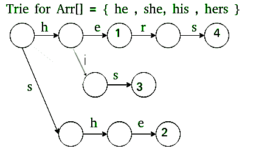
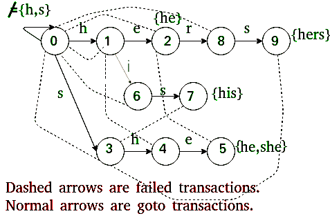

# 模式搜索的 Aho-Corasick 算法

> 原文:[https://www . geesforgeks . org/Aho-Cora sick-algorithm-pattern-search/](https://www.geeksforgeeks.org/aho-corasick-algorithm-pattern-searching/)

给定一个输入文本和 k 个单词的数组 arr[]，查找输入文本中所有单词的所有出现。设 **n** 为文字长度， **m** 为所有字的字符总数，即 m =长度(arr[0]) +长度(arr[1]) + … +长度(arr[k-1])。这里 **k** 是输入单词的总数。

**示例:**

```
Input: text = "ahishers"    
       arr[] = {"he", "she", "hers", "his"}

Output:
   Word his appears from 1 to 3
   Word he appears from 4 to 5
   Word she appears from 3 to 5
   Word hers appears from 4 to 7
```

如果我们使用像 **KMP** 这样的线性时间搜索算法，那么我们需要逐个搜索文本[]中的所有单词。这给了我们总的时间复杂度为 O(n +长度(字[0]) + O(n +长度(字[1]))+O(n+长度(字[2]) + … O(n +长度(字[k-1]))。这个时间复杂度可以写成 ***O(n*k + m)*** 。

**Aho-Corasick 算法**查找 ***O(n + m + z)*** 时间中的所有单词，其中 **z** 是单词在文本中出现的总次数。Aho–Corasick 字符串匹配算法构成了最初的 Unix 命令 fgrep 的基础。

*   **预处理:**构建 arr[]中所有单词的自动机自动机主要有三个功能:

```
Go To :   This function simply follows edges
          of Trie of all words in arr[]. It is
          represented as 2D array g[][] where
          we store next state for current state 
          and character.

Failure : This function stores all edges that are
          followed when current character doesn't
          have edge in Trie.  It is represented as
          1D array f[] where we store next state for
          current state. 

Output :  Stores indexes of all words that end at 
          current state. It is represented as 1D 
          array o[] where we store indexes
          of all matching words as a bitmap for 
          current state.
```

*   **匹配:**遍历给定的文本和构建的自动机，找到所有匹配的单词。

**预处理:**

*   我们首先建立一个所有单词的[特里](https://www.geeksforgeeks.org/trie-insert-and-search/)(或关键词树)。



特里

*   该部分填充 goto g[][]和输出 o[]中的条目。
*   接下来，我们将 Trie 扩展到自动机中，以支持线性时间匹配。



*   该部分填写故障 f[]和输出 o[]中的条目。

**前往:**
我们建造[特里](https://www.geeksforgeeks.org/trie-insert-and-search/)。对于所有在根处没有边的角色，我们将边添加回根。
**失败:**
对于一个状态 s，我们找到最长的合适后缀，它是某个模式的合适前缀。这是使用 Trie 的广度优先遍历来完成的。
**输出:**
对于状态 s，存储以 s 结尾的所有单词的索引。这些索引存储为按位映射(通过对值进行按位“或”运算)。这也是使用广度优先遍历失败的计算。

下面是阿霍-科拉西克算法的实现

## C++

```
// C++ program for implementation of Aho Corasick algorithm
// for string matching
using namespace std;
#include <bits/stdc++.h>

// Max number of states in the matching machine.
// Should be equal to the sum of the length of all keywords.
const int MAXS = 500;

// Maximum number of characters in input alphabet
const int MAXC = 26;

// OUTPUT FUNCTION IS IMPLEMENTED USING out[]
// Bit i in this mask is one if the word with index i
// appears when the machine enters this state.
int out[MAXS];

// FAILURE FUNCTION IS IMPLEMENTED USING f[]
int f[MAXS];

// GOTO FUNCTION (OR TRIE) IS IMPLEMENTED USING g[][]
int g[MAXS][MAXC];

// Builds the string matching machine.
// arr -   array of words. The index of each keyword is important:
//         "out[state] & (1 << i)" is > 0 if we just found word[i]
//         in the text.
// Returns the number of states that the built machine has.
// States are numbered 0 up to the return value - 1, inclusive.
int buildMatchingMachine(string arr[], int k)
{
    // Initialize all values in output function as 0.
    memset(out, 0, sizeof out);

    // Initialize all values in goto function as -1.
    memset(g, -1, sizeof g);

    // Initially, we just have the 0 state
    int states = 1;

    // Construct values for goto function, i.e., fill g[][]
    // This is same as building a Trie for arr[]
    for (int i = 0; i < k; ++i)
    {
        const string &word = arr[i];
        int currentState = 0;

        // Insert all characters of current word in arr[]
        for (int j = 0; j < word.size(); ++j)
        {
            int ch = word[j] - 'a';

            // Allocate a new node (create a new state) if a
            // node for ch doesn't exist.
            if (g[currentState][ch] == -1)
                g[currentState][ch] = states++;

            currentState = g[currentState][ch];
        }

        // Add current word in output function
        out[currentState] |= (1 << i);
    }

    // For all characters which don't have an edge from
    // root (or state 0) in Trie, add a goto edge to state
    // 0 itself
    for (int ch = 0; ch < MAXC; ++ch)
        if (g[0][ch] == -1)
            g[0][ch] = 0;

    // Now, let's build the failure function

    // Initialize values in fail function
    memset(f, -1, sizeof f);

    // Failure function is computed in breadth first order
    // using a queue
    queue<int> q;

     // Iterate over every possible input
    for (int ch = 0; ch < MAXC; ++ch)
    {
        // All nodes of depth 1 have failure function value
        // as 0\. For example, in above diagram we move to 0
        // from states 1 and 3.
        if (g[0][ch] != 0)
        {
            f[g[0][ch]] = 0;
            q.push(g[0][ch]);
        }
    }

    // Now queue has states 1 and 3
    while (q.size())
    {
        // Remove the front state from queue
        int state = q.front();
        q.pop();

        // For the removed state, find failure function for
        // all those characters for which goto function is
        // not defined.
        for (int ch = 0; ch <= MAXC; ++ch)
        {
            // If goto function is defined for character 'ch'
            // and 'state'
            if (g[state][ch] != -1)
            {
                // Find failure state of removed state
                int failure = f[state];

                // Find the deepest node labeled by proper
                // suffix of string from root to current
                // state.
                while (g[failure][ch] == -1)
                      failure = f[failure];

                failure = g[failure][ch];
                f[g[state][ch]] = failure;

                // Merge output values
                out[g[state][ch]] |= out[failure];

                // Insert the next level node (of Trie) in Queue
                q.push(g[state][ch]);
            }
        }
    }

    return states;
}

// Returns the next state the machine will transition to using goto
// and failure functions.
// currentState - The current state of the machine. Must be between
//                0 and the number of states - 1, inclusive.
// nextInput - The next character that enters into the machine.
int findNextState(int currentState, char nextInput)
{
    int answer = currentState;
    int ch = nextInput - 'a';

    // If goto is not defined, use failure function
    while (g[answer][ch] == -1)
        answer = f[answer];

    return g[answer][ch];
}

// This function finds all occurrences of all array words
// in text.
void searchWords(string arr[], int k, string text)
{
    // Preprocess patterns.
    // Build machine with goto, failure and output functions
    buildMatchingMachine(arr, k);

    // Initialize current state
    int currentState = 0;

    // Traverse the text through the built machine to find
    // all occurrences of words in arr[]
    for (int i = 0; i < text.size(); ++i)
    {
        currentState = findNextState(currentState, text[i]);

        // If match not found, move to next state
        if (out[currentState] == 0)
             continue;

        // Match found, print all matching words of arr[]
        // using output function.
        for (int j = 0; j < k; ++j)
        {
            if (out[currentState] & (1 << j))
            {
                cout << "Word " << arr[j] << " appears from "
                     << i - arr[j].size() + 1 << " to " << i << endl;
            }
        }
    }
}

// Driver program to test above
int main()
{
    string arr[] = {"he", "she", "hers", "his"};
    string text = "ahishers";
    int k = sizeof(arr)/sizeof(arr[0]);

    searchWords(arr, k, text);

    return 0;
}
```

## Java 语言(一种计算机语言，尤用于创建网站)

```
// Java program for implementation of 
// Aho Corasick algorithm for String
// matching
import java.util.*;

class GFG{

// Max number of states in the matching
// machine. Should be equal to the sum 
// of the length of all keywords.
static int MAXS = 500;

// Maximum number of characters
// in input alphabet
static int MAXC = 26;

// OUTPUT FUNCTION IS IMPLEMENTED USING out[]
// Bit i in this mask is one if the word with 
// index i appears when the machine enters 
// this state.
static int []out = new int[MAXS];

// FAILURE FUNCTION IS IMPLEMENTED USING f[]
static int []f = new int[MAXS];

// GOTO FUNCTION (OR TRIE) IS
// IMPLEMENTED USING g[][]
static int [][]g = new int[MAXS][MAXC];

// Builds the String matching machine.
// arr -   array of words. The index of each keyword is important:
//         "out[state] & (1 << i)" is > 0 if we just found word[i]
//         in the text.
// Returns the number of states that the built machine has.
// States are numbered 0 up to the return value - 1, inclusive.
static int buildMatchingMachine(String arr[], int k)
{

    // Initialize all values in output function as 0.
    Arrays.fill(out, 0);

    // Initialize all values in goto function as -1.
    for(int i = 0; i < MAXS; i++)
        Arrays.fill(g[i], -1);

    // Initially, we just have the 0 state
    int states = 1;

    // Convalues for goto function, i.e., fill g[][]
    // This is same as building a Trie for arr[]
    for(int i = 0; i < k; ++i)
    {
        String word = arr[i];
        int currentState = 0;

        // Insert all characters of current
        // word in arr[]
        for(int j = 0; j < word.length(); ++j)
        {
            int ch = word.charAt(j) - 'a';

            // Allocate a new node (create a new state)
            // if a node for ch doesn't exist.
            if (g[currentState][ch] == -1)
                g[currentState][ch] = states++;

            currentState = g[currentState][ch];
        }

        // Add current word in output function
        out[currentState] |= (1 << i);
    }

    // For all characters which don't have
    // an edge from root (or state 0) in Trie,
    // add a goto edge to state 0 itself
    for(int ch = 0; ch < MAXC; ++ch)
        if (g[0][ch] == -1)
            g[0][ch] = 0;

    // Now, let's build the failure function
    // Initialize values in fail function
    Arrays.fill(f, -1);

    // Failure function is computed in
    // breadth first order
    // using a queue
    Queue<Integer> q = new LinkedList<>();

    // Iterate over every possible input
    for(int ch = 0; ch < MAXC; ++ch)
    {

        // All nodes of depth 1 have failure
        // function value as 0\. For example,
        // in above diagram we move to 0
        // from states 1 and 3.
        if (g[0][ch] != 0)
        {
            f[g[0][ch]] = 0;
            q.add(g[0][ch]);
        }
    }

    // Now queue has states 1 and 3
    while (!q.isEmpty())
    {

        // Remove the front state from queue
        int state = q.peek();
        q.remove();

        // For the removed state, find failure 
        // function for all those characters
        // for which goto function is
        // not defined.
        for(int ch = 0; ch < MAXC; ++ch)
        {

            // If goto function is defined for 
            // character 'ch' and 'state'
            if (g[state][ch] != -1)
            {

                // Find failure state of removed state
                int failure = f[state];

                // Find the deepest node labeled by proper
                // suffix of String from root to current
                // state.
                while (g[failure][ch] == -1)
                      failure = f[failure];

                failure = g[failure][ch];
                f[g[state][ch]] = failure;

                // Merge output values
                out[g[state][ch]] |= out[failure];

                // Insert the next level node 
                // (of Trie) in Queue
                q.add(g[state][ch]);
            }
        }
    }
    return states;
}

// Returns the next state the machine will transition to using goto
// and failure functions.
// currentState - The current state of the machine. Must be between
//                0 and the number of states - 1, inclusive.
// nextInput - The next character that enters into the machine.
static int findNextState(int currentState, char nextInput)
{
    int answer = currentState;
    int ch = nextInput - 'a';

    // If goto is not defined, use 
    // failure function
    while (g[answer][ch] == -1)
        answer = f[answer];

    return g[answer][ch];
}

// This function finds all occurrences of
// all array words in text.
static void searchWords(String arr[], int k,
                        String text)
{

    // Preprocess patterns.
    // Build machine with goto, failure
    // and output functions
    buildMatchingMachine(arr, k);

    // Initialize current state
    int currentState = 0;

    // Traverse the text through the 
    // built machine to find all 
    // occurrences of words in arr[]
    for(int i = 0; i < text.length(); ++i)
    {
        currentState = findNextState(currentState,
                                     text.charAt(i));

        // If match not found, move to next state
        if (out[currentState] == 0)
             continue;

        // Match found, print all matching 
        // words of arr[]
        // using output function.
        for(int j = 0; j < k; ++j)
        {
            if ((out[currentState] & (1 << j)) > 0)
            {
                System.out.print("Word " +  arr[j] + 
                                 " appears from " + 
                                 (i - arr[j].length() + 1) +
                                 " to " +  i + "\n");
            }
        }
    }
}

// Driver code
public static void main(String[] args)
{
    String arr[] = { "he", "she", "hers", "his" };
    String text = "ahishers";
    int k = arr.length;

    searchWords(arr, k, text);
}
}

// This code is contributed by Princi Singh
```

## 蟒蛇 3

```
# Python program for implementation of
# Aho-Corasick algorithm for string matching

# defaultdict is used only for storing the final output
# We will return a dictionary where key is the matched word
# and value is the list of indexes of matched word
from collections import defaultdict

# For simplicity, Arrays and Queues have been implemented using lists. 
# If you want to improve performance try using them instead
class AhoCorasick:
    def __init__(self, words):

        # Max number of states in the matching machine.
        # Should be equal to the sum of the length of all keywords.
        self.max_states = sum([len(word) for word in words])

        # Maximum number of characters.
        # Currently supports only alphabets [a,z]
        self.max_characters = 26

        # OUTPUT FUNCTION IS IMPLEMENTED USING out []
        # Bit i in this mask is 1 if the word with
        # index i appears when the machine enters this state.
        # Lets say, a state outputs two words "he" and "she" and
        # in our provided words list, he has index 0 and she has index 3
        # so value of out[state] for this state will be 1001
        # It has been initialized to all 0.
        # We have taken one extra state for the root.
        self.out = [0]*(self.max_states+1)

        # FAILURE FUNCTION IS IMPLEMENTED USING fail []
        # There is one value for each state + 1 for the root
        # It has been initialized to all -1
        # This will contain the fail state value for each state
        self.fail = [-1]*(self.max_states+1)

        # GOTO FUNCTION (OR TRIE) IS IMPLEMENTED USING goto [[]]
        # Number of rows = max_states + 1
        # Number of columns = max_characters i.e 26 in our case
        # It has been initialized to all -1.
        self.goto = [[-1]*self.max_characters for _ in range(self.max_states+1)]

        # Convert all words to lowercase
        # so that our search is case insensitive
        for i in range(len(words)):
          words[i] = words[i].lower()

        # All the words in dictionary which will be used to create Trie
        # The index of each keyword is important:
        # "out[state] & (1 << i)" is > 0 if we just found word[i]
        # in the text.
        self.words = words

        # Once the Trie has been built, it will contain the number
        # of nodes in Trie which is total number of states required <= max_states
        self.states_count = self.__build_matching_machine()

    # Builds the String matching machine.
    # Returns the number of states that the built machine has.
    # States are numbered 0 up to the return value - 1, inclusive.
    def __build_matching_machine(self):
        k = len(self.words)

        # Initially, we just have the 0 state
        states = 1

        # Convalues for goto function, i.e., fill goto
        # This is same as building a Trie for words[]
        for i in range(k):
            word = self.words[i]
            current_state = 0

            # Process all the characters of the current word
            for character in word:
                ch = ord(character) - 97 # Ascii value of 'a' = 97

                # Allocate a new node (create a new state)
                # if a node for ch doesn't exist.
                if self.goto[current_state][ch] == -1:
                    self.goto[current_state][ch] = states
                    states += 1

                current_state = self.goto[current_state][ch]

            # Add current word in output function
            self.out[current_state] |= (1<<i)

        # For all characters which don't have
        # an edge from root (or state 0) in Trie,
        # add a goto edge to state 0 itself
        for ch in range(self.max_characters):
            if self.goto[0][ch] == -1:
                self.goto[0][ch] = 0

        # Failure function is computed in 
        # breadth first order using a queue
        queue = []

        # Iterate over every possible input
        for ch in range(self.max_characters):

            # All nodes of depth 1 have failure
            # function value as 0\. For example,
            # in above diagram we move to 0
            # from states 1 and 3.
            if self.goto[0][ch] != 0:
                self.fail[self.goto[0][ch]] = 0
                queue.append(self.goto[0][ch])

        # Now queue has states 1 and 3
        while queue:

            # Remove the front state from queue
            state = queue.pop(0)

            # For the removed state, find failure
            # function for all those characters
            # for which goto function is not defined.
            for ch in range(self.max_characters):

                # If goto function is defined for
                # character 'ch' and 'state'
                if self.goto[state][ch] != -1:

                    # Find failure state of removed state
                    failure = self.fail[state]

                    # Find the deepest node labeled by proper
                    # suffix of String from root to current state.
                    while self.goto[failure][ch] == -1:
                        failure = self.fail[failure]

                    failure = self.goto[failure][ch]
                    self.fail[self.goto[state][ch]] = failure

                    # Merge output values
                    self.out[self.goto[state][ch]] |= self.out[failure]

                    # Insert the next level node (of Trie) in Queue
                    queue.append(self.goto[state][ch])

        return states

    # Returns the next state the machine will transition to using goto
    # and failure functions.
    # current_state - The current state of the machine. Must be between
    #             0 and the number of states - 1, inclusive.
    # next_input - The next character that enters into the machine.
    def __find_next_state(self, current_state, next_input):
        answer = current_state
        ch = ord(next_input) - 97 # Ascii value of 'a' is 97

        # If goto is not defined, use
        # failure function
        while self.goto[answer][ch] == -1:
            answer = self.fail[answer]

        return self.goto[answer][ch]

    # This function finds all occurrences of all words in text.
    def search_words(self, text):
        # Convert the text to lowercase to make search case insensitive
        text = text.lower()

        # Initialize current_state to 0 
        current_state = 0

        # A dictionary to store the result.
        # Key here is the found word
        # Value is a list of all occurrences start index
        result = defaultdict(list)

        # Traverse the text through the built machine
        # to find all occurrences of words
        for i in range(len(text)):
            current_state = self.__find_next_state(current_state, text[i])

            # If match not found, move to next state
            if self.out[current_state] == 0: continue

            # Match found, store the word in result dictionary
            for j in range(len(self.words)):
                if (self.out[current_state] & (1<<j)) > 0:
                    word = self.words[j]

                    # Start index of word is (i-len(word)+1)
                    result[word].append(i-len(word)+1)

        # Return the final result dictionary
        return result

# Driver code
if __name__ == "__main__":
    words = ["he", "she", "hers", "his"]
    text = "ahishers"

    # Create an Object to initialize the Trie
    aho_chorasick = AhoCorasick(words)

    # Get the result
    result = aho_chorasick.search_words(text)

    # Print the result
    for word in result:
        for i in result[word]:
            print("Word", word, "appears from", i, "to", i+len(word)-1)

# This code is contributed by Md Azharuddin
```

## C#

```
// C# program for implementation of
// Aho Corasick algorithm for String
// matching
using System;
using System.Collections.Generic;

class GFG{

// Max number of states in the matching
// machine. Should be equal to the sum
// of the length of all keywords.
static int MAXS = 500;

// Maximum number of characters
// in input alphabet
static int MAXC = 26;

// OUTPUT FUNCTION IS IMPLEMENTED USING out[]
// Bit i in this mask is one if the word with
// index i appears when the machine enters
// this state.
static int[] out = new int[MAXS];

// FAILURE FUNCTION IS IMPLEMENTED USING f[]
static int[] f = new int[MAXS];

// GOTO FUNCTION (OR TRIE) IS
// IMPLEMENTED USING g[,]
static int[,] g = new int[MAXS, MAXC];

// Builds the String matching machine.
// arr -   array of words. The index of each keyword is
// important:
//         "out[state] & (1 << i)" is > 0 if we just
//         found word[i] in the text.
// Returns the number of states that the built machine
// has. States are numbered 0 up to the return value -
// 1, inclusive.
static int buildMatchingMachine(String[] arr, int k)
{

    // Initialize all values in output function as 0.
    for(int i = 0; i < outt.Length; i++)
        outt[i] = 0;

    // Initialize all values in goto function as -1.
    for(int i = 0; i < MAXS; i++)
        for(int j = 0; j < MAXC; j++)
            g[i, j] = -1;

    // Initially, we just have the 0 state
    int states = 1;

    // Convalues for goto function, i.e., fill g[,]
    // This is same as building a Trie for []arr
    for(int i = 0; i < k; ++i) 
    {
        String word = arr[i];
        int currentState = 0;

        // Insert all characters of current
        // word in []arr
        for(int j = 0; j < word.Length; ++j)
        {
            int ch = word[j] - 'a';

            // Allocate a new node (create a new state)
            // if a node for ch doesn't exist.
            if (g[currentState, ch] == -1)
                g[currentState, ch] = states++;

            currentState = g[currentState, ch];
        }

        // Add current word in output function
        outt[currentState] |= (1 << i);
    }

    // For all characters which don't have
    // an edge from root (or state 0) in Trie,
    // add a goto edge to state 0 itself
    for(int ch = 0; ch < MAXC; ++ch)
        if (g[0, ch] == -1)
            g[0, ch] = 0;

    // Now, let's build the failure function
    // Initialize values in fail function
    for(int i = 0; i < MAXC; i++)
        f[i] = 0;

    // Failure function is computed in
    // breadth first order
    // using a queue
    Queue<int> q = new Queue<int>();

    // Iterate over every possible input
    for(int ch = 0; ch < MAXC; ++ch)
    {

        // All nodes of depth 1 have failure
        // function value as 0\. For example,
        // in above diagram we move to 0
        // from states 1 and 3.
        if (g[0, ch] != 0) 
        {
            f[g[0, ch]] = 0;
            q.Enqueue(g[0, ch]);
        }
    }

    // Now queue has states 1 and 3
    while (q.Count != 0) 
    {

        // Remove the front state from queue
        int state = q.Peek();
        q.Dequeue();

        // For the removed state, find failure
        // function for all those characters
        // for which goto function is
        // not defined.
        for(int ch = 0; ch < MAXC; ++ch)
        {

            // If goto function is defined for
            // character 'ch' and 'state'
            if (g[state, ch] != -1) 
            {

                // Find failure state of removed state
                int failure = f[state];

                // Find the deepest node labeled by
                // proper suffix of String from root to
                // current state.
                while (g[failure, ch] == -1)
                    failure = f[failure];

                failure = g[failure, ch];
                f[g[state, ch]] = failure;

                // Merge output values
                outt[g[state, ch]] |= outt[failure];

                // Insert the next level node
                // (of Trie) in Queue
                q.Enqueue(g[state, ch]);
            }
        }
    }
    return states;
}

// Returns the next state the machine will transition to
// using goto and failure functions. currentState - The
// current state of the machine. Must be between
//                0 and the number of states - 1,
//                inclusive.
// nextInput - The next character that enters into the
// machine.
static int findNextState(int currentState,
                         char nextInput)
{
    int answer = currentState;
    int ch = nextInput - 'a';

    // If goto is not defined, use
    // failure function
    while (g[answer, ch] == -1)
        answer = f[answer];

    return g[answer, ch];
}

// This function finds all occurrences of
// all array words in text.
static void searchWords(String[] arr, int k,
                        String text)
{

    // Preprocess patterns.
    // Build machine with goto, failure
    // and output functions
    buildMatchingMachine(arr, k);

    // Initialize current state
    int currentState = 0;

    // Traverse the text through the
    // built machine to find all
    // occurrences of words in []arr
    for(int i = 0; i < text.Length; ++i)
    {
        currentState = findNextState(currentState, 
                                     text[i]);

        // If match not found, move to next state
        if (outt[currentState] == 0)
            continue;

        // Match found, print all matching
        // words of []arr
        // using output function.
        for(int j = 0; j < k; ++j)
        {
            if ((outt[currentState] & (1 << j)) > 0)
            {
                Console.Write("Word " + arr[j] + 
                              " appears from " +
                              (i - arr[j].Length + 1) + 
                              " to " + i + "\n");
            }
        }
    }
}

// Driver code
public static void Main(String[] args)
{
    String[] arr = { "he", "she", "hers", "his" };
    String text = "ahishers";
    int k = arr.Length;

    searchWords(arr, k, text);
}
}

// This code is contributed by Amit Katiyar
```

**Output**

```
Word his appears from 1 to 3
Word he appears from 4 to 5
Word she appears from 3 to 5
Word hers appears from 4 to 7
```

**来源:**
http://www.cs.uku.fi/~kilpelai/BSA05/lectures/slides04.pdf
本文由**阿育什·戈维尔**供稿。如果发现有不正确的地方，请写评论，或者想分享更多关于以上讨论话题的信息