# 求时间复杂度的阿卡拉-宝宝方法

> 原文:[https://www . geesforgeks . org/akra-bazzi-寻找时间的方法-复杂性/](https://www.geeksforgeeks.org/akra-bazzi-method-for-finding-the-time-complexities/)

[大师定理](https://www.geeksforgeeks.org/analysis-algorithm-set-4-master-method-solving-recurrences/)是一种解决时间复杂性重现的流行方法，形式如下:

> 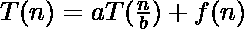

对 a，b 和 f(n)有约束。递推关系式限制了马斯特定理的可用性。下面是三个不能用 master 定理直接解决的循环:

1.  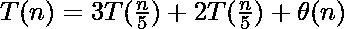
2.  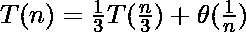
3.  

**<u>阿卡拉-宝宝法</u> :** 本文探讨了另一种解决此类复发的方法，该方法是由**穆罕默德·阿卡拉**和**卢埃·宝宝**在 **1998** 中开发的。阿卡拉-宝宝方法可以应用于下列形式的重现:

> 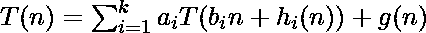

其中，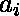和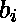是常数，这样:

> 1.  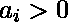
> 2.  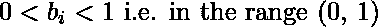
> 3.  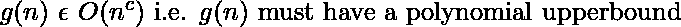
> 4.  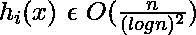

接下来，找到 p，这样

> 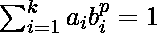

然后

> 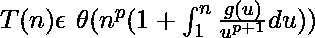

**示例**
让我们考虑上面讨论的三个循环，并使用以下方法解决它们:

**实施例 1。**

这里

> 1.  a 1 = 3
> 
> 1
> 
> 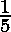
> 4.  a 2 = 2
> 5.  b 2 = 
> 
> 1
> 
> 2 
> 
> 8.  G(n) = \theta(n), that is

在这个问题中，h 1 (n)和 h 2 (n)不存在。
这里 p=1 满足

> 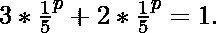

最后，

> => 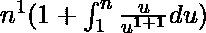
> 
> => 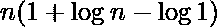
> 
> => 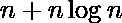
> 
> => 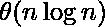

**例 2。**

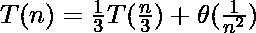

这里

> 1.  a = 
> 2.  b = 
> 3.  g(n)= 
> 4.  B is in the range (0,1)
> 5.  G (n) = \ theta (n 2), that is, in o (n c , where c can be 1.

在这个问题中 h(n)不存在。
这里 p =–1 满足

> 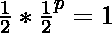

最后，

> => 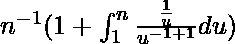
> 
> => 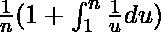
> 
> => ![\large\frac{1}{n}\normalsize(1+[\log u]_{1}^{n})](img/cfb35ba4c3147e6c404c47fa8d16c88c.png "Rendered by QuickLaTeX.com")
> 
> => 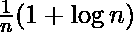
> 
> => 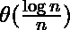

**例 3。**

这里

> 1.  a = 9
> 2.  b = 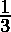
> 3.  g(n)= \θ(n) 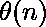
> 4.  B is in the range (0,1)
> 5.  G (n) = 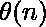 that is, o (n) c , where c can be 1.
> 6.  H (n) = 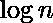, that is, 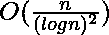

这里 p=2 满足

> 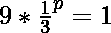

最后，

> => 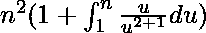
> 
> => 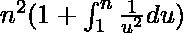
> 
> => ![n^{2}(1+[-\large\frac{1}{u}\normalsize]_{1}^{n})](img/7f094fce742783c34cc8e79ce534beba.png "Rendered by QuickLaTeX.com")
> 
> => 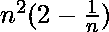
> 
> => 
> 
> => 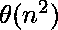

**优势:**

*   适用于许多分治算法。
*   对递归格式的约束比 Master 定理小。
*   对于复杂的递推关系，可以用数值方法计算 p。

**缺点:**

*   当 g(n)的增长不是有界多项式时不起作用。例如 **g(N) = 2 N** 。
*   不处理天花板和地板功能。