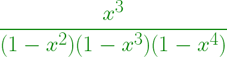

# 阿尔库因序列

> 原文:[https://www.geeksforgeeks.org/alcuins-sequence/](https://www.geeksforgeeks.org/alcuins-sequence/)

[阿尔库因序列](https://en.wikipedia.org/wiki/Alcuin%27s_sequence)是
的扩展



该系列具有重要意义

*   **阿尔库因数列** a(n)为边数为整数的三角形个数，三角形周长为 n。
*   **阿尔库因数列** a(n)是具有不同整数边的三角形的数目，三角形的周长为 n+6。

**阿尔库因序列**如下:

> 0, 0, 1, 0, 1, 1, 2, 1, 3, 2

**例:**

```
Input: n = 10
Output: 0, 0, 1, 0, 1, 
        1, 2, 1, 3, 2
Input: n = 15
Output:0, 0, 1, 0, 1, 
        1, 2, 1, 3, 2, 
        4, 3, 5, 4, 7, 
```

**进场:**

*   使用
    **a(n)= round(n^2/12–地板(n/4)*地板((n+2)/4)** 找到阿尔库因序列的第 n 项
*   找出第一个术语并显示出来。

以下是上述方法的实现:

## C++

```
#include <bits/stdc++.h>
using namespace std;

// find the nth term  of
// Alcuin's sequence
int Alcuin(int n)
{
    double _n = n, ans;

    ans = round((_n * _n) / 12)
          - floor(_n / 4)
                * floor((_n + 2) / 4);

    // return the ans
    return ans;
}

// print first n terms of Alcuin number
void solve(int n)
{
    int i = 0;

    for (int i = 1; i <= n; i++) {

        // display the number
        cout << Alcuin(i) << ", ";
    }
}

// Driver code
int main()
{
    int n = 15;
    solve(n);
    return 0;
}
```

## Java 语言(一种计算机语言，尤用于创建网站)

```
// Java program for Alcuin's Sequence
import java.util.*;

class GFG
{

// find the nth term of
// Alcuin's sequence
static int Alcuin(int n)
{
    double _n = n, ans;

    ans = Math.round((_n * _n) / 12) -
          Math.floor(_n / 4) *
          Math.floor((_n + 2) / 4);

    // return the ans
    return (int) ans;
}

// print first n terms of Alcuin number
static void solve(int n)
{
    int i = 0;

    for (i = 1; i <= n; i++)
    {

        // display the number
        System.out.print(Alcuin(i) + ", ");
    }
}

// Driver code
public static void main(String[] args)
{
    int n = 15;
    solve(n);
}
}

// This code is contributed by Princi Singh
```

## 蟒蛇 3

```
# Python3 program for Alcuin’s Sequence
from math import ceil, floor

# find the nth term of
# Alcuin's sequence
def Alcuin(n):

    _n = n
    ans = 0

    ans = (round((_n * _n) / 12) -
            floor(_n / 4) *
            floor((_n + 2) / 4))

    # return the ans
    return ans

# print first n terms of Alcuin number
def solve(n):

    for i in range(1, n + 1):

        # display the number
        print(Alcuin(i), end = ", ")

# Driver code
n = 15
solve(n)

# This code is contributed by Mohit Kumar
```

## C#

```
// C# program for Alcuin's Sequence
using System;

class GFG
{

    // find the nth term of
    // Alcuin's sequence
    static int Alcuin(int n)
    {
        double _n = n, ans;

        ans = Math.Round((_n * _n) / 12) -
              Math.Floor(_n / 4) *
              Math.Floor((_n + 2) / 4);

        // return the ans
        return (int) ans;
    }

    // print first n terms of Alcuin number
    static void solve(int n)
    {
        int i = 0;

        for (i = 1; i <= n; i++)
        {

            // display the number
            Console.Write(Alcuin(i) + ", ");
        }
    }

    // Driver code
    public static void Main(String[] args)
    {
        int n = 15;
        solve(n);
    }
}

// This code is contributed by Rajput-Ji
```

## java 描述语言

```
<script>

// find the nth term  of
// Alcuin's sequence
function Alcuin(n)
{
    let _n = n, ans;

    ans = Math.round((_n * _n) / 12)
          - Math.floor(_n / 4)
                * Math.floor((_n + 2) / 4);

    // return the ans
    return ans;
}

// print first n terms of Alcuin number
function solve(n)
{
    let i = 0;

    for (let i = 1; i <= n; i++) {

        // display the number
        document.write(Alcuin(i) + ", ");
    }
}

// Driver code
    let n = 15;
    solve(n);

</script>
```

**输出:**

```
0, 0, 1, 0, 1, 1, 2, 1, 3, 2, 4, 3, 5, 4, 7, 
```

**参考:**T2https://en.wikipedia.org/wiki/Alcuin%27s_sequence