# 解魔方的算法

> 原文:[https://www . geeksforgeeks . org/算法求解魔方/](https://www.geeksforgeeks.org/algorithm-to-solve-rubiks-cube/)

A **魔方**是由‘Erno Rubik’发明的一个有趣的谜题，它有 4300 万种可能的配置。但是通过使用某些算法，这个问题很容易解决。如今魔方有很多变体，但最基本的是 **3x3x3 魔方。**

一个 3x3x3 魔方由 21 块拼接而成:1 块三轴原理块，8 块三色调角块(角立体造型)，12 块二色调边块(边 3D 方块)。

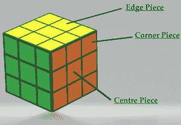

**注意-**
中心件总是只在原来的位置。

**魔方的基本旋转:**

*   **R:** 顺时针旋转右侧图层。
*   **R:**逆时针旋转右侧图层。
*   **L:** 顺时针旋转左侧图层。
*   **L':** 逆时针旋转左侧图层。
*   **U:** 顺时针旋转顶层。
*   **U:**逆时针旋转顶层。
*   **F:** 顺时针旋转前层。
*   **F:**逆时针旋转前层。

**初学者方法:**
解魔方的简单方法是按照先解底层，再解中间层，最后解顶层的方法。

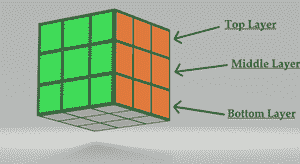

以下是解魔方的步骤-
**第一步:**首先选择任意颜色的中心(比如白色)，然后通过将所有四个相邻的边缘块放在白色中心来制作*白色十字架*。

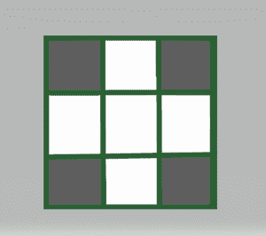

**第二步:**将侧面所有四个中心件的颜色与底层的边缘一一匹配，并将匹配的对以相反的方向发送，然后再次将它们带到一起，制成白色的十字。

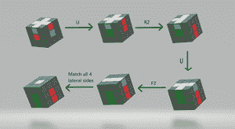

匹配所有层后，立方体看起来像这样-

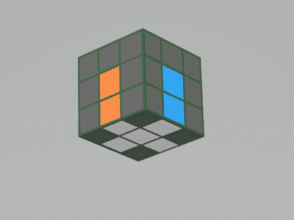

**步骤 3:** 通过首先匹配与其所需颜色相匹配的正确角来设置底层的角。然后应用***【R U R ' U】***算法，重复同样的算法，直到底角块设置在正确的位置，如下图所示****

****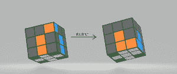****

****在设置了所有的角之后，立方体会看起来像这样-****

****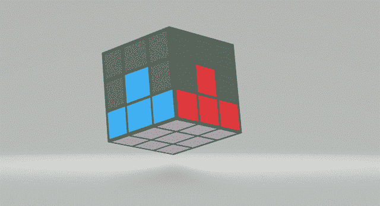****

******步骤 4:** 通过匹配侧面的所有四条边来制作第二层。首先，将顶层边缘的颜色与其中心层匹配，并观察该片的其他部分，即顶面颜色。****

*   ******情况 1:** 如果另一个零件颜色与右侧的中心件匹配，则应用算法*U R U R' U' F' U' F.*****
*   ******情况 2:** 如果另一个零件颜色与左侧的中心件匹配，则应用算法***U ' L U ' L ' U ' F U F '。*******

******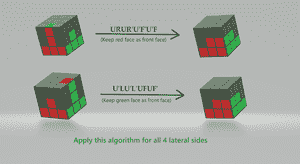******

******把这个应用到所有其他部分后，立方体看起来像这样-******

******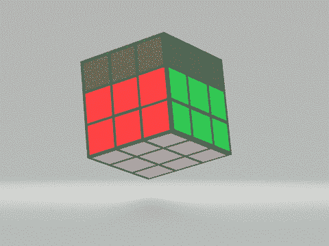******

********第五步:**应用简单算法***F R U R ' U ' F '**1-3 次*在顶层做黄色十字，如下图。********

******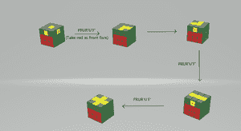******

********第六步:**现在将顶层的任意一条边与中间层的中心点进行匹配，然后应用 *F R U R' U' F'* 算法，直到所有边都匹配。******

****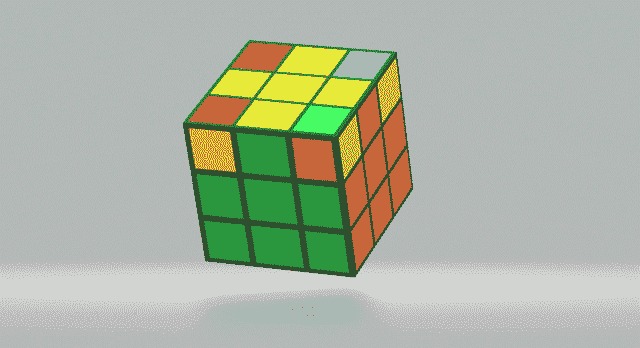****

******第七步:**现在要匹配顶层的所有角块，首先看到已经被匹配的角，并将其保持为正面(在这种情况下是绿黄橙的组合)，然后应用算法 *U R U L U R' U' L。*****

****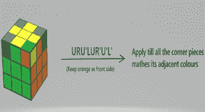****

****在应用这个算法 1-3 次后，立方体看起来像-****

********

******第 8 步**:最后一步保持黄色为正面，从任意一个角开始应用 *U R' U' R* 算法，直到角排列正确，然后旋转顶层，在右上角带来另一个混乱的角，再次重复*U R' U' R* 算法进行排列，以此类推。排列完所有的角块后，如果需要完全解决你的立方体，只需移动黄色饰面层 *1-2 次*。****

****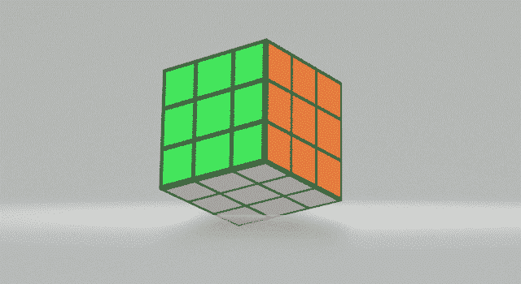****

****有了这最后一步，魔方终于解开了。****