# 算法|重现|集合 1

> 原文:[https://www.geeksforgeeks.org/algorithms-recurrences-set-1/](https://www.geeksforgeeks.org/algorithms-recurrences-set-1/)

*   **Question 1:** Which of the following is the value of T<sup>3</sup>(n) where T<sup>3</sup>(n) is defined as T<sup>3</sup>(n) = 5*T<sup>3</sup>(n-1) – 4*T<sup>3</sup>(n-2)
    1.  C<sub>1</sub>* 5<sup>n</sup>+C<sub>2</sub>* 4<sup>n</sup>
    2.  C<sub>1</sub>+C<sub>2</sub>* 4<sup>n</sup>
    3.  C<sub>1</sub>* 2<sup>n</sup>+C<sub>2</sub>* 4<sup>n</sup>
    4.  C<sub>1</sub>* 5<sup>n</sup>+C<sub>2</sub>*(-4)<sup>n</sup>

    **回答:** 2

    **解释:**递归函数(方程)似乎有一种奇怪的形式。让我们改变变量 T <sup>2</sup> (n)得到一个熟悉形式的方程；所以，我们让 A(n)= T<sup>3</sup>(n)；然后我们有:

    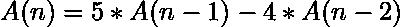

    我们的新微分方程的特征方程是:

    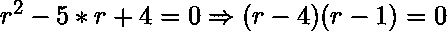

    所以，这个方程的齐次解应该是:

    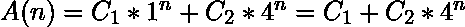

    正如我们已经定义的 A(n) = T <sup>3</sup> (n)，最终答案是:

    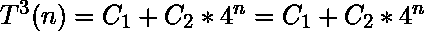

*   **Question 2:** Determine the value of initial condition F(1) in a way that we can have F(n) = (n+2)! as the solution to the following given recursive function:

    ```
     **F(n) = (n+1) * F(n-1) + (n+1)！**
    ```

    1.  three
    2.  four
    3.  six
    4.  Two

    **回答:** 3

    **解释:**通过使用迭代技术求解给定的递归函数，我们将拥有:

    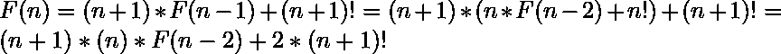

    如果我们继续这些推导，我们很容易猜到答案应该是以下形式:

    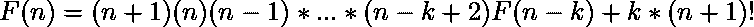

    迭代法的最后一步(停止点)是当我们到达初始条件 F(1)时；因此，我们假设 k = n-1，非递归形式为:

    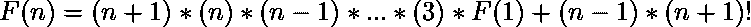

    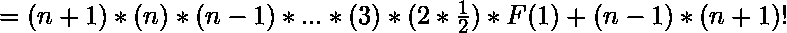

    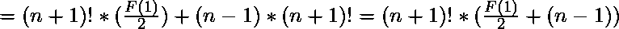

    根据所讨论的给定函数 F(n ),以及到目前为止我们所得到的:

    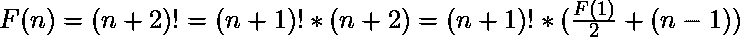

    最后，正如我们将看到的，F(1)的值是:

    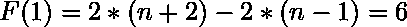

*   **Question 3:** What is the time Complexity of T(n) = 4* T(n/2) + n * log(n!).
    1.  θ（n * log n）
    2.  θ(n〔t0〕2〔t1〕
    3.  θ(n〔t0〕2〔t1〕* log n)
    4.  θ(n<sup>2</sup>*日志 <sup>2</sup> n)

    **回答:** 4

    **说明:**我们知道**日志(n！)∈ θ( n * log n )** 。

    现在，等价的问题是分析新递归函数的顺序:

    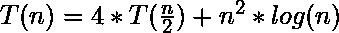

    这个我们可以通过[掌握定理](https://www.geeksforgeeks.org/analysis-algorithm-set-4-master-method-solving-recurrences/)来解决。为了在这里应用主定理，我们有 **f(n) = n <sup>2</sup> * log(n)** ，参数 **a** (子问题数) **b** (约化因子) **C** 分别等于 4、2、2；所以，θ( n <sup>log <sub>b</sub> a</sup> )是θ( n <sup>2</sup> )的，它与θ( n <sup>**C** = 2</sup> )处于同一复杂度等级；因此，给定的递归函数是属于 master 定理的情况 2。

    根据主定理，T(n)的顺序如下:

    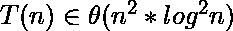

*   **Question 4:** Which one gives the best estimation of T(n) complexity?

    ```
    t(n)=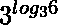* t(n/2)+n<sup>【2】</sup>【n+1】。
    ```

    1.  θ(n2*n* log n)
    2.  o(n)*【n+1】*日志 n)
    3.  θ(■t0)
    4.  θ(■t0)
    5.  o(n)2*n。

    **回答:** 3

    **说明:**我们知道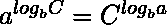，和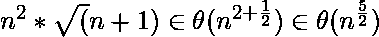；因此，我们可以将递归函数简化如下:

    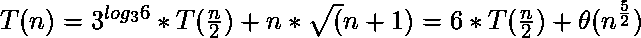

    属于 **[主定理](https://www.geeksforgeeks.org/analysis-algorithm-set-4-master-method-solving-recurrences/)** 的情况 3；所以， **T(n)** 的渐近复杂度是:

    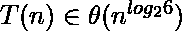

*   **Question 5:** Which asymptotic boundary is not correct for T (n) = T (n/4) + T (3n/4) + n ?
    1.  O( n <sup>log <sub>4/3</sub> 2</sup>
    2.  Ω（ n ）
    3.  O( n * log(n))
    4.  以上都不是

    **回答:** 4

    **说明:**通过 **[主定理](https://www.geeksforgeeks.org/analysis-algorithm-set-4-master-method-solving-recurrences/)** ，我们可以指定与前两个选项(A)和(B)所示相同的边界:

    1.  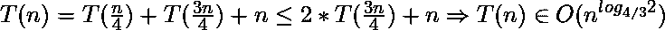
    2.  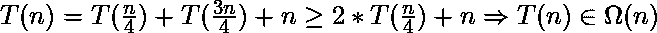

    我们可以通过**递归树**的方法找出第三个选项的正确性。我们画一棵树，就可以很容易地猜出 **T(n)** 的合适边界:

    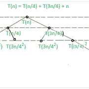

    递归树的分枝长度不能小于 **h <sub>r</sub>** ，也不能大于**h<sub>L</sub>**；因此可以推断出以下估计:

    1.  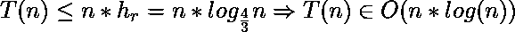
    2.  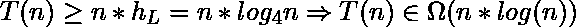

    在根据上面提到的两个边界，我们还有 **T(n) ∈ θ( n*log(n) )** 。

    我们知道如果 **T(n) ∈ O(n * log(n))** ，那么它也一定是**O(n<sup>log<sub>4/3</sub>n</sup>)**；所以如果我们先评估了第三个选项，我们实际上也会推断出选项(A)的正确性。然而，递归树只是给出了如何猜测合适边界的想法。由于有人可能会给出错误的猜测，这种方法也需要验证或证明它不会违反所使用的符号的定义。这种验证(证明)可以通过对 T(n)的迭代替换归纳获得，同时考虑符号定义。