# 算法示例问题|重现|集合 2

> 原文:[https://www.geeksforgeeks.org/algorithms-recurrences-set-2/](https://www.geeksforgeeks.org/algorithms-recurrences-set-2/)

*   **Question 1:** What is the complexity of T(n)?
    1.  θ(1<sub>n</sub>
    2.  θ(1<sub>n<sup>2</sup>t5】</sub>
    3.  I（ 1 ）
    4.  ο(ln(n))

    **答案:3**
    **解释:**利用代换技术求解给定的递归函数，T(n)的封闭形式(非递归形式)可归纳猜测如下:

    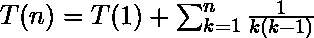

    在进一步深入并涉及复杂的分数之前，最好简化手头的等式。部分分数分解方法通常用于表示有理数分数，其中分子和分母都是多项式形式，是一个或几个具有更简单分母的分数的和。使用这种方法给出:

    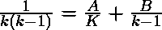

    进行这种分解后，A 和 B 的值将分别为-1 和+1。执行此分解后，T(n)的非递归形式应写成:

    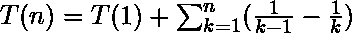

    扩展 T(n)的紧凑表示将导致:

    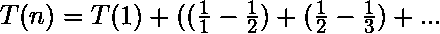

    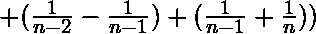

    显而易见，除了第一个和最后一个分数，每个分数都出现两次，但每次都有一个相反的符号；所以，除了第一个和最后一个分数，所有的分数都会消失:

    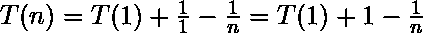

    从刚刚导出的最后一个方程来看，T (n)的渐近复杂度为:

    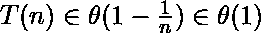

*   **Question 2:** Determine (count) the total possible number of strings of length N with four characters {a, b, c, d} containing an even number of “a”s? [ C(N) is abbreviate of the function Count(N) to serve this purpose.]
    1.  c(N)= 5.0 * 3<sup>N-1</sup>–1.0 * 5<sup>N-1</sup>
    2.  C(N) = 1.0 * 4 <sup>N</sup> + 6
    3.  c(N)= 0.5 * 2<sup>N</sup>+0.5 * 4<sup>N</sup>
    4.  c(N)= 1.0 * 2<sup>N</sup>+2.0 *(3)<sup>N</sup>

    ```
    Example: 

    For n = 1, there are 3 distinct strings: C(3) = 3

    ```

    *   b、c、d。For n = 2, r, for n = 2, 10 possible strings are: C(10) = 10
    *   aa、bb、cc、dd、bc、bd、cb、cd、db、dc

    **答案:3**
    **解释:**对于给定约束的字符串的第一个字符，有两种可能的情况:

    1.  第一个字符可以是除“a”之外的可能字符“b”、“c”或“d”之一。在这种情况下，目标是找到剩余长度为“N-1”的字符串的数量，这些字符串由偶数个“a”组成
        *   碳(氮)= 3*碳(氮-1)
    2.  第一个字符可能是“a”，其中一个“a”已经出现；因此，应该计算奇数个“a”的可能字符串的数量。这个数**不能**叫 C(N-1)，但是 C(N)还是可以用 C(N-1)来实现的。
        *   C(N)= 4<sup>N-1</sup>–C(N-1)，其中:
            *   4 <sup>N-1</sup> :长度为(N-1)的四个字符的可能字符串的总数
            *   C(N-1):由偶数个“a”组成的长度为(N-1)的字符串数

    由于上面提到的两个不同的场景不能同时发生，所以字符串的总数是这些情况的总和:

    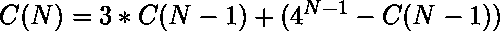

    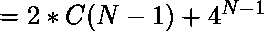

    要找到特定的解决方案，需要两个初始条件，如下所示:

    1.  对于 n = 1，有 3 个不同的字符串:b，c，d。
    2.  或者，对于 n = 2，10 个可能的字符串是:aa、bb、cc、dd、bc、bd、cb、cd、db、dc

    现在，这个问题可以表述为:

    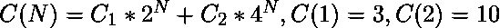

    具有给定约束的字符串的总可能数量为:

    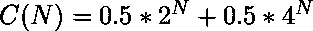

*   **Question 3:** Which one of the recurrence functions does not have a solution of polynomial form?
    1.  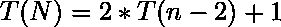
    2.  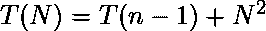
    3.  ![ T(N) = T([ \frac{8}{9} n ] ) + 9 * n + 1 ](img/66d727cb4f30c48f5e948ff3b1e9f39c.png "Rendered by QuickLaTeX.com")
    4.  

    **回答:1**
    **说明:**以上所有方程的解都需要看哪个选项的解不是多项式。应当看到，所有的解都是多项式形式的，除了引入第一选项的那个。以下是对选项的分析:

    1.  **Option (1)** has exponential solution: In order to find the homogeneous solution of the equation presented in first option, the roots of its characteristic equation is required:

        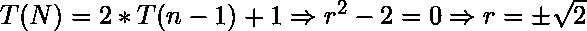

        因此，解是指数形式的:

        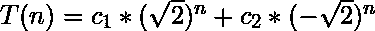

        

    2.  **Option (2):** The equation of second option can be easily solved by substitution technique:

        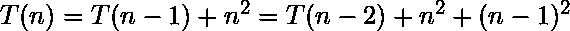

        可以归纳猜测的 T(n)的封闭形式是:

        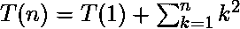

        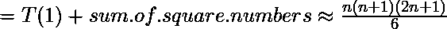

        这说明它是一个三次多项式函数(三次多项式):

        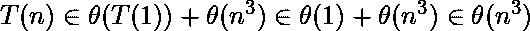

    3.  **选项(3):** 在根据 **[主定理](https://www.geeksforgeeks.org/analysis-algorithm-set-4-master-method-solving-recurrences/)** 中，第三选项中提出的方程的复杂度为。
    4.  **选项(4):** 第四个选项方程位于 **[主定理](https://www.geeksforgeeks.org/analysis-algorithm-set-4-master-method-solving-recurrences/)** 的情况 3 中；因此它的复杂性是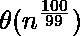。
*   **Question 4:** which one give the best estimation of F(n) asymptotic complexity?
    1.  O( n <sup>3</sup> )
    2.  φ(n<sup>2</sup>
    3.  O( n <sup>2</sup> )
    4.  θ(n〔t0〕2〔t1〕

    **回答:4**
    **解释:**在这类问题上做任何决定之前，有一些棘手的事实需要考虑:

    1.  【找到尽可能紧的边界】最佳渐近估计是当复杂性行为用θ-符号表示时。这主要是基于算法的平均性能，即所谓的平均案例场景，需要复杂的分析，程序员更喜欢使用其他符号，如 O()；然而，尝试找到尽可能紧密的边界仍然是一个很好的做法。
    2.  【符号谈无穷】数学渐近符号描绘了无穷远处，或者当“n”趋向于非常大的数量时，复杂性函数的行为。无限是一个假设的、抽象的概念，在现实生活中无法达到。为了计算的目的，为了对函数行为有一个概念，应该考虑的数字仅仅取决于问题。在这个问题中似乎对输入数据大小“n”没有限制。
    3.  【意识到测试者的陷阱】为了摆脱测试者提供的潜在陷阱，应为 n 分配足够大的值；在这个问题中，不应选择 100 或 1000 这样的小数值。由于需要比较 n <sup>3</sup> 对于 n < 100 的复杂性和 n <sup>2</sup> 对于 n > 100 的复杂性，对于 n = 100，大于 1000 的值是可以接受的，这使得 n <sup>2</sup> 优于 n <sup>3</sup> 。即使我们准备在每次通话时重新计算 F(100)，对于 n > 1000，n <sup>2</sup> 始终大于 F(100)，对于 n=100 这样的小数值，F 的数量级为 n <sup>3</sup> 。在 n > 1000 所需的计算中，可以简单地忽略 F(100)的值。
    4.  【在现实应用中，使用一些辅助内存空间来获得一些速度有时会很有效】在这个问题中，使用θ(1)的辅助内存空间来立即保存 F(100)的结果以备将来使用，而不必在每次调用 n > 100 时重新计算 F(100)是一个很好的主意。所以 F(100)的复杂度是 O(1)，可能只是为了读取一个值，对于 n > 100，F(n)的复杂度是θ(n<sup>2</sup>)。

    F(n)的复杂度为:

    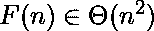

*   **Question 5:** Which one specifies appropriate ranges for k and α (alpha), where the following asymptotic expression holds?

    ```
    
    ```

    1.  α ≥ 0 & k ≤ α
    2.  α ≥ 0.1 & k ≥ 0
    3.  α > 1 & k ∈ R
    4.  α > 0 & k ∈ R

    **答案:4**
    **解释:**有一个非常可靠的资源可以有效解决这个问题，麻省理工大学的[小抄](http://web.mit.edu/broder/Public/asymptotics-cheatsheet.pdf)。然而，并不是全部，但是这个解决方案中描述的一个重要部分是基于在麻省理工学院小抄中可能找到的推导。

    目标是找到表达式 ln <sup>k</sup> n ∈ O(n <sup>α</sup> 为真的范围。这个表达式可能不被持有的最糟糕的情况是，让表达式的左侧变得非常大，同时试图迫使右侧保持尽可能小；换句话说，试图给指数“k”分配一个大的可能值，同时在另一边为指数“Alpha”指定非常小的值。小的值，甚至小于 1，都可以赋给α。然而，目前，α被赋予一个可选的特定常数 E，但还不是负值；α既不是一个变量 E(n)，也不是“n”的函数，因为这将是一个全新的问题，而不是这个问题中描述的问题。

    设α = |E|(可选的小正常数)且 k > 0；目的是看表达式 ln <sup>k</sup> n ∈ O(n <sup>E</sup> 是否为真:

    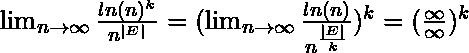

    应用医院法则给出:

    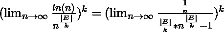

    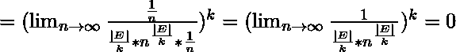

    目前得到的结论是，对数函数没有正指数“k”，即使正指数很小，也能超过变量“n”。当然，当对数函数取负指数并变得更小时也是如此。换句话说:

    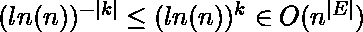

    指数 Alpha 取负值(α = -|E|)怎么办？由于负指数意味着翻转分数，翻转派系伴随着改变不等式符号，它产生:

    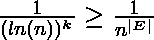

    O 符号不再适用了。因此，上述不等式保留的范围是当 k ∈ R & α>0 时；在数学语言中:

    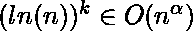为 k ∈ R & α > 0

    多项式表达式不能包含具有分数指数的变量；因此，这个问题更具包容性，因为它采用这样的小数值。因此，这个问题陈述描述了多项式表达式比对数函数增长得多快。

    **来源:**

    1.  [麻省理工学院渐近小抄](http://web.mit.edu/broder/Public/asymptotics-cheatsheet.pdf)
    2.  伊朗大学考试汇编(有一些总结、修改和翻译)