# 算法样题|集合 3 |时间顺序分析

> 原文:[https://www . geesforgeks . org/算法-样本-问题-集合-3-时间-顺序-分析/](https://www.geeksforgeeks.org/algorithms-sample-questions-set-3-time-order-analysis/)

**问题 1:**T(n)的渐近边界是什么？

> 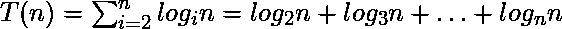

1.  θ（n*log（n） ）
2.  θ(n〔t0〕2〔t1〕
3.  θ（n ）
4.  θ(n * log〔t0〕2〔t1〕)
5.  θ(n<sup>2</sup>*日志 <sup>2</sup> (n))

**答案:3**
**解释:**为了找到合适的上下边界，首先想到的方法是将 sigma 符号扩展到单个术语，其中可以检测到一些模式。这种方式有助于定义一些可接受的上下边界，它们的组合可能会导致一个可能的解决方案。

关于指定这些边界，有以下一些提示:

*   很明显，对于大于√ n 的任何 k，每个对数 <sub>k</sub> n 应该小于对数 <sub>√n</sub> n = 2，而大于对数 <sub>n</sub> n = 1。在数学语言中:
    1.  A hint on UPPER boundary, for k > √ n:

        

        ![ \Rightarrow \sum_{i=[\sqrt{n}]}^{ n } log_{i}n \leq \sum_{i=[\sqrt{n}]}^{ n } 2 ](img/e73f133a45f64025fd14614ac913aa6c.png "Rendered by QuickLaTeX.com")

    2.  A hint on LOWER boundary, for k > √ n:

        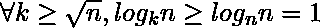

        ![ \Rightarrow \sum_{i=[\sqrt{n}] + 1}^{ n } log_{i}n \geq \sum_{i=[\sqrt{n}] + 1}^{ n } 1 ](img/bf804ba0b086ccb4f304b4861c83cd3a.png "Rendered by QuickLaTeX.com")

*   除此之外，随着对数基数的增加，它的值会减少；所以第一个σ展开后的项不能大于第一个 ter，log <sub>2</sub> n，也不能小于最后一个，即 log<sub>√n</sub>n；在其他句子中，
    1.  Another hint on UPPER boundary, but this time for k < √ n:

        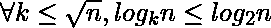

        ![ \Rightarrow  \sum_{i=2}^{  [\sqrt{n}] } log_{i}n \leq  \sum_{i=2}^{  [\sqrt{n}] } log_{2}n](img/75d77b072cd92b61c2a4804120a44ebf.png "Rendered by QuickLaTeX.com")

    2.  Another hint on LOWER boundary, but this time for k < √ n:

        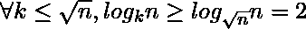

        ![ \Rightarrow \sum_{i=2}^{  [\sqrt{n}] } log_{i}n \geq  \sum_{i=2}^{  [\sqrt{n}] } 2](img/7f2fa134501b47df7d59bef369a35ab5.png "Rendered by QuickLaTeX.com")

遵循以下提示:

1.  Lower boundary:

    ![ \sum_{i=2}^{n} log_{i}n  =  \sum_{i=2}^{  [\sqrt{n}] } log_{i}n +  \sum_{i=[\sqrt{n}]+1}^{n} log_{i}n ](img/ec3121d3c58d09c17900eed60fe69785.png "Rendered by QuickLaTeX.com")

    ![ \leq  \sum_{i=2}^{  [\sqrt{n}] } log_{2}n +  \sum_{i=[\sqrt{n}]+1}^{n} 2 ](img/5ec0c20358ce1ff896fadcb70e85cb43.png "Rendered by QuickLaTeX.com")

    ![ =  ([\sqrt{n}] - 1) * log_{2}n +  (n - [\sqrt{n}]) * 2 ](img/83e4b6a8be18fde552f42020686f7974.png "Rendered by QuickLaTeX.com")

    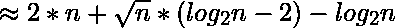

    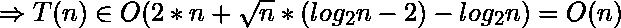

2.  Upper boundary:

    ![ \sum_{i=2}^{n} log_{i}n  =  \sum_{i=2}^{  [\sqrt{n}] } log_{i}n +  \sum_{i=[\sqrt{n}]+1}^{n} log_{i}n ](img/ec3121d3c58d09c17900eed60fe69785.png "Rendered by QuickLaTeX.com")

    ![ \geq  \sum_{i=2}^{  [\sqrt{n}] } log_{[\sqrt{n}]}n +  \sum_{i=[\sqrt{n}]+1}^{n} 1 ](img/6b6ea9a73b71879c21999e0942202381.png "Rendered by QuickLaTeX.com")

    ![ =  ([\sqrt{n}] - 1) * 2 +  (n - [\sqrt{n}]) * 1 ](img/f9c3a05bc9b378f267fec6c0826b0ee6.png "Rendered by QuickLaTeX.com")

    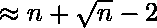

    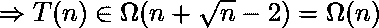

到目前为止的推导表明，T(n)的增长不能超过 O(n)，也不能小于ω(n)；因此，T(n)的渐近复杂度阶为:

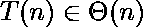

**问题 2:** 给定程序的运行时间顺序是什么？

```
C PROGRAM: Input n of type integer
  for(i= 2; i<n; i=i+1)
   for(j = 1; j < n; j= j * i)
    // A line of code of Θ(1)

```

1.  θ（n ）
2.  θ（n*log（n） ）
3.  θ(n〔t0〕2〔t1〕
4.  θ( n*log <sup>2</sup> log(n))
5.  θ(n<sup>2</sup>*日志 <sup>2</sup> (n))

**回答:1**

**说明:**各线路运行时间分别如下:

1.  第一个代码行 t <sub>1</sub> (n)，是:
    为(I = 2；I<n；i=i+1) //它运行(n–2)次；所以这条线的时间复杂度是θ(n)
2.  第二个代码行，t <sub>2</sub> (n)为:
    为(j = 1；j<n；j = j * I)//log<sub>2</sub>T7】n+log<sub>3</sub>+T11】n+…+log<sub>n-1</sub>+T15】n=σlog<sub>I</sub>+T19】n∈θ(n)in 根据本文 PREVIOUS QUESTION(参考问题 1)
3.  第三个代码行 t <sub>3</sub> (n)是:
    //θ(1)的一个代码行:内循环，所以它的下单时间和前一行一样，是θ(n)

程序的总时间复杂度 T(n)是每一行 t <sub>i</sub> (n)的和，i = 1..3，如下所示:

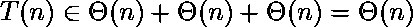

**问题 3:** 给出以下递推方程 T(n)。拟设 g <sub>i</sub> (n)多少个，i=1..5、函数是可以接受的以便有 T(n) ∈ θ(f(n))当 f(n) = g <sub>i</sub> (n)时？

> 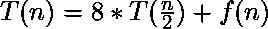
> 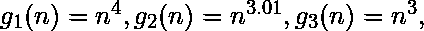
> 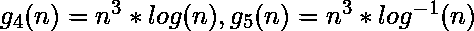

1.  one
2.  Two
3.  three
4.  four
5.  five

**答案:2**
**解释:** [大师定理](https://www.geeksforgeeks.org/analysis-algorithm-set-4-master-method-solving-recurrences/)及其引申对轻松攻克这个难题能有很大帮助。[主定理](https://www.geeksforgeeks.org/analysis-algorithm-set-4-master-method-solving-recurrences/)的一般形式可以表示为:

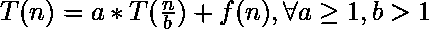

为了使用[主定理](https://www.geeksforgeeks.org/analysis-algorithm-set-4-master-method-solving-recurrences/)，需要看到特定“a”、“b”和“f(n)”的给定问题满足这个定理的哪种情况的条件。[主定理](https://www.geeksforgeeks.org/analysis-algorithm-set-4-master-method-solving-recurrences/)的三种情况及其条件是:

*   case 1: This case happens the recursion tree is leaf-heavy (the work to split/recombine a problem is dwarfed by subproblems.)

    

*   case 2: This case occurs when the work to split/recombine a problem is comparable to subproblems.

    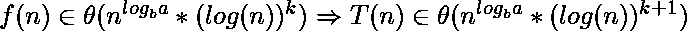
    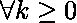

*   case 3: This case takes place when the recursion tree is root-heavy (the work to split/recombine a problem dominates subproblems.)

    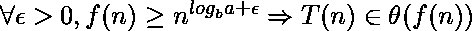

主定理的广义第二种情况，即所谓的[高级主定理](https://www.geeksforgeeks.org/advanced-master-theorem-for-divide-and-conquer-recurrences/)，处理 k 的所有值，它说:

*   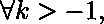

    

*   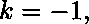

    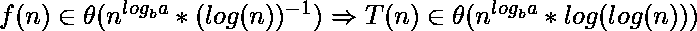

*   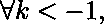

    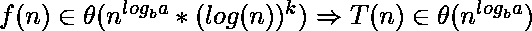

这个问题的答案是主定理的第三种情况，其中 T(n)是θ(f(n))的；所以为了有 T(n) = θ(f(n))，n <sup>log <sub>b</sub> a</sup> 和 f(n)之间应该有多项式差“ε”；因此，函数 g <sub>1</sub> (n)和 g <sub>2</sub> (n)满足 Master 定理第三种情况的条件。为它们找到的“ε”值分别为 1 和 0.01。

**问题 4:** 哪个选项描述了这个多输入变量程序的真正渐近分析，同时对输入的相对增长有洞察(先验知识)，比如 m∈θ(n)？

```
 C PROGRAM: inputs m and n of type integer 
  for(i= 1; i<= n; i=i+1) : n
   for(j = 1; j <= m; j= j * 2)
    for(k = 1; k <= j; k= k+1)
     \\ A code line of Θ(1)

```

1.  θ( n * m*(m+1)/2)
2.  θ(n * m+n *日志 <sup>2</sup> (m))
3.  ο(m<sup>3</sup>
4.  θ(n〔t0〕2〔t1〕
5.  θ(n<sup>2</sup>*日志 <sup>2</sup> (n))

**回答:4**

**说明:**根据输入 n 和 m，T(n，m)计算程序的时间复杂度，第一步是获取每一行的运行时间，t <sub>i</sub> (n，m)，如下所示:

1.  for(i= 1; i<= n; i=i+1) // It runs n times

    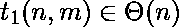

2.  for(j = 1; j <= m; j= j * 2) // iterates log<sub>2</sub>(m) times, and it is inside another loop which multiply it n times

    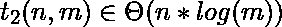

3.  为(k = 1；k<= j；k= k+1) //它运行 2+4+8+……+2<sup>log(m)</sup>次

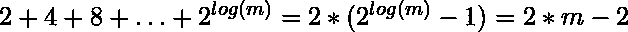

这也在一个外部循环中，首先是“for”循环，它本身迭代 n 次

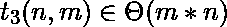

9.  \\A line of code of Θ(1) The same as previous line, Θ( m*n )

    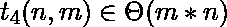

该程序的总运行时间顺序为:

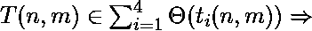

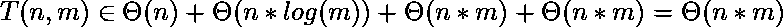

根据给定的先验知识，它甚至可以更简化，即 m∈θ(n)，或 n∈θ(m):

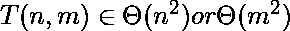

**问题 5:** 有一个整数的向量，叫做 V[]，长度为“N”。
对于具体问题(程序)，给出σ<sub>I = 1</sub><sup>N</sup>| V【I】| = p .
下面的代码片段时间复杂度是多少？【不用说，P 也是整数】

```
Tmp = -1;
  For r= 1 to N
   For S = 1 to V[r]
    Tmp = Tmp + 20;

```

1.  O( N + 2*N*P)
2.  O( N * P)
3.  O( N <sup>2</sup> )
4.  O( P <sup>2</sup> )
5.  O( 2*P + N)

**答案:5**
**说明:**每行执行的次数及其总时间复杂度如下:

Tmp =-1； // θ(1)
为 r= 1 至 N // N 次；所以是θ(N)
对于 S = 1 到 V[r] //不能超过|V[r]|次；所以总次数为 O(σ<sub>r = 1</sub><sup>N</sup>| V【r】|)= O(P)
Tmp = Tmp+20； //同上一行，O( P)

为了找出给定程序的时间复杂性，需要记住三个事实:

1.  每个 V[r]可以取任意整数值(甚至是零或负的)，但这并不重要，因为在 c 这样的编程语言中，所有的负值都会导致第二个循环没有执行，但是在编程语言中，允许倒数到(或迭代到)负数，但是没有被分析的算法取决于编程语言，分析只是基于算法本身。可以肯定的是问题中给出的信息；所以一个精明的动作就是考虑|V[r]|的绝对值，同时也要用 O() 记数法，以摆脱被卡住的状态。否则，不得不说程序运行的时间至少和第一个循环的执行时间一样多，也就是ω(N)
2.  虽然这个程序的运行时间顺序似乎不依赖于两个变量，但没有更多的信息需要进一步分析来比较 P 和 N；所以渐近复杂度取决于 P 和 N 的值；换句话说，有 T(N，P)复杂度函数代替 T(N)。
3.  O()符号定义了一个比θ()符号指定的紧边界更宽松的边界；因此，θ()和 O()的和将是 O()类型。在这个问题中，程序的总时间复杂度是所有代码行复杂度的和， θ(1) + θ(N) + O( P ) + O( P ) ，属于集合 O( 2 * P + N + 1)或 O( 2 * P + N)。

综合考虑上述所有因素，一个渐近复杂度可以是 T(N，P)∈O(2 * | P |+N)；但是，变量的系数在渐近分析的最后一步并不重要，因为它们都属于同一组复杂度函数，复杂度也可以表示为 O(|P| + N)。

**来源:**

1.  伊朗大学考试汇编(有一些总结、修改和翻译)