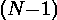

# 无前导零的所有可能的 N 位数和基数 B

> 原文:[https://www . geesforgeks . org/所有可能的 n 位数和不带前导零的基数 b/](https://www.geeksforgeeks.org/all-possible-numbers-of-n-digits-and-base-b-without-leading-zeros/)

给定数字“N”和基数“B”的数量，任务是计算基数“B”中所有不带前导零的“N”个数字。

**示例:**

```
Input: N = 2, B = 2
Output: 2
All possible numbers without 
leading zeros are 10 and 11.

Input: N = 5, B = 8
Output: 28672
```

**进场:**

*   如果基数是“B”，那么这个数字的每个数字都可以取[0，B-1]范围内的任何值。
*   所以，B‘N’位数字有可能以‘B’为基数(包括前导零的数字)。
*   而且，如果我们把第一个数字固定为‘0’，那么剩下的‘N-1’个数字就可以组成总共 B 个数字。
*   所以，有可能不带前导零的以“B”为基数的“N”位数的总数是 B–B。

下面是上述方法的实现:

## C++

```
// C++ implementation of the approach
#include <bits/stdc++.h>
using namespace std;

// function to count
// all permutations
void countPermutations(int N, int B)
{
    // count of
    // all permutations
    int x = pow(B, N);

    // count of permutations
    // with leading zeros
    int y = pow(B, N - 1);

    // Return the permutations
    // without leading zeros
    cout << x - y << "\n";
}

// Driver code
int main()
{

    int N = 6;
    int B = 4;

    countPermutations(N, B);

    return 0;
}
```

## Java 语言(一种计算机语言，尤用于创建网站)

```
// Java implementation of the approach

class GFG
{
// function to count
// all permutations
static void countPermutations(int N, int B)
{
    // count of
    // all permutations
    int x = (int)Math.pow(B, N);

    // count of permutations
    // with leading zeros
    int y = (int)Math.pow(B, N - 1);

    // Return the permutations
    // without leading zeros
    System.out.println(x - y);
}

// Driver code
public static void main(String[] args)
{
    int N = 6;
    int B = 4;

    countPermutations(N, B);
}
}

// This code is contributed by mits
```

## 蟒蛇 3

```
# Python3 implementation of the approach

# function to count all permutations
def countPermutations(N, B):

    # count of all permutations
    x = B ** N

    # count of permutations
    # with leading zeros
    y = B ** (N - 1)

    # Return the permutations
    # without leading zeros
    print(x - y)

# Driver code
if __name__ == "__main__":

    N, B = 6, 4
    countPermutations(N, B)

# This code is contributed by Rituraj Jain
```

## C#

```
// C# implementation of the approach

using System;
class GFG
{
// function to count
// all permutations
static void countPermutations(int N, int B)
{
    // count of
    // all permutations
    int x = (int)Math.Pow(B, N);

    // count of permutations
    // with leading zeros
    int y = (int)Math.Pow(B, N - 1);

    // Return the permutations
    // without leading zeros
    Console.WriteLine(x - y);
}

// Driver code
public static void Main()
{
    int N = 6;
    int B = 4;

    countPermutations(N, B);
}
}

// This code is contributed
// by Akanksha Rai(Abby_akku)
```

## 服务器端编程语言（Professional Hypertext Preprocessor 的缩写）

```
<?php
// PHP implementation of the approach

// function to count all permutations
function countPermutations($N, $B)
{
    // count of all permutations
    $x = pow($B, $N);

    // count of permutations
    // with leading zeros
    $y = pow($B, $N - 1);

    // Return the permutations
    // without leading zeros
    echo ($x - $y), "\n";
}

// Driver code
$N = 6;
$B = 4;

countPermutations($N, $B);

// This code is contributed
// by Sach_Code`
?>
```

## java 描述语言

```
<script>

// Javascript implementation of the approach

// function to count
// all permutations
function countPermutations(N, B)
{
    // count of
    // all permutations
    var x = Math.pow(B, N);

    // count of permutations
    // with leading zeros
    var y = Math.pow(B, N - 1);

    // Return the permutations
    // without leading zeros
    document.write( x - y );
}

// Driver code
var N = 6;
var B = 4;
countPermutations(N, B);

</script>
```

**Output:** 

```
3072
```