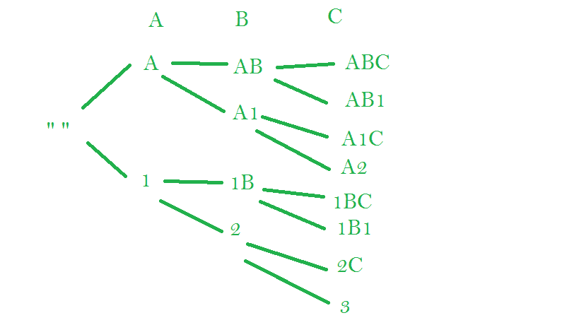

# 字符串的字母数字缩写

> 原文:[https://www . geesforgeks . org/字母数字-字符串缩写/](https://www.geeksforgeeks.org/alphanumeric-abbreviations-of-a-string/)

给定长度小于 10 的字符串。我们需要打印字符串的所有字母数字缩写。

字母数字缩写形式的字符与数字混合，数字等于选定子串的跳过字符数。因此，每当跳过一个*字符子串时，你必须用表示子串中字符数量的数字来替换它。*一个字符串可以有任意数量的跳过子字符串。任何两个子字符串都不应彼此相邻。因此，**结果中没有相邻的两位数。**更清晰的思路，请看例子。

示例:

```
Input : ANKS 
Output :
ANKS (nothing is replaced)
ANK1 (S is replaced) 
AN1S (K is replaced)
AN2  (KS is replaced)
A1KS (N is replaced)
A1K1 (N and S are replaced)
A2S (NK is replaced)
A3 (NKS is replaced)
1NKS (A is replaced)
1NK1 (A and S are replaced)
1N1S (A and N is replaced)
1N2 (A and KS are replaced)
2KS (AN is replaced)
2K1 (AN and S is replaced)
3S (ANK is replaced)
4 (ANKS is replaced)

Input : ABC
Output : 
ABC
AB1 
A1C 
A2 
1BC 
1B1 
2C 
3
Note: 11C is not valid because no two digits should be adjacent, 
2C is the correct one because AB is a substring, not A and B individually

```

来源:[谷歌面试问题](https://www.careercup.com/question?id=5093369735806976)

想法是从空字符串开始。每一步，我们都有两个选择。

1.  考虑性格的本来面目。
2.  添加要计数的字符。如果没有计数，则使用 1。



您可以看到每个字符如何作为一个字符或一个数字加到结果中。这进一步在末尾产生了 2^n 缩写，其中 n 是字符串的长度。

```
// C++ program to print all Alpha-Numeric Abbreviations
// of a String
#include <bits/stdc++.h>
using namespace std;

// Recursive function to print the valid combinations
// s is string, st is resultant string
void printCompRec(const string& s, int index,
                  int max_index, string st)
{
    // if the end of the string is reached
    if (index == max_index) {
        cout << st << "\n";
        return;
    }

    // push the current character to result
    st.push_back(s[index]);

    // recur for the next [Using Char]
    printCompRec(s, index + 1, max_index, st);

    // remove the character from result
    st.pop_back();

    // set count of digits to 1
    int count = 1;

    // addition the adjacent digits
    if (!st.empty()) {

        if (isdigit(st.back())) {

            // get the digit and increase the count
            count += (int)(st.back() - '0');

            // remove the adjacent digit
            st.pop_back();
        }
    }

    // change count to a character
    char to_print = (char)(count + '0');

    // add the character to result
    st.push_back(to_print);

    // recur for this again [Using Count]
    printCompRec(s, index + 1, max_index, st);
}

// Wrapper function
void printComb(std::string s)
{
    // if the string is empty
    if (!s.length())
        return;

    // Stores result strings one one by one
    string st;

    printCompRec(s, 0, s.length(), st);
}

// driver function
int main()
{
    string str = "GFG";
    printComb(str);
    return 0;
}
```

输出:

```
GFG 
GF1 
G1G 
G2 
1FG 
1F1
2G 
3

```

来源: [CareerCup](https://www.careercup.com/question?id=5093369735806976)

本文由**阿迪蒂亚·尼哈尔·库马尔·辛格**供稿。如果你喜欢 GeeksforGeeks 并想投稿，你也可以使用[contribute.geeksforgeeks.org](http://www.contribute.geeksforgeeks.org)写一篇文章或者把你的文章邮寄到 contribute@geeksforgeeks.org。看到你的文章出现在极客博客主页上，帮助其他极客。

如果你发现任何不正确的地方，或者你想分享更多关于上面讨论的话题的信息，请写评论。