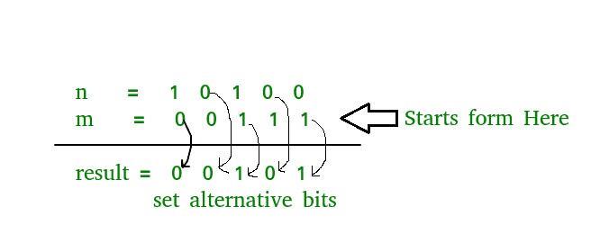

# 两个数字的交替位创建一个新的数字

> 原文:[https://www . geesforgeks . org/两个数字的交替位创建新数字/](https://www.geeksforgeeks.org/alternate-bits-of-two-numbers-to-create-a-new-number/)

给定两个数字，任务是使用两个数字中的替代位来创建结果。我们取第二个数的第一位，然后取第一个数的第二位，第二个数的第三位，取第一个数的第四位，以此类推，用它生成一个数。
**例:**

```
Input : n = 10, m = 11
Output : 11
Start from right of second number  
Binary representation of n = 1 0 1 0 
                             ^   ^     
Binary representation of m = 1 0 1 1     
                               ^   ^
Output  is                 = 1 0 1 1        

Input : n = 20, m = 7
Output : 5
Start from right of second number  
binary representation of n = 1 0 1 0 0
                           ^   ^
binary representation of m = 0 0 1 1 1
                         ^   ^   ^
Output  is                 = 0 0 1 0 1   
```

**进场:-**
1。获取设置的偶数位数 n.
2。得到集合奇数位数 m.
3。返回这些数字或。



## C++

```
// CPP Program to generate a number using
// alternate bits of two numbers.
#include <iostream>
using namespace std;

// set even bit of number n
int setevenbits(int n)
{
    int temp = n;
    int count = 0;

    // res for store 101010.. number
    int res = 0;

    // generate number form of 101010.....
    // till temp size
    for (temp = n; temp > 0; temp >>= 1) {

        // if bit is even then generate
        // number and or with res
        if (count % 2 == 1)
            res |= (1 << count);

        count++;
    }

    // return set even bit number
    return (n & res);
}

// set odd bit of number m
int setoddbits(int m)
{
    int count = 0;

    // res for store 101010.. number
    int res = 0;

    // generate number form of 101010....
    // till temp size
    for (int temp = m; temp > 0; temp >>= 1) {

        // if bit is even then generate
        // number and or with res
        if (count % 2 == 0)
            res |= (1 << count);

        count++;
    }

    // return set odd bit number
    return (m & res);
}

int getAlternateBits(int n, int m)
{
    // set even bit of number n
    int tempn = setevenbits(n);

    // set odd bit of number m
    int tempm = setoddbits(m);

    // take OR with these number
    return (tempn | tempm);
}

// Driver code
int main()
{
    int n = 10;
    int m = 11;

    // n  = 1 0 1 0
    //        ^   ^
    // m  = 1 0 1 1
    //          ^   ^
    // result= 1 0 1 1

    cout << getAlternateBits(n, m);

    return 0;
}
```

## Java 语言(一种计算机语言，尤用于创建网站)

```
// java Program to generate a number using
// alternate bits of two numbers.
import java.io.*;

class GFG {

    // set even bit of number n
    static int setevenbits(int n)
    {

        int temp = n;
        int count = 0;

        // res for store 101010.. number
        int res = 0;

        // generate number form of 101010.....
        // till temp size
        for (temp = n; temp > 0; temp >>= 1) {

            // if bit is even then generate
            // number and or with res
            if (count % 2 == 1)
                res |= (1 << count);

            count++;
        }

        // return set even bit number
        return (n & res);
    }

    // set odd bit of number m
    static int setoddbits(int m)
    {
        int count = 0;

        // res for store 101010.. number
        int res = 0;

        // generate number form of 101010....
        // till temp size
        for (int temp = m; temp > 0; temp >>= 1)
        {
            // if bit is even then generate
            // number and or with res
            if (count % 2 == 0)
                res |= (1 << count);

            count++;
        }

        // return set odd bit number
        return (m & res);
    }

    static int getAlternateBits(int n, int m)
    {
        // set even bit of number n
        int tempn = setevenbits(n);

        // set odd bit of number m
        int tempm = setoddbits(m);

        // take OR with these number
        return (tempn | tempm);
    }

    // Driver code
    public static void main (String[] args)
    {

    int n = 10;
    int m = 11;

    // n = 1 0 1 0
    //       ^   ^
    // m = 1 0 1 1
    //         ^   ^
    // result= 1 0 1 1
    System.out.println(getAlternateBits(n, m));
    }
}

// This code is contributed by vt_m
```

## 蟒蛇 3

```
# Python Program to generate a number using
# alternate bits of two numbers.

# set even bit of number n
def setevenbits(n):
    temp = n
    count = 0

    # res for store 101010.. number
    res = 0

    # generate number form of 101010.....
    # till temp size
    while temp > 0:

        # if bit is even then generate
        # number and or with res
        if count % 2:
            res |= (1 << count)

        count += 1
        temp >>= 1

    # return set even bit number
    return (n & res)

# set odd bit of number m
def setoddbits(m):
    temp = m
    count = 0

    # res for store 101010.. number
    res = 0

    # generate number form of 101010....
    # till temp size
    while temp > 0:

        # if bit is even then generate
        # number and or with res
        if not count % 2:
            res |= (1 << count)

        count += 1
        temp >>= 1

    # return set odd bit number
    return (m & res)

def getAlternateBits(n, m):
    # set even bit of number n
    tempn = setevenbits(n)

    # set odd bit of number m
    tempm = setoddbits(m)

    # take OR with these number
    return (tempn | tempm)

# Driver code
n = 10
m = 11

# n = 1 0 1 0
#     ^ ^
# m = 1 0 1 1
#         ^ ^
# result= 1 0 1 1

print(getAlternateBits(n, m))

# This code is contributed by Ansu Kumari.
```

## C#

```
// C# Program to generate a number using
// alternate bits of two numbers.
using System;

class GFG {

    // set even bit of number n
    static int setevenbits(int n)
    {

        int temp = n;
        int count = 0;

        // res for store 101010.. number
        int res = 0;

        // generate number form of 101010.....
        // till temp size
        for (temp = n; temp > 0; temp >>= 1) {

            // if bit is even then generate
            // number and or with res
            if (count % 2 == 1)
                res |= (1 << count);

            count++;
        }

        // return set even bit number
        return (n & res);
    }

    // set odd bit of number m
    static int setoddbits(int m)
    {
        int count = 0;

        // res for store 101010.. number
        int res = 0;

        // generate number form of 101010....
        // till temp size
        for (int temp = m; temp > 0; temp >>= 1)
        {
            // if bit is even then generate
            // number and or with res
            if (count % 2 == 0)
                res |= (1 << count);

            count++;
        }

        // return set odd bit number
        return (m & res);
    }

    static int getAlternateBits(int n, int m)
    {
        // set even bit of number n
        int tempn = setevenbits(n);

        // set odd bit of number m
        int tempm = setoddbits(m);

        // take OR with these number
        return (tempn | tempm);
    }

    // Driver code
    public static void Main ()
    {

        int n = 10;
        int m = 11;

        // n = 1 0 1 0
        // ^ ^
        // m = 1 0 1 1
        //     ^ ^
        // result= 1 0 1 1
        Console.WriteLine(getAlternateBits(n, m));
    }
}

// This code is contributed by vt_m
```

## 服务器端编程语言（Professional Hypertext Preprocessor 的缩写）

```
<?php
// PHP Program to generate a number using
// alternate bits of two numbers.

// set even bit of number n
function setevenbits($n)
{
    $temp = $n;
    $count = 0;

    // res for store 101010.. number
    $res = 0;

    // generate number form of 101010.....
    // till temp size
    for ($temp = $n; $temp > 0; $temp >>= 1)
    {

        // if bit is even then generate
        // number and or with res
        if ($count % 2 == 1)
            $res |= (1 << $count);

        $count++;
    }

    // return set even bit number
    return ($n & $res);
}

// set odd bit of number m
function setoddbits($m)
{
    $count = 0;

    // res for store 101010.. number
    $res = 0;

    // generate number form of 101010....
    // till temp size
    for ($temp = $m; $temp > 0; $temp >>= 1)
    {

        // if bit is even then generate
        // number and or with res
        if ($count % 2 == 0)
            $res |= (1 << $count);

        $count++;
    }

    // return set odd bit number
    return ($m & $res);
}

function getAlternateBits($n, $m)
{
    // set even bit of number n
    $tempn = setevenbits($n);

    // set odd bit of number m
    $tempm = setoddbits($m);

    // take OR with these number
    return ($tempn | $tempm);
}

// Driver code
$n = 10;
$m = 11;

// n = 1 0 1 0
// ^ ^
// m = 1 0 1 1
//     ^ ^
// result= 1 0 1 1

echo getAlternateBits($n, $m);

// This code is contributed by mits
?>
```

## java 描述语言

```
<script>
// javascript Program to generate a number using
// alternate bits of two numbers.

// set even bit of number n
function setevenbits(n)
{

    var temp = n;
    var count = 0;

    // res for store 101010.. number
    var res = 0;

    // generate number form of 101010.....
    // till temp size
    for (temp = n; temp > 0; temp >>= 1) {

        // if bit is even then generate
        // number and or with res
        if (count % 2 == 1)
            res |= (1 << count);

        count++;
    }

    // return set even bit number
    return (n & res);
}

// set odd bit of number m
function setoddbits(m)
{
    var count = 0;

    // res for store 101010.. number
    var res = 0;

    // generate number form of 101010....
    // till temp size
    for (temp = m; temp > 0; temp >>= 1)
    {
        // if bit is even then generate
        // number and or with res
        if (count % 2 == 0)
            res |= (1 << count);

        count++;
    }

    // return set odd bit number
    return (m & res);
}

function getAlternateBits(n , m)
{

    // set even bit of number n
    var tempn = setevenbits(n);

    // set odd bit of number m
    var tempm = setoddbits(m);

    // take OR with these number
    return (tempn | tempm);
}

// Driver code
var n = 10;
var m = 11;

// n = 1 0 1 0
//       ^   ^
// m = 1 0 1 1
//         ^   ^
// result= 1 0 1 1
document.write(getAlternateBits(n, m));

// This code is contributed by Princi Singh.
</script>
```

**输出:**

```
11
```