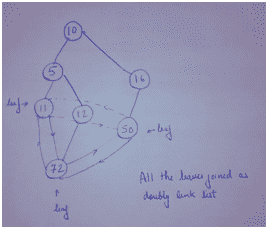

# 亚马逊面试体验|第 140 集(SDE 经验丰富)

> 原文:[https://www . geesforgeks . org/Amazon-面试-体验-设置-140-体验-sde/](https://www.geeksforgeeks.org/amazon-interview-experience-set-140-experienced-sde/)

嗨，最近我接受了亚马逊的采访。

**第一轮(电话):**
1。给定一个整数数组和一个常数 X，打印数组中乘积等于 X 的所有对数，
后续:O(n)中你会怎么做？你将如何处理重复的配对？
colla bedit 上需要代码。

2.[他问我知道二叉树的级序遍历吗。他让我编码然后，他换了个问题，问二叉树螺旋顺序遍历，让我编码。](https://practice.geeksforgeeks.org/problems/level-order-traversal-in-spiral-form/1)

**第二轮(电话):**
1。[在一个基站中，两个节点被交换。给定指向根节点的指针，找到两个节点并纠正树。他问了这个方法，然后让我用 collabedit 编写同样的代码。](https://practice.geeksforgeeks.org/problems/fixed-two-nodes-of-a-bst/1)

2.[给定一个整数数组，求数组中乘积最大的三个元素并打印出来。需要代码。](https://practice.geeksforgeeks.org/problems/three-great-candidates/0)

**第三轮(面对面现场)**
1。[给定 n 个整数的排序数组，计数并显示三元组的数量，使得 a[i] < a[j] < a[k]](https://practice.geeksforgeeks.org/problems/sorted-subsequence-of-size-3/1) 0(n)时间。需要代码。
2。在给定的字符串中，一些字符被问号替换，您可以用任何字符替换问号。给定这样一个字符串，找到可以创建的回文总数。字符串仅包含[a-z]字符，问号也只能由[a-z]替换。示例:输入字符串:字符串？？a "输出:26
3。[给定一棵二叉树，所有的叶子节点以双链表的形式出现。找到树的高度。](https://practice.geeksforgeeks.org/problems/height-of-spiral-tree/1) [](https://media.geeksforgeeks.org/wp-content/cdn-uploads/amazonInterview1.png)

**第 4 轮(招聘经理轮):**
关于之前公司工作的详细讨论？

我为什么要离开以前的雇主？

为什么是亚马逊？

如果我不喜欢这份工作呢？

我在工作中遇到了哪些挑战，我是如何解决的？

弱点和优势？

路由器是做什么的，什么是静态路由？给定一个路由表，您将如何减少路由器决定必须将数据包转发到哪个路由器的时间？

可以实现的算法的细节，并讨论时间和空间的复杂性。

**第 5 轮(面对面现场):**
1。[给定 N 个不同长度的排序链接列表，将它们合并成一个单一的排序链接列表](https://practice.geeksforgeeks.org/problems/merge-k-sorted-linked-lists/1)。需要伪代码。

2.给定数字 d 和数组 n 的大小。打印数组中所有元素的组合，这样数组的第一个元素是 d，数组中的下一个元素可以是数组中的前一个元素+1 或-1。需要代码。

```
E.g. Input: d=4 N=3
Output:
  4 3 2
  4 3 4
  4 5 4
  4 5 6
```

3.[什么是 lru 和 LRU 的实现？](https://practice.geeksforgeeks.org/problems/lru-cache/1)为同一个写伪代码。

我要感谢 GeeksforGeeks 为我们提供了这样一个学习平台。

如果你喜欢极客博客并想投稿，你也可以写一篇文章并把你的文章邮寄到 contribute@geeksforgeeks.org。看到你的文章出现在极客博客主页上，帮助其他极客。

[All Practice Problems for Amazon](https://practice.geeksforgeeks.org/company/Amazon/) !