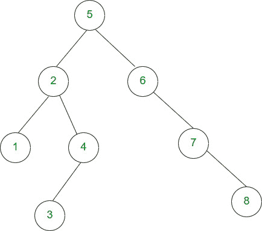
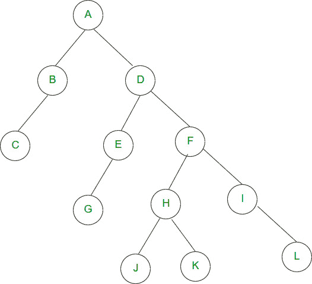
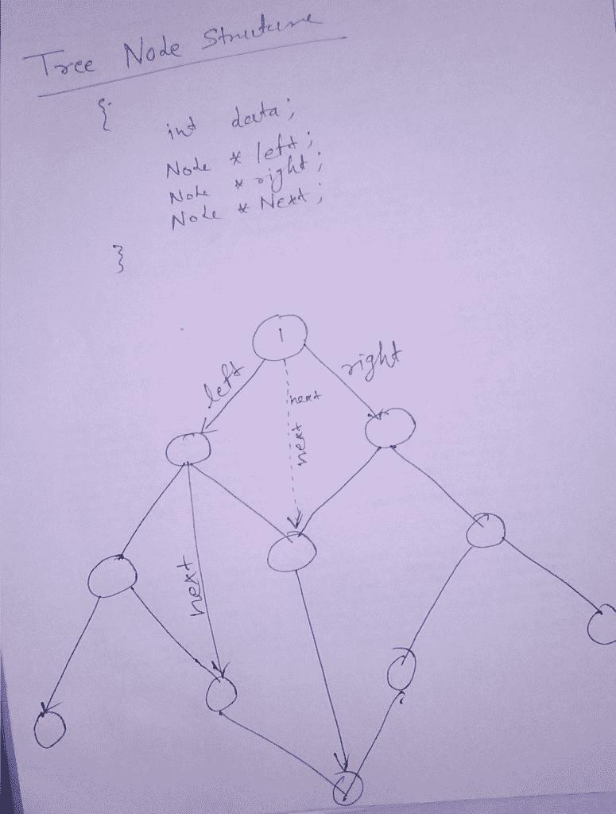

# 亚马逊面试体验|第 187 集(针对 SDE1)

> 原文:[https://www . geesforgeks . org/Amazon-interview-experience-set-187-for-SDE 1/](https://www.geeksforgeeks.org/amazon-interview-experience-set-187-for-sde1/)

嗨，最近我接受了海得拉巴亚马逊 SDE 一号职位的面试。有一个电话回合，接着是 4 个 F2F 回合。

**电话回合:**
1。[给定一个数组，找出满足三角形性质的所有三元组(2 条边的和应该大于 3 条边)](https://practice.geeksforgeeks.org/problems/count-possible-triangles/0)

2.[给定一个数组，找出它是否是多数数组。](https://practice.geeksforgeeks.org/problems/majority-element/0)
复杂度:O(n)空间复杂度 O(1)

**F2F 第 1 轮:**
1。给定一个依赖关系，其中对于 java 包 p1、p2、p3
p1:{p2、p3}
p2:{p3}
p3:{}
这意味着 p1 可以在 p2 和 p3 编译完成时编译
p2 可以在 p3 编译时编译
p3 可以开始，因为它没有任何依赖关系。
制定策略，找到流程的编译顺序。
Ans:拓扑排序
2。项目讨论
问了所有和我最后一年项目相关的概念。
3。公司当前项目
公司面临的挑战

**2F 第二轮:**T2 第一轮。给定一棵二叉树，从左到下到上打印它的侧视图，从右到上打印它的侧视图。
例如，对于图像 1，输出将是 3、1、2、5、6、7、8

例如例 2(图像 2)输出应该是 C、B、A、D、F、I、L

2.[给定一个字符串，找到其中最大的回文子串](https://practice.geeksforgeeks.org/problems/longest-palindrome-in-a-string/0)。

3.什么是虚拟内存？
4。什么是 OS 中的分页？

**2F 第 3 轮:**
1。为什么要在 6 个月的经历中寻找改变。
2。讨论当用户在 facebook
这样的社交网络上发帖时，如何向好友发送通知讨论的是何时加载用户的好友列表，他希望我们在用户登录时加载好友列表。

**2F 第 4 轮:**
1。讨论当前项目面临的挑战
在团队领导/经理不在的情况下必须做出决定的情况
2。为什么你要在 6 个月的经验中寻求改变

3.[给定图 3 中给出特殊二叉树结构，一个节点有 3 个节点指针左、右和下两个相邻的节点左右共享，如 tree 所示给定树，其节点被设置为下一个指针为空。](https://practice.geeksforgeeks.org/problems/connect-nodes-at-same-level/1)
你要设置下一个指针如图所示。
如果任何节点为空，那么它的上一个节点的下一个应该是那个节点的下一个，例如 a - > b - > c (a 的下一个是 b，b 的下一个是 c)如果 b 为空，那么 a 的下一个应该是 c。

4。什么是虚拟内存？
5。什么是分段故障？

注意:-他们期望代码全面工作。

**提示:**
1。想大声点他们永远支持你
2。如果没有得到，请寻求提示。

如果你喜欢极客博客并想投稿，你也可以写一篇文章并把你的文章邮寄到 contribute@geeksforgeeks.org。看到你的文章出现在极客博客主页上，帮助其他极客。

## 相关实践问题

[Majority Element](https://practice.geeksforgeeks.org/problems/majority-element/0)[All Practice Problems for Amazon](https://practice.geeksforgeeks.org/company/Amazon/) !