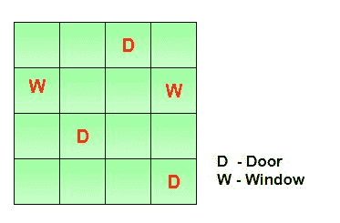

# 亚马逊面试体验|第 257 集(校外)

> 原文:[https://www . geesforgeks . org/Amazon-面试-体验-设置-257-校外/](https://www.geeksforgeeks.org/amazon-interview-experience-set-257-off-campus/)

我最近接受了 SDE 的亚马逊面试。这是 TRMS 团队在德里的一次校外活动。

**笔试:**
Q1) [找个峰素。](https://practice.geeksforgeeks.org/problems/peak-element/1)
Q2) [二叉树俯视图。](https://practice.geeksforgeeks.org/problems/top-view-of-binary-tree/1)
Q3) [二叉树](https://practice.geeksforgeeks.org/problems/maximum-difference-between-node-and-its-ancestor/1)中节点与其祖先的最大差异。

**第 1 轮(F2F):**
Q1) [在排序数组中，每个数字出现两次，只有一个数字出现一次。你必须找到一次出现的数字。](https://practice.geeksforgeeks.org/problems/find-the-element-that-appears-once-in-sorted-array/0)期望复杂度:O(log N)
Ex : 101，101，200，200，301，450，450
输出:301
Q2) [用随机指针克隆一棵二叉树](https://practice.geeksforgeeks.org/problems/clone-a-binary-tree/1)。
在这两个问题中，他们需要一个适当的工作代码来覆盖每个边缘案例。

**第 2 回合(F2F):**
Q1) [下一个更大的元素](https://practice.geeksforgeeks.org/problems/next-larger-element/0)。
Q2)你得到了一个格子，上面有一些门、墙和一些空地。
第一部分:你必须说出最少的从格子中的随机位置到最近的门的移动次数。你只能向四个方向移动，即左、右、上、下。

第二部分:每个空单元到最近的门的最小距离。对问题的两个部分都进行了大量的讨论。
我花了一些时间，终于想出了使用广度优先遍历的工作解决方案。
Q3) [从给定的列号中查找 Excel 列名。](https://practice.geeksforgeeks.org/problems/excel-sheet/0https://practice.geeksforgeeks.org/problems/excel-sheet/0)
这是最艰难的一轮。
面试者乘坐飞往班加罗尔的航班，时间不早了。接下来的两轮是电话。

**第三轮(电话):**
这一轮被招聘经理拿下。
Q1)说说你自己。你现在的公司，你的角色和责任。离职原因。
Q2)一个 100 硬币拼图。
Q3)写“a.out”后按回车键会发生什么。他想知道在为您的代码创建可执行文件后，操作系统执行的功能。
Q4)当您的代码遇到空值时会发生什么？
Q5)Java 中的垃圾收集器。有什么不同？

**第 4 轮(电话):**
Q1)说说你自己。你现在的公司，你的角色和责任。
Q2)被问及当前公司面临的挑战。任何你和你的经理意见不一致的情况。当前公司执行的任何创新或独特工作。
Q3) [连接同级节点](https://practice.geeksforgeeks.org/problems/connect-nodes-at-same-level/1)。
期望适当的工作代码覆盖所有边缘情况。他们分享了协作链接。
Q4)什么是锁定？问到信号量，虚拟内存，进程调度。

如果你喜欢极客博客并想投稿，你也可以写一篇文章并把你的文章邮寄到 contribute@geeksforgeeks.org。看到你的文章出现在极客博客主页上，帮助其他极客。

[All Practice Problems for Amazon](https://practice.geeksforgeeks.org/company/Amazon/) !