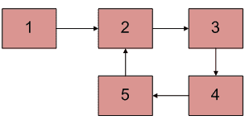

# 亚马逊面试体验|第 295 集(校内)

> 原文:[https://www . geesforgeks . org/Amazon-面试-体验-设置-295-在校园内/](https://www.geeksforgeeks.org/amazon-interview-experience-set-295-on-campus/)

亚马逊参观了我们的 FTE(全职员工)校园。面试过程从一轮在线编码开始，然后是 4 次面对面的面试。随着我们进入下一轮，难度增加了。所有的面试都是从简单介绍我开始的。

**线上回合:**

一场包含 22 个问题的黑客竞赛，包括 2 个编码问题和 20 个 MCQ 问题，涉及 [C](https://www.geeksforgeeks.org/quiz-corner-gq/) 、 [OS](https://www.geeksforgeeks.org/quiz-corner-gq/) 、 [DBMS](https://www.geeksforgeeks.org/quiz-corner-gq/) 、[网络](https://www.geeksforgeeks.org/quiz-corner-gq/)。
这 20 个 MCQ 主要基于算法分析，例如特定代码片段的时间复杂度空间复杂度，基本 C，java [输出](https://www.geeksforgeeks.org/category/program-output/)基于问题，操作系统[互斥](https://www.geeksforgeeks.org/mutex-vs-semaphore/)，信号量，IPC，同步等..
以下是我记得的一些问题

1.  **以下哪种排序算法的 nlogn 复杂度最差？**
    Ans:合并排序，堆排序。
2.  **在链表中给定节点后插入节点的时间？**
    Ans:O(1)。
3.  【fork()系统调用被调用 n 次时创建的子进程数？
    Ans:2^n-1(i 猜)。
4.  **Int arr[5]={1，2}，cout<T3】a[2]<T5】a[3]<T7】a[4]；。。。以下代码片段的输出是什么？** Ans:0，0，0。
5.  **假设数组中始终存在被搜索的元素，使用线性搜索来搜索数组中的元素所花费的平均时间？** Ans: (n+1)/2。
6.  **给你一个数组，你要找出哪个代表最大/最小堆？**
7.  **你是一棵二叉树的两次遍历，，你要找出问的遍历吗？**例如:Inorder=4，8，10，12，14，20，22。等级顺序=20，8，22，4，12，10，14 找到 preoreder？答复:20、8、4、12、10、14、22
8.  **给你一个二叉查找树和一个搜索给定密钥所需的密钥时间？** Ans:O(log(n))平衡 BST 的最坏情况 O(n)正常 BST 的最坏情况(这种情况发生在左/右偏斜树)。

**编码问题**:

1.  [给你一组正整数，代表建筑物的高度。假设每栋建筑的宽度为 1。你必须找到建筑物的最大矩形面积。](https://practice.geeksforgeeks.org/problems/maximum-rectangular-area-in-a-histogram/0)
2.  给你一个字符串，比如说“saideep”，s-1，a-1，i-1，e-2，d-1，p-1 是每个字符的频率。字符串的值定义为每个不同字符计数的平方和，上述字符串的值为 1+1+1+1+4 = 8；你的任务是**在去掉‘k’字符后最小化字符串的字符串值**。
    **Ans:** 这是一个直截了当的问题，你用一个 256 的数组来存储每个字符的频率，对于 k 次，你找到一个最大频率的字符，并将其频率递减 1。k 次迭代后，打印剩余字符得到的值函数。

**F2F 1 ( 1 小时 30 分钟，技术)**:

面试官是女士，大概比我大 3-4 岁。她问了我两个编码问题:

1.  [You are given a binary tree , you have to print extreme nodes of it.](https://practice.geeksforgeeks.org/problems/extreme-nodes-in-alternate-order/1)? Give me an algorithm that is robust, works fine for all cases, explain the space complexity and time complexity of you algorithm?
    For Example:

    ```
          1
        /  \
       2    3
      /  \   \  
     4    5   8 
             /  \
           6    7

    ```

    **输出:** ( 1 2 8 6)或(1 3 4 7)
    **Ans:** 它只是一个级别顺序遍历的修改，跟踪一个布尔标志变量并在每次迭代后翻转它。然后她让我工整地写完整的代码。

2.  [You will be given two linked lists that consists of digits 0-9 only in each node. Each linked list represents a Number ,you have to add two numbers represented by a linked list?](https://practice.geeksforgeeks.org/problems/add-two-numbers-represented-by-linked-lists/1)
    For Ex:

    ```
    Input:
    First List: 5->6->3 // represents number 365
    Second List: 8->4->2 // represents number 248
    Output
    Resultant list: 3->1->6 // represents number 613

    ```

    我说我已经知道她跳到下一个问题的问题了

3.  [会给你一个链表，里面包含循环，如果存在检测到它并删除它？](https://practice.geeksforgeeks.org/problems/remove-loop-in-linked-list/1)例如: [](https://media.geeksforgeeks.org/wp-content/cdn-uploads/linked-list-loop-detection.png) **Ans:** 首先我给出了一个散列式的解决方案，对所有情况都有效。这个想法是，每当我看到一个节点，我就在哈希表中进行查找，看看它是否已经存在于表中，如果存在，那么就有一个循环，我使这个节点==NULL。
    否则我将在哈希表中插入该节点，并移动到下一个节点。
    她对那个解决方案没意见，但是它需要哈希表的 O(n)空间，所以她让我在 O(n)时间和 O(1)空间内做。
    然后我得到了那个 2 指针方法( [floyds 循环检测算法](https://practice.geeksforgeeks.org/problems/remove-loop-in-linked-list/1)，所以我给出了那个方法，通过这个方法我们可以很容易地检测到一个循环，但是去除它需要一些数学(与一维运动学相关)。
    然后她让我工整地写完整的代码。

**F2F 2(1 小时 30 分钟技术):**

他给了我两个编码问题

1.  [给你一个有不同字符的字符串，你要打印它的所有排列？](https://practice.geeksforgeeks.org/problems/permutations-of-a-given-string/0)
    例如:**输入:**【AB】
    **输出:** AB，BA
    这是一个直截了当的问题，我给他一个回溯方法，他让我用一个例子来解释回溯是如何工作的。然后他让我工整地写完整的代码。

*   You are given a maze which describes the way for a goat to reach its house.Maze is usually a M*N grid consisting of only 0’s and 1’s .Goat initially is at (0,0) point in the maze and it has to reach point(M-1,N-1).The only possible move the goat can make is go RIGHT,DOWN,RIGHT-DOWN(DIAGONAL) i.e from a point (i,j) goat can move to(i+1,j) or(i,j+1) or (i+1,j+1) point.Goat can make only one step at a time. Your task is to find number of such paths for the goat to reach its house.
    Point (0,0) and point(M-1,N-1) are abviously 1\. A 1 indicates that the point can be used and 0 indicates that the point is blocked in the sense we cannot go to the point at any cost. **Ans:** I gave him a recursive solution initially and explained him about the drawbacks of that solution, that it takes exponential time to solve that problem.
    I then explained how i can use Dynamic programming to solve this problem and gave him a DP solution.He was very much impressed with my solution and asked me the time and space complexities of that solution.He then asked me write complete code neatly.

    **F2F 3(1 小时技术):**

    面试官看了我的简历和我之前几轮面试的表现，说自我介绍。我自我介绍:他问我有没有实习过。我说不，先生，我在一些公司有机会，但我没有抓住。然后他问我这个夏天你学到了什么，我说我为实习做了准备，我做了 1-2 个迷你项目。
    然后他问我你为什么不带那个实习生。我告诉他我不喜欢那些公司的招聘流程本身我怎么能在公司工作。我说他们都问了我很薄弱的记忆概念，甚至没有问我一个逻辑问题。他甚至没有问我一个编码问题。

    他说，让我们开始我们的过程，你在这里是因为你的编码技能，但在这一轮我会问你理论问题。

    他问我

    1.  触发器和存储过程的区别？
    2.  [螺纹与工艺](https://www.geeksforgeeks.org/thread-in-operating-system/)的区别？
    3.  定义死锁和竞争条件？
    4.  如何检测[死锁](https://www.geeksforgeeks.org/deadlock-detection-recovery/)？
    5.  什么是资源分配图及其与死锁的关系，图中有哪些节点？
    6.  他问我知道哪些数据结构，并给出了它们的实时例子？
    7.  [在数据库管理系统中索引](https://www.geeksforgeeks.org/indexing-in-databases-set-1/)
    8.  索引的类型
    9.  如何在数据库中建立索引(b 树和 b+树)
    10.  视图、视图类型及其优点

    然后他给了我一个编码问题:你必须用右边紧挨着的小元素替换数组的每个元素。如果这样的元素不存在，不要替换它。
    **Ans:** 我给了他一个堆栈解决方案，他非常满意，并让我编写代码来处理角落案例。然后他让我工整地写完整的代码。他对我的代码很满意，让我在外面等下一轮。

    **F2F 4 ( HR+TECHNICAL ) :**

    他先请我做自我介绍，然后给了我一个编码问题。这是一个很难回答的问题[你会得到一个地板尺寸(m*n)和可以放入大矩形的子矩形..你必须打印给定尺寸的小矩形的平面图。](https://practice.geeksforgeeks.org/problems/ways-to-tile-a-floor/0)
    他给我解释说需要先构建切片树，然后打印平面图。他问你将使用哪些数据结构来构建它，并让我想一想。

    **Ans:** 我给了他一个基于栈/队列的方法。我告诉他，我将按长度/宽度对子矩形进行排序，并按 d =递增的顺序将它们堆叠起来。。他对我的算法非常满意，让我给它编码。我把它完全编码后给他看了。。我只是解决了问题，没有打印平面图，这是我们的实际问题。。然后我在里面实现了打印功能。
    他说他面试完了，问我有没有问题。
    我问他目前在做什么样的项目，以及一些关于技术的非正式讨论。

    附言:每个人都知道这个算法，但它的实现需要健壮、干净的代码，涵盖所有测试用例。它们肯定会给出我们的代码无法执行的角落用例，所以请确保您编写了一个通用代码。确保您提出任何疑问，以澄清给定的问题/场景。面试官很有帮助，如果你被打动了，他们会给你暗示。

    感谢极客们。。它在我的准备中帮助了我很多。

    如果你喜欢极客博客并想投稿，你也可以写一篇文章并把你的文章邮寄到 review-team@geeksforgeeks.org。看到你的文章出现在极客博客主页上，帮助其他极客。

    如果发现有不正确的地方，请写评论，或者想分享更多关于以上讨论话题的信息

    [All Practice Problems for Amazon](https://practice.geeksforgeeks.org/company/Amazon/) !