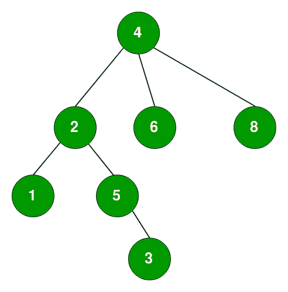

# 亚马逊采访|第 87 集(面向 SDE)

> 原文:[https://www.geeksforgeeks.org/amazon-interview-set-86-sde/](https://www.geeksforgeeks.org/amazon-interview-set-86-sde/)

我最近清空了亚马逊 SDE 的位置。通过我的准备极客 forGeeks 发挥了很大的作用，这是唯一一个我在准备阶段超过 90%的时间参考/关注的网站。

请在下面找到我在亚马逊的经历。
**1 笔试**
1) [给定一组数字，在每个元素的右边找到下一个更大的否](https://practice.geeksforgeeks.org/problems/next-larger-element/0)

```
Example-    Input     12 15 22 09 07 02 18 23 27
            Output    15 22 27 18 18 18 23 27 -1
```

**2)** [给定一个链接列表并输入 int K，在 K 大小的槽中反向链接列表](https://practice.geeksforgeeks.org/problems/reverse-a-linked-list-in-groups-of-given-size/1)

```
Example Input 12--> 13--> 3--> 20--> 55--> 87--> 20--> 77--> 90 Lets k =3
Output 3--> 13->12--> 87--> 55--> 20--> 90--> 77--> 20
```

**3)** [给定树，输入 int K，打印离叶子 K 距离的节点。](https://practice.geeksforgeeks.org/problems/node-at-distance/1)
输入在树下面，k = 2



输出-2、5、4

**2。
第一轮 F2F(DS 和 Algo)** 两个面试官在小组里，只有一个在问问题，另一个只是在观察，他记下了我们之间发生的所有对话，并注意到了我提供的方法和解决方案。这在所有的面试中都很常见。

**1)** [分别给定一个无穷串的 0 和 1。你需要找到从 0 到 1 的转换点。](https://practice.geeksforgeeks.org/problems/find-transition-point/1)
我在 O(n)中给出了原生解。他告诉要多优化。直接二分搜索法不能应用于它，因为字符串是无限的，并且没有给出字符串的长度。
我说过我会把字符串分成 10 个大小的槽，这样可以降低复杂性。尽管如此，他还是告诉我要进一步优化。我告诉过你我会以 2 的幂增加槽的大小，比如 2，4，8，16，32。他对此很满意。
他又把它复杂化了，他补充说现在我字符串包含 0，1，2 的排序顺序。你需要找到从 0 到 1 和 1 到 2 的转换点。我提供了方法。
之后告诉这次我想让它通用。字符串可以包含 0 到 n(输入)个查找所有转换点的数字。我解决了它，他对这种方法很满意，并告诉我为它编写代码。

**2)** [从两个排序的数组中找出公共元素](https://practice.geeksforgeeks.org/problems/union-of-two-arrays/0)

**3。第二 F2F(DS 和 Algo)**

**1)** 我破解起来有点困难，她从 java 克隆中陈述询问，这是我的薄弱环节。给定一个包含字符串“名称”和对朋友的引用的类，如下所示。

```
Class A {
   A(String str, Person P { //Constructor
       this. name = str;
       this.friend= P ;
   }
   // override
   Clone() {
       // code for this function was expected from me
       // which can produce the deep copy
   }
}
```

假设 A–> B–> C–> D 表示 A 是 B 的朋友，B 是 C 的朋友，以此类推..
调用一次 Clone 方法会像
A’–>B’–>C’–>D(这里 A’是 A 的克隆)一样克隆整个好友列表。
破解这个对我来说真的很难，因为我不熟悉这些问题。

**2)** [如何从单链接列表中找到最后第 n 个元素，](https://practice.geeksforgeeks.org/problems/nth-node-from-end-of-linked-list/1)对我来说很容易。
2 分钟解决，快速写代码。

**3)** [给定一个由数字、值 K 和值 X 组成的排序数组，找到与值最接近的 K 个数字](https://practice.geeksforgeeks.org/problems/k-closest-elements/0)
示例:输入 12 16 22 30 35 39 42 45 48 50 53 55 56K = 4 X = 35
输出 22 30 39 42
面试官时间不多了，因为第一个问题花费了大量时间。所以她告诉只告诉方法，代码是不期望的。

**4。第三届 F2F(酒吧筹集者)**

Interviewer was of friendly nature. He was very senior and very cool guy. Started with my project question and then some behavioral question and in last one technical questionWhat is your current project, What value you added in your project till now.What challenges you faced while working in project and how did you overcome.What was the important learning for you in last project.If you have the option to go 3 year back in life, then what would you like to change in life, means which skills and steps/decision you want to gain or change.What you did in past on which you feel proud.. blaa blaa….Given a tree, how will you find the vertical sum of nodesrefer this link to understand more about question[Print a Binary Tree in Vertical Order](https://practice.geeksforgeeks.org/problems/print-a-binary-tree-in-vertical-order/1)I gave the solution using Hash map, but he was not satisfy with answer. He told to gave other solution because Hash map will increase the space complexity. I used array solution which was increase time complexity, then i used circular link list and finally solve it using doubly link list. He was satisfy with solution. Told me to code for it.

**5。第四轮 f2f(OOPS，设计模式和操作系统基础)**

Started with my project details, my project was in android mobile, so he told me to design a “Contact application”. Class diagram and their relationship was expected from me. What all design pattern you can use in that.Explain inheritance and Base class is given you need to stop exposing the base class methods without touching the base class at all. It was really tricky.    question i liked it.What is deadlock and How to detect deadlock in system.Concept of Database normalization and various types of it.He also started asking some networking question. Like TCP/IP, socket connection.How the chat between 2 user work internally, internally how the packets flows between layer. And suppose user A send “Hi” message to user B and user B just shutdown the system. What will happen in that case.

**6。第五名 f2f(招聘经理)**

Why you want to join Amazon.What did you know about Amazon.Current project explanation.What new code you implemented and how much impact it put on other.Given a tree, write the In-order traversal. I wrote in 2 min using recursion.Next addition was, can you write it using iteration tried and wrote some buggy code.He started checking and told the bug and told me to correct it. Even-through i solved the same question at my home, Still it was not clicking my mind. I started correcting it but failed. After that interviewer gave one hint. I used the hint and solved the whole code again. He was running out of time so took the code sheet and told i will check it later in free time.Refer this link for actual solution and proper understanding of last question[Inoreder traversal without recurssion ](https://practice.geeksforgeeks.org/problems/inorder-traversal/1) 

**面向所有人的信息:-**
亚马逊希望代码准确、精确，复杂度更低。所以首先和你的面试官讨论一下方法。不要跳入代码。
即使不知道正确答案，也要继续讨论解决问题的各种可能性，尝试用不同的角度破解那个问题。练习越来越多的真题。

非常非常祝贺作者。如果你喜欢极客博客并想投稿，你也可以写一篇文章并把你的文章邮寄到 review-team@geeksforgeeks.org。看到你的文章出现在极客博客主页上，帮助其他极客。

[**亚马逊所有练习题**](https://practice.geeksforgeeks.org/company/Amazon/) **！**