# 算法分析|第五集(摊销分析介绍)

> 原文:[https://www . geesforgeks . org/analysis-algorithm-set-5-摊销-analysis-introduction/](https://www.geeksforgeeks.org/analysis-algorithm-set-5-amortized-analysis-introduction/)

[摊销分析](http://en.wikipedia.org/wiki/Amortized_analysis)用于偶尔一次运算非常慢，但其他大部分运算都比较快的算法。在摊销分析中，我们分析一系列操作，并保证最坏情况下的平均时间低于特定昂贵操作的最坏情况时间。
使用摊余分析分析其操作的示例数据结构是散列表、不相交集和显示树。

让我们考虑一个简单的哈希表插入的例子。我们如何决定桌子的大小？在空间和时间之间有一个权衡，如果我们使哈希表变大，搜索时间变短，但是所需的空间变大。

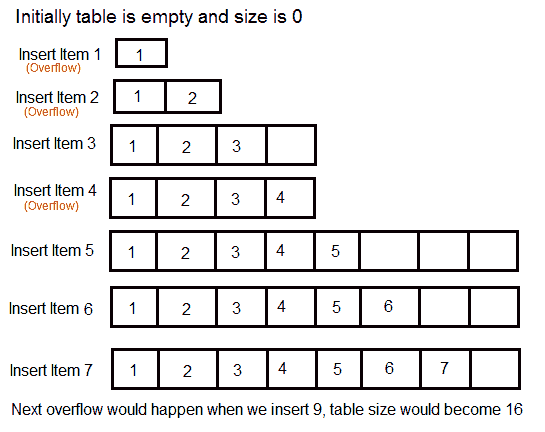

这个权衡问题的解决方案是使用[动态表(或数组)](http://en.wikipedia.org/wiki/Dynamic_array)。这个想法是增加表的大小，每当它变满。以下是当表变满时要遵循的步骤。
1)为更大的表分配内存，通常是旧表的两倍。
2)将旧表的内容复制到新表。
3)解放旧桌子。

如果表有可用空间，我们只需在可用空间中插入新项目。

**使用上述方案进行 n 次插入的时间复杂度是多少？**
如果我们用简单的分析，一次插入的最坏情况成本是 O(n)。因此，n 个嵌件的最坏情况成本为 n * O(n)，即 O(n 2 )。该分析给出了一个上限，但不是 n 个插入的严格上限，因为所有插入都不需要θ(n)时间。

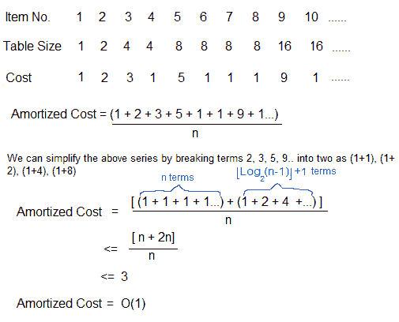

因此，使用摊销分析，我们可以证明动态表方案具有 O(1)插入时间，这是散列中使用的一个很好的结果。另外，动态表的概念用在 C++中的[向量、](http://www.cplusplus.com/reference/vector/vector/)Java 中的[数组列表](http://docs.oracle.com/javase/7/docs/api/java/util/ArrayList.html)中。

以下是一些重要的注意事项。
**1)** 一系列操作的摊余成本可以看作是一个受薪者的支出。这个人的平均月支出小于或等于工资，但是这个人可以通过买车什么的在特定的月份花更多的钱。在其他月份，他或她会为昂贵的月份存钱。

**2)** 以上对动态数组示例所做的摊销分析称为 ***合计法*** 。做摊销分析还有两种更强大的方法叫做 [***会计方法***](http://en.wikipedia.org/wiki/Accounting_method)**和 [***位势法***](http://en.wikipedia.org/wiki/Potential_method) 。我们将在不同的帖子中讨论其他两种方法。**

****3)** 摊销分析不涉及概率。平均运行时间还有另一个不同的概念，算法使用随机化使其更快，并且预期运行时间比最坏情况下的运行时间更快。使用随机分析对这些算法进行分析。这些算法的例子有随机快速排序、快速选择和散列。我们将很快在另一篇文章中介绍随机分析。**

****红黑树插入摊销分析****

**让我们用位势法讨论红黑树运算(插入)的摊销分析。**

**为了进行红黑树插入操作的摊销分析，我们使用了位势(或物理学家)方法。对于势方法，我们定义了一个势函数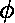，它将数据结构映射到一个非负实值。一个操作可以导致这个电位的改变。**

**让我们以如下方式定义势函数:**

**(1) 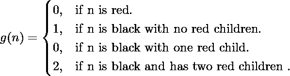**

**其中 n 是红黑树的节点**

**势函数 = 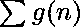，覆盖红黑树的所有节点。**

**此外，我们将一项业务的摊余时间定义为:**

****摊销时间** = c + 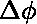 (h)**

**(h)=(h’)–(h)
其中 h 和 h’分别是手术前后红黑树的状态
c 是手术的实际费用**

**潜力的变化对于低成本运营应该是积极的，对于高成本运营应该是消极的。**

**红黑树的叶子上插入了一个新节点。我们有下列任何一种红黑树的叶子:** 

**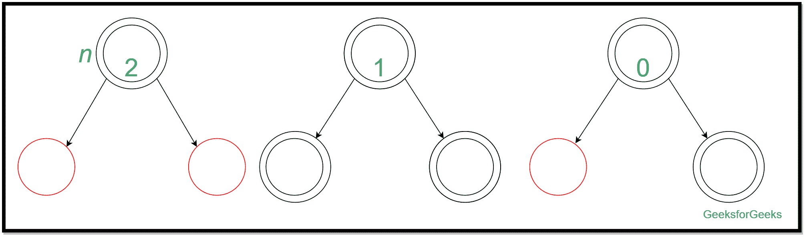**

**插入及其摊销分析可表示为:
**(1)****

**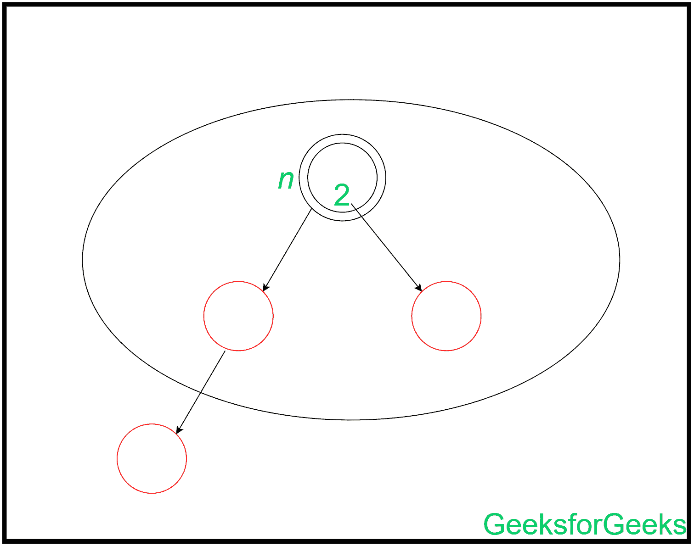**

**这种插入是通过首先重新着色父对象和另一个兄弟对象(红色)来执行的。然后考虑该叶节点的祖父母、外祖父母进行进一步的回集，导致**摊余成本**为 **-1** (当叶节点的祖父母为红色时)、 **-2** (当叶叔叔为黑色、祖父母为黑色时)或 **+1** (当叶叔叔为红色、祖父母为黑色时)。插入可以显示为:** 

**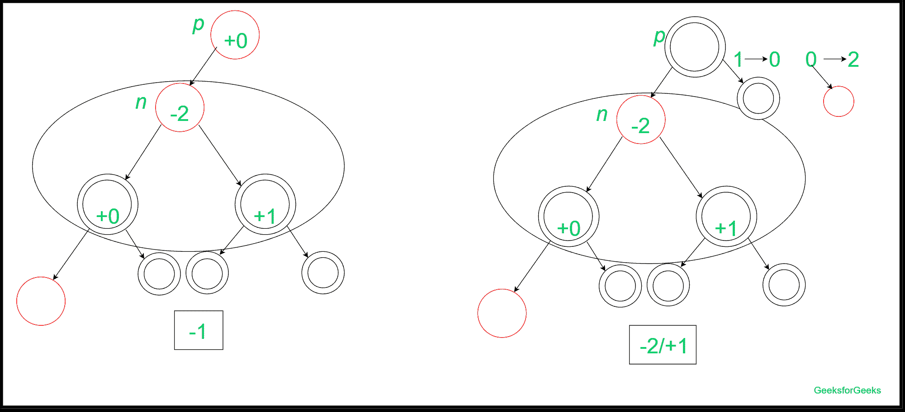**

****(2)**** 

**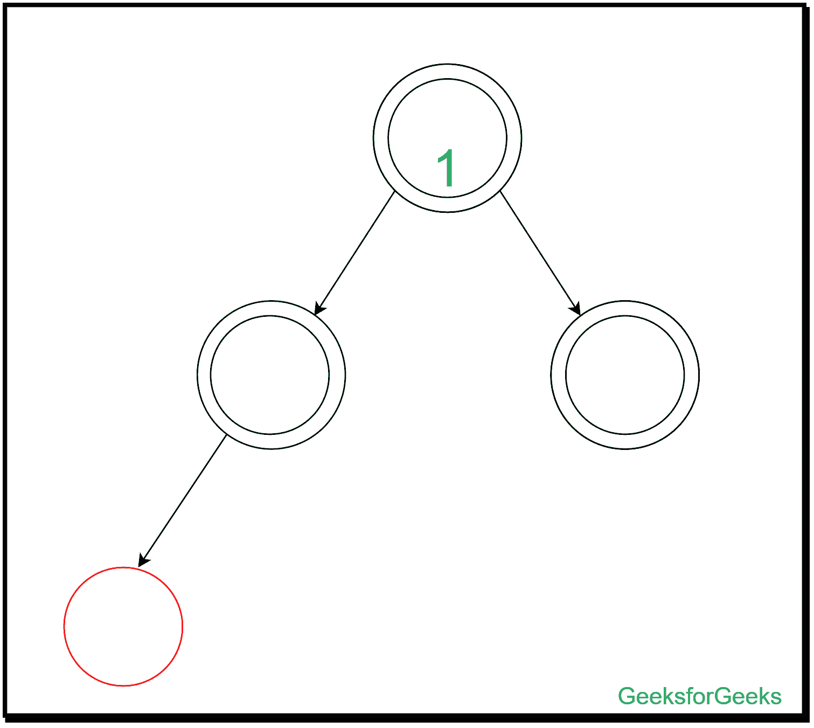**

**在此插入过程中，由于树叶的黑色深度保持不变，因此插入的节点没有任何变化。当叶子可能有一个**黑色兄弟**或者**没有任何兄弟**时(因为我们认为空节点的颜色是黑色)，就是这种情况。**

**所以本次插入的**摊余成本**为 **0** 。**

****(3)**** 

****

**在此插入中，我们不能对叶节点、其父节点和同级节点重新着色，以使黑色深度保持不变。因此，我们需要执行左-左旋转。**

**旋转后，当 g 的祖父母(插入的节点)是黑色时，没有变化。同样，对于 g 的红祖父母(插入的节点)的情况，我们没有任何改变。所以插入完成**摊余成本= +2** 。插入内容描述如下:** 

**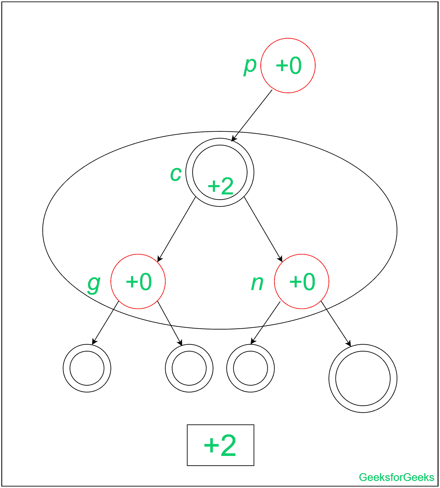**

**在计算了红黑树叶子部位的这些特定摊余成本后，我们可以讨论插入红黑树的总摊余成本的性质。因为这可能发生，所以两个红色节点可能具有父子关系，直到红黑树的根。**

**因此，在极端(或角落)情况下，我们将有两个红色子节点的黑色节点的数量减少 1，最多将没有红色子节点的黑色节点的数量增加 1，给潜在函数留下最多 1 的净损失。因为一个潜在的单位为每个操作付费**

** (h) 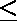 n
其中 n 为节点总数**

**因此，插入红黑树的**总摊余成本**为 **O(n)** 。**

**对于红黑树插入的任何疑问，您可以参考红黑树插入。**

****来源:**
[伯克利第 35 讲:摊销分析](https://www.youtube.com/watch?v=UYcWpldlX-o)
[麻省理工第 13 讲:摊销算法、表加倍、位势法](https://www.youtube.com/watch?v=b733mo4CxAQ)
[http://www . cs . Cornell . edu/courses/cs 3110/2011 sp/讲座/lec20-摊销/摊销. htm](http://www.cs.cornell.edu/courses/cs3110/2011sp/lectures/lec20-amortized/amortized.htm)
http://web.iitd.ac.in/~csz188551/COL106_2019/**

**如果你发现任何不正确的地方，或者你想分享更多关于上面讨论的话题的信息，请写评论。**