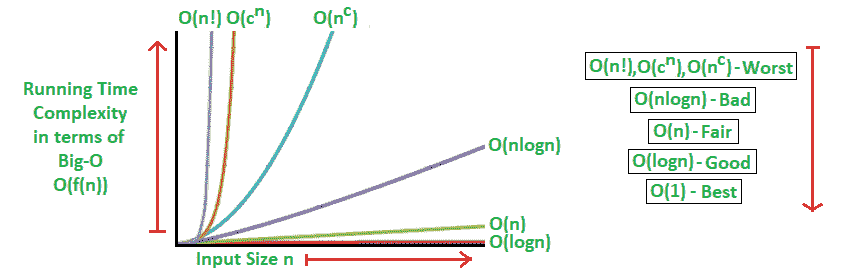

# 算法分析|大 O 分析

> 原文:[https://www . geesforgeks . org/analysis-algorithms-big-o-analysis/](https://www.geeksforgeeks.org/analysis-algorithms-big-o-analysis/)

在我们之前关于[算法分析](https://www.geeksforgeeks.org/analysis-of-algorithms-set-3asymptotic-notations/)的文章中，我们已经讨论了渐近符号、它们的最坏和最好情况性能等。简而言之。在本文中，我们使用[大 0 渐近符号](https://www.geeksforgeeks.org/analysis-of-algorithms-set-3asymptotic-notations/)详细讨论了算法的分析。

**算法大 O 分析**

我们可以用大 0 符号来表达算法的复杂性。对于大小为 N 的问题:

*   恒定时间函数/方法是“1 阶”:0(1)
*   线性时间函数/方法是“N 阶”:O(N)
*   二次时间函数/方法是“N 阶平方”:O(N 2)

定义:设 g 和 f 是从自然数集合到自身的函数。如果存在常数 **c > 0** 和自然数**n<sub>0</sub>T5】使得 f (n) ≤ cg(n)为所有 n > = n <sub>0</sub> ，则函数 f 被称为 O(g)(读 g 的 big-oh)。**

注意:O(g)是集合！

符号滥用:f = O(g)不代表 f ∈ O(g)。

大 O 渐近符号给出了上限概念，数学描述如下:

> f(n) = O(g(n))如果存在正整数 n <sub>0</sub> 和正常数 c，使得 f(n)≤c.g(n) ∀ n≥n <sub>0</sub>

大 O 运行时分析的一般分步过程如下:

1.  弄清楚输入是什么，n 代表什么。
2.  表示运算的最大次数，算法用 n 来表示。
3.  排除所有排除最高订单的条款。
4.  去掉所有不变的因素。

大 O 符号分析的一些有用特性如下:

> 常数乘法:
> 如果 f(n) = c.g(n)，那么 O(f(n))= O(g(n))；其中 c 是非零常数。
> 多项式函数:
> If f(n) = a <sub>0</sub> + a <sub>1</sub> 。n + a <sub>2</sub> 。n<sup>2</sup>+—+a<sub>m</sub>。n <sup>m</sup> ，则 O(f(n)) = O(n <sup>m</sup> )。
> 求和函数:
> 如果 f(n)= f<sub>1</sub>(n)+f<sub>2</sub>(n)+—+f<sub>m</sub>(n)和 f<sub>I</sub>(n)≤f<sub>I+1</sub>(n)∀I = 1，2，—，m，
> 则 O(f(n)) = O(max(f <sub>对数函数:
> 如果 f(n) = log <sub>a</sub> n 和 g(n)=log <sub>b</sub> n，则 O(f(n))= O(g(n))
> ；就大 o 而言，所有日志函数都以相同的方式增长</sub>

基本上，这种渐近符号用于从理论上衡量和比较算法的最坏情况。对于任何算法，只要我们正确识别依赖于 n(输入大小)的操作，大 O 分析应该是简单的。

**算法运行时分析**

在一般情况下，我们主要用于测量和比较算法最坏情况下的理论运行时间复杂度，以进行性能分析。
任何算法最快可能的运行时间为 O(1)，通常称为*恒定运行时间*。在这种情况下，无论输入大小如何，算法的执行时间总是相同的。这是一个算法的理想运行时，但很少能实现。
在实际情况下，一个算法的性能(Runtime)取决于 n，即输入的大小或每个输入项需要的运算次数。
算法可以从最好到最差的性能(运行时间复杂度)分类如下:

> 对数算法–O(logn)
> 运行时间与 n 成正比地对数增长
> 线性算法–O(n)
> 运行时间与 n 成正比地增长
> 超线性算法–O(nlogn)
> 运行时间与 n 成正比地增长
> 多项式算法–O(n<sup>c</sup>)
> 运行时间比以前所有基于 n 的算法都增长得快
> 指数算法–O(c<sup>n</sup>))
> 运行时间增长最快，即使是
> n 的小值也很快无法使用。

其中，n 是输入大小，c 是正常数。



**运行时分析的算法示例** :
所有这些类型算法的一些示例(在最坏情况下)如下所述:

> 对数算法–0(对数)–二分搜索法。
> 线性算法–O(n)–线性搜索。
> 超线性算法–0(nlogn)–堆排序，合并排序。
> ·多项式算法–o(n^c)–strassen 矩阵乘法、冒泡排序、选择排序、插入排序、桶排序。
> 指数算法–o(c^n–河内塔。
> 阶乘算法–0(n！)–未成年人行列式展开，旅行商问题的蛮力搜索算法。

**运行时分析的数学示例** :
随着 n(输入大小)变大，不同阶次算法的性能(运行时)迅速分离。让我们考虑一下数学例子:

```
If n = 10,                  If n=20,
    log(10) = 1;                log(20) = 2.996;
    10 = 10;                    20 = 20;
    10log(10)=10;               20log(20)=59.9;
    102=100;                    202=400;
    210=1024;                    220=1048576;
    10!=3628800;                20!=2.432902e+1818;
```

**算法内存占用分析**

对于算法的性能分析，运行时度量不仅是相关的度量，而且我们需要考虑程序的内存使用量。这被称为算法的内存占用，简称为空间复杂度。
在这里，我们还需要测量和比较算法的最坏情况理论空间复杂度，以进行性能分析。
基本上取决于下面描述的两个主要方面:

*   首先，程序的实现负责内存的使用。例如，我们可以假设递归实现总是比特定问题的相应迭代实现保留更多的内存。
*   另一个是 n，即每个项目所需的输入大小或存储量。例如，具有大量输入大小的简单算法比具有较少输入大小的复杂算法消耗更多的内存。

内存占用分析的算法示例:基于最坏的情况，将带有示例的算法从最好到最坏的性能(空间复杂性)进行分类，如下所述:

```
▪ Ideal algorithm - O(1) - Linear Search, Binary Search,
    Bubble Sort, Selection Sort, Insertion Sort, Heap Sort, Shell Sort.
▪ Logarithmic algorithm - O(log n) - Merge Sort.
▪ Linear algorithm - O(n) - Quick Sort.
▪ Sub-linear algorithm - O(n+k) - Radix Sort.
```

**时空权衡与效率**

在最佳内存使用和运行时性能之间通常有一个折衷。
一般来说对于一个算法来说，空间效率和时间效率在两个相对的端点达到，并且它们之间的每个点都有一定的时间和空间效率。所以，时间效率越高，空间效率越低，反之亦然。
例如，Mergesort 算法速度非常快，但需要大量空间来执行操作。另一方面，冒泡排序非常慢，但需要最小的空间。

在本主题的最后，我们可以得出结论，找到一个运行时间更短、对内存空间要求更低的算法，会对算法的性能产生巨大的影响。